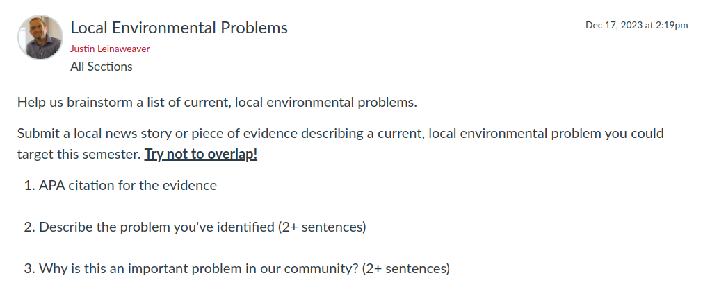
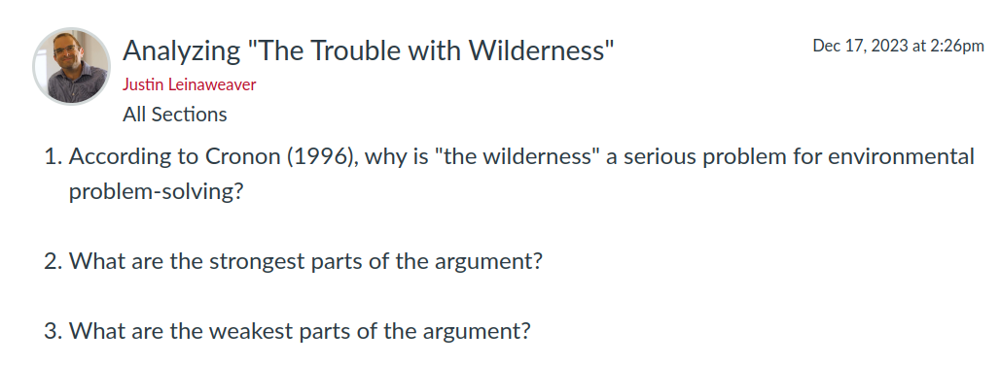

---
output:
  xaringan::moon_reader:
    css: ["default", "extra.css"]
    lib_dir: libs
    seal: false
    nature:
      highlightStyle: github
      highlightLines: true
      countIncrementalSlides: false
      ratio: '16:9'
---

```{r, echo = FALSE, warning = FALSE, message = FALSE}
##xaringan::inf_mr()
## For offline work: https://bookdown.org/yihui/rmarkdown/some-tips.html#working-offline
## Images not appearing? Put images folder inside the libs folder as that is the main data directory

library(tidyverse)
library(readxl)
library(stargazer)
##library(kableExtra)
##library(modelr)

knitr::opts_chunk$set(echo = FALSE,
                      eval = TRUE,
                      error = FALSE,
                      message = FALSE,
                      warning = FALSE,
                      comment = NA)
```


background-image: url('libs/Images/background-forest_v3.png')
background-size: 100%
background-position: center
class: middle

.size80[**Today's Agenda**]

<br>

.center[
.size65[Brainstorming local environmental problems]
]

<br>

.center[.size40[
  Justin Leinaweaver (Spring 2024)
]]

???

## Prep for Class
1. Review and record participation submissions

2. Publish next canvas discussion

<br>

**SLIDE**: Let's kick things off with a refresher from last class


---

class: middle, center

```{r}
tibble(
  col1 = c("Participation", "Project Development", "1. The Problem", "2. Evaluating Designs", "3. Community Feedback", "4. Getting Involved", "Proposing a Policy"),
  col2 = c("", "", "(Feb 23)", "(Apr 5)", "(TBD)", "(Apr 26)", "(Final)"),
  col3 = c(20, 60, "", "", "", "", 20)
) |>
  kableExtra::kbl(align = c("l", "c", "c"), col.names = c("", "", "%")) |>
  kableExtra::kable_styling(font_size = 40) |>
  kableExtra::column_spec(1, width = "20em") |>
  kableExtra::column_spec(2, width = "7em")
```

???

### Any questions on the syllabus?

### - Clear on attendance, participation, assignments and how we'll be using Canvas?

<br>

Just a head's up, I don't check the inbox in Canvas. 

- If you need to contact me please send me an email.


---

background-image: url('libs/Images/background-forest_v3.png')
background-size: 100%
background-position: center
class: middle

```{r, echo = FALSE, fig.align = 'center', out.width = '87%'}
knitr::include_graphics("libs/Images/01_1-cartoon_lake.jpg")
```

???

### What was the story of our in-class simulation?
- (Lake of magical bonus point fish)

<br>

### How did this help us to define "politics"?
1. Decision-making in a community
2. How we make and enforce "the rules"
3. Who gets what, when and how?

<br>

Key for us is to remember that we need the science, the economics and the ethics to help us understand an environmental problem, but...

- Without the politics we lack the tools needed to translate a "fix" into a specific plan that can make a difference in a real community.

<br>

### Any questions on what we covered last class?


---

background-image: url('libs/Images/background-forest_v3.png')
background-size: 100%
background-position: center

class: middle

.size40[.content-box-green[**Assignment for Today**]]

<br>

```{r, echo = FALSE, fig.align = 'center', out.width = '100%'}

```

???

### Everybody ready to go with this?

### Put another way, did everybody earn their participation point?

<br>

In a moment we'll go around the room and hear about the cases you brought to class today.

- I'd like everyone to present their case as the answer to a series of questions that will help us think broadly about environmental problems

- Nobody here is yet an expert in their problem, so don't stress this.


---

background-image: url('libs/Images/background-forest_v3.png')
background-size: 100%
background-position: center
class: middle

.size50[
1) Describe the problem in one sentence (e.g. as simply as possible)
]

???

To start, make sure you can describe the problem as simply as possible.

- I'm willing to bet this thing you have chosen is a problem for lots of people, places, things, etc.

- As a first step I want you to zoom in on the problem in simple terms without involving the targets of it

- Think of this like what we did splitting climate change into smaller pieces on Tuesday.

<br>

### Does that make sense?

- Go!


---

background-image: url('libs/Images/background-forest_v3.png')
background-size: 100%
background-position: center
class: middle

.size50[
1) Describe the problem

2) Describe the harm done to a specific target 
]

???

Now I want you to go from the simple problem in abstract terms, to the problem in very concrete terms.

- Identify one target harmed by this problem and describe how it harms them. 

- Be specific.

- The target could be a community, a neighborhood, a company, or any other group of people

- For now I will ask you to focus on a human impact rather than a purely non-human one.

<br>

### Does that make sense?

- Go!


---

background-image: url('libs/Images/background-forest_v3.png')
background-size: 100%
background-position: center
class: middle

.size45[
1) Describe the problem

2) Describe the harm done to a specific target

3) What would meaningful progress on the problem look like for this target?
]

???

For the second prompt you focused on a specific harm to a specific target.

- For this prompt I want you to think about what progress would look like for that target alone

<br>

Your "big" goal might be to fully address a significant problem for all people and all time, but that's WAY down the road

- I want you to describe what would be a meaningful improvement in the life of your specified target only.

<br>

- Thinking small can help you design feasible proposals, AND 

- can help you more deeply understand why a problem matters to real people.

<br>

In other words, how much harm would need to be reduced to make a meaningful impact on this target?

- What is the smallest amount we need to change to call our work a success?

<br>

### Does that make sense?

- Go!


---

background-image: url('libs/Images/background-forest_v3.png')
background-size: 100%
background-position: center
class: middle

.size40[
1) Describe the problem

2) Describe the harm done to a specific target

3) Describe meaningful progress

4) Briefly describe **three** causes of the problem (e.g. specific actions)
]

???

We live in a probabilistic world where everything undoubtedly has multiple causes.

- In this step I want you to brainstorm three causes of the problem. 

<br>

Think about what specific actions by specific actors lead to this problem.

- I'm using "actor" collectively here e.g. can be a single person or any group

<br>

### Does that make sense?

- Go!


---

background-image: url('libs/Images/background-forest_v3.png')
background-size: 100%
background-position: center
class: middle

.size40[
1) Describe the problem

2) Describe the harm done to a specific target

3) Describe meaningful progress

4) Describe three causes

5) Identify an actor who benefits from each of these causes
]

???

For each cause of the problem you have identified I want you to describe who benefits from that action.

<br>

This is our effort to think carefully about why the environmental problems we see exist in the world

- I do not believe we live in a world of Disney villains out to destroy a river or a family of puppies for fun

- Problems are typically caused by actions taken for reasons entirely unrelated to the environmental problem itself

<br>

So, your job is to give us one reason why each of these actions from prompt four is happening.

- Who benefits from each cause?

<br>

### Does that make sense?

- Go!


### Make sense?

<br>

### Everybody have their answer?


---

background-image: url('libs/Images/background-forest_v3.png')
background-size: 100%
background-position: center
class: middle

.size40[
1) Describe the problem

2) Describe the harm done to a specific target

3) Describe meaningful progress

4) Describe three causes

5) Describe who benefits
]

???

Ok, let's circle up as best we can and present the cases.

*Go around the room to hear cases and discuss each*

*Make sure they are specific and clear*

<br>

### So, how are we feeling? Do you have your case for the semester or are you going to look for something else?

<br>

**Everyone** needs to have their case **LOCKED IN** before class next Thursday.

- We have a lot to accomplish and we can't spin our wheels on problem selection for too long.

<br>

### Any questions on that?


---

background-image: url('libs/Images/01-1-ozarks_forest.jpg')
background-size: 100%
background-position: center
class: bottom

.right[.textwhite[.size60[**Why is "the wilderness" a serious problem for society?**]]]

???

For Tuesday, I have assigned you an article by the historian William Cronon on the trouble with wilderness.

- I love this article. I really do.

<br>

My hope is that this article:

1. Lays some of the foundations we need for environmental problem-solving, AND 

2. Gives you help thinking about the problem you are choosing to focus on this semester.


---

background-image: url('libs/Images/background-forest_v3.png')
background-size: 100%
background-position: center

class: middle

.size50[.content-box-green[**Assignment for Next Class**]]

<br>

```{r, echo = FALSE, fig.align = 'center', out.width = '100%'}

```

???

### Questions on the assignment?

<br>

Keep thinking about your problem selection and let me know if you want to discuss it.


