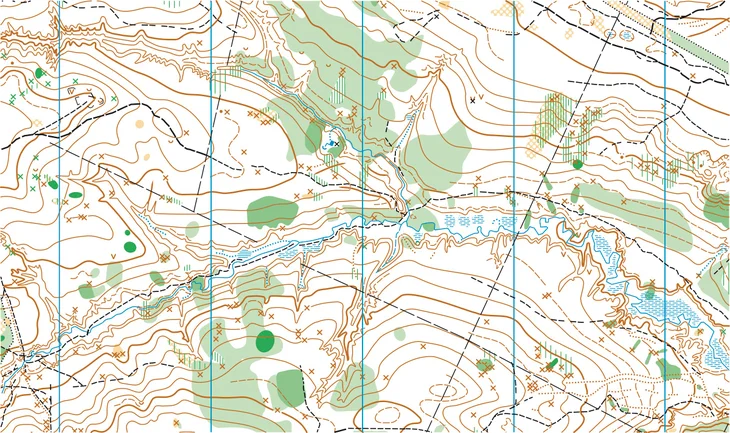

## Today's Agenda {background-image="Images/background-forest_v3.png" .center}

```{r}
library(tidyverse)
library(kableExtra)
```

<br>

::: {.r-fit-text}

**Comparative Case Studies**

- Local Communities Solving Environmental Problems

:::

<br>

::: r-stack
Justin Leinaweaver (Spring 2025)
:::

::: notes
Prep for Class

1. Review Canvas submissions

<br>

**SLIDE**: Our work last week...

:::


## {background-image="Images/02_1-Rockymountain_wilderness.jpg"}

<br>

<br>

<br>

<br>

<br>

<br>

<br>

<br>

<br>

::: {.r-fit-text}

<p style="color: white;">What is the "Trouble with Wilderness"?</p>

:::

::: notes

Last week we dug into one of my favorite articles exploring our relationship to the environment.

- Cronon, W. (1996). The Trouble with Wilderness or, Getting Back to the Wrong Nature. *Environmental History*. 1(1), 7–28.

<br>

**So, what is the "trouble with wilderness" according to Cronon?**

<br>

**And what is the lesson of this article for us if we want to solve real-world environmental problems?**

- (**SLIDE**)

:::


## {background-image="Images/background-forest_v3.png" .center}

:::: {.r-fit-text}
**Setting the Stage for Problem-Solving**

1) All environmental concepts are contested

2) Your chosen definition narrows your options

3) Many disputes arise from conflicting definitions
::::

::: notes

To refresh where we ended last week...

1. We must remember that all of the concepts related to environmental problems will be contested (e.g. fought over),

    - No matter how obvious you think the problem is, I assure you that all of the stakeholders view it somewhat differently

2. Your chosen definition automatically narrows the options of policies you think are acceptable vs not

    - Definitions set the agenda of future action

    - Be strategic when establishing a definition and be flexible in considering alternative viewpoints

3. Conflicts over problem definitions often drive the most serious disputed regarding environmental problem.

    - The most effective policy solutions begin with clear definitions that generate buy-in from the relevant stakeholders

<br>

**Questions on any of this?**

<br>

**SLIDE**: Our work for this week
:::


## {background-image="Images/background-forest_v3.png" .center}

{style="display: block; margin: 0 auto"}

::: {.r-fit-text}
**Environmental Problems in Local Communities**

- Today: Success Cases

- Thursday: Failure Cases
:::

::: notes

I want us to use our class time this week to explore cases of local communities engaging with environmental problems

<br>

My hope is that these exercises will:

1. Give you a broader list of specific examples of local communities grappling with environmental problems that you can draw from in our work, and

2. Give you a head start on thinking about policy-making in terms of theory and process

<br>

Today we explore the success stories and Thursday we shift to the failures

<br>

**SLIDE**: Introduce the cases

:::


## The Success Cases {background-image="Images/background-forest_v3.png" .center}

::: {.r-fit-text}
1. What happened?

2. Why are you convinced this was a success?
:::

::: notes

Let's speed around the room to introduce the cases

- In a moment we'll dig more deeply into all of them, but let's begin with a broad overview

- Be an active listener as we do this!

<br>

*PRESENT each*

<br>

*Split class into small groups (five groups of four)*

- Go sit with your group!

:::


## Analyzing the Success Cases {background-image="Images/background-forest_v3.png" .center}

<br>

**1. Characteristics of the Environmental Problems**

- What are the common characteristics for the environmental problems in our success stories?

::: notes

Groups, take some time to review ALL of the cases submitted on Canvas in order to make this list.

- **Questions on the task?**

- Go!

<br>

*ON BOARD: Present and discuss each*

<br>

**Class Notes (2025-SP)**

- ?

:::


## Analyzing the Success Cases {background-image="Images/background-forest_v3.png" .center}

<br>

**2. Characteristics of the Community**

- What are the common characteristics for the communities in our success stories?

::: notes

Groups, take some time to review ALL of the cases submitted on Canvas in order to make this list.

- **Questions on the task?**

- Go!

<br>

*ON BOARD: Present and discuss each*

<br>

**Class Notes (2025-SP)**

- ?

:::


## Analyzing the Success Cases {background-image="Images/background-forest_v3.png" .center}

<br>

**3. Characteristics of the Policy**

- What are the common characteristics for the policies in our success stories?

::: notes

Groups, take some time to review ALL of the cases submitted on Canvas in order to make this list.

- **Questions on the task?**

- Go!

<br>

*ON BOARD: Present and discuss each*

<br>

**Class Notes (2025-SP)**

- ?

:::


## Theory as a Scientific Tool {background-image="Images/background-forest_v3.png" .center}

{style="display: block; margin: 0 auto"}

::: notes

I want to end today with an exercise in generating theory

- Theories, in science, are the stories we have designed to help us explain the world

- They are simplifications of complex processes meant to help us understand why things happen as they do

<br>

I particularly like the analogy of theories as maps

- Maps are neither true nor false, they are useful or not

- They are tailored to a specific use

- They reflect the interests of their designers

<br>

This topographic map is super useful for planning a hike

- Close together lines mean steep elevation changes, far apart means more gradual

- We can use this to plan a gentle stroll or a strenuous challenge!

<br>

HOWEVER, this map would be terrible for predicting the weather

- **SLIDE**

:::


## Theory as a Scientific Tool {background-image="Images/background-forest_v3.png" .center}

{style="display: block; margin: 0 auto"}

::: notes

Now this map is designed to tell us something about the weather!

- Neither map is "false" or "wrong", just suited for different tasks

- Neither map aims to completely represent the entirety of reality, just the parts we need it to focus on

<br>

Theories of evolution, gravity, the median voter are all useful tools for some things and not others

- Just like maps

<br>

**Everybody with me?**

:::


## Thinking Theoretically {background-image="Images/background-forest_v3.png" .center}

<br>

### What are our big picture takeaways from the success cases today?

- Are there certain kinds of environmental problem, community or policy approach that is more likely to succeed?

::: notes

Groups, take a minute to reflect on all our cases and consider if there are any inferences we would like to draw so far

- Any elements of our success cases that you suspect might be tied to the success or failure of environmental problem-solving?

<br>

*PRESENT and DISCUSS*

- *Force this discussion*

<br>

**SLIDE**: For Thursday...
:::


## For Next Class: Case Studies {background-image="Images/background-forest_v3.png" .center}

<br>

**Local Communities Failing to Solve Environmental Problems**

- Find us an example of a LOCAL community anywhere in the world failing to solve an environmental problem

Good examples include communities...:

- Not creating the policies to solve a problem,

- Removing the policies already in place, or

- Persisting with policies that are not working

::: notes

No overlap in cases! (e.g. don't submit a case someone has already submitted)

<br>

**Questions on the assignment?**

:::