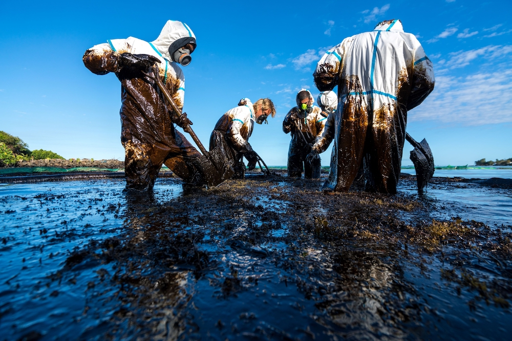
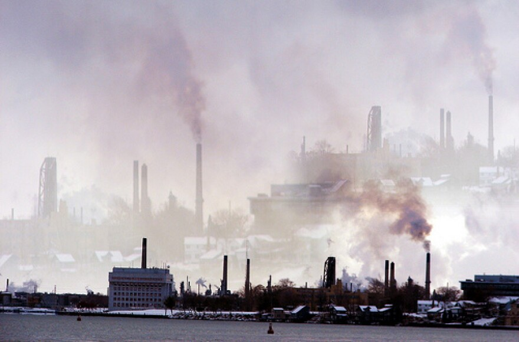
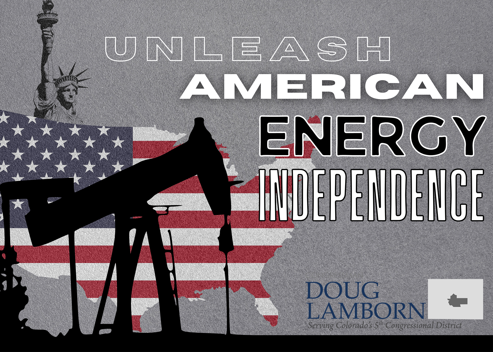
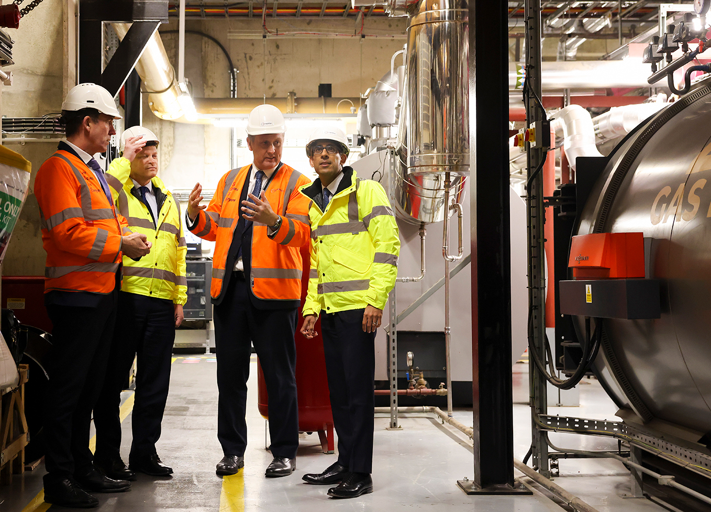

## Today's Agenda {background-image="libs/Images/background-forest_v3.png" .center}

```{r}
library(tidyverse)
library(kableExtra)
```

<br>

<br>

**I. The Basics of Problem-Solving in a Community**

- Selecting and defining the environmental problem you will focus on this semester

<br>

::: r-stack
Justin Leinaweaver (Spring 2024)
:::

::: notes
Prep for Class

1. Bring paper to class

2. Check Canvas submissions

:::


## {background-image="libs/Images/background-forest_v3.png" .center}

```{r}
tibble(
  col1 = c("Participation", "Project Development", "1. The Problem", "2. Evaluating Designs", "3. Community Feedback", "4. Getting Involved", "Proposing a Policy"),
  col2 = c("", "", "(Feb 23)", "(Apr 5)", "(TBD)", "(Apr 26)", "(Final)"),
  col3 = c(20, 60, "", "", "", "", 20)
) |>
  kableExtra::kbl(align = c("l", "c", "c"), col.names = c("", "", "%")) |>
  kableExtra::kable_styling(font_size = 40) |>
  kableExtra::column_spec(1, width = "20em") |>
  kableExtra::column_spec(2, width = "7em") |>
  kableExtra::row_spec(0, background = "lightblue") |>
  kableExtra::row_spec(1:7, background = "white")
```

::: notes

Your focus this semester is on developing a policy to address a local environmental problem.

- All of our assignments are focused on reinforcing that work and helping you build to that goal

<br>

In class I will introduce the tools and frameworks you will need to make progress on this goal

- Outside of class you will work to apply those tools and frameworks to your chosen projects

<br>

Your first assignment will be to write a paper that introduces us to the problem you have chosen.

- We'll get to the details on that assignment in a moment

<br>

**SLIDE**: To get you moving on this, I asked each of you to submit your chosen problem to Canvas before class.
:::


## For Today {background-image="libs/Images/background-forest_v3.png" .center}

<br>

**Before class** submit to our Canvas discussion board: 

1. Describe your environmental problem

2. Why do you believe this is a problem?

3. What is the primary cause of this problem (from your perspective)? 

::: notes

Key to earning your participation!

### Did everybody get their proposed problem submitted before class?

<br>

### How did this go? 

### - Did writing down these basics help you clarify your thinking at all?

<br>

**SLIDE**: Think back to our discussions of Cronon (1996) on Tuesday.

:::
    
    
    
## The Trouble with Wilderness {background-image="libs/Images/background-forest_v3.png" .center}

**(Cronon 1996)**

<br>

Therefore, wilderness is a human creation and our mythologizing about it makes it harder to solve environmental problems.

::: notes

At one level, Cronon was making a specific argument about the wilderness and our relationship to it.

### What does he mean by "wilderness is a human creation"?

<br>

### What is the mythology of the wilderness?
- (Evolution of the sublime)
    - loss of frontier
    - doubly ironic reframing of wilderness as temple of restoration
- (all human populations have managed environmental resources to survive)

<br>

### According to Cronon, why do these two things mean that wilderness is a problem?
1. (The wilderness myth makes compromise impossible, and)
2. (Failing to recognize the wildness around you means ignoring the actual lives and needs of the people living on Earth.)

<br>

### What are the problem-solving lessons I asked you to take from Cronon's work?
- (**SLIDE**)
:::


## Setting the Stage for Problem-Solving {background-image="libs/Images/background-forest_v3.png" .center}

<br>

1) All environmental concepts are contested

<br>

2) Your chosen definition narrows your options

<br>

3) Many disputes arise from conflicting definitions

::: notes

**In short, I want us to think critically about problem definitions.**

1. All of the concepts related to environmental problems will be contested (e.g. fought over),

2. Your chosen definition automatically narrows the options of policies you think are acceptable vs not, AND

3. Conflicts over problem definitions often drive the most serious disputed regarding environmental problem.

<br>

### With a few days to reflect on this, any questions?

:::


## Environmental Problem-Solving {background-image="libs/Images/background-forest_v3.png" .center}

**Step 1**

<br>

1. **IDENTIFY** the competing definitions of the problem,

2. **COMPARE** and **CONTRAST** those definitions to find areas of compromise, and

3. Be able to **EXPLAIN** your preferred definition in that context

::: notes

Everybody write this down!

<br>

This is an extremely important step and should help you both:

1. set the stage for a successful policy intervention, AND 

2. Clarify your own thinking about the problem

<br>

What I hope this makes clear is that your job as a problem-solver is to solve actual problems.

- Not simply push for your idealized version of the world regardless of how other members of your community view it.

<br>

Solving real world problems means understanding why those problems exist in the first place and exploring contested definitions is a valuable first step to doing this.

<br>
    
### Questions on this?

<br>

Now, this is where you want be for the first paper in your project.

- So, today we'll work on heading toward this goal.
:::


## {background-image="libs/Images/background-forest_v3.png" .center}

<br>

**By the end of today you should have:**

1. Selected a specific local environmental problem,

2. A description of your preferred framing of the problem, and

3. A list of alternative problem framings to explore. 

::: notes

Today we make sure everyone has their problem selected and that we've brainstormed a list of alternative framings for you to explore.

<br>

**Key Point**: We're a team in here and no one gets left behind!

- That means it is our shared responsibility to make sure all of your projects are on a firm footing!

<br>

So, today we write, we reflect AND we help each other revise!

- Let's get to it!

:::


## Write a simple, clear description of your local environmental problem {background-image="libs/Images/background-forest_v3.png" .center}

::: notes

Everybody take out a sheet of paper and at the top write a simple, clear description of your selected problem.

- Keep opinion out of this one. Your perspective (e.g. framing) comes next.

- Focus on demonstrable facts on the ground.

<br>

### Does that make sense?

- Give it a shot!

<br>

*After a few minutes work: Get a volunteer to present their simple problem description for feedback*

- *Repeat with second volunteer*

<br>

Stand up and touch base with everyone else in class

- I want you to read and reflect on all of the problems selected by the class

- Make sure to ask for clarifications if the problem doesn't make sense or needs more detail.

<br>

**KEY to THIS**: You are NOT making more work for the person!

- It's the opposite!

- Your job is to help them see what additional information, sources, data, or examples they need to FULLY describe their problem.

- Go for it!

<br>

**REFLECTIONS**: Ok, everybody take a few minutes to reflect on the feedback and make any revisions/notes you need.
:::


## What is your preferred framing of the problem? {background-image="libs/Images/background-forest_v3.png" .center}

::: notes

Your next step in the problem-solving process is to be able to explain your preferred problem framing.

<br>

### Has anybody ever encountered the problem framing concept before?

### - Can you explain it to us?

<br>

Framing is a way of presenting a problem or an issue. 

- In simplest terms, the framing is your definition plus context
    - e.g. why it is a problem, why it is important and possibly even what should be done about it

- In a more expert sense, framing is **explaining the context** of your problem in a way that **gains the most support** from your audience.

- This means that problem framing is an exercise in advocacy (e.g. pushing a specific viewpoint / solution)

<br>

Let's illustrate this concept in action.

- For example, let's say you were concerned with the extraction and use of of fossil fuels (e.g. gas, coal, etc)

<br>

### Somebody frame fossil fuel extraction and use as a serious problem for our society?

- (**SLIDE**)
:::


## Fossil Fuels are a Serious Problem {background-image="libs/Images/background-forest_v3.png" .center}

<br>

:::: {.columns}
::: {.column width="50%"}
```{r, echo = FALSE, fig.align = 'center'}

```
:::

::: {.column width="50%"}
```{r, echo = FALSE, fig.align = 'center'}

```
:::
::::

::: notes

Defining fossil fuel use as a serious problem for our society is easy!

- Fossil fuel extraction is a dirty process (mining, mountain and forest clearing, destruction of rivers and creeks), 

- Fossil fuel transportation can go catastrophically wrong (Exxon Valdez, pipeline spills, etc),

- Fossil fuel use creates air pollution that kills people and injects smog into our cities, and

- Fossil fuel use is a primary driver of climate change

<br>

Each of these is a piece of context that can be **supported by evidence** and collectively **frames the problem** as a serious one to be addressed.

### Make sense?

<br>

This exercise can go way more ways!

### How could you define fossil fuel extraction to help other people understand it is NOT a problem?

- (**SLIDE**)
:::


## Fossil Fuels are a Vital Part of our Economy {background-image="libs/Images/background-forest_v3.png" .center}

:::: {.columns}
::: {.column width="50%"}
```{r, echo = FALSE, fig.align = 'center'}

```
:::

::: {.column width="50%"}
```{r, echo = FALSE, fig.align = 'center'}

```
:::
::::

::: notes

Defining fossil fuel use as an important benefit for our society is easy!

- Fossil fuel extraction has made the US an economic powerhouse

- More high paying jobs,

- Cheaper prices for families (cheaper gas, warmer homes, more affordable food),

- Less dependence on problematic foreign countries (Saudi Arabia, Venezuela, Russia, etc)

<br>

Again, each of these descriptions can be **supported by evidence** and collectively **frame the issue** as not a problem.

<br>

Note that in some cases, "not a problem" isn't an option

- Instead, the framing may be that this is a problem BUT that it must not be "fixed" without considering these other important elements (jobs, security, etc.)

<br>

### Make sense?
:::


## What is your preferred framing of the problem? {background-image="libs/Images/background-forest_v3.png" .center}

::: notes

To be clear, problem framing is a problem definition that includes the context you believe is most likely to convince other people to accept your view of the issue.

<br>

### Any questions on the problem framing concept before I ask you to do this on your own project?
:::


## What is your preferred framing of the problem? {background-image="libs/Images/background-forest_v3.png" .center}

<br>
From your perspective, 

- Why is this a problem? 
- Why does it matter?
- What is the cause of the problem you believe we should focus on?

::: notes

Take a few minutes to describe your problem framing on the sheet of paper.

- Give us a **complete** sentence or two on each of these prompts

<br>

### Does that make sense?

- Get to it!

<br>

Ok, stand up and go check out everybody else's preferred framings

- Make sure to ask for clarifications / explanations as you go

- Go for it!

<br>

**REFLECTIONS**: Ok, take a few minutes to reflect on the feedback and make any revisions/notes you need.
:::


## Brainstorm a list of competing problem framings {background-image="libs/Images/background-forest_v3.png" .center}

::: notes

Our last job for today is to brainstorm alternatives to your problem framing.

- This list is meant to help you start figuring out the contours of the problem you face.

- These are the perspectives you'll need to consider and explore in order to solve your problem.
:::


## Brainstorm a list of competing problem framings {background-image="libs/Images/background-forest_v3.png" .center}

<br>

1. Those who argue this is not a serious problem,

2. Those who argue the "cure" is likely too costly, and

2. Those who argue you're focusing on the wrong cause

::: notes

Start off brainstorming on your own.

- Try to make a list of those who view your problem differently than you do.

<br>

It may help of you to think about this as three types of group:

1. The people who disagree with you that this IS a problem
    - In other words, you've spotted a thing, but it's not really a problem society should be focused on
    
2. The people who agree it is a problem but that the fixes would be too costly
    
3. The people who agree it is a problem but who think you've identified the wrong primary cause
    - Yes it's a problem, but you've missed the real root of it!
    
    <br>

### Does that make sense?

- Get to it!

<br>

Everybody stand up and review ALL the lists.

- Can you offer any additional framings they might have missed?

- Do any on their current list need clarification?

- Go for it!

<br>

**REFLECTIONS**: Ok, everybody take a few minutes to reflect on the feedback and make any revisions/notes you need.

:::


## Select an Environmental Problem {background-image="libs/Images/background-forest_v3.png" .center}

<br>

1. Do you have a clear, specific local environmental problem?

2. Can you articulate your preferred framing of the problem?

3. Do you have a list of alternative/competing problem framings to explore?

::: notes

Ok, how did we do with our work today? 

### Does everybody have a good start on these three elements?

<br>

### Anything we need to discuss or can help you with?

<br>

**SLIDE**: To wrap up today let's talk community engagement and our work for next week.
:::


## Assignment 4 {background-image="libs/Images/background-forest_v3.png" .center}

**Getting Involved in our Community**

<br>

**Find or create** an opportunity to get **actively involved in your issue locally** (e.g. litter pickup, river cleanup, working with a local NGO or city agency on your issue, etc.)

**Write a report** describing what you did, who you worked with and what you learned that will help you with solving your chosen policy problem.

::: notes

Essentially all of our assignments this term work in a sequence, one leading to the next.

- However, that is not true for the community engagement report

<br>

BEFORE the end of April you have to take action in our community in some way connected to your chosen project!

- e.g. litter pickup, river cleanup, working with a local NGO or city agency on your issue, etc.

You will then write up a report on the activity and how it contributed to your thinking about your project.

<br>

**IMPORTANT**
1. You **MUST** submit to me a proposal for your engagement project as a Canvas Assignment **BEFORE** you do it. 
    - Your proposal should frame the activity in terms of how it directly ties to your project, AND 
    - how doing it will help you better complete that project (e.g. deepens your understanding of the nature of the problem, the stakeholders involved, etc.)?

2. Your report must include evidence for all claims (e.g. documentation of the activity through photos, etc.), and

<br>

### Questions on this assignment?

<br>

I'd like to use our remaining time today to brainstorm possible activities for this assignment.

- So, let's form small groups and take a few minutes to brainstorm ideas.

- Get ready to report to the class what you come up with!

<br>

Let's hear your ideas!
:::


## For Next Class {background-image="libs/Images/background-forest_v3.png" .center}

<br>

1. Read the Munger chapter

2. Submit to Canvas: What is the most useful advice in the Munger chapter for ensuring that we design "wise" policy solutions for our environmental problems?

::: notes

Next week we shift our focus to how we can attack our environmental problems with policy-making and policy analyses.

### Questions on this assignment?

:::

