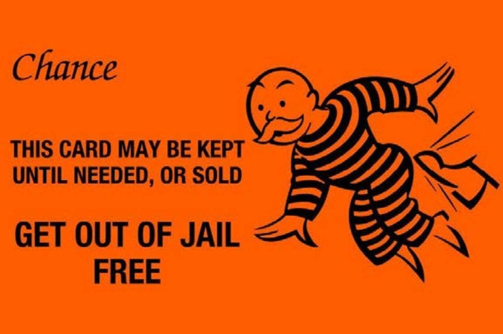
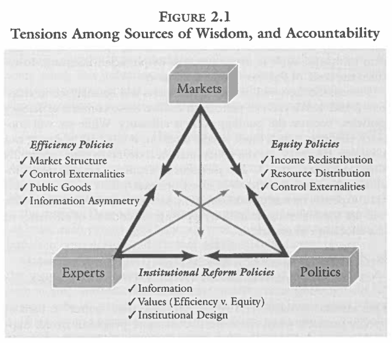

---
output:
  xaringan::moon_reader:
    css: ["default", "extra.css"]
    lib_dir: libs
    seal: false
    nature:
      highlightStyle: github
      highlightLines: true
      countIncrementalSlides: false
      ratio: '16:9'
---

```{r, echo = FALSE, warning = FALSE, message = FALSE}
##xaringan::inf_mr()
## For offline work: https://bookdown.org/yihui/rmarkdown/some-tips.html#working-offline
## Images not appearing? Put images folder inside the libs folder as that is the main data directory

library(tidyverse)
library(readxl)
library(stargazer)
##library(kableExtra)
##library(modelr)

knitr::opts_chunk$set(echo = FALSE,
                      eval = TRUE,
                      error = FALSE,
                      message = FALSE,
                      warning = FALSE,
                      comment = NA)
```

background-image: url('libs/Images/background-forest_v3.png')
background-size: 100%
background-position: center
class: middle

.size70[**Today's Agenda**]

.size40[
What should government *do*? 
- "Deciding How to Decide"

- "The Economics of Pollution"
]

<br>

.center[.size35[
  Justin Leinaweaver (Spring 2024)
]]

???

## Prep for Class
1. Bring the Munger book to class

2. Publish Canvas discussion for Thursday

<br>

.size15[Munger, M. C. (2000). Deciding How to Decide: "Experts," "The People," and "The Market." In *Analyzing Policy: Choices, Conflicts and Practices* (pp. 30–53). W.W. Norton & Company.]

.size15[OpenStax. (2016). 12.1 The Economics of Pollution. In Principles of Economics. [Link](https://opentextbc.ca/principlesofeconomics/chapter/12-1-the-economics-of-pollution/)]


---

background-image: url('libs/Images/background-forest_v3.png')
background-size: 100%
background-position: center
class: middle

.center[.size50[**Assignment 4 (Due Apr 28th)**

Getting Involved in our Community]]

.size40[
1. Find (or create) an opportunity to get actively involved in your issue locally, and

2. Write a report describing what you did, who you worked with and what you learned from the experience.
]

???

As I introduced last week you have a piece of your project you need to get to work on right now!

- Remember, you have to get my sign-off before acting, and

- Your proposal should frame the activity in terms of how it directly ties to your project AND how doing it will help you better complete that project (e.g. deepens your understanding of the nature of the problem, the stakeholders involved, etc.)?

<br>

Quick Brainstorm: Everybody name one thing they could do this weekend to get involved in your chosen problem in our community!

- Something that either connects you with the stakeholders OR deepens your understanding of the problem itself.


---

background-image: url('libs/Images/background-forest_v3.png')
background-size: 100%
background-position: center
class: middle

# The Semester: Three Sections 

.size45[
1. The Basics of Problem-Solving in a Community

2. Evaluating Policy Design Options

3. Designing Environmental Policies
]

???

As I set out for you in week 1, our semester is organized in three sections.

- Now that we're a couple of weeks in I'm hoping you're starting to get a sense of what I mean by "the basics."

- Let's make sure of that!


---

background-image: url('libs/Images/background-forest_v3.png')
background-size: 100%
background-position: center
class: middle

# The Semester: Three Sections 

.size40[
**1) The Basics of Problem-Solving in a Community**
- **"Politics"**
]

???

We've actually accomplished quite a bit in our first two weeks of class so let's do a quick review of environmental problem-solving so far.

We kicked off week 1 of the class talking "politics" and simulating a distribution game.

- SLIDE: Refresh my memory on the game and what we learned from it!


---

background-image: url('libs/Images/background-forest_v3.png')
background-size: 100%
background-position: center
class: middle

# The Semester: Three Sections 

.size40[
**1) The Basics of Problem-Solving in a Community**
- **"Politics"**
]

```{r, echo = FALSE, fig.align = 'center', out.width = '30%'}

```

???

### What was the problem your community faced in our game?

### What result did you come to? e.g what "policy" or rules did you create?

### Why do you think we reached this result?

### Were you happy with the outcome? Why or why not?

<br>

MMy goal was for this to help you develop a better intuitive sense of the dynamics of political processes.

In short, these processes involve:
- A collection of individual actors each pursuing their own interests (e.g. the things they want),
- A community landscape characterized by complex relationships and expectations about how the rules get made and are enforced 
- Debates about the distribution of resources discussed in terms of who gets what, when, how and why?

### That's clearly a lot of ideas, but what is the takeaway for you?
#### - In other words, what are the specific lessons we can take from our simulation that help us solve environmental problems?

1. EVERY problem exists in a community with pre-existing dynamics (actors, institutions and interactions) that you must familiarize yourself with.

2. EVERY policy choice creates winners and losers
    - There is no free lunch, someone has to pay for a benefit to be created
    - Your job as a problem-solver will often involve trying to balance the costs and benefits

3. We all have to live together and even the "best" rules will fail if the community does not recognize them as legitimate
    - Reaching consensus is hard, but rule-making without it is risky

4. Trust makes policy solutions MUCH easier to design!
    - Societies with a lack of trust are in for a rough time trying to solve problems.
    - Thanks to Heather for being so trustworthy in our class!

<br>

### Is everybody clear on how "politics" plays a role in problem-solving?


---

background-image: url('libs/Images/background-forest_v3.png')
background-size: 100%
background-position: center
class: middle

# The Semester: Three Sections 

.size40[
**1) The Basics of Problem-Solving in a Community**
- "Politics"
- **"Environment"**
]

???

Last week we shifted our focus to a key concept in this class: The Environment.

### For the purposes of problem-solving, what is "the environment" and what do we need to keep in mind as we work?

1. "The Environment", or whatever specific piece of it you are focusing on in problem-solving, is a human construct.
    - Cronon (1996) argues that ALL environmental concepts are constructed by people and their meanings evolve over time!

2. The root of many "environmental" conflicts is often a conflict in definitions
    - Stakeholders will almost certainly define the key concept in your problem differently.
    - This leads to actors arguing past each other
    
3. A good problem-solver must be flexible and adaptable which means not locking in on any single definition!
    - The key skill is learning to identify the stakeholders' definitions and knowing how to connect them!
    - We must design solutions that either work to align those competing framings OR that are consistent with all relevant definitions.
    
<br>

### Is everybody clear on how "the environment" plays a role in problem-solving?


---

background-image: url('libs/Images/background-forest_v3.png')
background-size: 100%
background-position: center
class: middle

# The Semester: Three Sections 

.size40[
**1) The Basics of Problem-Solving in a Community**
- "Politics"
- "Environment"
- **"Policy"**
]

???

This week we need to **define "policy"** and think carefully about what it means to say that a problem **REQUIRES** a policy solution!

### Does everybody have the chapter from Munger's book?

Michael Munger's *Analyzing Policy* is an excellent, although very technical book, all about learning to be a policy analyst.

<br>

### When you hear the word "policy," what immediately springs to mind?

- (Government, right?)
    - Something expensive that government does or pays for?
- (Or maybe the rules your employer has for you at work?)

<br>

Ok, I'm about to show you a dictionary definition for the word "policy."

Before I do, let's talk about the dictionary for a sec.

Dictionary definitions are a great place to start your learning
- They represent one kind of consensus about the meaning of words
- HOWEVER, they are extremely limited and constraining.
    - They represent the opposite of the kind of flexibility we just argued was necessary for problem-solving

As an academic, you should almost NEVER start any paper or argument with a dictionary definition.
- Academic arguments are designed to create new knowledge in contested areas.
- Simple definitions are the opposite of the hard problems you are targeting.


---

background-image: url('libs/Images/background-forest_v3.png')
background-size: 100%
background-position: center
class: middle

.size60[**Policy Defined**]

.size40[
"A definite course or method of action selected (as by a government, institution, group or individual) from among alternatives and in the light of given conditions to guide and usually determine present and future decisions..." (Webster's Third International Dictionary).
]

???

Remember, the dictionary offers us a consensus understanding of what this word means.

- This means you can extract key elements from this and expect that across various audiences everyone excepts these as the broad outline of a policy.

<br>

Let's step through these key elements.


---

background-image: url('libs/Images/background-forest_v3.png')
background-size: 100%
background-position: center
class: middle

.size60[**Policy Defined**]

.size40[
"A .textblue[**definite course or method of action**] selected (as by a government, institution, group or individual) from among alternatives and in the light of given conditions to guide and usually determine present and future decisions..." (Webster's Third International Dictionary).
]

???

1) A policy, by definition, is a "definite" "course" or "method" of action

- This means your policy proposal must be SPECIFIC!

<br>

(SLIDE 2: Alternatives)    


---

background-image: url('libs/Images/background-forest_v3.png')
background-size: 100%
background-position: center
class: middle

.size60[**Policy Defined**]

.size40[
"A definite course or method of action selected (as by a government, institution, group or individual) .textblue[**from among alternatives**] and in the light of given conditions to guide and usually determine present and future decisions..." (Webster's Third International Dictionary).
]

???

2) A policy, by definition, is selected from among competing options

- You will be expected to have explicitly considered alternatives to your "definite" "course of action".

- In other words, the quality of your plan DEPENDS, at least in part, on how seriously you've considered alternatives.

<br>

(SLIDE: 3 conditions matter)


    

---

background-image: url('libs/Images/background-forest_v3.png')
background-size: 100%
background-position: center
class: middle

.size60[**Policy Defined**]

.size40[
"A definite course or method of action selected (as by a government, institution, group or individual) from among alternatives and .textblue[**in the light of given conditions**] to guide and usually determine present and future decisions..." (Webster's Third International Dictionary).
]

???

3) A policy, by definition, is adapted to the important "conditions" of the problem

- In other words, the quality of your plan also DEPENDS on how well you've adapted it to the conditions on the ground.

- No one-size-fits-all policy solutions are appropriate here.

<br>

(SLIDE: 4 stakeholders matter)


---

background-image: url('libs/Images/background-forest_v3.png')
background-size: 100%
background-position: center
class: middle

.size60[**Policy Defined**]

.size40[
"A definite course or method of action selected (as by a government, institution, group or individual) from among alternatives and in the light of given conditions .textblue[**to guide and usually determine present and future decisions**]..." (Webster's Third International Dictionary).
]

???

4) A policy, by definition, "guide[s]" or "determine[s]" future behavior by stakeholders

- e.g. the people involved in the problem

- This means your plan must be specific enough to influence decision-making, and

- Be adapted to the needs of the present AND the future.

<br>

SLIDE: In sum


---

background-image: url('libs/Images/background-forest_v3.png')
background-size: 100%
background-position: center
class: middle

.size40[
**A .textblue[useful] policy proposal .textblue[MUST]:**

- Be specific,

- Be adapted to the specific stakeholders,

- Be adapted to the conditions on the ground, and

- Include an evaluation of strong alternative proposals.
]

???

### Does all of that make sense?

Everybody write this down and consider it a guide for our work this semester and especially for the final paper!


---

background-image: url('libs/Images/02-1-Murray-make-a-difference.jpg')
background-size: 45%
background-position: center
class: middle, slideblue

???

<br>

SUPER important point for us this term, **we're not messing around**!
- This isn't an exercise in, "if I was president or king of the world I would do X".

<br>

Key to this definition of policy is recognizing it doesn't only apply to "government."
- The "decider" can be anyone, or any group, willing to put in the work to design a plan that meets the needs of its stakeholders and the conditions on the ground.

<br>

This is why I will insist that everyone select a local environmental problem to target this semester.
- I want us tied to a specific community, in a specific moment in time and at a level where we can find concrete ways to make a difference.

<br>

### Questions on this definition or what it means for us as important players in the game?


---

background-image: url('libs/Images/02-1-Burke_Quote.jpg')
background-size: 100%
background-position: center
class: slideblue

???

Munger kicks off his chapter with a longer version of this quote.

- I hope it's not a stretch to see how this ties into our work defining politics with a simulation game.

- Burke acknowledges that government is not "god-given" or part of the "natural order", it is a device built by us to achieve specific aims

- In our distribution game there was no government, only a group of people seeking to develop some rule that could solve a problem for them.
    - You tried to devise some rules to meet your wants

<br>

In short, Munger wants us to acknowledge that while policy-making is a search for wisdom there are many types of wisdom and those different standards FREQUENTLY conflict with each other.
- Sounds like Cronon writing about the environment, no?


---

background-image: url('libs/Images/02-1-winners.jpg')
background-size: 75%
background-position: center
class: slideblue

???

One of the key takeaways for much of this chapter, and our entire semester, is that **all policies create winners and losers**.

+ Policy-making is **ALWAYS a choice** and **all choices have consequences**.

### Humor me for a sec, can we think of any policy or rule in our society that does not impose "costs" on someone?

<br>

I mention this point BEFORE we talk about the tensions that exist between the sources of wisdom because I believe it is incredibly important that policy designers, like you, remember that the stakes of your work are high for everyone involved.

- Today we'll be having conversations that feel very abstract, but underpinning them are serious costs and benefits that threaten peoples' livelihoods and health.


---

background-image: url('libs/Images/02-1-Munger_Fig2-1.png')
background-size: 50%
background-position: right
class: middle, slideblue

.left[
.size40[
**"Framing" a Problem**

1. The Cause, 

2. The Importance, and

3. The Solution
]]

???

I really like Figure 2.1 for its many lessons about problem-solving using policy.

First, Munger is introducing us to the tools we need to frame a problem.
- For "framing" think of packaging the problem for sale or preparing to hang it like a painting.

- Framing takes your simple, clear problem description and packages it with an easily digestible story:
    1. What is causing the problem?
    2. Why is it important to me as a stakeholder?
    3. How should we address this problem as a community?

### Make sense?


---

background-image: url('libs/Images/02-1-Munger_Fig2-1.png')
background-size: 60%
background-position: center
class: middle, slideblue

???

Second, Figure 2.1 tells us that each possible "framing" of your problem represents a choice to have "accountability" or rule enforcement done using a specific set of criteria.

- Ex: If you choose "markets" as your wisdom for solving a given problem then you are arguing that all possible solutions to that problem be evaluated using efficiency criteria.

- Choosing politics means designing institutions (societal rules) using consensus or other public decision-making

- Choosing experts means removing control from the markets or the people in order to prioritize those with the most knowledge about the subject or problem.
    
### Make sense?

<br>

*Split class into three groups, one per "source of wisdom"*

Go sit with your group!


---

background-image: url('libs/Images/background-forest_v3.png')
background-size: 100%
background-position: center
class: top

```{r, fig.align='center', out.width='48%'}

```

.center[.size40[**What are the pros and cons of prioritizing this one "source of wisdom" over the other two?**]]

???

Groups, take some time to build two lists **DIRECTLY ON THE BOARD**. (10 mins)

### What are the pros and cons of prioritizing this one form of wisdom/source of accountability over the other two? 
#### - In other words, what does your "source of wisdom" do well and what does it do badly? 

Don't yet get into the different types of policy that comes in the conflict between the sources, just focus on what would happen if we made your source the end-all and be-all of policy-making.

Also, don't assume all the important answers are in the book!
- It's time to think!

### Questions?

Get to it!

<br>

*Groups Present Each and DISCUSS*

The Market
- Pros: Most efficient by definition (most bang for the resource buck)
- Cons: Market failures such as 1) Monopolies (e.g. antitrust), 2) Externalities (e.g. pollution), 3) Under supply of public goods (e.g. free-riding), and 4) Information problems (e.g. drug safety); Reduces all problems to maximization of use issues

Experts: "someone who has the goal of improving the functioning of politics or markets" (31).
- Pros: Hopefully relies on transparent and verifiable knowledge; Plans built on expertise and designed with ongoing evaluation
- Cons: May discourage wide participation; May privilege some uses/solutions over others; May lead to inequitable outcomes depending on "who" the experts are

Politics
- Pros: Can be done to maximize participation; 
- Cons: Can be very slow; Can be very messy; Often has trouble with long time horizon problems


---

background-image: url('libs/Images/02-1-Munger_Fig2-1-efficiency.png')
background-size: 60%
background-position: center
class: middle, slideblue

???

Now, Munger argues that many policy debates come from the conflicts between these sources of wisdom.

<br>

When experts try to "fix" market failures we get efficiency policies.
- e.g. How do we distribute the rewards to ensure no better distribution is possible?
- e.g. How can expert tweaks to the market reduce market failures?

### Give me a real-world example of an efficiency policy.

<br>

### How about examples when this can go "wrong"?

#### - In other words, when can experts go too far?


---

background-image: url('libs/Images/02-1-Munger_Fig2-1-equity.png')
background-size: 60%
background-position: center
class: middle, slideblue

???

When politics tries to "fix" market failures we get equity policies.
- Disagreements about the outcomes of market processes
- e.g. Fairness

### Give me a real-world example of an equity policy.

<br>

### How about examples when this can go "wrong"?

#### - In other words, when can politics go too far?

<br>

##### chapter notes

But there are two conflicting meanings of fairness too!
1. "Fair" as in "average"
2. "Fair" as in equitable


---

background-image: url('libs/Images/02-1-Munger_Fig2-1-reform.png')
background-size: 60%
background-position: center
class: middle, slideblue

???

When experts try to "fix" political failures we get institutional reform policies.
+ Can be either benign or evil (e.g. broaden the vote vs restrict it)
+ Often implicate the very functioning of your government or democracy

### Give me a real-world example of an efficiency policy.

<br>

### How about examples when this can go "wrong"?

#### - In other words, when can experts go too far?


---

background-image: url('libs/Images/01-1-get_out_of_jail_free.jpg')
background-size: 100%
background-position: center
class: middle

???

Think back to our index card distribution game for a moment.

### Did we hear any arguments from the class that we could classify as based on "equity"?
#### - Even if not, give me an example of what that would sound like.

<br>

### How about promoting efficiency?
#### - Even if not, give me an example of what that would sound like.

<br>

### Did anyone suggest institutional reform policies?
#### - Even if not, give me an example of what that would sound like.


---

background-image: url('libs/Images/background-forest_v3.png')
background-size: 100%
background-position: center
class: top

```{r, fig.align='center', out.width='65%'}

```

???

<br>

### Any questions or need for clarification on the sources of wisdom?

<br>

### So, how does Figure 2.1 help us be better policy designers? What specific tools does it give us?

1. Helps us remember there are trade-offs required to solve any problem
    - All policies create winners and losers
    
2. HOPEFULLY, this helps you start to better understand why no single "wisdom" is always the "right" answer
    - If a single source ALWAYS "wins" then you create a wild imbalance in society (e.g. all costs to one type of group and all benefits to one type of group repeated forever)
    - I argue based off of this that anybody who approaches problem-solving as an ideologue is an incredibly unhelpful and likely unserious person.
        - If you know "the answer" before being presented with the problem YOU are the problem
        - e.g. always cut government, always use the market, etc.

3. This triangle offers us a helpful way to think about disputes over problem framing
    - As you analyze the stakeholders involved in any environmental problem you will have a better understanding of who they are and what they want if you can figure out where they fit here.
    
<br>

### Questions on this?


---

background-image: url('libs/Images/02-1-cavemen.jpg')
background-size: 100%
background-position: center

???

Let's now shift to one of my favorite thought experiments in any textbook ever.

### What are the concrete lessons we can take from the starving Hun-gats tribe to help us be better policy-makers?

- (With apologies to the Libertarians, the desire to survive appears to make policy a necessity for any commmunity of size)

- (Battles over expertise are central to policy-making)

- (Policy can only ever be as effective as the authority that compels the behavior, e.g. the birth of religious rules?)

- (Any society with resource issues will deal with free-riding problems)


<br>

#### Chapter notes
+ (Literally a tribe of hunter-gatherers in pre-history)
+ They are running out of food (or at least the food they know is safe to eat)
+ They can stay independent and "free" but not if they want to survive and thrive over time!
+ (Thought experiment to help us think about the birth of policy.)
+ (Illustration of the "state of nature" so frequently referenced by olden philosophers like Hobbes)
    - Munger seems to imply that a "state of nature" represents the absence of any market, expert or political "context" in a given situation (p35).
    - That was definitely not the case here (or probably anywhere, ever)!


---

background-image: url('libs/Images/02-1-Munger_Fig2-3.png')
background-size: 55%
background-position: center
class: slideblue

???

In Figure 2.3 Munger lays out his "three stages of policy choice."

### Again, as a policy designer in training what lessons does this figure teach us?

BEFORE you try to solve a problem, you MUST make an argument about HOW we should decide what to do!

In other words, a policy solution proposal must be built on multiple separate arguments BEFORE we get to the details of the problem:

1. Argument 1: This thing is a public problem, 

2. Argument 2: We should decide what to do about this thing collectively, and

3. Argument 3: The decision should be made by experts OR through politics.

<br>

### Does this make sense?

#### - Anybody need clarification on any of the steps in this flow chart or the concepts here?


---

background-image: url('libs/Images/02-1-Munger_Fig2-4.png')
background-size: 67%
background-position: center
class: slideblue

???

Ok, I want to make sure we don't blow past Figure 2.4 because this one carries a super important lesson for us about policy-making and the environment.

### What are the key, big picture observations about problem-solving in this figure?

1. Observation 1: Tread lightly!
    - Issue framings are typically powerful and often connect minor issues to loaded ideas and identities
    - Nobody is an expert in everything even in their own lives so we use heuristic shortcuts to help us navigate the world
        - e.g. I'm a republican who believes in markets and freedom
        - e.g. I'm a democrat who believes in equity and opportunity
    - The choices made by each stakeholder in figure 2.3 leads them to frame a specific problem using some incredibly loaded language.
        - A person who views the issue you are calling "a problem" who believes it is an issue of their "individual liberty" is NOT someone who is going to be excited to hear about your new plan, right?

2. Observation 2: These are strategic opportunities! (Part 1)
    - When a stakeholder uses language like in these four boxes they are telling you a ton about who they are, what they identify with and what they value!
    - Think carefully about these messages as a means to helping you think through moving their willingness to compromise.

3. Observation 3: These are strategic opportunities! (Part 2)
    - Many stakeholders will be in one of these boxes but are incredibly unlikely to have thought through precisely how they got there (e.g. their path through fig 2.3)
        - This may mean even though the language is loaded you are better off targeting their answers in Fig 2.3 as a means to creating room for compromise
        - Discussions over your issue will be much more productive if you frame them as a discussion about "how we should decide" rather than one about your preferred solutions right off the bat.

### Make sense?
        
<br>

If your goal is to solve actual problems facing a real community then an effective policy designer must be flexible and empathetic to the needs and views of the stakeholders in the community.

- We live in a complex and diverse society filled with lots of different people living in very close quarters.

- Our job is to figure out where they are, what they want and how we can help them solve problems using policies that EVERYONE will accept and obey over time.

### Questions on the Munger chapter or how we apply the material to your projects this semester?


---

background-image: url('libs/Images/02-1-Munger_Fig2-1.png')
background-size: 60%
background-position: right
class: middle, slidegreen

.left[
.size40[
**OpenStax (2016)**

Market failures

Spillovers

Social Costs

Externalities
  + Negative
  + Positive
]]

???

Let's jump to the environmental econ chapter.

I gave you this as a crash course in the economic language that is vital to understanding the discussions surrounding most environmental problems at the policy level.

### Any questions on the concepts or techniques introduced in the chapter?

### Where do these issues place us in Munger's Figure 2.1 about the kinds of policies we need in the environmental arena?

<br>

## Chapter Notes from Glossary

additional external cost: additional costs incurred by third parties outside the production process when a unit of output is produced

externality: a market exchange that affects a third party who is outside or “external” to the exchange; sometimes called a “spillover”

market failure: When the market on its own does not allocate resources efficiently in a way that balances social costs and benefits; externalities are one example of a market failure

negative externality: a situation where a third party, outside the transaction, suffers from a market transaction by others

positive externality: a situation where a third party, outside the transaction, benefits from a market transaction by others 

social costs: costs that include both the private costs incurred by firms and also additional costs incurred by third parties outside the production process, like costs of pollution

spillover: see externality 


---

background-image: url('libs/Images/background-forest_v3.png')
background-size: 100%
background-position: center

class: middle

.size60[**Assignment for Thursday**]

.size40[
**Before class** submit to our Canvas discussion board: 

1. Define your environmental problem

2. Argument: This is a public (not private) problem

3. Argument: We need a collective (not individual) decision
]

???

On Thursday we'll work to continue refining your chosen envrionmental problem definitions and start applying our material from today to your projects.

- Focus on making these two arguments clearly


### Questions on this assignment?