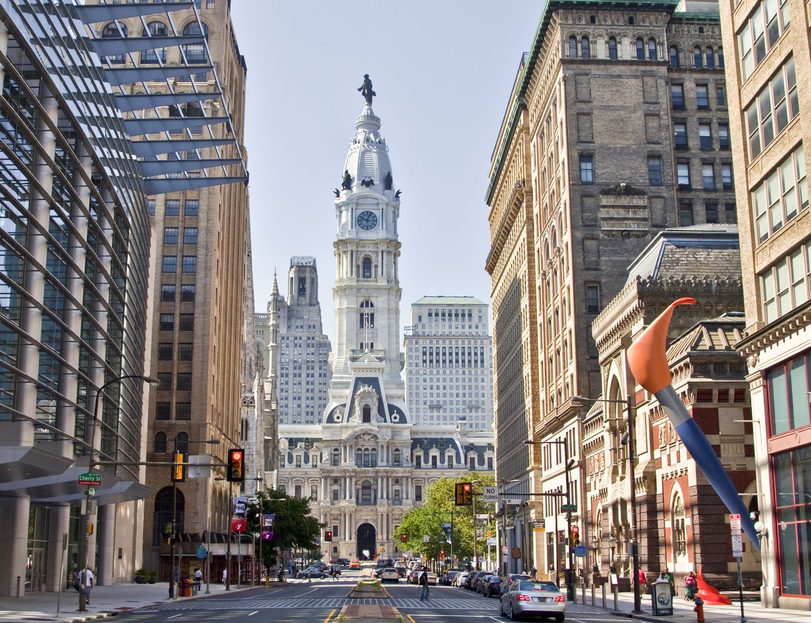
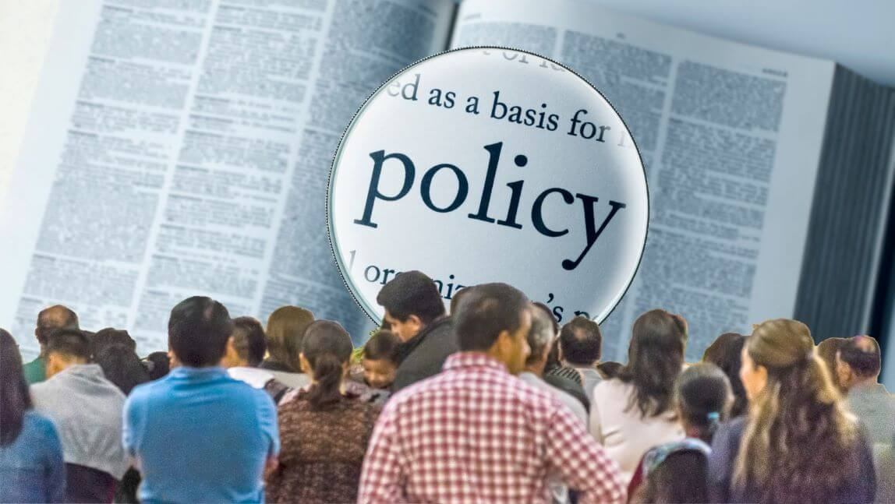
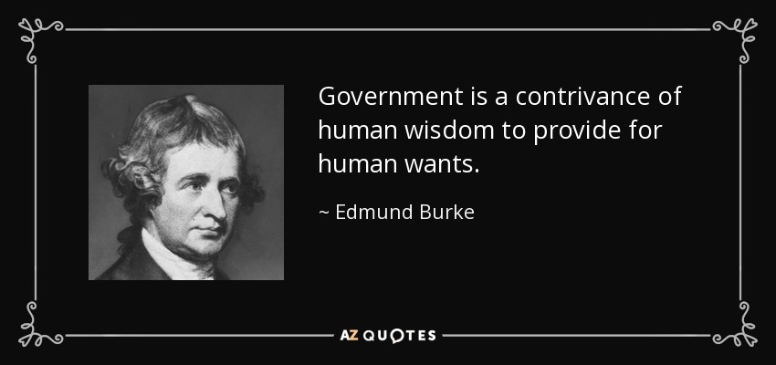
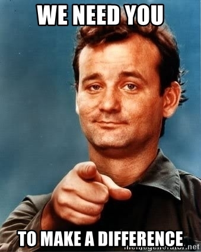
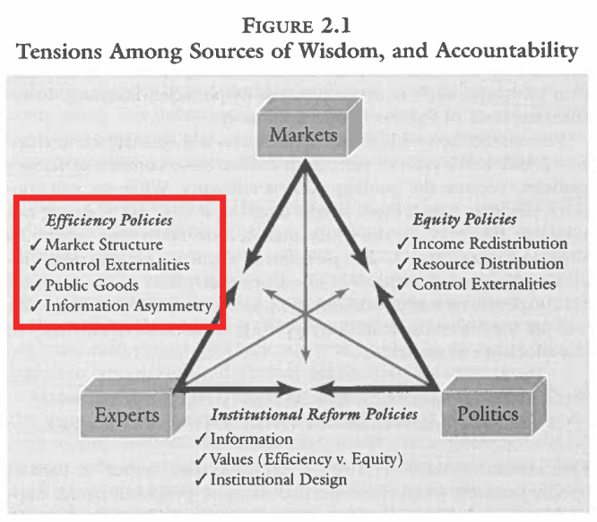
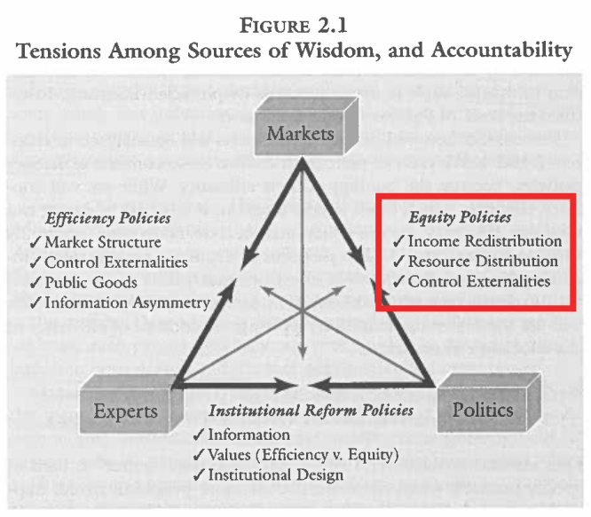
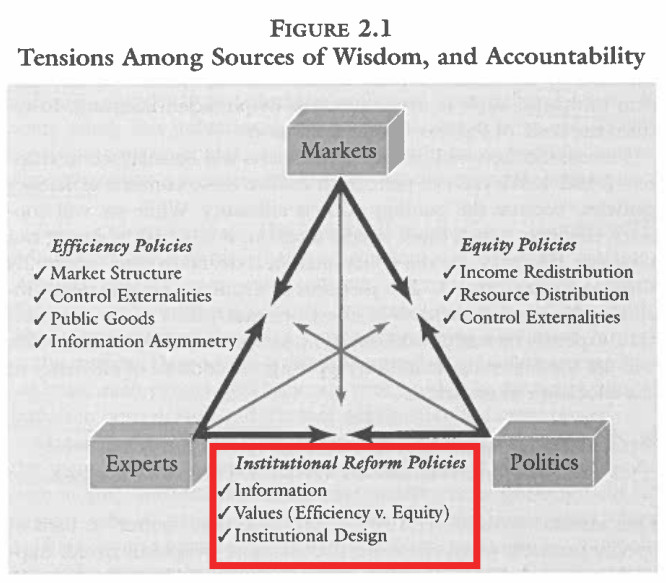
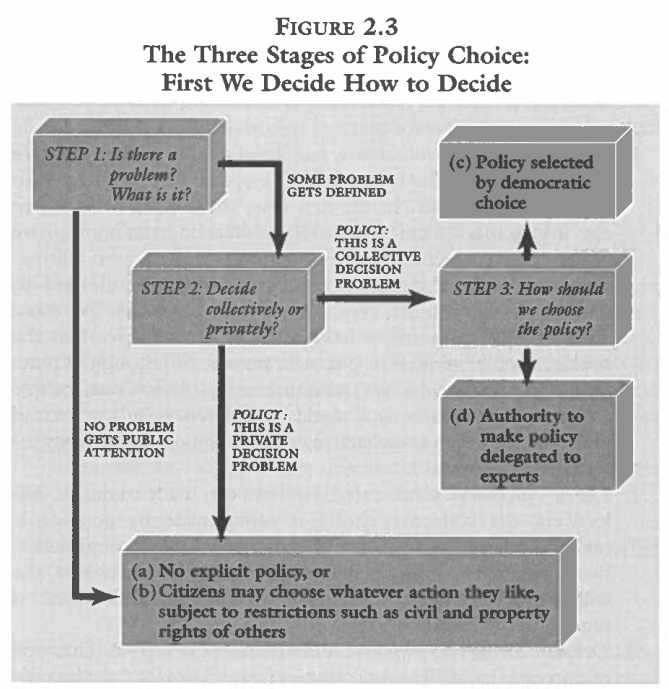
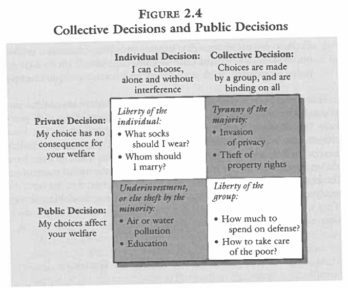

## Today's Agenda {background-image="Images/background-forest_v3.png" .center}

```{r}
library(tidyverse)
library(kableExtra)
```

<br>

::: {.r-fit-text}

**A Crash Course in Public Policy**

- Why do societies make policy?

- What are the basic pre-req's for making policy?

:::

<br>

::: r-stack
Justin Leinaweaver (Spring 2025)
:::

::: notes
Prep for Class

1. Review Canvas submissions

2. Bring the Munger book to class
    - Munger, M. C. (2000). Deciding How to Decide: "Experts," "The People," and "The Market." In *Analyzing Policy: Choices, Conflicts and Practices* (pp. 30–53). W.W. Norton & Company.

<br>

**SLIDE**: Let's refresh our work so far in this class.

:::


## {background-image="Images/background-forest_v3.png" .center}

::: {.r-fit-text}
**1) The Basics of Problem-Solving in a Community**
:::

```{r, echo = FALSE, fig.align = 'center'}

```

::: notes

In our first class we simulated a resource management problem.

**What was the problem your community faced in our game?**

- (How to manage a renewable resource)
- (How to distribute benefits in a community)

<br>

**What rules did you create? Why?**

- **e.g. number of fishers, selection of fishers, enforcement of the rules?**

<br>

**Did the group succeed in its efforts? Why or why not?**

- **Were you maximizing the sustainability of the resource, the gains of the collective or the gains of one individual?**

<br>

I really like this opening simulation for a bunch of reasons:

- It gives me a sense of who each of you are as individuals

- It gives me a sense of who you are as a collective

- It asks each of you to think about a community problem like a political scientist

- And, frankly, it's a lot of fun

<br>

**SLIDE**: But there are also some lessons on problem-solving we should keep in mind

:::


## {background-image="Images/background-forest_v3.png" .center}

::: {.r-fit-text}
**1) The Basics of Problem-Solving in a Community**
:::

<br>

Politics in everything!

::: {.incremental}

- EVERY problem exists in a community, and 

- EVERY community is a complex mix of actors, rules and interactions

- There are no "blank slates" or "state of nature" societies
:::

::: notes

**REVEAL 1 and 2**

- *Read slide*

<br>

**REVEAL 3**: Importantly, this isn't just talking about the rules you created for this problem!

- There is no "starting from scratch" anywhere in human societies!

<br>

Most of you were strangers to each other when we played the game and yet your behavior was HEAVILY influenced by:

- Your individual expectations for how you will do in this class (e.g. is EC valuable or not?),

- Your individual needs for progress towards your longer-term goals (graduation, grad school, etc)

- Your desire to be seen by the rest of the group in a particular way (classmates and professor)

- Your sense of how classrooms in college are supposed to function (e.g. what are the rules of behavior?)

- Your desire (maybe?) to not exterminate a species

- and so much more...

<br>

**Is everybody clear on the importance of thinking about the "politics" when problem-solving?**

- As policy-makers you need to keep these lessons in mind

:::


## {background-image="Images/background-forest_v3.png" .center}

::: {.r-fit-text}
**1) The Basics of Problem-Solving in a Community**
:::

:::: {.columns}
::: {.column width="50%"}


:::

::: {.column width="50%"}



:::
::::

::: {.r-fit-text}
**The Trouble with Wilderness**
:::

::: notes

After the simulation we shifted our focus to a big collection of key ideas discussed in the Cronon piece from 1996.

<br>

**For the purposes of problem-solving, what is "the trouble with wilderness" and what do we need to keep in mind as we work?**

- (**SLIDE**)

:::


## {background-image="Images/background-forest_v3.png" .center}

::: {.r-fit-text}
**1) The Basics of Problem-Solving in a Community**

<br>

**The Trouble with Wilderness**

1. The "environment" is a contested concept

2. "Conflict" is often due to conflicting definitions

3. **YOU** have to be curious and adaptable
:::

::: notes


1. "The Environment", or whatever specific piece of it you are focusing on in problem-solving, is a human construct.

    - Cronon (1996) argues that ALL environmental concepts are constructed by people and their meanings evolve over time!

<br>

2. The root of many "environmental" conflicts is often a conflict in definitions

    - Stakeholders will almost certainly define the key concept in your problem differently.

    - This leads to actors arguing past each other

<br>
    
3. A good problem-solver must be flexible and adaptable which means not locking in on any single definition!

    - The key skill is learning to identify the stakeholders' definitions and knowing how to connect them!

    - We must design solutions that either work to align those competing framings OR that are consistent with all relevant definitions.
    
<br>

**Is everybody clear on how "the environment" plays a role in problem-solving?**
:::


## {background-image="Images/background-forest_v3.png" .center}

::: {.r-fit-text}
**1) The Basics of Problem-Solving in a Community**
:::

<br>

{style="display: block; margin: 0 auto"}

::: notes

After exploring the Cronon piece we shifted into a comparative case study exercise

<br>

**For the purposes of problem-solving, what did we learn from our success and failure case studies last week?**

- **Are there certain kinds of environmental problem, community or policy approach that is more or less likely to succeed?**

<br>

**SLIDE**: Our work for this week...

:::


## {background-image="Images/background-forest_v3.png" .center}

::: {.r-fit-text}
**1) The Basics of Problem-Solving in a Community**
:::

{style="display: block; margin: 0 auto"}

::: {.r-fit-text}
**Problem-solving in a community requires policy!**
:::

::: notes


This week we need to **define "policy"** and think carefully about what it means to say that a problem **REQUIRES** a policy solution!

<br>

For today I assigned you a chapter from Michael Munger's *Analyzing Policy* book

- Munger's book is an excellent read for anyone interested in becoming a policy analyst or policymaker.

<br>

**When you hear the word "policy," what immediately springs to mind?**

- **What are the "policy" examples that you've encountered?**

- (Laws and regulations by government)

- (Rules for behavior as a student at Drury)

- (Rules tied to your contract with your employer at work)

<br>

Ok, I'm about to show you a dictionary definition for the word "policy."

- Before I do, let's talk about the dictionary for a sec.

<br>

Dictionary definitions are a great place to start your learning

- They represent one kind of consensus about the meaning of words

- HOWEVER, they are extremely limited and constraining.

<br>

As a problem-solver, our interest is in understanding concepts in the context of a given community

- NOT imposing one dictionary specified consensus on them

- So, feel free to consult the dictionary but don't let it limit your engagement with real people and real problems
:::


## What is Policy? {background-image="Images/background-forest_v3.png" .center}

<br>

"A definite course or method of action selected (as by a government, institution, group or individual) from among alternatives and in the light of given conditions to guide and usually determine present and future decisions..." (Webster's Third International Dictionary).

::: notes

Let's step through the key elements from this definition

:::


## What is Policy? {background-image="Images/background-forest_v3.png" .center}

<br>

"A **definite course or method of action** selected (as by a government, institution, group or individual) from among alternatives and in the light of given conditions to guide and usually determine present and future decisions..." (Webster's Third International Dictionary).

::: notes

1) A policy, by definition, is a "definite" "course" or "method" of action

<br>

Makes sense if you think of policy as a new rule or set of rules

- Without specificity and clarity the policy cannot hope to change behavior

- e.g. Actor X must do Y

- e.g. Companies investing in new equipment must...

<br>

**SLIDE**: The alternatives
:::


## What is Policy? {background-image="Images/background-forest_v3.png" .center}

<br>

"A definite course or method of action selected (as by a government, institution, group or individual) **from among alternatives** and in the light of given conditions to guide and usually determine present and future decisions..." (Webster's Third International Dictionary).

::: notes

2) A policy, by definition, is selected from among competing options

- There is NEVER just one answer to an environmental problem

- A BIG part of the reason a community typically has a problem in the first place is because there is dispute within that community over the possible answers

<br>

This means all policy, by definition, is choosing one set of rules over another

- Effective problem-solvers MUST be able to explain their choices in the context of the policies not selected

- In other words, you will be expected to have explicitly considered alternatives to your "definite" "course of action" AND be able to explain why you choose the way you did

<br>

**SLIDE**: conditions matter
:::

    

## What is Policy? {background-image="Images/background-forest_v3.png" .center}

<br>

"A definite course or method of action selected (as by a government, institution, group or individual) from among alternatives and **in the light of given conditions** to guide and usually determine present and future decisions..." (Webster's Third International Dictionary).

::: notes

3) A policy, by definition, must be adapted to the important "conditions" of the problem

- In other words, the quality of your plan also DEPENDS on how well you've adapted it to the conditions on the ground.

- No one-size-fits-all policy solutions are appropriate here.

<br>

THIS is the danger of groups tied or committed to a specific ideology.

- Both cutting regulations and adding new ones are powerful options for influencing behavior, BUT

- It is the context of the problem that should guide your policy design, not vice versa!

- If you know the policy answer before you hear the problem you are not taking it seriously

<br>

**SLIDE**: stakeholders matter
:::


## What is Policy? {background-image="Images/background-forest_v3.png" .center}

<br>

"A definite course or method of action selected (as by a government, institution, group or individual) from among alternatives and in the light of given conditions **to guide and usually determine present and future decisions**..." (Webster's Third International Dictionary).

::: notes

4) A policy, by definition, "guide[s]" or "determine[s]" future behavior by stakeholders

- Stakeholders e.g. the people involved in the problem

<br>

This means your plan must be adapted to the context of now AND the expected context we face in the future

<br>

**SLIDE**: In sum
:::


## {background-image="Images/background-forest_v3.png" .center}

### To maximize your chances of success, your policy proposals must be:

::: {.r-fit-text}
- Specific,

- Adapted to the stakeholders,

- Adapted to the science of the problem, 

- Adapted to the rules of the community, and

- Be at least as good as the alternatives.
:::

::: notes
**Does all of that make sense?**

<br>

Everybody write this down and consider it a guide for our work this semester and especially for the final paper!

<br>

**SLIDE**: To the Munger chapter!
:::


## What is Policy? {background-image="Images/background-forest_v3.png" .center}

{style="display: block; margin: 0 auto"}

::: notes

Munger kicks off his chapter with a longer version of this quote.

<br>

**What do you think of this as a definition of "government" or "policy"?**

- **By these terms, were you a government during our fishing simulation?**

<br>

Burke frames government as a human effort to deliver what we want

- Burke acknowledges that government is not "god-given" or part of the "natural order", it is a device built by us to achieve specific aims

- "contrivance": "the use of skill to bring something about or create something" (OED)

<br>

Importantly, this means that "government" is not impartial, perfect, or fixed in nature

- It is a human operation run by a community to achieve the goals of that community.

- In the simulation you were doing your best to manage a bunch of interests in the face of great uncertainty!

- Government is hard.
:::


## {background-image="Images/background-forest_v3.png" .center}

{style="display: block; margin: 0 auto"}

::: notes

Even MORE importantly, this means government is not separate from you.

- It is not a building far away or a special class of people

- It is the confusing name we apply to our community's efforts to solve problems

<br>

We live in a big, complicated country and its functioning well depends on you

- Problem-solving is in your hands

- The "decider" can be anyone, or any group, willing to put in the work 

- If you design a plan that meets the needs of its stakeholders and the conditions on the ground, you can make a difference

- THIS is how our government is designed to work

<br>

This is why we work on local environmental problems in here

- I want us tied to a specific community, in a specific moment in time and at a level where we can find concrete ways to make a difference.

<br>

**Questions on this?**

<br>

**SLIDE**: One more bit of preamble before we dig into the Munger chapter more deeply

:::


## {background-image="Images/background-forest_v3.png" .center}

{style="display: block; margin: 0 auto"}

::: notes

Never forget, however, that in real-world problem-solving we play with live ammunition (so to speak)

<br>

Policy designers must NEVER forget that **all policies create winners and losers**.

+ Policy-making is **ALWAYS a choice** and **all choices have consequences**.

<br>

For example, Missouri just raised its minimum wage

- **Who benefits from increases to the minimum wage?**

- **Who pays the costs for those increases?**

- **Is there any way to pay workers more without distributing the costs to society?**

<br>

The same is true with environmental policies

- Take the clean air standards set by the Clean Air Act and the EPA

- **Who benefits from cleaner air?**

- **And who pays the costs for it?**

- **Is there any way to get cleaner air without impacting polluting industries?**

<br>

**Humor me, can we think of any policy or rule in our society whether implemented by government, school, or your employer, that does not impose costs on someone?**

<br>

**SLIDE**: Please keep these real world costs and benefits in mind as we now shift to what will feel like an incredibly abstract conversation about the "wisdoms"
:::


## The "Wisdoms" {background-image="Images/background-forest_v3.png" .center}

<br>

:::: {.columns}
::: {.column width="50%"}
::: {.r-fit-text}
1. The Cause 

2. The Importance

3. Solution Types

4. Effectiveness Criteria
:::
:::

::: {.column width="50%"}

{style="display: block; margin: 0 auto"}

:::
::::

::: notes

In Figure 2.1 Munger focuses on three "tensions" that likely exist in any society when it comes to government action. 

- The three sources of "wisdom" here each represent a competing way to frame a policy problem

<br>

Each of these "sources of wisdom" represent different, pre-packaged framings you can apply to an environmental problem

- Each package asks you to view a given problem from a specific lens which carries with it guidance on why it matters, how it should be addressed and how it should be evaluated

<br>

Before you attempt to design a policy to address a problem you should be able to analyze that problem using each of the three "wisdoms."

<br>

**Does this make sense in big picture terms?**

<br>

*Split class into three groups and assign to each wisdom*

- Go sit with your group and claim a section of the board!
:::


## {background-image="Images/background-forest_v3.png" .center}

{style="display: block; margin: 0 auto"}


::: notes
**Everybody open up to Figure 2.1 in the Munger chapter**

<br>


I really appreciate how this figure connects our discussions last week about problem framing to policy design.

- As we noted last week, "framing" is like the packaging of a problem for sale

- Framing takes your simple, clear problem description and packages it with the important context / an easily digestible story

<br>

Last week I tried to make clear to you how powerful problem framing can be for problem-solving

- Today we step through how problem-framing creates path dependence 

- In simpler terms, getting the stakeholders to accept your framing is a huge step to getting them to accept your policy design

:::


## Introduce your "wisdom" {background-image="Images/background-forest_v3.png" .center}

<br>

1. What are the "primary" causes of our problems?

2. What are the "best" kinds of policy designs?

3. What are the "right" criteria for evaluating effectiveness?

4. What are the strengths and weaknesses of this perspective?

::: notes

Groups, in 10 minutes I want you to introduce your "wisdom" to the class.

- I know the chapter discusses the wisdoms primarily by their tensions between each other, but I'd like you to zoom in on each wisdom separately

- In other words, focus on what would happen if we made your source the end-all and be-all of policy-making

<br>

**Questions on the four prompts?**

- Go!

<br>

Let's hear your answers!

- *Groups Present Each and DISCUSS*

<br>

The Market

- Pros: Most efficient by definition (most bang for the resource buck)
- Cons: Market failures such as 1) Monopolies (e.g. antitrust), 2) Externalities (e.g. pollution), 3) Under supply of public goods (e.g. free-riding), and 4) Information problems (e.g. drug safety); Reduces all problems to maximization of use issues

Experts: "someone who has the goal of improving the functioning of politics or markets" (31).

- Pros: Hopefully relies on transparent and verifiable knowledge; Plans built on expertise and designed with ongoing evaluation
- Cons: May discourage wide participation; May privilege some uses/solutions over others; May lead to inequitable outcomes depending on "who" the experts are

Politics

- Pros: Can be done to maximize participation; 
- Cons: Can be very slow; Can be very messy; Often has trouble with long time horizon problems

:::


## {background-image="Images/01_1-cartoon_lake.jpg" .center}

::: notes

Think back to our resource management simulation.

- A community finds a renewable resource of fish they wish to consume

- Your job as a policy designer is to help that community manage the resource

<br>

This will mean guiding them in:

- The rules they create,

- The enforcement mechanisms they will require,

- The criteria they will use to monitor the plan's effectiveness,

- All while acknowledging some will benefit and others will pay the costs!

<br>

Let's practice this exercise using the "wisdoms" we've been reviewing
:::


## Applying the "Wisdoms" {background-image="Images/03_1-Cartoon_Lake_v2.png" .center}

<br>

1. Propose a policy to manage this resource

2. Explain the criteria we should use to monitor its effectiveness

3. Identify who in our society will benefit and who will pay the costs

::: notes

Groups, take a few minutes to think about our management problem from the perspective of your assigned wisdom.

- I'd like each group to apply their wisdom to the problem in order to tell us these three things

<br>

1. What would the policy look like?

2. How would we know if it is working?

3. How are the costs and benefits distributed in this plan?

<br>

**Questions?**

- Go!

<br>

*PRESENT and DISCUSS each*
:::


## {background-image="Images/01_1-cartoon_lake.jpg" .center}

::: notes
**So, where do we end up?**

- **Which plan appeals most to you? Why?**

<br>

**SLIDES**: *Conflicts between the wisdoms*
:::


## {background-image="Images/background-forest_v3.png" .center}

{style="display: block; margin: 0 auto"}

::: notes

Now, Munger argues that many policy debates come from the conflicts between these sources of wisdom.

<br>

When experts try to "fix" market failures we get efficiency policies.
- e.g. How do we distribute the rewards to ensure no better distribution is possible?

- e.g. How can expert tweaks to the market reduce market failures?

<br>

**Can we see this specific tension when we compare the plans from the market and expert groups?**

<br>

**How much room for compromise here?**

:::


## {background-image="Images/background-forest_v3.png" .center}

{style="display: block; margin: 0 auto"}

::: notes

When politics tries to "fix" market failures we get equity policies.
- Disagreements about the outcomes of market processes

- e.g. Fairness

<br>

**Can we see this specific tension when we compare the plans from the market and politics groups?**

<br>

**How much room for compromise here?**

<br>

**chapter notes**

But there are two conflicting meanings of fairness too!

1. "Fair" as in "average"
2. "Fair" as in equitable
:::


## {background-image="Images/background-forest_v3.png" .center}

{style="display: block; margin: 0 auto"}

::: notes

When experts try to "fix" political failures we get institutional reform policies.
+ Can be either benign or evil (e.g. broaden the vote vs restrict it)

+ Often implicate the very functioning of your government or democracy

<br>

**Can we see this specific tension when we compare the plans from the expert and politics groups?**

<br>

**How much room for compromise here?**
:::


## {background-image="Images/background-forest_v3.png" .center}

{style="display: block; margin: 0 auto"}

::: notes
**Any questions or need for clarification on the sources of wisdom?**

- **Does everybody understand the value of thinking through a specific problem three times, once per "wisdom"?**

<br>

Bottom line, there is no free lunch!

- Each perspective promotes a type of policy design but each policy design creates costs for somebody in society

<br>

HOPEFULLY, this helps you start to better understand why no single "wisdom" is always the "right" answer

- If a single source ALWAYS "wins" then you create a wild imbalance in society (e.g. all costs to one type of group and all benefits to one type of group repeated forever)

<br>

This triangle offers us a helpful way to think about disputes over problem framing

- As you analyze the stakeholders involved in any environmental problem you will have a better understanding of who they are and what they want if you can figure out where they fit here.
:::


## {background-image="Images/02-1-cavemen.jpg" .center}

::: notes

Let's now shift to one of my favorite thought experiments in any textbook ever.

<br>

**What is the Hun-gats tribe thought experiment?**

- **What details stood out for you?**

- A tribe of hunter-gatherers in pre-history that are running out of food (or at least the food they know is safe to eat)

- Option: They can stay independent and "free" (every man for himself), but that will almost certainly wipe them out

- Option: Create policy to share risk and increase chances of survival over time

<br>

Now analyze it for me!

**What are the concrete lessons we can take from the starving Hun-gats tribe to help us be better policy-makers?**

- *Don't dawdle setting this up or debating the state of nature. Get to the point. They read it so ask what the takeaways are!*

<br>

1. The "state of nature" baseline is probably a stupid one as it never could have existed (not even in this thought experiment)
    - Munger implies that a "state of nature" represents the absence of any market, expert or political "context" in a given situation (p35).

2. The desire to survive appears to make policy a necessity

3. Battles over expertise are central to policy-making

4. Policy can only ever be as effective as the authority that compels the behavior, e.g. the birth of religious rules?

5. Any society with resource issues will deal with free-riding problems

<br>

I really appreciate how this distills down to the fundamental basics of how any human society functions.

- The creation of policy helps maximize the odds of survival
:::


## {background-image="Images/background-forest_v3.png" .center}

{style="display: block; margin: 0 auto"}

::: notes

In Figure 2.3 Munger lays out his "three stages of policy choice."

- This figure specifies the three steps involved in pushing a community to address a problem

<br>

In essence, Munger's three steps are:

1. Convince the community there is a problem,

2. Convince the community it should be addressed collectively, and

3. Convince the community of how the specific policy should be adopted

<br>

Fundamentally, this figure is a reminder for all policymakers

- BEFORE you try to solve a problem, you MUST make a number of convincing arguments

<br>

**SLIDE**: For our purposes, I'm going to boil these down to two steps that I will ask you to include in your reports this semester

:::


## We Need a Policy {background-image="Images/background-forest_v3.png" .center}

<br>

::: {.r-fit-text}
**Argument 1:** This is a public problem

<br>

**Argument 2:** This requires a collective decision
:::

::: notes

Before you can propose a policy solution you must first convince the relevant community of two things:
1. The issue is a public problem, and

2. It requires a collective decision.

<br>

**What does it mean to say something is a "public" problem?**

- **As opposed to what?**

- (**SLIDE**)
:::


## 1. This is a public problem {background-image="Images/background-forest_v3.png" .center}

<br>

**Private Problem**

- "My choice has no consequence for your welfare"

**Public Problem**

- "My choices affect your welfare"

::: notes

Note that for clarity I am referring to these as debates about the problem

- In Munger's Figure 2.4 he labels these "decisions" which I find a little confusing

<br>

**Give me an example of something in your life that is clearly a "private problem" by this definition.**

<br>

**Now give me an example of something in your life that is clearly a "public problem" by this definition.**

<br>

**How distinct are these two things?**

- **Is it likely the case that people easily agree the difference between public and private problems?**

<br>

- **Give me an example of a problem that straddles the line between public and private these days**
:::


## We Need a Policy {background-image="Images/background-forest_v3.png" .center}

<br>

::: {.r-fit-text}
**Argument 1:** This is a public problem

<br>

**Argument 2: This requires a collective decision**
:::

::: notes
**What does it mean to say something requires a "collective" decision?**

- **As opposed to what?**

- (**SLIDE**)
:::


## 2. This requires a collective decision {background-image="Images/background-forest_v3.png" .center}

<br>

::: {.r-fit-text}

**Individual Decision**

- "I can choose, alone and without interference"

**Collective Decision**

- "Choices are made by a group, and are binding on all"
:::

::: notes
**Give me an example of something in your life that should definitely remain an "individual decision" by this definition.**

<br>

**Now give me an example of something in your life that should absolutely require a "collective decision" by this definition.**

<br>

**How distinct are these two things?**

- **Is it likely the case that people easily agree the difference between individual and collective decision problems?**

<br>

- **Give me an example of a problem that straddles the line**
:::


## We Need a Policy {background-image="Images/background-forest_v3.png" .center}

{style="display: block; margin: 0 auto"}

::: notes

Munger's Figure 2.4 combines these two arguments in order to convey more important lessons for us as policymakers and problem-solvers.

- **Groups, reflect on this 2x2 grid and report back to me on how this helps us solve problems**

<br>

**What do you get from this?**

- **How does this help us think about problem-solving in a community?**

<br>

Different combinations of positions on our two baseline arguments lead to VERY different views of any specific problem

- Figuring out how a stakeholder thinks about your problem along these two dimensions can offer very powerful insights for you about them.

- Issue framings are typically powerful and often connect minor issues to loaded ideas and identities

- A person who views the issue you are calling "a problem" who believes it is an issue of their "individual liberty" is NOT someone who is going to be excited to hear about your new plan, right?

<br>

These boxes represent shortcuts to analyzing a stakeholder
- When a stakeholder uses language like in these four boxes they are telling you a ton about who they are, what they identify with and what they value!

- Think carefully about these messages as a means to helping you think through moving their willingness to compromise.

<br>

These boxes represent shortcuts to moving the views of a stakeholder

- Taking on one of these at a time will be easier than trying to tackle both framing problems simultaneously

- Keeping these discussions distinct can be a useful strategy

- e.g. first establishing that someone's choices affect community welfare AND THEN making a separate case that the community should decide

<br>

**Make sense?**

:::


## {background-image="Images/background-forest_v3.png" .center}

{style="display: block; margin: 0 auto"}

::: notes

If your goal is to solve actual problems facing a real community then an effective policy designer must be flexible and empathetic to the needs and views of the stakeholders in the community.

<br>

We live in a complex and diverse society filled with lots of different people living in very close quarters.

- Our job is to figure out where they are, what they want and how we can help them solve problems using policies that EVERYONE will accept and obey over time.

<br>

**Questions on the Munger chapter or how we apply the material to your projects this semester?**
:::


## For Next Class {background-image="Images/background-forest_v3.png" .center}


::: notes

On Thursday 

<br>

**Questions on this assignment?**
:::
