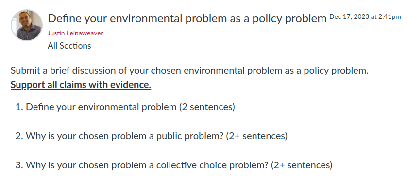

---
output:
  xaringan::moon_reader:
    css: ["default", "extra.css"]
    lib_dir: libs
    seal: false
    nature:
      highlightStyle: github
      highlightLines: true
      countIncrementalSlides: false
      ratio: '16:9'
---

```{r, echo = FALSE, warning = FALSE, message = FALSE}
##xaringan::inf_mr()
## For offline work: https://bookdown.org/yihui/rmarkdown/some-tips.html#working-offline
## Images not appearing? Put images folder inside the libs folder as that is the main data directory

library(tidyverse)
library(readxl)
library(stargazer)
##library(kableExtra)
##library(modelr)

knitr::opts_chunk$set(echo = FALSE,
                      eval = TRUE,
                      error = FALSE,
                      message = FALSE,
                      warning = FALSE,
                      comment = NA)
```

background-image: url('libs/Images/background-forest_v3.png')
background-size: 105%
background-class: center
class: middle

.size45[**I. The Basics of Problem-Solving in a Community**]

<br>

.size50[

**Today's Agenda**

Argument: Your environmental problem is public and should be solved collectively
]

<br>

.center[.size40[
  Justin Leinaweaver (Spring 2024)
]]

???

## Prep for Class
1. Record Canvas submissions

2. Bring the Munger book to class

3. Publish Canvas discussion for Tuesday

<br>

.size15[Munger, M. C. (2000). Deciding How to Decide: "Experts," "The People," and "The Market." In *Analyzing Policy: Choices, Conflicts and Practices* (pp. 30–53). W.W. Norton & Company.]

<br>

**SLIDE**: Warm-up by brainstorming community engagement projects


---

background-image: url('libs/Images/background-forest_v3.png')
background-size: 100%
background-position: center
class: middle

.center[.size50[.content-box-green[**Assignment 4**]

Getting Involved in our Community]]

.size40[
**Find or create** an opportunity to get **actively involved in your issue locally** (e.g. litter pickup, river cleanup, working with a local NGO or city agency on your issue, etc.)

**Write a report** describing what you did, who you worked with and what you learned that will help you with solving your chosen policy problem.
]

???

Let's warm up again today with more community engagement brainstorming!

- Everybody get ready to name one activity they could do this weekend to engage in their chosen environmental problem in our community!

- Something that gets you out into the community doing something to work on your specific problem

- **MUST** be different than your idea last class!

<br>

Go!

<br>

Don't forget you have to get my sign-off on your project BEFORE you do it

- Submit your proposal on Canvas as an assignment.

<br>

### Any questions on the community engagement project?


---

background-image: url('libs/Images/background-forest_v3.png')
background-size: 100%
background-position: center
class: middle

.size45[.content-box-green[**1) The Basics of Problem-Solving in a Community**]]

.size55[
- "Politics"

- "Environment"

- **"Policy"**
]

???

This week we have continued our work in the first section of the class focused on laying the foundations for problem-solving.

- On Tuesday I tried to help you connect our previous work to Munger's big ideas about policy-making 


---

background-image: url('libs/Images/background-forest_v3.png')
background-size: 100%
background-position: center
class: middle

.size45[
**A .textblue[useful] policy proposal .textblue[MUST]:**

- Be specific,

- Be adapted to the specific stakeholders,

- Be adapted to the conditions on the ground, and

- Include an evaluation of strong alternative proposals.
]

???

I introduced you to a common definition of policy and we used that to extract a series of guidelines that I hope will help you be more effective problem-solvers.

<br>

**SLIDE**: Policy-making sounds hard, do we have to do it?


---

background-image: url('libs/Images/02-1-cavemen.jpg')
background-size: 100%
background-position: center

???

To answer that question, Munger's reading introduced you to a thought experiment about the Hun-Gats tribe

- In short: A tribe of hunter-gatherers in pre-history are running out of food and have to decide what to do about it 

- Should they leave this decision to individuals or the community?

<br>

### What do we learn about policy and policy-making from the Hung-Gat thought experiment?

<br>

1. Both options are policies!
    - Leave me alone and tell me what to do are both rules

2. Private, individual decision-making often leads to bad community outcomes
    - The creation of policy helps maximize the odds of survival

3. ALL Policies create winners and losers which means battles over rule-making and enforcement are inevitable
    - Battles over expertise are central to policy-making

<br>

That's a handy thought experiment!

- **SLIDE**: So, we need policy, but what design standard should we use?


---

background-image: url('libs/Images/01_1-cartoon_lake.jpg')
background-size: 100%
background-position: center
class: middle

```{r, echo = FALSE, fig.align = 'right', out.width = '55%'}
knitr::include_graphics("libs/Images/02-1-Munger_Fig2-1.png")
```

???

We ended last class by briefly applying each of Munger's three "wisdoms" to our resource management problem

- My hope is that this helps you begin to see how specific problem framings (e.g. markets, experts and politics) lead to very different policy designs.

<br>

### Market group, what policy did you propose and why do you believe it is awesome?
- (CLASS NOTE: Let someone own the lake and their profit motive will ensure its survival!)
- Awesome because markets are the most efficient means of allocating resources in productive ways

<br>

### Experts group, what policy did you propose and why do you believe it is awesome?
- (CLASS NOTE: Experts should be empowered to help us estimate maximum sustainable yields and the dynamics of the lake ecosystem in order to determine extraction policies)
- Awesome because this gives the fish the best chance to survive!

<br>

### Politics group, what policy did you propose and why do you believe it is awesome?
- (CLASS NOTE: The community should be entrusted to collectively decide how to balance concerns about the fish and the people)
- Awesome because we can consider equity and redistribution in order to deal with other community concerns

<br>

### And which of the three is the "best" policy?
- It depends on how you personally value the aims of each problem-framing AND
- Who you believe should pay the costs for the community's survival

<br>

### Make sense?

<br>

**SLIDE**: That battle is still to come for each of you on your chosen problem, but the final piece that Munger tells us is important ties to your assignment for today

<br>

<br>

<br>

#### The following was the plan for SP24 but since prior class had to rush this I made the above before class

### What are the key lessons of this figure for designing policies to solve an environmental problem?

### - What does this figure help us think about?

<br>

1. Designing a policy means choosing a "source of wisdom" or in the language of our class so far a problem framing!
    - You can only maximize for one thing at a time!
    - A coherent policy needs to root itself with a clear organizing principle

2. The triangle helps you remember that all policy designs create winners and losers 
    - This can help you anticipate the challenges/problems before they arrive
    - Make your plan better proactively!

3. This triangle offers us a helpful way to understand disputes about your problem in the community
    - As you analyze the stakeholders involved in any environmental problem you will have a better understanding of who they are and what they want if you can figure out where they fit here.


---

background-image: url('libs/Images/background-forest_v3.png')
background-size: 100%
background-position: center

class: middle

.size50[.content-box-green[**Assignment for Next Class**]]

<br>

```{r, echo = FALSE, fig.align = 'center', out.width = '100%'}

```

???

Getting a community to accept a policy solution to any problem requires you successfully make two separate arguments!

- Key for us is to remember that without clearing these two hurdles no effective policy solution is possible

<br>

Today we take all the useful theoretical work from Munger and apply it to your projects with your pre-class work as our jumping off point.

### How did this go? 

### - Everybody ready to push forward?

<br>

Today we'll work together to strengthen your arguments and help each other develop counter-arguments to consider.


<br>

<br>

<br>

#### The following was the plan for SP24 but since prior class had to rush this I made the above before class

Let's refresh our memories on the roadblocks to making these arguments

### 1. What kinds of obstacles may push you off the policy track in step 1? 

### - In other words, why might an environmental problem be thought of as an individual rather than a public problem?

- p46: No one cares, 
- issue unimportant, or
- due to civic/religious culture it simply doesn't occur to anyone that government might have a role in this

<br>

### 2. What kinds of obstacles may push you off the policy track in step 2?

- Either there is no decision, 
- the group decides this is outside the scope of government, OR 
- the group collectively decides not to act

<br>

### Questions on this?

<br>

**SLIDE**: Last important figure from Munger (prior plan included Fig 2.4)


---

background-image: url('libs/Images/background-forest_v3.png')
background-size: 100%
background-position: center
class: middle, center

.size50[.content-box-green[**Describe your environmental problem**]]

???

Everybody take out a piece of paper.

- Across the top write a **SIMPLE** description of your environmental problem

- *Zip around the room to hear all of them, make sure they are simple*

--

<br>

```{r}
tibble(
  cola = c(1, 2, 3, 4, 5),
  col1 = c("?", "?", "?", "?", "?"),
  col2 = c("?", "?", "?", "?", "?")
) |>
  kableExtra::kbl(align = c("c", "c"), col.names = c("", "Public Problem", "Collective Decision")) |>
  kableExtra::kable_styling(font_size = 40) |>
  kableExtra::column_spec(2:3, width = "25em") |>
  kableExtra::row_spec(row = 0, background = "lightgreen")
```

???

<br>

Under your problem description make two lists

- Give us your best five reasons you argue this is a public problem, and

- Your best five reasons this should be a collective decision

- These should be **COMPLETE** sentences!

<br>

### Questions on what I'm asking for?

- Go!


---

background-image: url('libs/Images/background-forest_v3.png')
background-size: 100%
background-position: center
class: middle, center

.size50[.content-box-green[**Describe your environmental problem**]]

<br>

```{r}
tibble(
  cola = c(1, 2, 3, 4, 5),
  col1 = c("?", "?", "?", "?", "?"),
  col2 = c("?", "?", "?", "?", "?")
) |>
  kableExtra::kbl(align = c("c", "c"), col.names = c("", "Public Problem", "Collective Decision")) |>
  kableExtra::kable_styling(font_size = 40) |>
  kableExtra::column_spec(2:3, width = "25em") |>
  kableExtra::row_spec(row = 0, background = "lightgreen")
```

???

Ok, I need a volunteer to share theirs!

- *As they present you take abbreviated notes on the board*

<br>

Let's help to strengthen these

### 1. Is each reason clear (and complete sentence)?

<br>

### 2. Which of these reasons need evidence in order to be convincing?

### - Volunteer, do you have evidence for this yet?

<br>

### 3. Any new reasons we could add to these lists to strengthen these arguments?

<br>

### Ok, did that help clarify the exercise?

<br>

Let's do it again!

- I need a second volunteer!

- *Repeat exercise above*

<br>

Ok, split into pairs and repeat this exercise for each other

- Make sure your partner has clear and compelling reasons and if you think they are missing anything.

<br>

### Questions?

- Go!


---

background-image: url('libs/Images/background-forest_v3.png')
background-size: 100%
background-position: center
class: middle

.center[.size65[.content-box-green[**We Need a Policy Solution**]]]

<br>

.size50[
**Argument 1:** This is a public problem

**Argument 2:** This requires a collective decision
]

???

Alright, let's zip around the room and hear all these arguments.

- Describe the problem and then read us your reasons for each argument

<br>

### How are we doing with this?

### - Questions? Need for clarification?

<br>

### Does everybody have a clear problem definition and argument that this is a public problem that requires a collective decision?

<br>

**SLIDE**: Time for the next step: Counter-arguments!


---

background-image: url('libs/Images/background-forest_v3.png')
background-size: 100%
background-position: center
class: middle, center

```{r}
tibble(
  cola = c(1, 2, 3, 4, 5),
  col1 = c("?", "?", "?", "?", "?"),
  col2 = c("?", "?", "?", "?", "?")
) |>
  kableExtra::kbl(align = c("c", "c"), col.names = c("", "Private Problem", "Individual Decision")) |>
  kableExtra::kable_styling(font_size = 40) |>
  kableExtra::column_spec(2:3, width = "25em") |>
  kableExtra::row_spec(row = 0, background = "pink")
```

???

On your sheet of paper, below your current lists, I want you to make two new lists that represent the counter-arguments.

1. Give us your best five reasons this is actually a PRIVATE problem
    - e.g. "my choice has no consequence for your welfare"

2. Give us your best five reasons this should remain an INDIVUDAL decision!
    - e.g. "I should be able to choose alone and without interference"

<br>

### Does what I'm asking for make sense?

- Go!

<br>

*New volunteer!*

- Describe your chosen problem and then give us your strongest argument this is a private problem that should be an individual decision

- *As they present you take abbreviated notes on the board*

<br>

### Are these reasons clear?

<br>

### Anything else we could add to these lists to strengthen the arguments?

<br>

Small groups (3) review each other's new lists!

- Make sure they are clear and see if you can add anything to them

- Go!

<br>

### Does anybody have a list of counter-arguments that are particularly daunting or difficult to address? Let's discuss!


---

background-image: url('libs/Images/background-forest_v3.png')
background-size: 100%
background-position: center
class: middle, center

.pull-left[
```{r, echo = FALSE, fig.align = 'center', out.width = '100%'}
knitr::include_graphics("libs/Images/02-1-Munger_Fig2-3.png")
```
]

.pull-right[

<br>

```{r, echo = FALSE, fig.align = 'center', out.width = '100%'}
knitr::include_graphics("libs/Images/02-1-Munger_Fig2-4.png")
```
]

???

Your work for today is meant to deepen your thinking about the framing of your chosen environmental problem

- Every problem framing carries implicit arguments about who is harmed and how society should respond

- Our exercises today represent a step towards making those implicit arguments explicit.

- Ultimately, it will be VERY helpful to you to keep arguments about the NEED for policy SEPARATE from the arguments about the design of the policy.

<br>

Our work today is also meant to help you think more seriously about the opposition you are likely to encounter when trying to solve your problem.

- The objections will be rooted in different problem framings and you need to consider them before you begin to deisgn anything.

<br>

### Make sense?


---

background-image: url('libs/Images/background-forest_v3.png')
background-size: 100%
background-position: center

class: middle

.size70[.content-box-green[**Assignment for Tuesday**]]

.size45[
1. Read the chapters in the syllabus describing domestic processes for problem-solving, and

2. Submit to Canvas: What are **three** key elements you argue are necessary to **successfully navigate** a domestic policy-making process?
]

???

Next week we explore processes of policy-making and problem-solving.

<br>

The readings will introduce you to a few intriguing options.

<br>

Then you'll reflect on those options and submit your analysis of them.

<br>

### Questions on the assignment?


