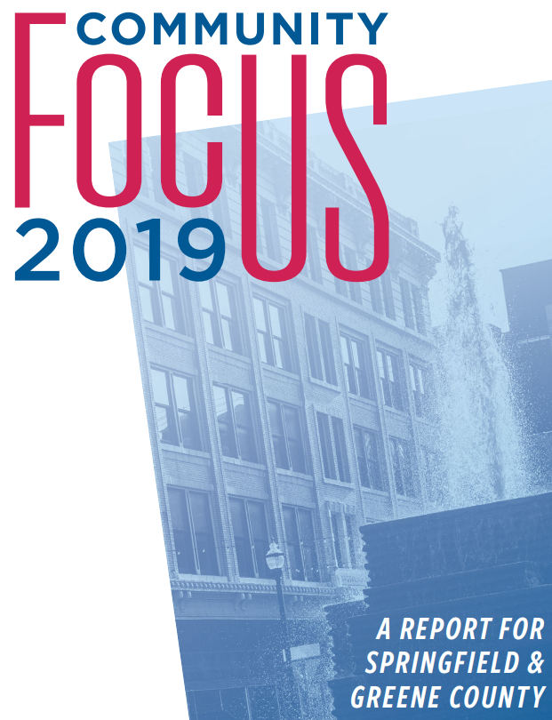
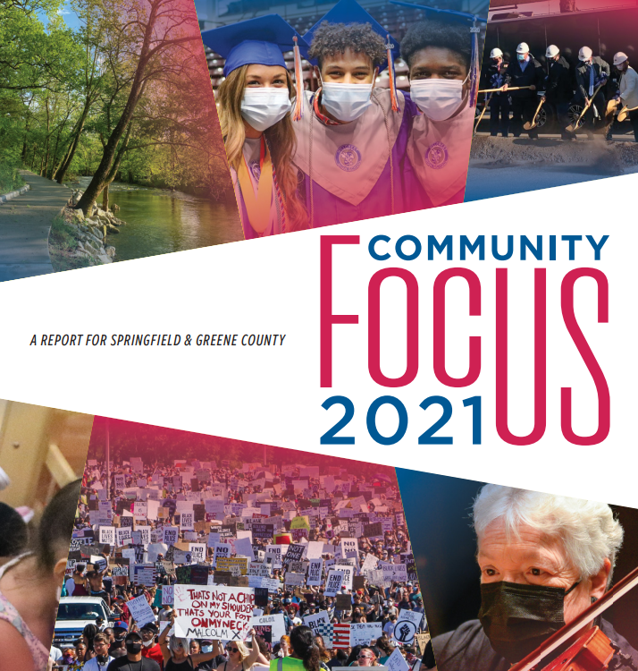
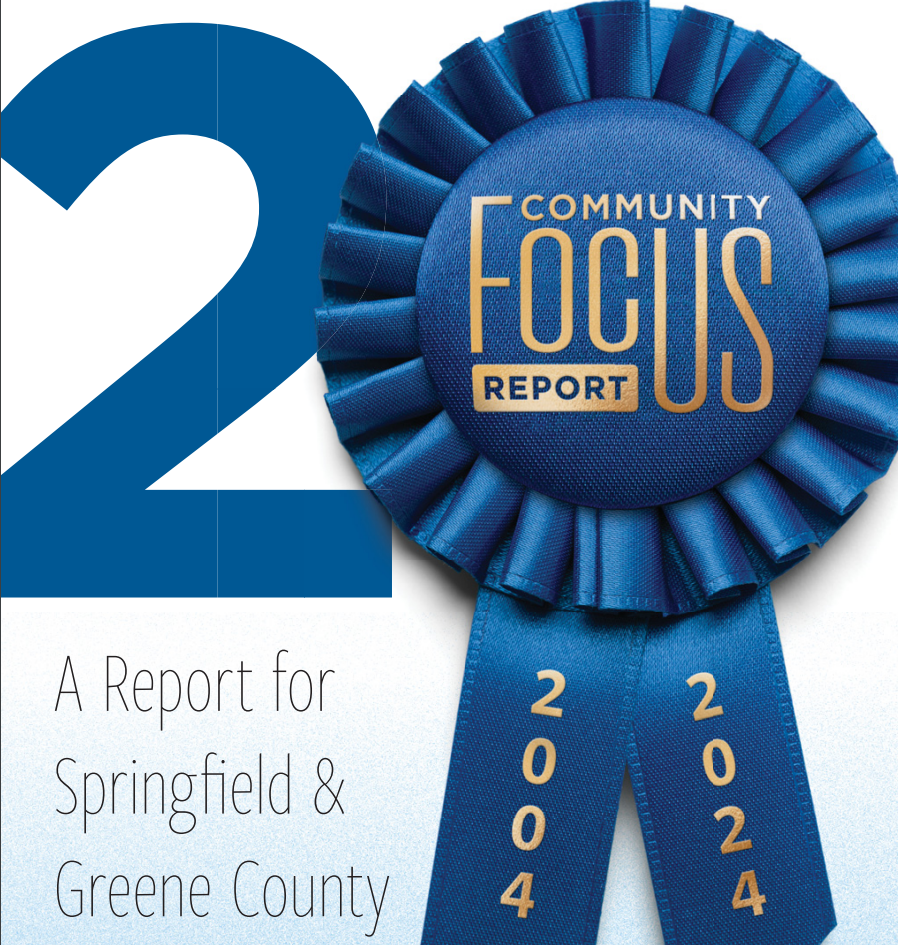

## Today's Agenda {background-image="Images/background-forest_v3.png" .center}

```{r}
library(tidyverse)
library(kableExtra)
```

<br>

### How well equipped is Springfield to solve environmental problems?

<br>

::: r-stack
Justin Leinaweaver (Spring 2025)
:::

::: notes
Prep for Class

1. Review Canvas submissions

2. Copy theories generated in week 2 case studies to here

3. SGF Community Focus Reports
    - [2024 Report](https://springfieldcommunityfocus.org/2024_report/community-focus-report-2024.pdf)
    - [2021 Report](https://springfieldcommunityfocus.org/2021_report/springfield-community-focus-report-2021.pdf)
    - [2019 Report](https://springfieldcommunityfocus.org/2019_report/community-focus-2019-report.pdf)
    
4. Canvas Assignment Prompt: How effective has the Springfield community been in identifying and solving big problems? Read these reports in order to get a sense of how our community identifies and addresses big challenges. Don't just focus on the environmental stuff, it's all connected!
    1. Over the last five years, what are the THREE most impressive accomplishments identified in the Springfield Community Focus Reports?
    2. Over the last five years, what are THREE specific challenges we have been unable to address? Why do these stand out for you?

<br>

I have a few aims for us today:

1. We need to get a better sense of how Springfield functions as a community when faced with challenges

2. We should leverage the theoretical work we've done over the last few weeks to dig deeper into the material in these reports, and

3. We should flag ongoing environmental challenges as identified by these reports

<br>

**SLIDE**: Let's start by talking about these reports as sources of information

:::


## Evaluating the Source {background-image="Images/background-forest_v3.png"}

{.absolute left=0 bottom=130 width="325"}

{.absolute left=350 bottom=165 width="325"}

{.absolute right=0 bottom=150 width="350"}

::: notes

Talk to me about these reports as sources of information about our community

- **What did you learn about these reports in terms of their validity and reliability based on how they present themselves in the writing?**

-*ON BOARD: Elements that boost your confidence vs elements that lower it*

<br>

- **Who are the sources of this information?**

- **Who decides on the topics to focus on? e.g. Who is the agenda setter?**

- **Who does the actual writing?**

- **What do you think of the caliber of the writing? Are these well written?**

<br>

**How do the SGF Community Focus Reports fit in the material we covered in the Munger chapter last class?**

- **What role are they trying to play in our community?**

- (**SLIDE**)

:::


## {background-image="Images/background-forest_v3.png" .center}

::: {.r-fit-text}
**Policymaking Pre-Requisites**

<br>

You must convince the community that:

1. We have a public problem, and

2. We require a collective decision to solve it
:::

::: notes

I see these reports VERY much as an effort to "decide how to decide"!

- The pre-reqs in action!

<br>

Let's keep these two tasks in mind later in our class today when we discuss the challenges you highlighted in your Canvas submissions

<br>

**SLIDE**: But first, let's start with what you identified as the "most impressive accomplishments" from the last three reports

:::


## {background-image="Images/background-forest_v3.png" .center}

### What are Springfield's "most impressive accomplishments" over the last five years?

::: notes

*ON BOARD: col 1 with room to match "why" to each in col 2*

- Help me list all of the "most impressive accomplishments" from the last three Springfield Community Focus Reports submitted to Canvas.

- Tell me what happened and in which report we can read about it

<br>

**Ok, analysis time. Why are these the "big" accomplishments?**

- **In other words, and based on this list, what are the criteria you were using for choosing what is and is not "impressive"?**

<br>

Don't forget to reflect on your own assumptions and biases along the way!

- **What do we learn from this list of criteria about you as a group of community problem-solvers?**

<br>

Remember, we have to constantly be interrogating our own assumptions as we go or we are liable to stumble into problems that could have been avoided.

:::


## {background-image="Images/background-forest_v3.png" .center}

### What do the reports highlight as the reasons for these "most impressive accomplishments"?

::: notes

*ON BOARD: col 2 next to each accomplishment*

- **Per the reports, what are the specific reasons we accomplished these "impressive" things? How do the reports explain them?**

<br>

**Any overlap in this list with the mechanisms we brainstormed using our case studies last week?**

- **Would we have been able to predict these using our theories of local problem-solving?**

<br>

*Class notes*

P(Success) increases when**

- The visibility of the problem increases
- The threat of harm is imminent
- The source of the problem is clear
- The greater the agreement on the cause of the problem
- The size of the impacted community is smaller
- The community has a greater sense of shared values
- The community has a demonstrated pattern of activism
- The community is more affluent
- The money available to act is greater
- The plan includes criteria for measuring effectiveness
- The plan includes greater levels of community involvment
- The plan changes incentives (carrots or sticks)

<br>

**SLIDE**: Challenges time!

:::


## {background-image="Images/background-forest_v3.png" .center}

### What are the "specific challenges we have been unable to address" over the last five years?

::: notes

*ON BOARD: col 3*

- Help me list all of the "specific challenges we have been unable to address" from the last three Springfield Community Focus Reports submitted to Canvas.

- Tell me what happened and in which report we can read about it

<br>

**Per the reports, why are we struggling to overcome these challenges?**

- **How do the reports explain the lack of progress?**

<br>

**Any overlap in this list with the mechanisms we brainstormed using our case studies last week?**

- **Would we have been able to predict these challenges using our theories of local problem-solving?**

<br>

Let's rank these challenges

- **Which specific challenges are the most important for Springfield to address? Why?**

- I know I'm asking for value-based judgements here, but I' understand that.'m curious to learn more about your values.

<br>

**SLIDE**: Evaluate the pre-reqs

:::


## {background-image="Images/background-forest_v3.png" .center}

::: {.r-fit-text}
**Policymaking Pre-Requisites**

<br>

You must convince the community that:

1. We have a public problem, and

2. We require a collective decision to solve it
:::

::: notes

Let's now talk about the role of these reports in the policymaking process.

<br>

**How effectively do you think these reports are making the pre-req arguments on these specific challenges?**

- **Which ones are they doing the best job with? Why?**

- **Which the weakest? Why?**

:::


## {background-image="Images/background-forest_v3.png" .center}

### How well equipped is Springfield to solve environmental problems?

::: notes

Big picture, where do we end up in our evaluation of Springfield as a community prepared to solve big problems?

<br>

**What kind of picture does the current report present of our local community?** 

- **e.g. big picture strengths and weaknesses?**

<br>

**SLIDE**: Next week we need to collectively select the local environmental problem we are going to work on this semester

:::


## For Next Class {background-image="Images/background-forest_v3.png" .center}

<br>

**Submit a local news story or other piece of evidence describing a current, local environmental problem we could work on this semester**

- No overlaps!

::: notes

As a class we need to brainstorm a list of current, local environmental problems

- To kick us off on the brainstorming

- *Read the slide*

- Canvas has more of the details on the assignment page

<br>

**With that task in mind, what are the primary environmental problems we still face in our area as identified by the reports?**

- *ON BOARD*

<br>

**Any questions on the assignment?**

- Remember, no overlap! Let's build a big list of options!

:::