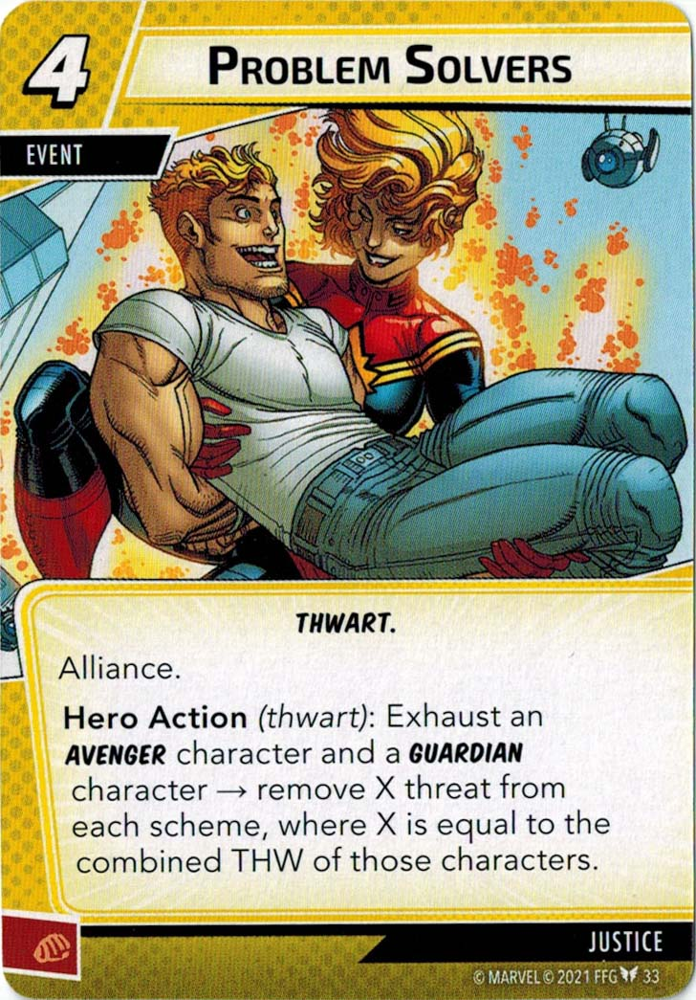

---
output:
  xaringan::moon_reader:
    css: ["default", "extra.css"]
    lib_dir: libs
    seal: false
    nature:
      highlightStyle: github
      highlightLines: true
      countIncrementalSlides: false
      ratio: '16:9'
---

```{r, echo = FALSE, warning = FALSE, message = FALSE}
##xaringan::inf_mr()
## For offline work: https://bookdown.org/yihui/rmarkdown/some-tips.html#working-offline
## Images not appearing? Put images folder inside the libs folder as that is the main data directory

library(tidyverse)
library(readxl)
library(stargazer)
##library(kableExtra)
##library(modelr)

knitr::opts_chunk$set(echo = FALSE,
                      eval = TRUE,
                      error = FALSE,
                      message = FALSE,
                      warning = FALSE,
                      comment = NA)
```

background-image: url('libs/Images/background-forest_v3.png')
background-size: 100%
background-position: center
class: middle, center

.left[.size70[**Today's Agenda**]]

.size55[
What are the key elements of a domestic process that aims to solve environmental problems?
]

<br>

.size35[
  Justin Leinaweaver (Spring 2024)
]

???

## Prep for Class
1. Record Canvas submissions

2. Publish next discussion

<br>

#### Readings
1. Clarke, T., & Peterson, T. R. (2016). *Environmental Conflict Management*. SAGE Publications, Inc. **ONLY chapters 1 and 2**
2. Hughes, J. W. (2007). *Environmental problem solving: A how-to guide*. University Press of New England. **ONLY chapter 4**
3. Kraft, M. E. (2011). Environmental Policy and Politics (5th ed.). Longman. **ONLY chapter 3**


---

background-image: url('libs/Images/background-forest_v3.png')
background-size: 100%
background-position: center
class: middle

.center[.size50[**Assignment 4 (Due Apr 28th)**

Getting Involved in our Community]]

.size40[
1. Find (or create) an opportunity to get actively involved in your issue locally, and

2. Write a report describing what you did, who you worked with and what you learned from the experience.
]

???

As I introduced last week you have a piece of your project you need to get to work on right now!

- Remember, you have to get my sign-off before acting, and

- Your proposal should frame the activity in terms of how it directly ties to your project AND how doing it will help you better complete that project (e.g. deepens your understanding of the nature of the problem, the stakeholders involved, etc.)?

<br>

Quick Brainstorm: Everybody name one thing they could do this weekend to get involved in your chosen problem in our community!

- Something that either connects you with the stakeholders OR deepens your understanding of the problem itself.

- MUST be different than your idea last class!


---

background-image: url('libs/Images/background-forest_v2.png')
background-size: 100%
background-position: center
class: middle

# The Semester: Three Sections 

.size40[
**1) The Basics of Problem-Solving in a Community**
- "Politics"
- "Environment"
- "Policy"
]

???

So far in our class we have been clarifying and analyzing key concepts like these in order to equip us to solve environmental problems.

- Let's do a quick run-through of what we've learned AND begun to utilize so far in our work!


---

background-image: url('libs/Images/background-forest_v2.png')
background-size: 100%
background-position: center
class: middle

.pull-left[
```{r, echo = FALSE, fig.align = 'center', out.width = '80%'}

```
]

.pull-right[

<br>

<br>

.center[
.size55[.content-box-green[**How do problem-solvers think about politics?**
]]]]

???

### How do problem-solvers think about politics? What is it and how does it help us solve problems?

1. Politics is almost literally everywhere around us
    - Anytime a group of people get together to do something, politics is happening
    
2. Frequently this looks like a distribution game and the dynamics come to focus on balancing the costs and benefits of the winners and the losers

3. Political science can offer us useful frameworks then for analyzing these scenarios, e.g.
    - Interests: We assume actors have preferences and pursue those preferences
    - Institutions: We assume rules matter although not always in the way they were designed
    - Interactions: We assume actors run into difficulty when they clash with other people
    
    
    
---

background-image: url('libs/Images/04_1-Youth-Climate-Strike.png')
background-size: 85%
background-position: left
class: bottom, center, slidegreen

.pull-right[

<br>

.center[
.size35[.content-box-green[**How do problem-solvers think about the environment?**
]]]]

???

### How do problem-solvers think about the environment? What is it and how does it help us solve problems?

Cronon (1996) is fundamentally an argument that we should be much more cognizant and critical of how we define the problems we seek to solve.

1. All of the concepts related to environmental problems will be contested (e.g. fought over),

2. Your chosen definition automatically narrows the options of policies you think are acceptable vs not, AND

2. Conflicts over problem definitions often drive the most serious disputed regarding environmental problem.


---

background-image: url('libs/Images/04_1-random_stock_image.png')
background-size: 85%
background-position: left
class: bottom, center, slidegreen

.pull-right[

<br>

.center[
.size35[.content-box-green[**What do problem-solvers know about policy-making that is vital to the process?**
]]]]

???

1. Designing a policy means choosing a "source of wisdom" / "accountability"
    - You can only maximize for one thing at a time!
    - A coherent policy needs to root itself with a clear organizing principle

2. BEFORE you get to work on solving your environmental problem you must make and win three separate arguments:   
    1. This is a public, not an individual problem,
    2. It should be addressed collectively not privately, and
    3. We should choose ourselves (democratic processes) or delegate policy-making to experts

That's three arguments you have to make BEFORE we've even begun talking about the design of your preferred policy action!

<br>

Important for us to realize the groundwork that must be completed before policy design truly comes into play.

- Solving community problems are not for the faint at heart.

- HOWEVER, if you lay the groundwork appropriately, the next steps become feasible!

### Make sense?


---

background-image: url('libs/Images/background-forest_v3.png')
background-size: 100%
background-position: center

class: middle

.size70[**Assignment for Today**]

.size40[
What are .textblue[**three key elements**] you argue are necessary to .textblue[**successfully navigate**] a domestic policy-making process?

+ Hughes (2007)
+ Kraft (2011)
+ Clarke and Peterson (2016)
]

???

All of this brings us to our work for today.

- There are many, many textbooks out there all grappling with environmental problems from a variety of perspectives.

<br>

Why did I choose these books?

+ From Hughes (2007) we get a book from an independent publisher that aims to be user friendly and accessible.

+ From Kraft (2011) we get a specialist in American public policy mapping out the policy process.

+ And from Clarke and Peterson (2016) we get an approach rooted in the communications and management literatures.


---

background-image: url('libs/Images/background-forest_v3.png')
background-size: 100%
background-position: center

class: middle

.size70[**Assignment for Today**]

.size40[
What are .textblue[**three key elements**] you argue are necessary to .textblue[**successfully navigate**] a domestic policy-making process?]

.size35[
+ DOC'S KEY approach (Hughes 2007, ch4)
+ The Policy Process Model (Kraft 2011, ch3)
+ The Collaborative Approach to Environmental Conflict (Clarke and Peterson 2016, ch1 and 2)
]

???

I've tried to pick out the chapter from each of these books that describes its central approach to our challenge.

### Did any one of them speak to you personally more than the others?
#### - Why or why not?

<br>

*Split class into groups of 3-4*
- Work with someone new and go sit with your group!

Ok, first step, review all of today's submissions on Canvas and develop your list of the most important elements.


---

background-image: url('libs/Images/background-forest_v3.png')
background-size: 100%
background-position: center

class: middle

.size70[**Assignment for Today**]

.size40[
What are .textblue[**three key elements**] you argue are necessary to .textblue[**successfully navigate**] a domestic policy-making process?]

.size35[
+ DOC'S KEY approach (Hughes 2007, ch4)
+ The Policy Process Model (Kraft 2011, ch3)
+ The Collaborative Approach to Environmental Conflict (Clarke and Peterson 2016, ch1 and 2)
]

???

Round robin through the groups, what is one important piece of advice?
- *ON BOARD*

<br>

#### Hughes 2007
- Definition (problem and outcome; avoid letting strategies be presented as the problem; problems are neutral and don't typically need 'must' or 'should')

#### Kraft 2011
- Can be used to figure out where in the process to target different kinds of pressure. The "right" strategy depends on stage of the process
- On the other hand, are we convinced these "stages" are really so distinct? How many feedback loops? How often does something go cleanly through the process?
- In other words, how much does the end of that chapter (the complexities of the US system) put the lie to the process in the first half?

#### C&P 2016
- Makes a strong case for why a collaborative approach matters but the "required conditions" sound incredibly hard to achieve at anything but the very local level
- Required conditions for a collaborative approach (p16-18): Representation of multiple interests, voluntary participation, direct engagement, mutual agreement on process, mutual agreement on decisions

## Longer Notes

DOC'S KEY approach (Hughes 2007, ch4)

- People matter and perspectives differ (even on identical events)
- Three types of problem and unstructured are the hardest to solve
- DOC'S KEY: Definition (problem and outcome; avoid letting strategies be presented as the problem; problems are neutral and don't typically need 'must' or 'should'), Objectives (set clear targets), Constraints (be aware of boundaries, limitations, assumptions, unacceptable impacts), Strategies (Brainstorm and be creative), Keepers (Choose the best strategy), Experiment (Test a strategy and adapt), Yes! (Implement)

The Policy Process Model (Kraft 2011, ch3)

Stages

1. Agenda setting (critical stage, how a problem is perceived and how public reacts to it)
2. Policy formulation
3. Policy legitimation (giving legal force to decisions AND is the action perceived as legitimate)
4. Policy implementation (Put the program into effect, fund and staff it)
5. Policy and program evaluation
6. Policy change

Chapter ends by noting some of the unique complexities of the federal system of government in the US

The Collaborative Approach to Environmental Conflict (C&P 2016, ch1 and 2)

Chapter 1: Frames environmental conflict management as a communication process (2). Environmental problem-solving requires interdisciplinary approaches (4) to produce solutions that respect the identity (4) and culture (5) of the stakeholders, accounts for scientific uncertainty (7) and the discrepancies between issues and political boundaries (8).

Chapter 2:

- Complexity and difficulty of solving env problems encourage us to use a process that includes 11 important elements (p12)
- Collaborative process should be adaptable, rely on appropriate science and tech, be implementable and have low transaction costs, has appropriate funding, is measurable, is socially legitimate
- Required conditions for a collaborative approach (p16-18): Representation of multiple interests, voluntary participation, direct engagement, mutual agreement on process, mutual agreement on decisions
- Benefits listed p18-


---

background-image: url('libs/Images/background-forest_v3.png')
background-size: 100%
background-position: center
class: middle

.center[.size60[**Let's design our own approach!**]]

.size55[
1. ?

2. ?

3. ...
]

???

*Form NEW Groups!*
- Let's keep moving!

<br>

Based on everything we've explored over the last three weeks PLUS the pre-class work you did, let's design our own series of key steps to attacking an environmental problem.

- I'm not looking for you to copy out one of the processes described by a chapter.

- I want you to think about what these processes tell us about environmental problem-solving at the domestic level.

<br>

Each group put your process on the board!

*Present each and discuss*


---

background-image: url('libs/Images/background-forest_v2.png')
background-size: 100%
background-position: center
class: middle

.size50[**A Possible (and evolving) Process**]

???

Let me pitch you one possible version of a process.

--

<br>

.size45[1) **Argument**: Our community has a problem]

???

### Step 1: Make an explicit argument

This represents your chance to interrogate your own position on a problem
- What are the key assumptions **YOU** are making that set this thing up as a problem
- What data do we have to measure the problem? Don't ask anyone to take your word for it.

--

<br>

.size45[2) **Investigate** the relevant stakeholders]

???

### Step 2: Investigate the players

For each stakeholder:
- How do they define the basic concepts in play?

- What are their preferred sources of wisdom or accountability?

- Fundamentally speaking, do they already see this as a problem?


---

background-image: url('libs/Images/background-forest_v2.png')
background-size: 100%
background-position: center
class: middle

.size45[**A Possible (and evolving) Process**]

<br>

.size45[1) **Argument**: Our community has a problem]

<br>

.size45[2) **Investigate** the relevant stakeholders]

<br>

.size45[3) **Revise** your "we have a problem" argument]

???

### Step 3

You need to adapt your problem framing to draw in as many stakeholders as possible. 

You need each of them to accept that:
1. The problem is real, and
2. This is a collective-choice problem


---

background-image: url('libs/Images/background-forest_v2.png')
background-size: 100%
background-position: center
class: middle

.size45[**A Possible (and evolving) Process**]

<br>

.size45[1) **Argument**: Our community has a problem]

.size45[2) **Investigate** the relevant stakeholders]

.size45[3) **Revise** your "we have a problem" argument]

.size45[4) Consider policy **designs**...]

???

<br>

### Step 4

This is where we'll be headed for the rest of the semester.

<br>

### Any questions on this or anything we've reviewed today?


---

background-image: url('libs/Images/background-forest_v3.png')
background-size: 100%
background-position: center
class: middle

.pull-left[
.size40[
**A Possible Process**

1. Baseline Argument
2. Investigate Stakeholders
3. Revise Argument
4. Design Policy
]]

.pull-right[

<br>

.center[.size45[**If this is our process, how optimistic should we be about solving environmental problems?**]]
]

???

### 1. If this is the "best" approach, does it offer opportunities for normal people to get involved?

#### - Should we add easier "ins" for outsiders to access the process?

<br>

### 2. Is this process better at addressing some kinds of problems than others?**]

#### - Any big blindspots here?

<br>

### Bottom line, if this is our process, how optimistic should we be about solving environmental problems?

#### - Where do we think the biggest process obstacles will be?


---

background-image: url('libs/Images/background-forest_v3.png')
background-size: 100%
background-position: center

class: middle

.size65[**Assignment for Thursday**]

.size40[
1. Read Miller (2009) ch3 on CAFE standards

2. **Before class** submit to Canvas:

**Identify and describe two stakeholders** relevant to your project who frame the problem in conflicting ways.
]

???

Thursday we shift our focus to analyzing stakeholders in a specific case study. 

- Read Miller on CAFE standards, and

- **Identify and describe two stakeholders** relevant to your project who frame the problem in conflicting ways. At this point, just give us basic details about each of them (who are they and how are they involved in your problem?)
    - At this point, just give us basic details about each of them (who are they and how are they involved in your problem?)

Before we get to that, let's bridge the exercises with a pre-class assignment that will help move you forward on the first paper for this class.

### Questions on the assignment?
