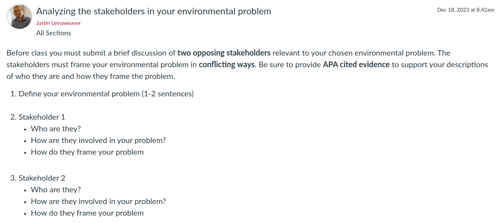

---
output:
  xaringan::moon_reader:
    css: ["default", "extra.css"]
    lib_dir: libs
    seal: false
    nature:
      highlightStyle: github
      highlightLines: true
      countIncrementalSlides: false
      ratio: '16:9'
---

```{r, echo = FALSE, warning = FALSE, message = FALSE}
##xaringan::inf_mr()
## For offline work: https://bookdown.org/yihui/rmarkdown/some-tips.html#working-offline
## Images not appearing? Put images folder inside the libs folder as that is the main data directory

library(tidyverse)
library(readxl)
##library(kableExtra)
##library(modelr)

knitr::opts_chunk$set(echo = FALSE,
                      eval = TRUE,
                      error = FALSE,
                      message = FALSE,
                      warning = FALSE,
                      comment = NA)
```

background-image: url('libs/Images/background-forest_v3.png')
background-size: 105%
background-class: center
class: middle

.size45[**I. The Basics of Problem-Solving in a Community**]

<br>

.size50[

**Today's Agenda**

The Role of Stakeholders in Policy-making
- Case Study: US CAFE Standards
]

<br>

.center[.size40[
  Justin Leinaweaver (Spring 2024)
]]

???

## Prep for Class
1. Post assignment description on Canvas

2. Make sure to save time at end of class to brainstorm project stakeholders

3. Do the CAFE slides need to be updated?
    - [Data from the Department of Energy](https://afdc.energy.gov/data/categories/fuel-consumption-and-efficiency)

<br>

.size10[
Readings

1. Miller, N. (Ed.). (2009). Corporate Average Fuel Economy Regulations (CAFE Standards). In *Environmental Politics: Stakeholders, Interests, and Policymaking*. (pp. 106–141). Routledge.

2. Grandoni, D., Siddiqui , F. & Phillips, A. (2021, Dec 20). New Biden rule reducing climate emissions from cars and SUVs reverses major Trump rollback. *The Washington Post*. [Link](https://www.washingtonpost.com/climate-environment/2021/12/20/auto-mileage-rule-biden-climate/)
]


---

background-image: url('libs/Images/background-forest_v3.png')
background-size: 100%
background-position: center
class: middle

.center[.size50[.content-box-green[**Assignment 4**]

Getting Involved in our Community]]

.size40[
**Find or create** an opportunity to get **actively involved in your issue locally** (e.g. litter pickup, river cleanup, working with a local NGO or city agency on your issue, etc.)

**Write a report** describing what you did, who you worked with and what you learned that will help you with solving your chosen policy problem.
]

???

Let's warm up again today with more community engagement brainstorming!

- Everybody get ready to name **A NEW** activity they could do this weekend to engage in their chosen environmental problem in our community!

- Even if you already have your project approved, give us something else!

<br>

Go!

<br>

Don't forget you have to get my sign-off on your project BEFORE you do it

- Submit your proposal on Canvas as an assignment.

<br>

### Any questions on the community engagement project?


---

background-image: url('libs/Images/01-1-ozarks_forest.jpg')
background-size: 100%
background-position: center
class: middle, center, inverse

.size55[.textwhite[**An Effective Policy Designer Must...**]]

<br>

```{r, fig.align='center', out.width='52%'}
knitr::include_graphics('libs/Images/02-1-cavemen.jpg')
```

<br>

.size55[.textwhite[**Consider why Policies Exist**]]

???

Quick hits on our work so far!

<br>

### Effective policy designers recognize that societies MUST create policies to deal with substantial problems or where free-riding could lead to disaster!

<br>

This means that policy-designers are challenged to create new rules in situations where:

1. Things are already getting "bad" or have been "bad" for some time,

2. Some members of the community benefit the status quo (e.g. from causing the problem), and

3. You lack the authority to implement or enforce new rules on your own


---

background-image: url('libs/Images/01-1-ozarks_forest.jpg')
background-size: 100%
background-position: center
class: middle, center, inverse

.size55[.textwhite[**An Effective Policy Designer Must...**]]

<br>

```{r, fig.align='center', out.width='50%'}
knitr::include_graphics('libs/Images/03-1-nos_yeses.jpg')
```

<br>

.size55[.textwhite[**Consider the "Politics"**]]

???

### Therefore, effective policy designers must navigate a political game to solve problems!

<br>

This means you MUST have a model of politics in mind to guide your planning

- We explored politics as a distribution game in class in order to help us think about how societies distribute costs and benefits and make and enforce rules of behavior.

- Actors pursuing their goals, constrained by institutional rules and colliding with each other while they do it. 

<br>

A willingness to acknowledge the relevant actors is also a willingness to accept that not everyone starts from the same basic principle of "the good" in society.

- Most everyone has an intuitive sense of which "wisdom" or type "accountability" is the "right" one for a given situation
    - e.g. Markets, Politics or Experts

- You need to learn to be able to identify these sources of conflict and how to bridge the gaps between them


---

background-image: url('libs/Images/01-1-ozarks_forest.jpg')
background-size: 100%
background-position: center
class: middle, center, inverse

.size55[.textwhite[**An Effective Policy Designer Must...**]]

<br>

```{r, fig.align='center', out.width='50%'}
knitr::include_graphics('libs/Images/03-1-flower_pavement.jpg')
```

<br>

.size55[.textwhite[**Consider the "Problem"**]]

???

### Effective policy designers are prepared for different stakeholders to define the key concepts differently

<br>

We explored the "environment" as a contested concept using the Cronon reading in order to help us:

1. To expect different definitions of any underlying problem, 

2. To think critically about the arguments that drive you, especially the ones you haven't clarified for yourself, and 

3. To make sure our proposals, and our expectations for human behavior, are NOT based on myths.


---

background-image: url('libs/Images/01-1-ozarks_forest.jpg')
background-size: 100%
background-position: center
class: middle, center, inverse

.size55[.textwhite[**An Effective Policy Designer Must...**]]

<br>

```{r, fig.align='center', out.width='45%'}
knitr::include_graphics('libs/Images/04_2-scales.jpg')
```

<br>

.size55[.textwhite[**Consider the "Baseline"**]]

???

### Effective policy designers know that policy design is only possible AFTER you've established your target is a public problem and requires a collective decision.

<br>

1. You MUST make an argument that WE, the public, have a problem, and

2. You MUST make an argument that WE should decide collectively, not privately


---

background-image: url('libs/Images/01-1-ozarks_forest.jpg')
background-size: 100%
background-position: center
class: middle, center, inverse

.size55[.textwhite[**An Effective Policy Designer Must...**]]

<br>

```{r, fig.align='center', out.width='62%'}
knitr::include_graphics('libs/Images/03-1-problem_solving_process.gif')
```

<br>

.size55[.textwhite[**Consider the "Domestic Process"**]]

???

### Effective policy designers consider how established processes of environmental conflict management can guide their efforts.

<br>

We probably shouldn't try to reinvent the wheel.
- Find the good process ideas that are out there and steal from them!

<br>

I like that Hughes (2007) pushes me to be clearer about problem definitions and to try to see them as separate from strategy.

<br>

I like that the "policy process model" from Kraft (2011) reminds me that the "right" pressure strategy depends on the stage of the process we are in 
- Arguments that work during agenda setting probably look different from the ones we need during policy formulation
    
<br>

I like the C&P (2016) collaborative approach because it makes sense to me that community problem-solving MUST be engaged in serious ways with the people whose behavior we hope to modify.


---

background-image: url('libs/Images/01-1-ozarks_forest.jpg')
background-size: 100%
background-position: center
class: middle, center, inverse

.size55[.textwhite[**An Effective Policy Designer Must...**]]

<br>

```{r, fig.align='center', out.width='53%'}
knitr::include_graphics('libs/Images/03-1-new_plan.jpg')
```

<br>

.size55[.textwhite[**Present a Complete Proposal**]]

???

### Finally, effective policy designers produce policy proposals that are:

1. Specific,

2. Adapted to the specific stakeholders,

3. Adapted to the conditions on the ground, and

4. Include an evaluation of strong alternative proposals.

<br>

Whew! Nice work all!

- **SLIDE**: Last class we discussed a process for getting all of this done!


---

background-image: url('libs/Images/background-forest_v3.png')
background-size: 100%
background-position: center
class: middle

.size55[.content-box-green[**A Possible (and evolving?) Process**]]

.size50[
1. **Describe** the problem facing our community

2. **Investigate** the relevant stakeholders

3. **Frame** the problem

4. Consider **policy designs**...
]

???

On Tuesday we started fleshing out a process for problem-solving that looks something like this.

- Remember, we are not pretending that this, or any process, is the "right" one.

- Our aim is for a useful set of guidelines.

<br>

Today, we dig into this second step by analyzing stakeholders in a real-world case study.

- **SLIDE**: Our work today is an important bridge to the work you'll be doing next week.


---

background-image: url('libs/Images/background-forest_v3.png')
background-size: 100%
background-position: center
class: middle

.size50[.content-box-green[**Paper 1: Introducing the Problem**]]

.size40[
1. A description of **the scientific basis** for your problem,

2. An argument that this is a **public problem**,

3. An argument that this requires a **collective decision**, and

4. An analysis of **at least two stakeholders with opposing viewpoints** of the problem
]

???

The first paper comes directly from the work we've been doing over the first four weeks of class.

- The assignment details are on Canvas.

- I will give you both classes next week to work on the report in class.

<br>

Here are the four required elements of the report.

- You must support ALL claims with high quality evidence

- High quality evidence = data gathered by peer-reviewed sources, government monitoring, third-party groups, etc.

- Please also see the "Paper Submission Requirements" in the syllabus and be sure to support ALL claims with evidence.

<br>

### Any questions on the prompt?


---

background-image: url('libs/Images/03-1-stakeholders.webp')
background-size: 100%
background-position: center
class: middle, center

???

Today we need to practice analyzing stakeholders in environmental policy disputes

- We tend to encounter stakeholders through the arguments they make publicly so our work today will focus on those public arguments

- Specifically we'll use the fight over CAFE standards in the US as a means for thinking critically about the role stakeholders play in environmental policy-making.

<br>

Our job is to analyze those statements to:

1. Map out the competing problem framings in play regarding our problem, and

2. Identify the values underpinning those statements so we better know how to appeal to those stakeholders

<br>

**SLIDE**: In short...


---

background-image: url('libs/Images/03-1-stakeholders_v2.png')
background-size: 100%
background-position: center
class: middle, center, inverse

.textwhite[.size55[**What can we learn from the stakeholders' public arguments that will help us broaden the appeal of our "we have a problem" argument?**]]

???

### Does this goal for today's work make sense?


---

background-image: url('libs/Images/background-forest_v3.png')
background-size: 100%
background-position: center
class: middle, top

.center[.size50[.content-box-green[**The CAFE Standards Debate**]]]

.size40[
1. David Greene, Oak Ridge National Laboratory (3.11) 
2. The National Center for Public Policy Research (3.7)
3. The Union of Concerned Scientists (3.9 and 3.15)
4. Bill Visnic, SUV Owners of America (3.1)
5. Public Citizen (3.3)
6. The CATO Institute (3.10)
7. Norman Mineta, Secretary of Transportation (3.8)
8. National Review (3.4)
]

???

The Miller book chapter collects public statements by stakeholders on the issue of CAFE Standards.

- Specifically, these statements were issued during the drafting and debate over the Energy Independence and Security Act of 2007.

<br>

Let's make sure we're clear on the basics.

### What are CAFE standards? What does that acronym stand for?
- (Corporate Average Fuel Economy (CAFE))

<br>

### How do they work? What do the CAFE Standards do?
- (**SLIDE**)


---

```{r, cache=TRUE, fig.retina=3, fig.asp=.57, out.width = '100%', fig.width = 9}
d <- read_excel("../../Data/Fuel_Economy_CAFE/10562_cafe_light_duty_6-1-20.xlsx", sheet = "Tidy")

# Save long version
d_long <- d |>
  pivot_longer(cols = passenger_cars:light_trucks, names_to = "class", values_to = "mpg")

# Plot 1: 1975 - 1985
d |>
  filter(Year < 1986) |>
  ggplot(aes(x = Year, y = passenger_cars)) +
  geom_point() +
  geom_line() +
  theme_bw() +
  #scale_y_continuous(limits = c(0, 70), breaks = seq(0, 70, 10)) +
  scale_y_continuous(limits = c(0, 30), breaks = seq(0, 30, 10)) +
  scale_x_continuous(limits = c(1974, 1986), breaks = 1974:1986) +
  annotate("point", x = 1975, y = 13, color = "red", size = 3) +
  annotate("text", x = 1975, y = 11, label = "Estimated", color = "red") +
  labs(x = "", y = "miles per gallon (mpg)",
       title = "Corporate Average Fuel Economy (CAFE) Standards",
       caption = "Source: Department of Energy")
```

???

Per the Department of Transportation the purpose of CAFE is to reduce energy consumption by increasing the fuel economy of cars and light trucks.

- "The CAFE standards are fleet-wide averages that must be achieved by each automaker for its car and truck fleet, each year, since 1978."

<br>

The early 1970s saw a brutal oil price shock that sent oil prices into the stratosphere and people were pissed!

- A big problem for us was we were driving wildly inefficient cars
    - 1975 estimate for passenger cars was approximately 13 mpg on average!

- In 1975 Congress responds by enacting "the nation's first Corporate Average Fuel Economy (CAFE) standards" that "called for a doubling of passenger-vehicle efficiency—to 27.5 miles per gallon (mpg)—within 10 years" ([Pew Report](https://www.pewtrusts.org/en/research-and-analysis/fact-sheets/2011/04/20/driving-to-545-mpg-the-history-of-fuel-economy))

- At the time domestic automakers argued this would lead to economic crises and angry consumers

- "In 1974, a Ford executive testified that the standards could “result in a Ford product line consisting . . . of all sub- Pinto-sized vehicles.”

<br>

CAFE applies to both cars and light duty trucks but for now I just want to focus on cars.


---

```{r, cache=TRUE, fig.retina=3, fig.asp=.57, out.width = '100%', fig.width = 9}
# Plot 2: 1975 - 1988
d |>
  filter(Year < 1989) |>
  ggplot(aes(x = Year, y = passenger_cars)) +
  geom_point() +
  geom_line() +
  theme_bw() +
  #scale_y_continuous(limits = c(0, 70), breaks = seq(0, 70, 10)) +
  scale_y_continuous(limits = c(0, 30), breaks = seq(0, 30, 10)) +
  scale_x_continuous(limits = c(1974, 1989), breaks = 1974:1989) +
  annotate("point", x = 1975, y = 13, color = "red", size = 3) +
  labs(x = "", y = "miles per gallon (mpg)",
       title = "Corporate Average Fuel Economy (CAFE) Standards",
       caption = "Source: Department of Energy")
```

???

Big success: "Between 1975 and 1985, average passenger vehicle mileage doubled from about 13.5 mpg to 27.5" (Pew)

<br>

Despite this success, Ford and General Motors aggressively "lobbied the Reagan administration to lower the standard" (Pew).
- They succeeded and the National Highway Traffic Safety Administration (NHTSA) lowered the CAFE standard to 26 mpg for the next three years

- ALSO the NHTSA at this time stopped raising the CAFE standards for light trucks


---

```{r, cache=TRUE, fig.retina=3, fig.asp=.57, out.width = '100%', fig.width = 9}
# Plot 2: 1975 - 2007
d |>
  filter(Year < 2008) |>
  ggplot(aes(x = Year, y = passenger_cars)) +
  geom_point() +
  geom_line() +
  theme_bw() +
  #scale_y_continuous(limits = c(0, 70), breaks = seq(0, 70, 10)) +
  scale_y_continuous(limits = c(0, 30), breaks = seq(0, 30, 10)) +
  scale_x_continuous(limits = c(1974, 2008), breaks = seq(1974, 2008, 2)) +
  annotate("point", x = 1975, y = 13, color = "red", size = 3) +
  labs(x = "", y = "miles per gallon (mpg)",
       title = "Corporate Average Fuel Economy (CAFE) Standards",
       caption = "Source: Department of Energy")
```

???

Lowered standards and increased truck/SUV sales meant that by the end of the 1990s cars and trucks were less efficient than they were a decade earlier (about 1mpg worse)

<br>

President Clinton comes in and tries to enact an increase in CAFE

- Congress responds with an appropriations rider taking away the administration's authority to increase vehicle efficiency (lasts 1995 to 2000).

<br>

**SLIDE**: No new activity on this for almost 20 years


---

```{r, cache=TRUE, fig.retina=3, fig.asp=.57, out.width = '100%', fig.width = 9}
# Plot 3: Dec 2007 - Energy Independence and Security Act (EISA)
d |>
  filter(Year < 2008) |> 
  ggplot(aes(x = Year, y = passenger_cars)) +
  geom_point() +
  geom_line() +
  theme_bw() +
  scale_y_continuous(limits = c(0, 40), breaks = seq(0, 40, 10)) +
  scale_x_continuous(limits = c(1974, 2020), breaks = seq(1974, 2020, 3)) +
  annotate("point", x = 1975, y = 13, color = "red", size = 3) +
  annotate("point", x = 2020, y = 35, color = "blue", size = 3) +
  annotate("segment", x = 2007, xend = 2020, y = 27.5, yend = 35, linetype = "dashed", color = "blue") +
  labs(x = "", y = "miles per gallon (mpg)",
       title = "Corporate Average Fuel Economy (CAFE) Standards",
       caption = "Source: Department of Energy")
```

???

In December 2007, Congress passes the Energy Independence and Security Act (EISA)

- Includes a provision to raise CAFE standards for cars, SUVs and pickups by about 40 percent—to 35 mpg by 2020.

<br>

### Any guesses why Congress decided to act in 2007?

- (**SLIDE**: Obama about to be president!)


---

```{r, cache=TRUE, fig.retina=3, fig.asp=.57, out.width = '100%', fig.width = 9}
# Plot 3: Dec 2007 - Energy Independence and Security Act (EISA)
d |>
  filter(Year < 2017) |> 
  ggplot(aes(x = Year, y = passenger_cars)) +
  geom_point() +
  geom_line() +
  theme_bw() +
  scale_y_continuous(limits = c(0, 40), breaks = seq(0, 40, 10)) +
  scale_x_continuous(limits = c(1974, 2020), breaks = seq(1974, 2020, 3)) +
  annotate("point", x = 1975, y = 13, color = "red", size = 3) +
  annotate("point", x = 2020, y = 35, color = "blue", size = 3) +
  annotate("segment", x = 2007, xend = 2020, y = 27.5, yend = 35, linetype = "dashed", color = "blue") +
  labs(x = "", y = "miles per gallon (mpg)",
       title = "Corporate Average Fuel Economy (CAFE) Standards",
       caption = "Source: Department of Energy")
```

???

April 2009: Obama pushes a 35.5 mpg FLEETWIDE target by 2016 (e.g. both cars and light trucks)

- This meant cars needed to hit an average around 39 mpg


---

```{r, cache=TRUE, fig.retina=3, fig.asp=.57, out.width = '100%', fig.width = 9}
# Plot 3: Dec 2007 - Energy Independence and Security Act (EISA)
d |>
  filter(Year < 2017) |> 
  ggplot(aes(x = Year, y = passenger_cars)) +
  geom_point() +
  geom_line() +
  theme_bw() +
  scale_y_continuous(limits = c(0, 60), breaks = seq(0, 60, 10)) +
  scale_x_continuous(limits = c(1974, 2026), breaks = seq(1974, 2026, 3)) +
  annotate("point", x = 1975, y = 13, color = "red", size = 3) +
  annotate("point", x = 2025, y = 54.5, color = "blue", size = 3) +
  annotate("segment", x = 2016, xend = 2025, y = 37.8, yend = 54.5, linetype = "dashed", color = "blue") +
  labs(x = "", y = "miles per gallon (mpg)",
       title = "Corporate Average Fuel Economy (CAFE) Standards",
       caption = "Source: Department of Energy")
```

???

August 2012: Obama finalizes a new rule that combines cars and light-duty trucks and sets the target of 54.5 mpg by 2025
- [Link](https://obamawhitehouse.archives.gov/the-press-office/2012/08/28/obama-administration-finalizes-historic-545-mpg-fuel-efficiency-standard)

<br>

### Any guesses what happened next?

- (**SLIDE**: Trump gets elected)


---

```{r, cache=TRUE, fig.retina=3, fig.asp=.57, out.width = '100%', fig.width = 9}
d |>
  filter(Year < 2021) |> 
  ggplot(aes(x = Year, y = passenger_cars)) +
  geom_point() +
  geom_line() +
  theme_bw() +
  scale_y_continuous(limits = c(0, 60), breaks = seq(0, 60, 10)) +
  scale_x_continuous(limits = c(1974, 2026), breaks = seq(1974, 2026, 3)) +
  annotate("point", x = 1975, y = 13, color = "red", size = 3) +
  annotate("point", x = 2025, y = 54.5, color = "blue", size = 3) +
  annotate("segment", x = 2020, xend = 2025, y = 44.2, yend = 40, linetype = "dashed", color = "red") +
  annotate("point", x = 2025, y = 40, color = "red", size = 3) +
  labs(x = "", y = "miles per gallon (mpg)",
       title = "Corporate Average Fuel Economy (CAFE) Standards",
       caption = "Source: Department of Energy")
```

???

It takes him four years to undo Obama's 2012 rules

- Sets a new 2025 target of approximately 40 mpg

<br>

Trump argues that many manufacturers are only meeting the standards using various credits and this would allow us to reduce those

- e.g. In essence, if a manufacturer does beats the target in one year they can roll over the surplus to next year

- This was meant to reduce those credits but lower the target to compensate

<br>

### So, based on your reading today, where is Biden setting the next target?

- (**SLIDE**)


---

```{r, cache=TRUE, fig.retina=3, fig.asp=.57, out.width = '100%', fig.width = 9}
d |>
  ggplot(aes(x = Year, y = passenger_cars)) +
  geom_point() +
  geom_line() +
  theme_bw() +
  scale_y_continuous(limits = c(0, 60), breaks = seq(0, 60, 10)) +
  scale_x_continuous(limits = c(1974, 2026), breaks = seq(1974, 2026, 3)) +
  annotate("point", x = 1975, y = 13, color = "red", size = 3) +
  annotate("segment", x = 2020, xend = 2025, y = 44.2, yend = 40, linetype = "dashed", color = "red") +
  annotate("point", x = 2025, y = 40, color = "red", size = 3) +
  labs(x = "", y = "miles per gallon (mpg)",
       title = "Corporate Average Fuel Economy (CAFE) Standards",
       caption = "Source: Department of Energy")
```

???

[LINK to EPA: Final Rule to Revise Existing National GHG Emissions Standards for Passenger Cars and Light Trucks Through Model Year 2026](https://www.epa.gov/regulations-emissions-vehicles-and-engines/final-rule-revise-existing-national-ghg-emissions)

<br>

One of the early climate actions taken by the Biden Administration was to revert the CAFE standards closer to the trajectory put in place by Obama's Administration. 

<br>

I hope you take a few things away from this:

FIRST, Elections matter. 
- A LOT. 
- SERIOUSLY.
- You should vote.

<br>

SECOND, once enacted, policies tend to be VERY sticky.

- Our system is slow but that means if you can lock in a good policy it can endure!


---

background-image: url('libs/Images/background-forest_v3.png')
background-size: 100%
background-position: center
class: middle, top

.center[.size55[.content-box-green[**Analyzing the Stakeholders**]]]

.size40[
1. David Greene, Oak Ridge National Laboratory (3.11) 
2. The National Center for Public Policy Research (3.7)
3. The Union of Concerned Scientists (3.9 and 3.15)
4. Bill Visnic, SUV Owners of America (3.1)
5. Public Citizen (3.3)
6. The CATO Institute (3.10)
7. Norman Mineta, Secretary of Transportation (3.8)
8. National Review (3.4)
]

???

The Miller book does a nice job collecting a bunch of public statements by stakeholders on this issue.

- Today we'll work to diagram and analyze those arguments.

- Remember, our actual key here is to learn more about stakeholders and the arguments they make, not to take a strong position on the CAFE standards.

<br>

*Split class into 8 groups (pairs preferred, threesomes if needed) and assign to stakeholders*

- Go sit with your partner(s)!


---

background-image: url('libs/Images/background-forest_v3.png')
background-size: 100%
background-position: center
class: middle, top

.center[.size55[.content-box-green[**Analyzing the Stakeholders**]]]

.size30[
1. David Greene, Oak Ridge National Laboratory (3.11) 
2. The National Center for Public Policy Research (3.7)
3. The Union of Concerned Scientists (3.9 and 3.15)
4. Bill Visnic, SUV Owners of America (3.1)
5. Public Citizen (3.3)
6. The CATO Institute (3.10)
7. Norman Mineta, Secretary of Transportation (3.8)
8. National Review (3.4)
]

<br>

.center[.size45[.content-box-green[**1) How do they frame the problem?**]]]

???

Groups, first job is to diagram the problem framing

- e.g. how do they present the problem and its context in order to gain support for their position?

- Work directly *ON THE BOARD*

<br>

### Questions on your job?

- Go!

<br>

*Present each diagram*

### Can we clarify these at all?

- Any inserts necessary to make the argument more logical?

<br>

1. (Supporter) 3.11 David L. Greene, Oak Ridge National Laboratory (p133-138) 
2. (Opponent) 3.7 The National Center for Public Policy Research (p120-124)
3. (Supporter) 3.9 AND 3.15 The Union of Concerned Scientists (p126-128, 140-141)
4. (Opponent) 3.1 Bill Visnic, SUV Owners of America (p109-112)
5. (Supporter) 3.3 Public Citizen (p113-115)
6. (Opponent) 3.10 The CATO Institute (p128-133)
7. (Supporter) 3.8 Norman Mineta, Secretary of Transportation (p124-126)
8. (Opponent) 3.4 National Review (p115-117)


---

background-image: url('libs/Images/background-forest_v3.png')
background-size: 100%
background-position: center

.pull-left[
.size55[

<br>

.center[
All public arguments are strategies.

They do NOT reveal "true" preferences.]
]]

.pull-right[
```{r, echo = FALSE, fig.align = 'center', out.width = '83%'}
knitr::include_graphics("libs/Images/04_2-Salesman.jpg")
```
]

???

With that exercise complete, I want to highlight this VERY key point.

- All of these submissions, speeches, testimonies, ads, etc are strategic signals meant to generate support for a given position.

- Problem framings DO NOT reveal "true" preferences.

<br>

HOWEVER, the public argument does tell us A TON about how that stakeholder frames the problem.

- e.g. who they think matters, the stakes involved and what arguments they believe have the best chance to succeed

<br>

### Make sense?


---

background-image: url('libs/Images/background-forest_v3.png')
background-size: 100%
background-position: center
class: middle, top

.center[.size50[.content-box-green[**Analyzing the Stakeholders**]]]

<br>

.size40[**1) Diagram the problem framing and use it to...**]

.size40[**2) Unpack the stakeholder's position**]
.size35[
- Who matters? (e.g. who are they talking to? why?)

- What do they value? (e.g. preferred source of wisdom)

- What costs are they trying to avoid?
]

???

Second step: Analyze their problem framing in order to identify or unpack what you can learn about their position

<br>

The problem-framing is a strategic package of ideas which means it is marketing (in a sense)

- HOWEVER, that doesn't make it useless!

<br>

Analyzing the marketing of an idea tells you a ton about how that stakeholder views the dynamics of the political problem itself

- Who do they believe matters?

- What do they value? (e.g. preferred source of wisdom)

- What do they fear? (e.g. costs are they trying to avoid)

<br>

### Make sense?

- Give it a shot!

- Get ready to report back on what you've learned about the problem AND about your stakeholder from analyzing the framing.

<br>

*PRESENT and DISCUSS each*

1. (Supporter) 3.11 David L. Greene, Oak Ridge National Laboratory (p133-138) 
2. (Opponent) 3.7 The National Center for Public Policy Research (p120-124)
3. (Supporter) 3.9 AND 3.15 The Union of Concerned Scientists (p126-128, 140-141)
4. (Opponent) 3.1 Bill Visnic, SUV Owners of America (p109-112)
5. (Supporter) 3.3 Public Citizen (p113-115)
6. (Opponent) 3.10 The CATO Institute (p128-133)
7. (Supporter) 3.8 Norman Mineta, Secretary of Transportation (p124-126)
8. (Opponent) 3.4 National Review (p115-117)


---

background-image: url('libs/Images/background-forest_v3.png')
background-size: 100%
background-position: center
class: middle

.pull-left[
```{r, echo = FALSE, fig.align = 'center', out.width = '65%'}
knitr::include_graphics("libs/Images/04_2-foreign_oil_cartoon.jpg")
```

```{r, echo = FALSE, fig.align = 'center', out.width = '100%'}
knitr::include_graphics("libs/Images/04_2-climate_change_impacts.jpg")
```
]

.pull-right[
```{r, echo = FALSE, fig.align = 'center', out.width = '65%'}
knitr::include_graphics("libs/Images/04_2-Terrorism.png")
```

```{r, echo = FALSE, fig.align = 'center', out.width = '65%'}
knitr::include_graphics("libs/Images/04_2-electric_bmw.jpg")
```
]

???

So, the CAFE standard policy is the result of all these stakeholders and problem-framings colliding

<br>

Miller argues at the start of the chapter that no single event triggered CAFE, that it was a confluence of many events pointing in the same direction:

- Continued over-dependence on foreign oil from regions in unrest

- Growing concerns over climate change

- Uncertainty about consequences of terrorism

- Domestic manufacturers losing market share to foreign autos with better fuel efficiency

<br>

Clearly, some talented policy-makers had to work hard to develop a problem framing that would draw in sufficient stakeholder support to make the policy possible.

### Do we see overlap in the framings we've discussed today? Where?

<br>

### What lessons can we take from this that will help us solve environmental problems?

<br>

Next week we spend both classes working on your first report.

- **SLIDE**: For next class we focus on stakeholders


---

background-image: url('libs/Images/background-forest_v3.png')
background-size: 100%
background-position: center
class: middle

```{r, echo = FALSE, fig.align = 'center', out.width = '100%'}

```

???

<br>

### Questions on the assignment?


