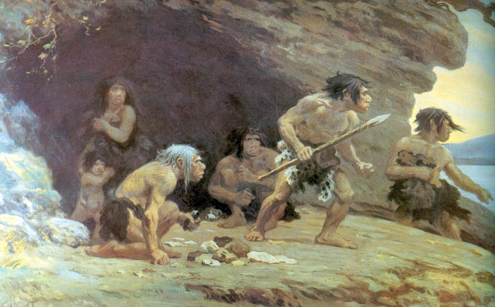
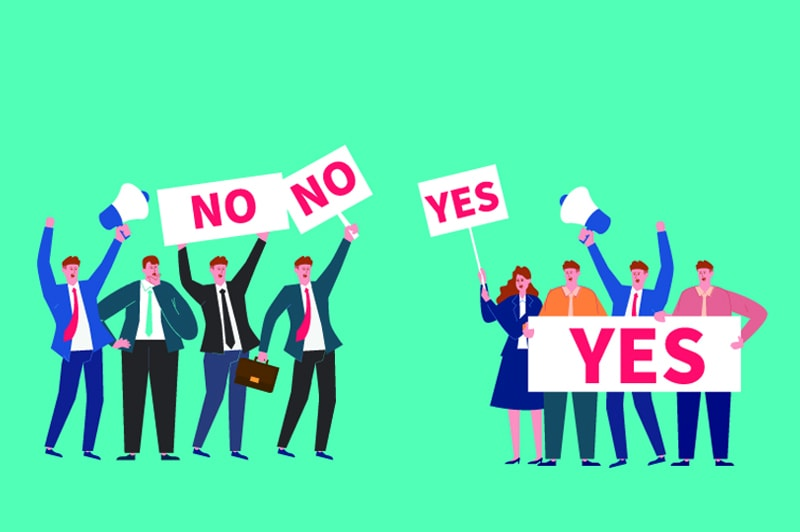
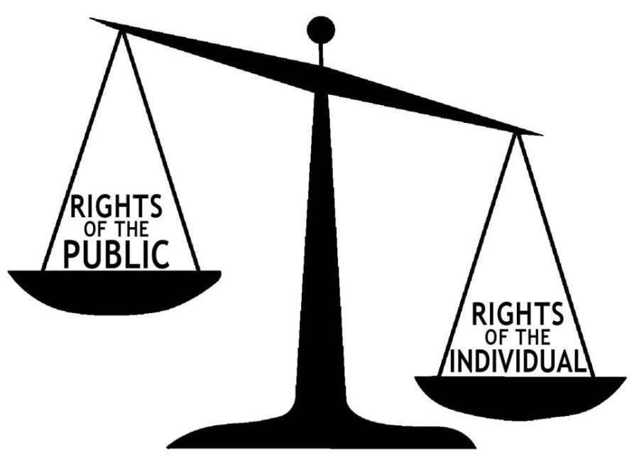
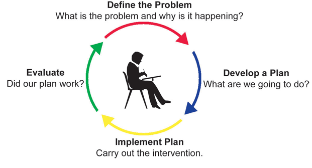
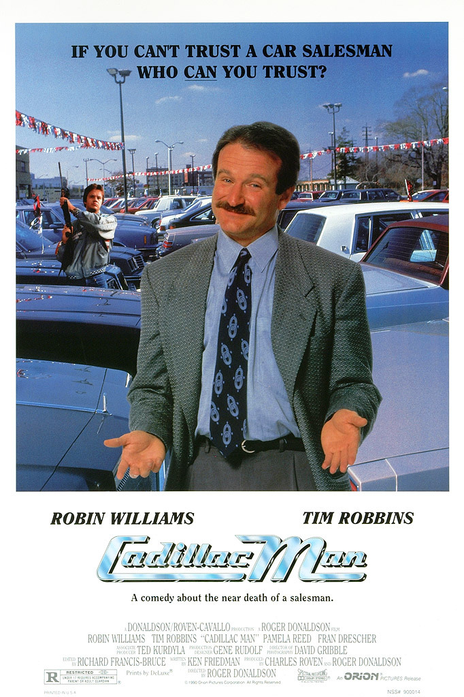
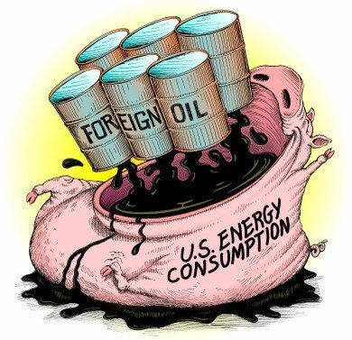
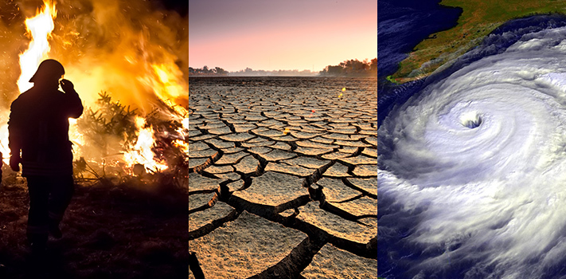

---
output:
  xaringan::moon_reader:
    css: ["default", "extra.css"]
    lib_dir: libs
    seal: false
    nature:
      highlightStyle: github
      highlightLines: true
      countIncrementalSlides: false
      ratio: '16:9'
---

```{r, echo = FALSE, warning = FALSE, message = FALSE}
##xaringan::inf_mr()
## For offline work: https://bookdown.org/yihui/rmarkdown/some-tips.html#working-offline
## Images not appearing? Put images folder inside the libs folder as that is the main data directory

library(tidyverse)
library(readxl)
library(stargazer)
##library(kableExtra)
##library(modelr)

knitr::opts_chunk$set(echo = FALSE,
                      eval = TRUE,
                      error = FALSE,
                      message = FALSE,
                      warning = FALSE,
                      comment = NA)
```

background-image: url('libs/Images/background-forest_v3.png')
background-size: 105%
background-class: center
class: middle

.size45[**I. The Basics of Problem-Solving in a Community**]

<br>

.size50[

**Today's Agenda**

The Role of Stakeholders in Policy-making
- Case Study: US CAFE Standards
]

<br>

.center[.size40[
  Justin Leinaweaver (Spring 2024)
]]

???

## Prep for Class
1. Record Canvas submissions

2. Make sure to save time at end of class to discuss plan for next week (paper 1)

3. Post assignment description on Canvas

<br>

.size10[
Readings

1. Miller, N. (Ed.). (2009). Corporate Average Fuel Economy Regulations (CAFE Standards). In *Environmental Politics: Stakeholders, Interests, and Policymaking*. (pp. 106–141). Routledge.

2. Grandoni, D., Siddiqui , F. & Phillips, A. (2021, Dec 20). New Biden rule reducing climate emissions from cars and SUVs reverses major Trump rollback. *The Washington Post*. [Link](https://www.washingtonpost.com/climate-environment/2021/12/20/auto-mileage-rule-biden-climate/)
]


---

background-image: url('libs/Images/background-forest_v3.png')
background-size: 100%
background-position: center
class: middle

.center[.size50[**Assignment 4 (Due Apr 28th)**

Getting Involved in our Community]]

.size40[
1. Find (or create) an opportunity to get actively involved in your issue locally, and

2. Write a report describing what you did, who you worked with and what you learned from the experience.
]

???

As I introduced last week you have a piece of your project you need to get to work on right now!

- Remember, you have to get my sign-off before acting, and

- Your proposal should frame the activity in terms of how it directly ties to your project AND how doing it will help you better complete that project (e.g. deepens your understanding of the nature of the problem, the stakeholders involved, etc.)?

<br>

Quick Brainstorm: Everybody name one thing they could do this weekend to get involved in your chosen problem in our community!

- Something that either connects you with the stakeholders OR deepens your understanding of the problem itself.

- MUST be different than your idea last class!


---

background-image: url('libs/Images/01-1-ozarks_forest.jpg')
background-size: 100%
background-position: center
class: middle, center, inverse

.size55[.textwhite[**An Effective Policy Designer Must...**]]

<br>

```{r, fig.align='center', out.width='52%'}

```

<br>

.size55[.textwhite[**Consider why Policies Exist**]]

???

Quick hits on our work so far!

<br>

### Effective policy designers recognize that societies MUST create policies to deal with substantial problems or where free-riding could lead to disaster!

This means that policy-designers are challenged to create new rules in situations where:

1. Things are already getting "bad" or have been "bad" for some time,

2. Some members of the community benefit the status quo (e.g. from causing the problem), and

3. You lack the authority to implement or enforce new rules on your own


---

background-image: url('libs/Images/01-1-ozarks_forest.jpg')
background-size: 100%
background-position: center
class: middle, center, inverse

.size55[.textwhite[**An Effective Policy Designer Must...**]]

<br>

```{r, fig.align='center', out.width='50%'}

```

<br>

.size55[.textwhite[**Consider the "Politics"**]]

???

### Therefore, effective policy designers must navigate a political game to solve problems!

<br>

This means you MUST have a model of politics in mind to guide your planning

- We explored politics as a distribution game in class in order to help us think about how societies distribute costs and benefits and make and enforce rules of behavior.

- Actors pursuing their goals, constrained by institutional rules and colliding with each other while they do it. 

<br>

A willingness to acknowledge the relevant actors is also a willingness to accept that not everyone starts from the same basic principle of "the good" in society.

- Most everyone has an intuitive sense of which "wisdom" or type "accountability" is the "right" one for a given situation
    - e.g. Markets, Politics or Experts

- You need to learn to be able to identify these sources of conflict and how to bridge the gaps between them


---

background-image: url('libs/Images/01-1-ozarks_forest.jpg')
background-size: 100%
background-position: center
class: middle, center, inverse

.size55[.textwhite[**An Effective Policy Designer Must...**]]

<br>

```{r, fig.align='center', out.width='50%'}

```

<br>

.size55[.textwhite[**Consider the "Problem"**]]

???

### Effective policy designers are prepared for different stakeholders to define the key concepts differently

<br>

We explored the "environment" as a contested concept using the Cronon reading in order to help us:

1. To expect different definitions of any underlying problem, 

2. To think critically about the arguments that drive you, especially the ones you haven't clarified for yourself, and 

3. To make sure our proposals, and our expectations for human behavior, are NOT based on myths.


---

background-image: url('libs/Images/01-1-ozarks_forest.jpg')
background-size: 100%
background-position: center
class: middle, center, inverse

.size55[.textwhite[**An Effective Policy Designer Must...**]]

<br>

```{r, fig.align='center', out.width='45%'}

```

<br>

.size55[.textwhite[**Consider the "Baseline"**]]

???

### Effective policy designers know that policy design is only possible AFTER you've established your target is a public problem and requires a collective decision.

<br>

1. You MUST make an argument that WE, the public, have a problem, 

2. You MUST make an argument that WE should decide collectively, not privately, and 

3. You MUST make an argument about how the rule should be decided (democracy? delegation to experts?)


---

background-image: url('libs/Images/01-1-ozarks_forest.jpg')
background-size: 100%
background-position: center
class: middle, center, inverse

.size55[.textwhite[**An Effective Policy Designer Must...**]]

<br>

```{r, fig.align='center', out.width='62%'}

```

<br>

.size55[.textwhite[**Consider the "Domestic Process"**]]

???

### Effective policy designers consider how established processes of environmental conflict management can guide their efforts.

<br>

We probably shouldn't try to reinvent the wheel.
- Find the good process ideas that are out there and steal from them!

- I liked that Hughes (2007) pushed me to be clearer about problem definitions and to try to see them as separate from strategy.

- I liked that the "policy process model" from Kraft (2011) reminded me that the "right" pressure strategy depends on the stage of the process we are in 
    - Arguments that work during agenda setting probably look different from the ones we need during policy formulation

- I liked the C&P (2016) collaborative approach because it makes sense to me that community problem-solving MUST be engaged in serious ways with the people whose behavior we hope to modify.


---

background-image: url('libs/Images/01-1-ozarks_forest.jpg')
background-size: 100%
background-position: center
class: middle, center, inverse

.size55[.textwhite[**An Effective Policy Designer Must...**]]

<br>

```{r, fig.align='center', out.width='53%'}

```

<br>

.size55[.textwhite[**Present a Complete Proposal**]]

???

### Finally, effective policy designers produce policy proposals that are:

1. Specific,

2. Adapted to the specific stakeholders,

3. Adapted to the conditions on the ground, and

4. Include an evaluation of strong alternative proposals.

<br>

### Questions or need for clarifications?


---

background-image: url('libs/Images/background-forest_v3.png')
background-size: 100%
background-position: center
class: middle

.size55[**Our Problem-Solving Process**]

.size40[
1. **Argument**: Our community has a problem

2. **Investigate** the relevant stakeholders

3. **Revise** your "we have a problem" argument

4. Consider policy **designs**...
]

???

On Tuesday we started fleshing out a process for problem-solving that looks something like this.

- Remember, we are not pretending that this, or any process, is the "right" one.

- Our aim is for a useful set of guidelines.

<br>

Today, we dig into this second step by analyzing stakeholders in a real-world case study.

- **SLIDE**: Our work today is an important bridge to the work you'll be doing next week.


---

background-image: url('libs/Images/background-forest_v3.png')
background-size: 100%
background-position: center
class: middle

## Paper 1: Introducing the Problem

.size30[
Write a report introducing us to the specific, local environmental problem you intend to target this semester. 

Your report .textblue[**must**] include:

1. A description of the problem supported by .textblue[**high quality evidence**],

2. An argument that this is a .textblue[**public problem**] that requires a .textblue[**collective decision**] by our community, and

3. An analysis of .textblue[**at least two stakeholders**] with .textblue[**opposing**] viewpoints of the problem
]

???

This description is posted on Canvas with additional details

The first paper comes directly from the work we've been doing over the first four weeks of class.

- High quality evidence = data gathered by peer-reviewed sources, government monitoring, third-party groups, etc.

- Stakeholders: Who are they, what do they want and how do they frame the problem?

- Please also see the "Paper Submission Requirements" in the syllabus and be sure to support ALL claims with evidence.

<br>

### Questions on the prompt?

I will give you both classes next week to work on the report in class.


---

background-image: url('libs/Images/03-1-stakeholders.webp')
background-size: 100%
background-position: center
class: middle, center

???

Today we need to practice analyzing stakeholders in environmental policy disputes

- Specifically we'll use the fight over CAFE standards in the US as a means for thinking critically about the role stakeholders play in environmental policy-making.

<br>

We tend to encounter stakeholders through the arguments they make publicly.

- However, these statements are strategic signals meant to generate support for their position, not reveal their "true" preferences.

<br>

We'll need to do some analytical work in order to use these statements to help us broaden the appeal of our arguments.

- **SLIDE**: In other words, ...


---

background-image: url('libs/Images/03-1-stakeholders_v2.png')
background-size: 100%
background-position: center
class: middle, center, inverse

.textwhite[.size55[**What can we learn from the stakeholders' public arguments that will help us broaden the appeal of our "we have a problem" argument?**]]

???

### Does this goal for today's work make sense?


---

background-image: url('libs/Images/background-forest_v3.png')
background-size: 100%
background-position: center
class: middle, top

.center[.size50[**The CAFE Standards Debate**]]

.center[.size50[**Stakeholders in Miller (2009)**]]

.size30[
1. David Greene, Oak Ridge National Laboratory (3.11) 
2. The National Center for Public Policy Research (3.7)
3. The Union of Concerned Scientists (3.9 and 3.15)
4. Bill Visnic, SUV Owners of America (3.1)
5. Public Citizen (3.3)
6. The CATO Institute (3.10)
7. Norman Mineta, Secretary of Transportation (3.8)
8. National Review (3.4)
]

???

The Miller book chapter collects public statements by stakeholders on the issue of CAFE Standards.

- Specifically, these statements were issued during the drafting and debate over the Energy Independence and Security Act of 2007.

<br>

Let's make sure we're clear on the basics.

### What are CAFE standards? What does that acronym stand for?
- (Corporate Average Fuel Economy (CAFE))

### How do they work? What do the CAFE Standards do?
- DoT: "First enacted by Congress in 1975, the purpose of CAFE is to reduce energy consumption by increasing the fuel economy of cars and light trucks.  The CAFE standards are fleet-wide averages that must be achieved by each automaker for its car and truck fleet, each year, since 1978."

<br>

### Anybody know where we are currently with CAFE standards?

(SLIDE)


---

background-image: url('libs/Images/03-1-CAFE_Standards_DoE.jpeg')
background-size: 100%
background-position: center

class: middle

???

Here we see the actual CAFE averages up to 2013 AND the increases mandated by the Obama administration

+ Source is the Dept of Energy

+ You'll note that Obama had planned some pretty sizable increases!

<br>

### Did these go into effect? New cars averaging 50+ mpg?

+ (Umm, no. Trump got elected and began rolling back every environmental regulation he could.)

+ (Trump's revised standard: overall avg of 32 miles per gallon in 2026)

<br>

**SLIDE**: So, where are we now?


---

class: middle, slideblue

.size35[
**Biden's New Rule**: Reach a projected industry-wide target of 161 grams CO2 /mile, or 40 miles per gallon value on fuel economy window stickers in 2026.

+ The final emission standards targets for 2023-2026 increase in stringency by between 5-10 percent in each model year.

+ The standards they replace increased in stringency by only 1.5 percent year over year.

+ By MY2026 the final emissions targets are 47 grams of CO2 /mile lower than the standards they replace.
]

???

[LINK to EPA: Final Rule to Revise Existing National GHG Emissions Standards for Passenger Cars and Light Trucks Through Model Year 2026](https://www.epa.gov/regulations-emissions-vehicles-and-engines/final-rule-revise-existing-national-ghg-emissions)


<br>

One of the early climate actions taken by the Biden Administration was to revert the CAFE standards closer to the trajectory put in place by Obama's Administration. 


---

background-image: url('libs/Images/background-forest_v3.png')
background-size: 100%
background-position: center
class: middle, top

.center[.size50[**The CAFE Standards Debate**]]

.center[.size50[**Stakeholders in Miller (2009)**]]

.size30[
1. David Greene, Oak Ridge National Laboratory (3.11) 
2. The National Center for Public Policy Research (3.7)
3. The Union of Concerned Scientists (3.9 and 3.15)
4. Bill Visnic, SUV Owners of America (3.1)
5. Public Citizen (3.3)
6. The CATO Institute (3.10)
7. Norman Mineta, Secretary of Transportation (3.8)
8. National Review (3.4)
]

???

The Miller book does a nice job collecting a bunch of public statements by stakeholders on this issue.

- Today we'll work to diagram and analyze those arguments.

- Remember, our actual key here is to learn more about stakeholders and the arguments they make, not to take a strong position on the CAFE standards.

### Sound good?


Ok, let's dig into the arguments made by the stakeholders in the Miller chapter.

*Split class into 8 groups (pairs preferred, threesomes if needed) and assign to stakeholders*

Go sit with your partner(s)!


---

background-image: url('libs/Images/background-forest_v3.png')
background-size: 100%
background-position: center
class: middle, top

.center[.size55[**Analyzing the Stakeholders**]]

.size30[
1. David Greene, Oak Ridge National Laboratory (3.11) 
2. The National Center for Public Policy Research (3.7)
3. The Union of Concerned Scientists (3.9 and 3.15)
4. Bill Visnic, SUV Owners of America (3.1)
5. Public Citizen (3.3)
6. The CATO Institute (3.10)
7. Norman Mineta, Secretary of Transportation (3.8)
8. National Review (3.4)
]

.size45[**1) Diagram the argument**]

???

Groups, first job is to diagram the argument they are making and put it on the board.

- Identify the main conclusion, and then the key premises provided to support that conclusion

- Put it *ON THE BOARD*

- Don't draw out the subtext yet, e.g. we'll analyze the argument in a moment, just diagram the argument as they are making it.

### Make sense?

Go!

<br>

*Present each diagram*

### Can we clarify these at all?

- Any inserts necessary to make the argument more logical?

<br>

1. (Supporter) 3.11 David L. Greene, Oak Ridge National Laboratory (p133-138) 
2. (Opponent) 3.7 The National Center for Public Policy Research (p120-124)
3. (Supporter) 3.9 AND 3.15 The Union of Concerned Scientists (p126-128, 140-141)
4. (Opponent) 3.1 Bill Visnic, SUV Owners of America (p109-112)
5. (Supporter) 3.3 Public Citizen (p113-115)
6. (Opponent) 3.10 The CATO Institute (p128-133)
7. (Supporter) 3.8 Norman Mineta, Secretary of Transportation (p124-126)
8. (Opponent) 3.4 National Review (p115-117)


---

background-image: url('libs/Images/background-forest_v3.png')
background-size: 100%
background-position: center

.pull-left[
.center[
.size55[All public arguments are strategies.

They do NOT necessarily reveal "true" preferences.]
]]

.pull-right[
```{r, echo = FALSE, fig.align = 'center', out.width = '83%'}

```
]

???

With that exercise complete, I want to once again re-iterate this VERY key point.

- All of these submissions, speeches, testimonies, ads, etc are strategic signals meant to generate support for a given position.

- They DO NOT reveal "true" preferences.

<br>

HOWEVER, the public argument does tell us A TON about how that stakeholder frames the problem.

- e.g. who they think matters, the stakes involved and what arguments they believe have the best chance to succeed

### Make sense?


---

background-image: url('libs/Images/background-forest_v3.png')
background-size: 100%
background-position: center
class: middle, top

.center[.size50[**Analyzing the Stakeholders**]]

.size40[**1) Diagram the argument and use it to...**]

.size40[**2) Classify the stakeholder**]
.size35[
- Who are they talking to? Why?
- What kinds of evidence are they using?
- Are they focused on policy design or the baseline argument?
- What is their preferred source of "wisdom"?
- What else might help us work with them?
]

???

#### Second step: Analyze the argument in order to learn about the stakeholder 

You've got the broad strokes of their position mapped out, now we analyze these public arguments to learn about the stakeholder.

- In other words, what does their public signal reveal about their core preferences?

- The better we can do at identifying their core preferences hidden in the public pitch, the greater our options for designing a policy that addresses their needs (if possible)

### Make sense?

Note: Baseline here refers to an argument we don't need a policy either because the problem is private or the decision should be left to individuals.

Get to analyzing!

<br>


---

background-image: url('libs/Images/background-forest_v3.png')
background-size: 100%
background-position: center
class: middle, top

.center[.size55[**Analyzing the Stakeholders**]]

.size30[
1. David Greene, Oak Ridge National Laboratory (3.11) 
2. The National Center for Public Policy Research (3.7)
3. The Union of Concerned Scientists (3.9 and 3.15)
4. Bill Visnic, SUV Owners of America (3.1)
5. Public Citizen (3.3)
6. The CATO Institute (3.10)
7. Norman Mineta, Secretary of Transportation (3.8)
8. National Review (3.4)
]

???

Ok, report back to us what you've concluded!

### How does each of these stakeholders frame the problem?

#### - To what degree do you believe their public statements reflect their actual problem framing? In other words, how much of their argument is performance vs truth?

<br>

**SLIDE**: so, where is the overlap?


---

background-image: url('libs/Images/background-forest_v3.png')
background-size: 100%
background-position: center
class: middle

.pull-left[
```{r, echo = FALSE, fig.align = 'center', out.width = '65%'}

```

```{r, echo = FALSE, fig.align = 'center', out.width = '100%'}

```
]

.pull-right[
```{r, echo = FALSE, fig.align = 'center', out.width = '65%'}

```

```{r, echo = FALSE, fig.align = 'center', out.width = '65%'}

```
]

???


Miller argues at the start of the chapter that no single event triggered this policy, it was a confluence of many events pointing in the same direction:

- Continued over-dependence on foreign oil from regions in unrest

- Growing concerns over climate change

- Uncertainty about consequences of terrorism

- Domestic manufacturers losing market share to foreign autos with better fuel efficiency

<br>

Clearly, some talented policy-makers had to work hard to develop a problem framing that would draw in sufficient stakeholder support to make the policy possible.

### Do we see overlap in the framings we've discussed today? Where?

<br>

### What lessons can we take from this that will help us solve environmental problems?


---

background-image: url('libs/Images/background-forest_v3.png')
background-size: 100%
background-position: center
class: middle, top

.center[.size50[**Analyzing the Stakeholders**]]

.size25[
1. David Greene, Oak Ridge National Laboratory (3.11) 
2. The National Center for Public Policy Research (3.7)
3. The Union of Concerned Scientists (3.9 and 3.15)
4. Bill Visnic, SUV Owners of America (3.1)
5. Public Citizen (3.3)
6. The CATO Institute (3.10)
7. Norman Mineta, Secretary of Transportation (3.8)
8. National Review (3.4)
]

.center[.size40[**Based on your analysis, what are our best strategies for reversing this stakeholder's position?**]]

???

I know this is a weird question given that this is a class focused on solving environmental problems.

- HOWEVER, our task right now is to practice thinking critically about stakeholders and how we might shape our arguments to win them over, NOT to promote CAFE standards.

<br>

So, groups, take a minute to think about how your analyses could be used to help us design a strategy that would reverse this stakeholders position on this issue 

- pro to con OR con to pro

### Questions?

Go for it!


---

background-image: url('libs/Images/background-forest_v3.png')
background-size: 100%
background-position: center

class: middle

.size70[**Assignment for Tuesday**]

.size50[
**Before class** submit to Canvas **evidence** we can use to diagram and analyze the positions of the two opposing stakeholders you selected.
]

???

Next week we focus on the first paper!

- For today you identified two relevant stakeholders.

- For Tuesday you need to begin analyzing them and that requires evidence!

<br>

Before class submit to Canvas evidence we can use to diagram and analyze the positions of two opposing stakeholders you identified for last class. 

- Find something concrete that describes, or allows us to infer about, how each of them differently frames your problem. 

- For each, include an APA citation to the evidence and a short explanation of why you believe this evidence is valuable to your work.

### Questions on the assignment?


