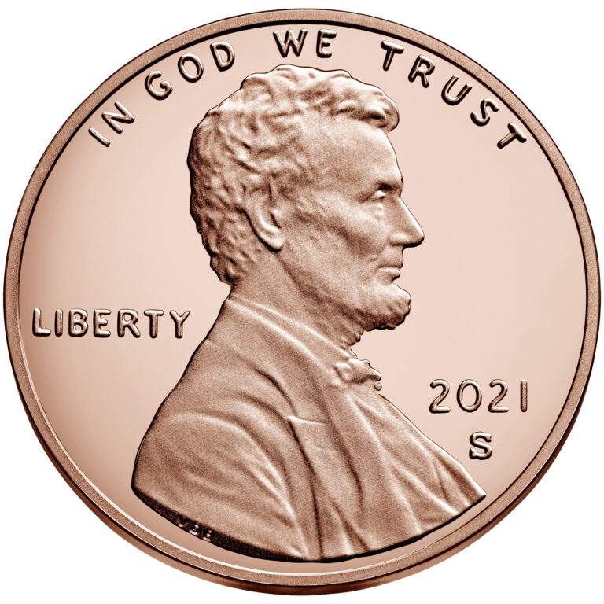

---
output:
  xaringan::moon_reader:
    css: ["default", "extra.css"]
    lib_dir: libs
    seal: false
    nature:
      highlightStyle: github
      highlightLines: true
      countIncrementalSlides: false
      ratio: '16:9'
---

```{r, echo = FALSE, warning = FALSE, message = FALSE}
##xaringan::inf_mr()
## For offline work: https://bookdown.org/yihui/rmarkdown/some-tips.html#working-offline
## Images not appearing? Put images folder inside the libs folder as that is the main data directory

library(tidyverse)
library(readxl)
library(stargazer)
##library(kableExtra)
##library(modelr)

knitr::opts_chunk$set(echo = FALSE,
                      eval = TRUE,
                      error = FALSE,
                      message = FALSE,
                      warning = FALSE,
                      comment = NA)
```

class: slideblue

.size65[**Today's Agenda**]

<br>

.size45[
What are the Complicating Factors in Environmental Policymaking?

+ Risk Aversion / Acceptance
]

<br>

.center[.size40[
  Justin Leinaweaver (Spring 2022)
]]

???

## Prep for Class
1. Bring pennies to class for coin flipping (1 per person)

2. Run slides off of laptop today so you can update the slides as we go

3. Prep email with link to Google Doc for collecting citations
    - https://docs.google.com/document/d/1tufRAEW1UdrYh8AqkkASAGLPyb7gp2Ws4okl71rdEIQ/edit?usp=sharing

4. Consider updating weather forecast slide to current

<br>

### SETUP NOTES FOR YOU
+ CORE201 FA15 1.2 and FA17 1.2
+ US PUBLIC POLICY 14.1
+ ADD Applied arguments: Ehrlich (averse) vs Simon (acceptant)


---

background-image: url('libs/Images/background-forest_v2.png')
background-size: 100%
background-position: center
class: middle

## Semester in Three Sections 

.size40[
1. **How do we approach environmental politics?** (4 wks)
    - Defining key concepts

    - Developing models of politics and problem-solving

    - Thinking about why communities make policy and the common roadblocks
]

???

In the first section of our class we focused on building the baseline language and understanding we will need to make progress on an environmental problem. 

- We defined key concepts: environment, politics, policy

- We developed models: Basic political structures AND specific processes in the literature designed for environmental conflicts

- We thought through the need for policy, conflicts over wisdom and accountability and the role of authority in rule making


---

background-image: url('libs/Images/background-forest_v2.png')
background-size: 100%
background-position: center
class: middle

# Semester in Three Sections 

.size45[
1. How do we approach environmental politics? (4 wks)

2. **What are the complicating factors in environmental policymaking?** (5 wks)

3. Designing an environmental policy (6 wks)
]

???

In the second section of our semester, we will focus on some of the specific complications that arise in environmental policy-making.

If the first section was about developing your baseline, then this section is meant to develop your language of policy-making in more advanced ways.


---

background-image: url('libs/Images/background-forest_v2.png')
background-size: 100%
background-position: center
class: middle

.size40[
**What are the complicating factors in environmental policymaking?** (5 wks)
- Risk Aversion / Acceptance

- Uncertainty, time horizons and discount rates

- Collective action problems and free-riding

- Inequality
]

???

Over the next 5 weeks we'll explore these important topics.

- Each of these represents an additional layer on top of our baseline model of politics.

- Each of these represents an additional way of thinking about the obstacles you will face with your stakeholders.

<br>

This section, just like the last, builds to an assignment focused on your personal research project.

SLIDE


---

background-image: url('libs/Images/background-green_blue_swirl_side.jpg')
background-size: 100%
background-position: center
class: middle

# Paper 2

.size45[
Write a report analyzing your environmental problem in terms of its complications. 

In what specific ways does risk aversion, uncertainty, the collective action problem and inequality complicate your problem-solving? 
]

???

In this paper you will apply the concepts we explore over the next four weeks to your chosen environmental problem.

You will evaluate your problem using each of these lenses and support your claims with real-world evidence.

This assignment is meant to deepen your understanding of the problem in significant ways in order to set you up for the policy design stage that comes next.

<br>

### Any questions on the assignment?


---

background-image: url('libs/Images/background-green_blue_swirl_side.jpg')
background-size: 100%
background-position: center
class: middle

# Paper 2

.size45[
Write a report analyzing your environmental problem in terms of its complications. 

In what specific ways does .textred[**risk aversion**], uncertainty, the collective action problem and inequality complicate your problem-solving? 
]

???

This week we explore risk aversion.

<br>

All people in a community perceive risk differently and these differences make problem-solving much harder.

Disputes over perceived risk tend to seriously complicate defining the problem and evaluating proposed solutions.

<br>

Of course, to talk about risk we have to first talk about probability.


---

background-image: url('libs/Images/05-1-coin_flip.gif')
background-size: 60%
background-position: right

class: slideblue, middle

.pull-left[

```{r, out.width='75%', fig.align='center'}

```
]

???

*Distribute pennies*

### Let’s start with this, what is the probability of getting heads when you flip a penny?

#### - How do you know?

<br>

### Assuming a probability of 50%, how many heads would you expect if i asked you to flip your coin ten times?

+ (5)

<br>

Ok, let's test your intuition!

Flip your penny ten times and record the number of heads.

<br>

*Gather results and update next slide*


---

```{r, fig.retina=3, fig.align='center', fig.asp=0.618, out.width = '95%', fig.width=5}
## Gather results 
classsize <- 17

d <- tibble(
  heads = rbinom(n = classsize, size = 10, prob = .5)
  #heads = c()
)

## Make bar plot
p1 <- ggplot(d, aes(x = heads)) +
  geom_bar() +
  labs(y = "", x = "Number of Heads in Ten Flips") +
  scale_x_continuous(breaks = 0:10, limits = c(0,10)) +
  geom_hline(yintercept = seq(2,6,2), color = "white") +
  theme_minimal()
  #ggthemes::theme_hc()

p1
```

???

### What do we learn from our experiment? 

+ ?

<br>

### Was our estimate of the probability of getting heads wrong or did we do our experiment wrong?

+ ?

<br>

Over just a few flips of the coin, many results are possible.

- However, as a class you just flipped the coin `r classsize*10` times.

- That is plenty times to start to zoom in on the actual probability of these pennies. 

<br>

SLIDE: If we average all of your flips together we get:


---

```{r, fig.retina=3, fig.align='center', fig.asp=0.618, out.width = '95%', fig.width=5}
## Make bar plot with mean
p1 +
  geom_vline(xintercept = mean(d$heads), color = "red", size = 1.2) +
  annotate("text", x = 8, y = 5, label = str_c("Mean: ", round(mean(d$heads), 1)), color = "red", size = 6)

```

???

### Given this result, what is the probability of heads using our pennies?

<br>

Ok, let's make sure we're clear.

### Based on this exercise, i want you to define the word probabiility for me.

(The probability is the likelihood of an event over the long run.)

+ If we flip these pennies many, many, many times we should get heads about this proportion of the time.

<br>

In other words, the probability is what we expect to happen if we could repeat a choice or an action many, many times.


---

background-image: url('libs/Images/05-1-weather_forecast.png')
background-size: 90%
background-position: center

???

Think about this as it relates to the weather.

### When the weather person tells you there is a 25% chance of rain today, what are they telling you?

+ If you lived this day one hundred times, it would rain approximately 25 times.
    - That's what they mean by 25%
    
+ In other words, they ran a computer simulation of today's weather a bunch of times and on one quarter of their simulations it rained, and on 3/4's of them it didn't

<br>

### When the weather forecast is for a 50% chance of rain today, what does that actually mean?

+ (SLIDE)


---

background-image: url('libs/Images/05-1-confused_weatherman.jpg')
background-size: 100%
background-position: center

???

(It rained in half of the simulations)
- In other words, they have no idea what is going to happen today.

<br>

### So, what does this mean for us, a group of people who will only live today one time?
#### - Do I bring an umbrella to work on a 50% chance of rain day or not?

+ ?

<br>

THIS is where your personal level of risk aversion or acceptance comes in!

The probability tells you the tendency of an event, but not the certainty of it.

YOU then have to decide the risks and rewards of acting as if that event will or won't happen.

<br>

### Don’t worry about the math, just tell me, does the intuition of a  probability make sense?

+ It is the likelihood of an event **over the long run**.


---

background-image: url('libs/Images/05-1-County_Fair.webp')
background-size: 100%
background-position: center

???

Now that you are all masters of probability, let’s dig into each of your risk profiles by gambling!

Imagine you are at the county fair with your best girl or guy and you come across a game called "Heads you win, Tails you lose."

--

.size40[.center[.content-box-green[**Heads you win, Tails you lose**]]]

<br>

.size30[.center[.content-box-green[Flip a fair coin: Heads pays you $5, tails you get nothing]]]

???

<br>

The game: Flip a fair coin, heads pays $5, tails you get nothing.

- Everybody take a minute to think about this game.

- Now, write down the maximum amount of money you would pay to play this game.

- Don't say it out loud, just write down your answer!

<br>

### Everybody have their answer written down?

Ok, rewind your imaginary date and let's replay the game!


---

background-image: url('libs/Images/05-1-County_Fair.webp')
background-size: 100%
background-position: center

.size40[.center[.content-box-green[**Heads you win, Tails you lose**]]]

<br>

.size30[.center[.content-box-green[Flip a fair coin: Heads pays you $100, tails you get nothing]]]

???

You and your date arrive at the fair and see this game where heads pays you $100!

- Take a minute to think about it and write down the maximum amount you would pay to play this game.

<br>

*ON BOARD* (2 cols: $5 game, $100 game) Collect responses

### What do we learn from comparing and contrasting your amounts? 
#### - Is there a correct answer?
- No!, Everyone has a different relationship with risk.
- Some people are more / less willing to take on risk to win profit.
- Not right or wrong, just different willingness to risk.
- In other words, some people are more risk acceptant and others are more risk averse.

<br>

### Why aren't all the numbers in the $100 game exactly 20 times the answers in the $5 game column?

#### - What does all this tell us about human decision-making?

- Your relationship to risk is sensitive to both the size of the risk AND the size of the reward!

- Some people will be willing to accept risk when the reward is huge, but not when it is small (e.g. playing the lottery)


---

background-image: url('libs/Images/05-1-intersection.jpg')
background-size: 100%
background-position: center

???

Important note: this is not just about games of chance.

Your decision-making is constantly influenced by your feelings about risk.

### Who here has a car?

<br>

### Ok, drivers, so you're cruising down the road and you see this ahead of you. What do you see and what do you do about it?

+ ?

<br>

### Make this clear for me, how do stop lights illustrate different peoples' levels of risk aversion?

+ Run a red light and get home faster (value!), BUT some probability of getting pulled over or an accident or hurting someone...

<br>

### Any questions about these basic introductions to probabilities or risk aversion?


---

background-image: url('libs/Images/05_1-monkey_darts_politics.jpg')
background-size: 75%
background-position: center
class: slideblue

???

Let's now take this back to our work building models of politics and problem-solving.

### What were some of the key things elements we argued were important when thinking strategically about problem-solving in a political world?

+ Interests, institutions and interactions
+ Problem definitions matter
+ Broad participation in rule-making seemed important
+ ?

<br>

### How does our discussion about risk today impact our models of politics and problem-solving?

(A key complicating factor!)

- Interests defined not just by what they want BUT ALSO by their risk tolerance!

- Two stakeholders presented with the exact same policy (e.g. rules of behavior) may each choose to behave in completely different ways BECAUSE of their different willingnesses to accept risk!

<br>

Let's now shift to the readings for today.


---

background-image: url('libs/Images/background-forest.png')
background-size: 100%
background-position: center
class: middle

.size50[
Ehrlich, P. & Ehrlich, A. (2008, August 4). Too Many People, Too Much Consumption. *Yale Environment 360*.
]

<br>

.size45[.center[**What is the conclusion of this argument?**]]

???

### What is the conclusion of the argument by Ehrlich and Ehrlich?

(SLIDE: Therefore, a combination of overpopulation x overconsumption has us on track for disaster (e.g. see Easter Island, the Mayans, and Nineveh).)


---

background-image: url('libs/Images/background-forest.png')
background-size: 100%
background-position: center
class: middle

.size50[
Ehrlich, P. & Ehrlich, A. (2008, August 4). Too Many People, Too Much Consumption. *Yale Environment 360*.
]

<br>

.center[.size40[Therefore, a combination of overpopulation and overconsumption has us on track for disaster (e.g. see Easter Island, the Mayans, and Nineveh)]]

???

### Which perspective on risk does the Ehrlich and Ehrlich piece represent: Risk acceptance or aversion? Why?

+ (Aversion!)

<br>

### Take a few minutes on your own to identify the key premises the authors use to support this conclusion.

<br>

### Consolidate lists with person next to you.

<br>

*ON BOARD*

+ (We are rapidly depleting the natural capital of the Earth; soil, groundwater, biodiversity)
+ (Negative Impact = Pop x Consumption x Technology)
+ (Technology improvements can help but cannot save us)
+ (Many past human societies have collapsed under the weight of overpopulation and environmental neglect)
+ (It is getting harder to locate the resources we need, e.g. have to mine deeper, use poorer soils, etc)
+ (Population control is controversial on both the left and the right though for different reasons and the media is "pro-natalist" in its framings of these stories, e.g. more births are good)
+ (Tackling overconsumption is complex and very, very difficult)


---

background-image: url('libs/Images/background-forest.png')
background-size: 100%
background-position: center
class: middle

.size50[
Simon, J. (1993). Population Growth Is Not Bad for Humanity. *PRI Review*, 3(6).
]

<br>

.size45[.center[**What is the conclusion of this argument?**]]

???

Let's jump to the second article.

### What is the conclusion of the article?

(SLIDE: Therefore, it is reasonable to expect "that the energetic effort of humankind will prevail in the future, as they have in the past, to increase
worldwide our numbers, our health, our wealth, and our opportunities" (10))


---

background-image: url('libs/Images/background-forest.png')
background-size: 100%
background-position: center
class: middle

.size50[
Simon, J. (1993). Population Growth Is Not Bad for Humanity. *PRI Review*, 3(6).
]

<br>

.center[.size40[Therefore, it is reasonable to expect "that the energetic effort of humankind will prevail in the future, as they have in the past, to increase worldwide our numbers, our health, our wealth, and our opportunities" (10)]]

???

### So, which perspective on risk does the Simon piece represent? Risk acceptance or aversion?

(Acceptance!)

<br>

### Take a few minutes on your own to identify the key premises the authors use to support this conclusion.

<br>

### Consolidate lists with person next to you.

<br>

*ON BOARD*

+ (Overpopulation hysteria has cost us dearly, distracted us from improving lives through targeting economic and political systems)
+ (The research shows "that faster population growth is not associated with slower economic growth")
+ (Market-directed economies do better than centrally planned ones)
+ (As with man-made production capital, so it is with natural resources: Shortages lead to the discovery of substitutes)
+ (Shortages ACTUALLY tend to leave us better off than before)
+ (The only serious shortage is ACTUALLY human beings!)
+ (The most important benefit of population size and growth is the increase it brings to the stock of useful knowledge.)
+ (Progress is limited largely by the availability of trained workers.)


---

background-image: url('libs/Images/background-forest.png')
background-size: 100%
background-position: center
class: middle

.size45[
Ehrlich, P. & Ehrlich, A. (2008, August 4). Too Many People, Too Much Consumption. *Yale Environment 360*.
]

.size45[
Simon, J. (1993). Population Growth Is Not Bad for Humanity. *PRI Review*, 3(6).
]

???

### Bottom line, which side is more convincing to you? Why?

<br>

### Is your feeling on this consistent with your risk level as determined by our game to start class?

<br>

### Is everybody clear on how differing levels of risk aversion complicate environmental problem-solving?


---

background-image: url('libs/Images/background-green_blue_swirl_side.jpg')
background-size: 100%
background-position: center
class: middle

# Paper 2

.size45[
Write a report analyzing your environmental problem in terms of its complications. 

In what specific ways does .textred[**risk aversion**], uncertainty, the collective action problem and inequality complicate your problem-solving? 
]

???

Before we go let's root ourselves back into the paper.

Today we've just begun to play with the many ways risk aversion complicates environmental problem-solving.

In order to help us broaden and deepen our appreciation of risk as a complicating factor I'm giving you an assignment for Thursday.


---

background-image: url('libs/Images/background-green_blue_swirl_side.jpg')
background-size: 100%
background-position: center

class: middle

.size60[**For Thursday**]

.size40[
Find us a .textred[**recent, real world example**] of differing levels of .textred[**risk aversion**] complicating environmental problem-solving. 

Look for examples with the sides evaluating the risks of the problem very differently. 

Be ready to help us .textred[**brainstorm strategies**] for addressing these complications.
]

???

#### Read prompt

<br>

You don't have to find a case that mirrors the problem you've selected for your paper.

HOWEVER, that's not a bad idea!

<br>

My aim is that we broaden and deepen our understanding of risk profiles complicating environmental problem-solving.

- So, go find us good cases we can dig our teeth into.

Submit the citation to your case before class.

- Be ready to present your case to the class AND start thinking about strategies we can use to address these risk based problems.

### Questions?