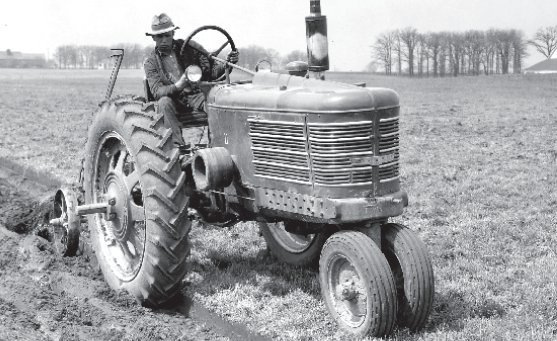
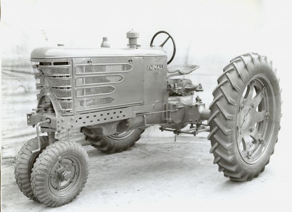
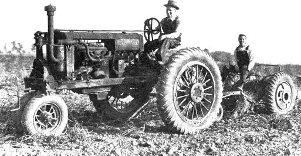
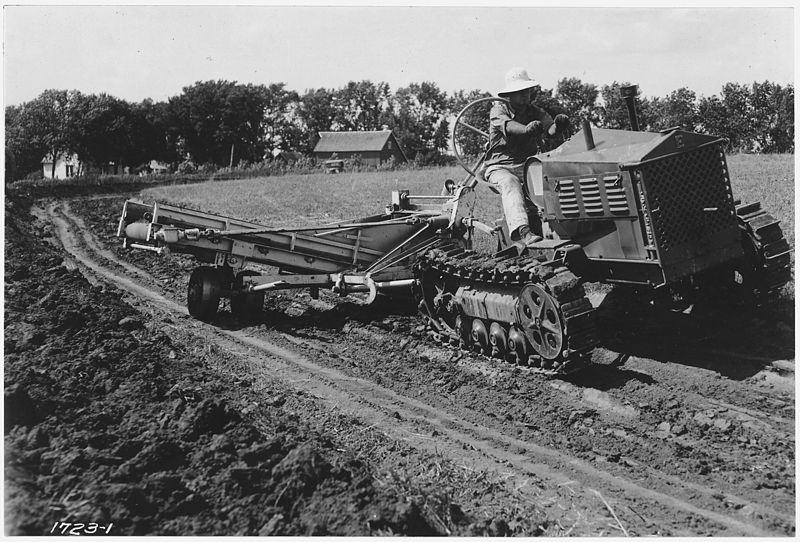

---
output:
  xaringan::moon_reader:
    css: ["default", "extra.css"]
    lib_dir: libs
    seal: false
    nature:
      highlightStyle: github
      highlightLines: true
      countIncrementalSlides: false
      ratio: '16:9'
---

```{r, echo = FALSE, warning = FALSE, message = FALSE}
##xaringan::inf_mr()
## For offline work: https://bookdown.org/yihui/rmarkdown/some-tips.html#working-offline
## Images not appearing? Put images folder inside the libs folder as that is the main data directory

library(tidyverse)
library(readxl)
library(stargazer)
##library(kableExtra)
##library(modelr)

knitr::opts_chunk$set(echo = FALSE,
                      eval = TRUE,
                      error = FALSE,
                      message = FALSE,
                      warning = FALSE,
                      comment = NA)
```

class: slideblue

.size80[**Today's Agenda**]

<br>

.size50[
1. Let's modify our plan for the rest of the semester, and

2. Review your uncertainty cases
]

<br>

.center[.size40[
  Justin Leinaweaver (Spring 2022)
]]

???

## Prep for Class
1. Check citations on shared Google sheet.
    - https://docs.google.com/document/d/1nqq5AhgW8gHpFt8FZU5LQu_9pRmKf2J3xWMXXVDIUq0/edit?usp=sharing
    
2. Note: I dropped the Dust Bowl example to the end. See how today goes without it. Maybe re-add in future IFF it adds an extra element we need.


---

background-image: url('libs/Images/background-blue_triangles.jpg')
background-size: 100%
background-position: center
class: middle

# The Semester: Three Sections 

.size45[
1. How do we approach environmental politics? (4 wks)

2. What are the complicating factors in environmental policymaking? (5 wks)

3. Designing an environmental policy (6 wks)
]

???

As I'm sure you all recognize, this is our current class plan.

- My thinking, given diverse backgrounds in the class we would need to spend most of our time exploring the conceptual tools that underpin political problem solving and the environment.

<br>

But here's the thing, the papers were really, really good.

- Good work all!

<br>

They've given me a much better sense of where we need to go next in the class to help you design your policies.

- That in mind I am proposing the following changes to our class outline, syllabus and assignments.


---

background-image: url('libs/Images/background-blue_triangles.jpg')
background-size: 100%
background-position: center
class: middle

# The Semester: Three Sections 

.size45[
1. How do we approach environmental politics? (6 wks)

2. **What are the primary mechanisms used by policy designers to solve environmental problems? (5 wks)**

3. Designing an environmental policy (4 wks)
]

???

Your reports have shown me we've made good progress on the conceptual level and now we need to dig into practical policy design approaches.

New plan: Starting next week and for the next five weeks we explore the most common policy methods used for solving environmental problems.

After this exploration you'll write your next paper focused on evaluating these options for your problem.

SLIDE: Let's zoom in on the details...


---

background-image: url('libs/Images/background-blue_triangles.jpg')
background-size: 100%
background-position: center
class: middle

.size40[
**2) What are the primary mechanisms used by policy designers to solve environmental problems? (5 wks)**

- Command and Control Regulations 

- "Green" Taxes 

- "Green" Subsidies 

- Adaptive Governance Policies 
]

???

How will we attack this?

Each week we focus on one approach.
- On Tuesday I'll have you read about the background of the approach and we'll explore some examples in class.

- For Thursday, I'll ask each of you to find an example from somewhere in the world of a society trying to solve a problem like yours using this approach.

<br>

My hope is that weekly structure pushes us forward in terms of learning the key concepts AND gets you much more ready to design a new policy.

You'll get a chance to test out four very different approaches to solving your problem before I ask you to pick one for your final papers.

<br>

SLIDE: This leads to a new prompt for paper 2


---

background-image: url('libs/Images/background-green_blue_swirl_side.jpg')
background-size: 100%
background-position: center

class: middle

# Paper 2
.size45[
Write a report analyzing the pros and cons of our four policy design options for addressing your specific environmental problem (C&C Regulations, "Green" Taxes, "Green" Subsidies, and Adaptive Governance). 

Which is the "right" choice for your work this term?

- Support all claims with evidence
]

???

New prompt and deadline for paper 2.

- Note that this pushes the deadline for paper 2 out by a number of weeks.

- This gives all of you a chance to write a report focused on evaluating many different policy approaches BEFORE you have to commit to one of them.

<br>

Ok, so that's my proposal.

The revised syllabus is now available on Moodle and I'll email it out shortly. 

### Does the new plan make sense?

### Any questions or concerns about this revised plan?

If you don't feel comfortable responding on Zoom, please send me an email or we can meet next week to discuss it.


---

background-image: url('libs/Images/background-green_blue_swirl_side.jpg')
background-size: 100%
background-position: center

class: middle

.size60[**For Today**]

.size45[
Find us a .textblue[**recent, real world example**] of differing levels of .textblue[**uncertainty, time horizons or discount rates**] complicating environmental problem-solving. 

Look for examples relevant to .textblue[**your ongoing project**] and be ready to help us .textblue[**brainstorm strategies**] for addressing these complications.
]

???


### Everybody ready to present the case they brought today?

Keep in mind, these cases will help us think critically about uncertainty AND give us a list of helpful citations for writing your second paper.

<br>

Alright, let's hear those cases!

- As you listen, look for connections between these examples and the problem your working on this term.

<br>

**After they go, you share your case**

SLIDE:NYT story on mosquito nets used for fishing + Video

*(omitted to end for now, SLIDE: Example from you: New farming technology to feed ourselves creates 'The Dust Bowl' (Worster))*


---

background-image: url('libs/Images/06-2-Malaria_Africa.png')
background-size: 97%
background-position: bottom
class: top

.center[.size55[**Malaria in Africa**]]

???

I brought a case too!

Malaria kills at least half a million Africans each year (data from 2015)

Mosquito nets are widely considered a magic bullet against malaria — one of the cheapest and most effective ways to stop the disease

- An insecticide-treated mosquito net, hung over a bed, is the perfect mosquito-killing machine. 

- The gauzy mesh allows the carbon dioxide that people exhale to flow out, which attracts mosquitoes. 

- But as they swarm in, their cuticles touch the insecticide on the net’s surface, poisoning their nervous systems and shutting down their microscopic hearts.

The World Health Organization says the nets are a primary reason malaria death rates in Africa have been cut in half since 2000.

[Link](https://www.nytimes.com/2015/01/25/world/africa/mosquito-nets-for-malaria-spawn-new-epidemic-overfishing.html)


---

class: center, middle, slideblue

<iframe width="1050" height="650" src="libs/Images/NYT-Malaria-Fishing-Nets.mp4" frameborder="0" allow="accelerometer; encrypted-media; gyroscope; picture-in-picture" allowfullscreen></iframe>

???

**Watch the video is (3:23)**

<br>

Amy Lehman, an American physician and the founder of the Lake Tanganyika Floating Health Clinic:

- “The narrative has always been, ‘Spend $10 on a net and save a life,’ and that’s a very compelling narrative.

- “But what if that net is distributed in a waterside, food-insecure area where maybe you won’t be affecting the malaria rate at all and you might actually be hurting the environment?” she said. “It’s a lose-lose. And that’s not a very neat story to tell.”

<br>

Why is this an environmental policy problem?

1. Malaria is impacting more and more people as climate change spreads mosquito hunting zones,

2. The nets themselves have such a fine mesh that they trap and destroy everything in the lake threatening to wipe out a fishery, and
    - Recent hydroacoustic surveys show that Zambia’s fish populations are dwindling. Harris Phiri, a Zambian fisheries official, blamed deforestation, rapid population growth and the widespread use of mosquito nets.
    - “They are catching very small fish that haven’t matured,” Mr. Phiri said. “The stocks won’t be able to grow.”

3. Many of these insecticide-treated nets are dragged through the same lakes and rivers people drink from, raising concerns about toxins. 

- One of the most common insecticides used by the mosquito net industry is permethrin, which the United States Environmental Protection Agency says is “likely to be carcinogenic to humans” when consumed orally. The E.P.A. also says permethrin is “highly toxic” to fish.

- Many of the nets are labelled "do not wash in lakes or rivers"


---

background-image: url('libs/Images/06-2-fishing.png')
background-size: 100%
background-position: center
class: top

???

Why is this a serious policy problem?

- Western governments and foundations donate the money. 

- Big companies like BASF, Bayer and Sumitomo Chemical design the nets. They are manufactured at about $3 apiece, many in China and Vietnam, shipped in steel containers to Africa, trucked to villages by aid agencies, and handed out by local ministries of health, usually gratis. 

- Madagascar: Fistfights are breaking out on the beaches of Madagascar between fishermen who fear that the nets will ruin their livelihoods, and those who say they will starve without them. 
    - Because Antongil Bay is considered a crucial shrimping area, Madagascar recently banned the use of ramikaoko nets there. But the government has been in such disarray since a military coup a few years ago that enforcement of the decree is now up to a group of threadbare vigilante fishermen.
    - In another village, mosquito-net users crept up to the boats of professional fishermen late one night and cut them loose into the sea. The net users were so furious about anyone trying to take away their nets that they started a boycott of the professional fishermen.

- The Congo: Congolese officials have snatched and burned the nets, and in August, Uganda’s president, Yoweri Museveni, threatened to jail anyone fishing with a mosquito net.

### How does this illustrate the role of uncertainty in environmental problem-solving?

<br>

### Any policy design lessons we can take from this or that we can apply from what we've studied so far?

- Something to be said for preferring wide consultations and rule-making that involves the community you are targeting!

- The stakeholders matter!

- A need for measurement and ongoing monitoring of your policy designs


---

background-image: url('libs/Images/background-green_blue_swirl_side.jpg')
background-size: 100%
background-position: center
class: middle

# Paper 2

.size45[
Write a report analyzing your environmental problem in terms of its complications. 

In what specific ways does risk aversion, .textblue[**uncertainty**], the collective action problem and inequality complicate your problem-solving? 
]

???

The collected citations for today (and each week in section 2) offer you evidence you may need to write the paper.

### Think about all the cases we've heard today and tell us in what specific ways  your environmental problem presents these complications?

#### - Which pieces of evidence most useful for you?


---

background-image: url('libs/Images/06-2-uncertainty.jpeg')
background-size: 90%
background-position: center
class: bottom

.size35[
.center[
.content-box-blue[**Strategies for Stakeholders with**]

.content-box-blue[**Different Uncertainty Profiles?**]
]]

???

### Can we use the cases we heard today to help us brainstorm strategies for dealing with environmental problems that confront stakeholders with very different uncertainty profiles?

#### - Ideas?

*ON BOARD*


---

background-image: url('libs/Images/background-forest_v2.png')
background-size: 100%
background-position: center
class: middle, center

.size60[**Next Week's Complication**]

<br>

.size45[
Collective Action Problems and Free-Riding
]

???

### Questions?


---

background-image: url('libs/Images/06-2-farm_tech_1830s.webp')
background-size: 83%
background-position: center

.size55[.content-box-green[**Farming in the 1830s**]]

???

US example showing the incredible stakes of environmental problems with stakeholders who hold incredibly different temporal discount rates.

In 1830, about 250 to 300 labor-hours were required to produce 100 bushels (5 acres) of wheat with a walking plow, brush harrow, hand broadcast of seed, sickle, and flail [Link](https://www.thoughtco.com/american-farm-tech-development-4083328)

<br>

#### Notes
Inventions included:
- 1834: The McCormick reaper was patented.
- 1834: John Lane began to manufacture plows faced with steel saw blades.
- 1837: John Deere and Leonard Andrus began manufacturing steel plows—the plow was made of wrought iron and had a steel share that could cut through sticky soil without clogging.
- 1837: A practical threshing machine was patented.


---

background-image: url('libs/Images/06-2-farm_tech_1890s.webp')
background-size: 100%
background-position: center
class: bottom, inverse

.center[.size70[**Farming in the 1890s**]]

???

By 1890, we had reduced the labor requirement for 100 bushels of wheat from 200-300 labor-hours to about 40–50 with a gang plow, seeder, harrow, binder, thresher, wagons, and horses [Link](https://www.thoughtco.com/american-farm-tech-development-4083328)

<br>

#### Notes
Inventions included:
- 1880: William Deering put 3,000 twine binders on the market.
- 1884–90: The horse-drawn combine was used in Pacific Coast wheat areas.
- 1890-95: Cream separators came into wide use
- 1890-99: The average annual consumption of commercial fertilizer was 1,845,900 tons.
- 1890s: Agriculture became increasingly mechanized and commercialized
- 1890: Most basic potentialities of agricultural machinery that were dependent on horsepower had been discovered.


---

class: slideblue, middle

.center[.size40[**Farming in the 1930s**]]

.pull-left[
```{r, out.width='80%'}



```
]

.pull-right[
```{r, out.width='90%'}



```
]

???

By the 1930s we had it down to 15-20 labor-hours to produce 100 bushels (5 acres) of wheat with a 3-bottom gang plow, tractor, 10-foot tandem disk, harrow, 12-foot combine, and trucks!

<br>

### Notes
- https://commons.wikimedia.org/wiki/File:Equipment_being_pulled_by_tractor_-_NARA_-_286176.jpg
- https://www.farmcollector.com/company-history/tractor-design-raymond-loewy-henry-dreyfuss/
- The Farmall F-22 in 1938 when it was beginning to look more like the subsequent production Farmall H. Courtesy Wisconsin Historical Society, image ID: WHi-27595. 
- In the 1930s, the all-purpose, rubber-tired tractor with complementary machinery came into wide use. Additionally:
- 1930–39: The average annual consumption of commercial fertilizer was 6,599,913 tons.
- 1930: One farmer could supply nearly 10 people in the United States and abroad with food.
- 1930: Fifteen to 20 labor-hours were required to produce 100 bushels (2 1/2 acres) of corn with a 2-bottom gang plow, 7-foot tandem disk, 4-section harrow, and 2-row planters, cultivators, and pickers. The same number of hours were also required to produce 100 bushels (5 acres) of wheat with a 3-bottom gang plow, tractor, 10-foot tandem disk, harrow, 12-foot combine, and trucks.


---

class: center, middle, slideblue

<iframe width="1050" height="650" src="libs/Images/Introducing_The_Dust_Bowl.mp4" frameborder="0" allow="accelerometer; encrypted-media; gyroscope; picture-in-picture" allowfullscreen></iframe>

???


---

background-image: url('libs/Images/06-2-Dust-Bowl-Map.png')
background-size: 72%
background-position: center

???


---

background-image: url('libs/Images/06-2-new_dust_bowl.png')
background-size: 100%
background-position: center

???

[link](https://www.smithsonianmag.com/smart-news/are-great-plains-headed-another-dust-bowl-180976117/)


*DISCUSS*

### Lessons for us?
