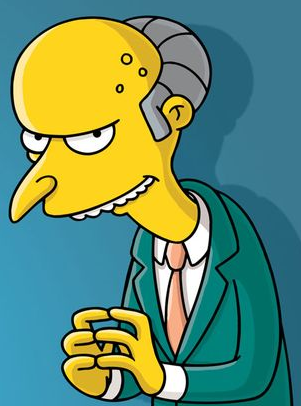

---
output:
  xaringan::moon_reader:
    css: ["default", "extra.css"]
    lib_dir: libs
    seal: false
    nature:
      highlightStyle: github
      highlightLines: true
      countIncrementalSlides: false
      ratio: '16:9'
---

```{r, echo = FALSE, warning = FALSE, message = FALSE}
##xaringan::inf_mr()
## For offline work: https://bookdown.org/yihui/rmarkdown/some-tips.html#working-offline
## Images not appearing? Put images folder inside the libs folder as that is the main data directory

library(tidyverse)
library(readxl)
##library(stargazer)
##library(kableExtra)
##library(modelr)

knitr::opts_chunk$set(echo = FALSE,
                      eval = TRUE,
                      error = FALSE,
                      message = FALSE,
                      warning = FALSE,
                      comment = NA)
```

background-image: url('libs/Images/background-forest_v3.png')
background-size: 105%
background-class: center
class: middle

.size45[**II. Policy Design Options**]

<br>

.size50[

**Today's Agenda**

Approaches to Environmental Policy Design

- "Command and Control" Regulations
]

<br>

.center[.size40[
  Justin Leinaweaver (Spring 2024)
]]

???

## Prep for Class
1. Put report 2 details on Canvas

2. Prep discussion board for next class
    


---

background-image: url('libs/Images/background-forest_v3.png')
background-size: 100%
background-position: center
class: middle

.size60[**The Semester: Three Sections**]

.size45[
1. **The Basics of Problem-Solving in a Community**

2. Evaluating Policy Design Options

3. Designing Environmental Policies
]

???

We've spent the last five weeks on section 1 of our class.

- My hope is that this has given you a rough understanding of the basic ways you can organize your investigation of a societal problem.

<br>

Specifically we've explored:

- How a "problem" is the result of actions taken by individuals interacting in a community (politics),

- How many problems appear intractable because the stakeholders all define it differently (definitions),

- What policy is, why it exists and the different ways we can assess its effectiveness (policy), and

- How community based problem solving requires us to be flexible and adaptable to the needs of the stakeholders whose behavior we may be trying to change.


---

background-image: url('libs/Images/background-forest_v3.png')
background-size: 100%
background-position: center
class: middle

# Section 2: Evaluating Policy Design Options
.size55[
1. Command & Control Regulations

2. "Green" Taxes

3. "Green" Subsidies

4. Adaptive Governance
]

???

Our next step in this process of addressing a local environmental problem job is to explore different policy design options.

<br>

Over the next four weeks we will analyze each of these approaches as tools for solving environmental problems.

<br>

**SLIDE**: At the end of this section you will write a report analyzing these four approaches as a fit for your environmental problem.


---

background-image: url('libs/Images/background-blue_triangles_v2.png')
background-size: 100%
background-position: center

class: middle

.size70[**Paper 2**]

.size55[
Which of the four policy design options is the "right" choice for addressing your environmental problem?

- Analyze the pros and cons of each option for your chosen problem
]

???


In this paper you will be asked to evaluate all four of the approaches we study in class from the perspective of your chosen environmental problem.

- For this paper you must evaluate each design as a **single, stand alone approach** (no blending)

- The final proposal can blend as many ideas/approaches as you want, but this paper  has a narrower aim. 

- ALSO, you must support all claims with evidence!

### Any questions on the prompt?

<br>

My plan is that each week we'll attack these like we did the basic elements.

- Each Tuesday I will give you readings on the background and a case to consider.

- Each Thursday we'll apply the lessons to your specific environmental problems.


---

background-image: url('libs/Images/background-forest_v3.png')
background-size: 100%
background-position: center
class: middle

# Section 2: Evaluating Policy Design Options
.size55[
1. .textblue[**Command & Control Regulations**]

2. "Green" Taxes

3. "Green" Subsidies

4. Adaptive Governance
]

???

Today we start with the "command and control" policy approach.

<br>

### Big picture, explain to me what a "command and control" policy does to solve an environmental problem?

- (SLIDE)


---

background-image: url('libs/Images/10-1-cartoon_measuring_smoke_stack.jpg')
background-size: 100%
background-position: center
class: center

???

Command-and-Control Regulations [(OpenStax 2016)](https://opentextbc.ca/principlesofeconomics/chapter/12-2-command-and-control-regulation/)

- A regulatory approach to reducing pollution
    - e.g. Government tells people what they can/can't do OR how they must do something
    
- Examples: 
    - Bans on some emissions,
    - Limitations on some emissions, 
    - Laws specifying what specific equipment you must use (pollution-control technologies)

<br>

The Open Textbook chapter argues command-and-control forces polluters to pay the social costs of their pollution.

### What does that mean?

- (**SLIDE**: Let's talk about the economics of regulating pollution!)


---

background-image: url('libs/Images/10-1-polluting_factory.jpg')
background-size: 83%
background-position: left
class: bottom

```{r, fig.align='right', out.width='35%'}

```

???

Hypothetical Example: 
- Mr. Burns buys some land and builds a factory to produce widgets he can sell for a profit.
- Unfortunately, the factory emits pollution that:
    - makes the river water undrinkable, 
    - kills a local fishery, and 
    - puts enough smog and PM into the air to increase asthma rates, heart attacks and reduce the productivity of local local farms.

<br>

### Why is this an example of pollution as an "externality"?
- Market Externality Defined: "The effect of a market exchange on a third party who is outside or “external” to the exchange is called an externality" (OpenStax [Link](https://opentextbc.ca/principlesofeconomics/chapter/12-1-the-economics-of-pollution/))

- The pollution in this example is impacting persons outside the primary exchange, e.g. widgets for cash.
    - (It is not the purpose of the factory to produce pollution, that is external to its primary market purpose)


---

background-image: url('libs/Images/10-1-polluting_factory.jpg')
background-size: 83%
background-position: left
class: bottom

```{r, fig.align='right', out.width='35%'}

```

???

### So, in this imaginary hypothetical how many widgets should Mr. Burns produce?

- In the absence of local laws or regulations concerning pollution this decision is probably a function of:
    1. How many do you think you can sell? AND
    2. What is the marginal cost per unit (e.g. the cost to produce each widget)

<br>

In other words, if customers want widgets and will pay more than they cost him to make he should keep making more widgets!

### Make sense?

<br>

**SLIDE**: Let's do a quick refresher in marginal costs and demand!


---

```{r, cache=TRUE, fig.retina=3, fig.asp=0.618, fig.align='center', out.width='95%', fig.width=6}
## Let's build supply and demand curves
p1 <- tibble(
  Price = 1:100,
  Quantity = 100:1
) |>
  ggplot(aes(x = Quantity, y = Price)) +
  geom_point(color = "white") +
  theme_classic() +
  coord_cartesian(xlim = c(0, 125)) +
  scale_x_continuous(breaks = seq(0, 100, 20)) +
  labs(x = "Quantity Produced", y = "Price per Widget")

p1
```

???

[Welcome to super basic Econ-101!](https://www.env-econ.net/negative-externality.html)

- Let's start with supply and demand.

<br>

Here we see a visual representation of Mr. Burns' decision when running his factory.

- On the y-axis are the different prices for a widget.

- On the x axis is the number of widgets he can choose to produce.

<br>

These are the two axes we need in order to illustrate demand, supply, profit and the effect of regulations on pollution levels.


---

```{r, fig.retina=3, fig.asp=0.618, fig.align='center', out.width='95%', fig.width=8, cache=TRUE}
p1 +
  annotate("segment", x = 0, xend = 100, y = 15, yend = 65, color = "blue", linewidth = 1.3) +
  annotate("text", x = 120, y = 67, label = "Supply\n(MC)", size = 5, color = "blue", hjust = .5)
```

???

This blue line is what we refer to as the supply curve.

### What does this "supply" line tell us about the production decision for Mr. Burns?

- (The blue line represents the marginal cost per unit (MC) which tells you how much it costs to make one more widget at that level)

- (The positive slope tells us that the cost per widget goes up as you produce more widgets)

<br>

### Why is it so often true that producing more widgets is more expensive (e.g. why a positive slope for our supply curve)?

- (**SLIDE**: Scarcity and cost!)


---

background-image: url('libs/Images/10-1-petroleum_seep.png')
background-size: 100%
background-position: center

???

Let's use a concrete example to illustrate a positive sloped marginal cost curve.

<br>

Let's say you buy a piece of land that is rich in oil.

- Image is what's called a petroleum seep, the oil is bubbling up from the land.

<br>

This business is easy. Just scoop the oil into barrels and sell it!


---

```{r, fig.retina=3, fig.asp=0.618, fig.align='center', out.width='95%', fig.width=8, cache=TRUE}
p1 +
  annotate("segment", x = 0, xend = 100, y = 15, yend = 65, color = "blue", linewidth = 1.3) +
  annotate("text", x = 120, y = 67, label = "Supply\n(MC)", size = 5, color = "blue", hjust = .5)
```

???

### At this point in your story, e.g. gathering oil from seeps, where are you on the supply curve?

- (**SLIDE**)


---

```{r, fig.retina=3, fig.asp=0.618, fig.align='center', out.width='95%', fig.width=8, cache=TRUE}
p1 +
  annotate("segment", x = 0, xend = 100, y = 15, yend = 65, color = "blue", linewidth = 1.3) +
  annotate("text", x = 120, y = 67, label = "Supply\n(MC)", size = 5, color = "blue", hjust = .5) +
  annotate("point", x = 5, y = 17.5, size = 5) +
  annotate("text", x = 13, y = 10, label = "Oil Seep")
```

???

Far left side of the curve. 
- You are producing very little oil, but the cost per barrel is VERY low!

<br>

Congrats! This is really working and you're starting to make some money!
- Unfortunately, the seeps will run dry.

### So, what do you do?
- (**SLIDE**: build an oil derrick)


---

background-image: url('libs/Images/10-1-oil_derrick.gif')
background-size: 90%
background-position: center

???

So you build an oil derrick in order to dig deeper and reach new oil supplies far under ground.

<br>

### What does this investment mean for your costs?

- (Oil derrick construction is expensive and you have to pay upkeep to keep it running.)

- (You have to hire a bunch of people to get them to run and maintain the equipment.)
    - Each person gets a salary, benefits, insurance, etc.

<br>

**SLIDE**: Back to the curve


---

```{r, fig.retina=3, fig.asp=0.618, fig.align='center', out.width='95%', fig.width=8, cache=TRUE}
p1 +
  annotate("segment", x = 0, xend = 100, y = 15, yend = 65, color = "blue", linewidth = 1.3) +
  annotate("text", x = 120, y = 67, label = "Supply\n(MC)", size = 5, color = "blue", hjust = .5) +
  annotate("point", x = 5, y = 17.5, size = 5, alpha = .25) +
  annotate("point", x = 55, y = 42.5, size = 5) +
  annotate("text", x = 13, y = 10, label = "Oil Seep", alpha = .6) +
  annotate("text", x = 60, y = 34, label = "Oil Derrick")
```

???

Extracting more oil requires sizable investments in production

- Sizable investments in production are only affordable if you can sell the oil at higher prices

### Make sense?

<br>

You're doing well, but you know you can do better!

- **SLIDE**


---

background-image: url('libs/Images/10-1-oil_rig.jpg')
background-size: 90%
background-position: center

???

Next step, take your company public!

- Sell shares on the stock market

- Unfortunately, investors demand infinite growth and the calls to fire you are getting louder.
    - You need to find more oil to sell...

<br>

**SLIDE**: SO, you build massive rigs in the ocean to really maximize your oil production.


---

```{r, fig.retina=3, fig.asp=0.618, fig.align='center', out.width='95%', fig.width=8, cache=TRUE}
p1 +
  annotate("segment", x = 0, xend = 100, y = 15, yend = 65, color = "blue", linewidth = 1.3) +
  annotate("text", x = 120, y = 67, label = "Supply\n(MC)", size = 5, color = "blue", hjust = .5) +
  annotate("point", x = 5, y = 17.5, size = 5, alpha = .25) +
  annotate("point", x = 55, y = 42.5, size = 5, alpha = .25) +
  annotate("text", x = 13, y = 10, label = "Oil Seep", alpha = .6) +
  annotate("text", x = 60, y = 34, label = "Oil Derrick", alpha = .6) +
  annotate("point", x = 90, y = 60, size = 5) +
  annotate("text", x = 94, y = 54, label = "Oil Rig")
```

???

This adds massive new costs to your production
- Waves, 
- storms, 
- pirates, 
- huge numbers of employees who suddenly want to unionize,
- harassment by environmental activists who note you may be destroying the planet...

<br>

I may be getting sidetracked.

### Is everybody clear on why we can assume increasing marginal costs of production?


---

background-image: url('libs/Images/10-1-polluting_factory2.png')
background-size: 90%
background-position: center
class: bottom

```{r, cache=TRUE, fig.retina=3, fig.asp=0.618, fig.align='center', out.width='40%', fig.width=8}
p1 +
  annotate("segment", x = 0, xend = 100, y = 15, yend = 65, color = "blue", linewidth = 1.3) +
  annotate("text", x = 120, y = 67, label = "Supply\n(MC)", size = 5, color = "blue", hjust = .5)
```

???

Go back to Mr. Burns factory.

### Why can we probably assume increasing marginal costs for Mr. Burns factory?

- (In Mr. Burns case just think of it becoming harder and harder (e.g. more expensive) to:
    - source the materials he needs to make widgets,
    - Add equipment and employees to run it,
    - etc.

- This is true for many, if not most, industrial production processes.

<br>

Long story short, that's the supply curve.

- As you make more widgets, you have to charge more for them or you won't make a profit.

### Questions on this?


---

```{r, cache=TRUE, fig.retina=3, fig.asp=0.618, fig.align='center', out.width='95%', fig.width=8}
p1 +
  annotate("segment", x = 0, xend = 100, y = 100, yend = 0, color = "red", linewidth = 1.3) +
  annotate("text", x = 115, y = 5, label = "Demand", size = 5, color = "red", hjust = .5)
```

???

Here's the demand curve.

### How do I read the demand curve? What is it telling me?

- (This indicates how many widgets people are willing to buy at different levels of the price.)
    - When the price is super high, nobody is willing to buy.
    - As the price falls, demand increases.

- Confusing because the line is falling, but remember moving to the right means increasing the number of widgets made/sold.

<br>

### Make sense?


---

```{r, cache=TRUE, fig.retina=3, fig.asp=0.618, fig.align='center', out.width='95%', fig.width=8}
p2 <- p1 +
  annotate("segment", x = 0, xend = 100, y = 15, yend = 65, color = "blue", linewidth = 1.3) +
  annotate("text", x = 120, y = 67, label = "Supply\n(MC)", size = 5, color = "blue", hjust = .5) +
  annotate("segment", x = 0, xend = 100, y = 100, yend = 0, color = "red", linewidth = 1.3) +
  annotate("text", x = 115, y = 5, label = "Demand", size = 5, color = "red", hjust = .5)

p2
```

???

We can plot both curves on the same plot.

- Here we see the marginal demand curve in red and the marginal cost curve in blue. 

<br>

### Given these two curves, how many widgets should Mr Burns produce?

- (**SLIDE**)


---

```{r, cache=TRUE, fig.retina=3, fig.asp=0.618, fig.align='center', out.width='95%', fig.width=8}
p2 +
  annotate("segment", x = 0, xend = 56, y = 43, yend = 43, linetype = "dashed") +
  annotate("segment", x = 56, xend = 56, y = 43, yend = 0, linetype = "dashed")
```

???

Maximizing profit means finding the equilibrium point between supply and demand.

- This is the amount that allows you to sell everything you make at or above the break-even cost.

<br>

**SLIDE**: Let's step through this intuition.


---

```{r, cache=TRUE, fig.retina=3, fig.asp=0.618, fig.align='center', out.width='95%', fig.width=8}
p2 +
  #annotate("segment", x = 0, xend = 56, y = 43, yend = 43, linetype = "dashed") +
  #annotate("segment", x = 56, xend = 56, y = 43, yend = 0, linetype = "dashed") +
  annotate("point", x = 85, y = 57.5, size = 6, color = "blue")
```

???

### According to this plot, what would happen to you, the factory owner, if you produced widgets at this level on the supply curve?
1. You would spend up to $60 per widget to make a total of 85 widgets.
2. And, you would have to charge MORE than $60 per widget to make a profit

### So, produce this many widgets and what happens to your business?
- (**SLIDE**)


---

```{r, cache=TRUE, fig.retina=3, fig.asp=0.618, fig.align='center', out.width='95%', fig.width=8}
p2 +
  annotate("segment", x = 80, xend = 0, y = 57.5, yend = 57.5, linetype = "dashed") +
  annotate("segment", x = 42, xend = 42, y = 0, yend = 57.5, linetype = "dashed") +
  #annotate("segment", x = 85, xend = 85, y = 0, yend = 57.5, linetype = "dashed") +
  annotate("point", x = 85, y = 57.5, size = 6, color = "blue") +
  annotate("point", x = 42, y = 57.5, size = 6, color = "red")
```

???

The demand curve tells us there are only customers for 42 widgets at a price of $60 per widget.

So, your options then become:

1. Give away product for free and go bankrupt, OR

2. Refuse to sell any widgets except at your preferred price, sales drop to zero and you go bankrupt.

<br>

### Is everybody clear about why you can't move up the supply curve just because you want to sell more widgets?


---

```{r, cache=TRUE, fig.retina=3, fig.asp=0.618, fig.align='center', out.width='95%', fig.width=8}
p2 +
  #annotate("segment", x = 0, xend = 56, y = 43, yend = 43, linetype = "dashed") +
  #annotate("segment", x = 56, xend = 56, y = 43, yend = 0, linetype = "dashed") +
  annotate("point", x = 25, y = 27.5, size = 6, color = "blue")
```

???

Let's go the other way.

### What happens if you produce at this point (e.g. 25 widgets for $28 dollars)?

- (**SLIDE**)


---

```{r, cache=TRUE, fig.retina=3, fig.asp=0.618, fig.align='center', out.width='95%', fig.width=8}
p2 +
  annotate("segment", x = 25, xend = 25, y = 0, yend = 75, linetype = "dashed") +
  annotate("segment", x = 0, xend = 25, y = 75, yend = 75, linetype = "dashed") +
  annotate("point", x = 25, y = 27.5, size = 6, color = "blue") +
  annotate("point", x = 25, y = 75, size = 6, color = "red")
```

???

Holy cow you're making bank!

- There is enough demand in the market that if you only make 25 widgets you could sell them for $75 apiece!

- That's a huge $47 profit per widget!

<br>

### However, what are you leaving out? Why not do this?
- (**SLIDE**: You're leaving a fortune on the table!)


---

```{r, cache=TRUE, fig.retina=3, fig.asp=0.618, fig.align='center', out.width='95%', fig.width=8}
p2 +
  annotate("segment", x = 0, xend = 56, y = 43, yend = 43, linetype = "dashed") +
  annotate("segment", x = 56, xend = 56, y = 43, yend = 0, linetype = "dashed") +
  annotate("polygon", x = c(0, 56, 0), y = c(15, 43, 43), fill = "lightblue", alpha = .5)
```

???

This shaded range represents the producer surplus, e.g. the profits without the fixed costs.

- In this example, our equilibrium point means you produce 56 widgets and sell them for $43 a piece.

- The distance between $43 and the blue line (what you paid to make it) is your profit!

<br>

### What conclusions can we draw from this?
### - Why produce at the equilibrium and not to the left where sales prices can be higher?

- As you suspected, sales near the equilibrium are less profitable to you than sales to the left

- HOWEVER, any production up to this point WILL RETURN you a profit!

- You make more money, the producer surplus, by selling more widgets even if the price is slightly lower!

### Make sense?

<br>

### Is everybody clear on the lines here and how a factory owner might use this to make a decision about production?

<br>

### What key element have we not added to the story yet?

(SLIDE)

<br>

##### Notes
- The area above the dashed line but under the demand curve is the consumer surplus. These consumers would have paide MUCH more for your widgets but now don't have to and get to keep that money!


---

background-image: url('libs/Images/10-1-cayuhoga-river-fire.jpg')
background-size: 95%
background-position: center

???

The pollution!

- Each widget produced creates pollution, BUT

- As we saw in the simplified production function the factory owner can ignore it because it doesn't currently influence either supply or demand!

<br>

This means that in a world with no environmental regulations the factory owner gets to make money and we all pay the costs of his/her business.

+ Hence our crazy polluted sky and water.

<br>

### Anybody recognize this famous photo?

(The Cuyahoga River in Ohio was once one of the most polluted rivers in the United States.)

+ It has caught fire a total of 13 times dating back to 1868, including this blaze in 1952.

+ Yes, the RIVER was so full of crap being dumped into it by steel mills and other industry it was able to catch fire.

+ That probably shouldn't happen.


---

```{r, cache=TRUE, fig.retina=3, fig.asp=0.618, fig.align='center', out.width='95%', fig.width=8}
p2 +
  annotate("segment", x = 0, xend = 56, y = 43, yend = 43, linetype = "dashed") +
  annotate("segment", x = 56, xend = 56, y = 43, yend = 0, linetype = "dashed") +
  annotate("polygon", x = c(0, 56, 0), y = c(15, 43, 43), fill = "lightblue", alpha = .5)
```

???

### So, how does a new command and control regulation requiring cleaner production (smokestack scrubbers, renewable energy, etc.) change this plot?

- (In essence, government mandating newer, cleaner processes will cost the factory owner money to install)

- (**SLIDE**)


---

```{r, fig.retina=3, fig.asp=0.618, fig.align='center', out.width='95%', fig.width=8, cache=TRUE}
p1 +
  annotate("segment", x = 0, xend = 100, y = 15, yend = 65, color = "grey", size = 1.3) +
  annotate("segment", x = 0, xend = 100, y = 35, yend = 85, color = "blue", size = 1.3) +
  annotate("text", x = 115, y = 85, label = "Supply\n(MC + Regs)", size = 5, color = "blue", hjust = .5) +
  annotate("segment", x = 0, xend = 100, y = 100, yend = 0, color = "red", size = 1.3) +
  annotate("text", x = 115, y = 5, label = "Demand", size = 5, color = "red", hjust = .5) +
  annotate("segment", x = 56, xend = 56, y = 43, yend = 0, linetype = "dashed", color = "grey") +
  annotate("segment", x = 43, xend = 43, y = 56, yend = 0, linetype = "dashed") +
  annotate("segment", x = 0, xend = 43, y = 56, yend = 56, linetype = "dashed")
```

???

Here we see the effect of the regulation.

1. It raises the costs of production for the factory
    - Think, installing new scrubbers on a smokestack.

2. This shifts the equilibrium point to the left.
    - The factory owner will now maximize profits by producing fewer widgets at a higher price.

<br>

The benefit to society is that this decreases the pollution immediately.

- In essence, this regulation forces the factory owner to pay for the harms they are imposing on the rest of us.

- Society still gets its widgets, but production of the widgets is now balanced against environmental harms.

### Does this make sense?

<br>

### Is this automatically a bad thing for the economy?

- (**SLIDE**)


---


background-image: url('libs/Images/07-1-clean_tech.webp')
background-size: 100%
background-position: center

???

(Not necessarily!)

1. A cleaner environment can have massive economic and health impacts
    - More people healthy, living longer, being more productive

2. Newer, cleaner technologies and refurbishing old buildings, etc. can boost employment!
    - You could absolutely employ more people than under the old system
    
<br>

Lots of complicated feedbacks to consider...

### Questions on this?


---

background-image: url('libs/Images/background-forest_v3.png')
background-size: 100%
background-position: center
class: middle

.size40[**Federal Air Pollution Regulations**]

.size35[
+ Air Pollution Control Act (1955)

+ Clean Air Act (1963)

+ The Air Quality Act (1967)

+ Clean Air Act Amendments (1970)

+ Clean Air Act Amendments (1977)

+ Clean Air Act Amendments (1990)
]

???

For today I assigned you a collection of readings that we can treat as a crash course in the Clean Air Act (CAA).

<br>

What we'll refer to as the CAA is actually a reference to a series of laws (and amendments) over time.

- While many of these laws include policy approaches beyond the C&C (taxes, subsidies, markets) we're focusing on today, this gives us plenty to explore. 


---

background-image: url('libs/Images/background-forest_v3.png')
background-size: 100%
background-position: center
class: middle

.size50[
US Environmental Protection Agency. (2013, Mar 22). The Clean Air Act in a Nutshell: How It Works. [Link](https://www.epa.gov/clean-air-act-overview/clean-air-act-nutshell-how-it-works)
]

???

Everybody open up the "The Clean Air Act in a Nutshell: How It Works" document produced by the EPA.

<br>

I want to use the regulations described in this document to both:

1. help us clarify our understanding of C&C regulations, AND 

2. expose us to a bunch of different environmental regulations operating in the US today.

--

<br>

.size45[.center[.content-box-blue[**Identify specific C&C regulations in the CAA**]]]

???

<br>

Ok, Let's go through this document to build a list of C&C regulation examples on the board.

### What specific regulations has the CAA established to improve air quality in America?

### - Give me examples: targets and methods used?

<br>

*ON BOARD*

- ?


---

background-image: url('libs/Images/10-1-1970s_Air_Pollution.webp')
background-size: 85%
background-position: center

???

**Ok, so, how well has the CAA worked?**

<br>

Per the WHO, PM is a common proxy indicator for air pollution. 

+ It affects more people than any other pollutant. 

+ The major components of PM are sulfate, nitrates, ammonia, sodium chloride, black carbon, mineral dust and water. 

+ Chronic exposure to particles contributes to the risk of developing cardiovascular and respiratory diseases, as well as of lung cancer.

+ This means at high levels it tends to correlate with serious decreases in life expectancy.

<br>

WHO guidelines for 2021 break PM into coarse PM (< 10 microns) and fine PM (< 2.5 microns)

- The guideline is to keep Fine PM below 15 micrograms and coarse PM below 45. (annual means)

- **So, all the circles on this map far exceed WHO danger thresholds.**


---

background-image: url('libs/Images/10-1-WP-PM_US_Map_2014.webp')
background-size: 64%
background-position: center
class: center

???

The research has been fairly resounding that air quality standards have improved dramatically over time.

- You can see impressive improvements since the 1970s in this plot.

<br>

Notes of caution:

- Too much red still on this map in areas above the WHO danger threshold, and

- Over the last few years things have stopped improving. Not quite getting worse but with so much red on this map we need to keep making progress!

<br>

### Notes
+ EPA PM tracking plots across time
+ https://www.epa.gov/air-trends/particulate-matter-pm25-trends#pmnat


---

background-image: url('libs/Images/10-1-RFF-GDP_vs_Pollution.png')
background-size: 75%
background-position: center
class: center

???

The super cool part of all this is:

- All the while we've been using C&C regulations to address our air pollution problems our economy has kept growing!

<br>

Here we see a visualization from Resources for the Future using data from the Federal Reserve.

- The question is, is this a coincidence or do we have research that shows environmental regulations don't hinder economic progress.


---

background-image: url('libs/Images/background-forest_v3.png')
background-size: 100%
background-position: center
class: middle

.size50[
Williamson, B. (2016, November 24). Do Environmental Regulations Really Work? *The Regulatory Review*. [Link](https://www.theregreview.org/2016/11/24/williamson-do-environmental-regulations-really-work/)
]

???

### So, what is the answer to this question according to Bryan Williamson?

- (He summarizes the research of Shapiro and Walker that argues the answer is regulations!)

<br>

### And what is the argument made by Shapiro and Walker for why this worked so well?

- (**SLIDE**)


---

background-image: url('libs/Images/10-1-Shapiro_Walker-Fig5.png')
background-size: 96%
background-position: center
class: middle

???

Walker and Shapiro argue:

+ "By investing more capital in pollution control technology..., businesses had the capacity to produce more output while emitting fewer pollutants. Accordingly, this observation explains most of the air pollution reduction observed from 1990 to 2008."

+ They build a series of models that can simulate a counter-factual for emissions in the absence of the CAA. These show that in the absence of the regs, emissions much higher!

+ "To demonstrate the effectiveness of EPA’s Clean Air Act regulations, Shapiro and Walker also modeled carbon dioxide (CO 2 ), an air pollutant that EPA did not regulate during the study’s time period. EPA and Census data show that there was nearly no regulation of CO 2 from 1990 to 2008. In addition, CO 2 emissions did not noticeably change during this time period."

<br>

### Notes

The actual Shapiro and Walker article is CRAZY dense econometrics

- Cool, right??? Maybe?


---

background-image: url('libs/Images/background-forest_v3.png')
background-size: 100%
background-position: center
class: middle

.size50[
Elliott, E. D. (2010). Lessons from Implementing the 1990 CAA Amendments. *Environmental Law Reporter News & Analysis*, 40, 10592.
]

???

Let's jump to the Elliott article.

- From 1989 through 1991, Mr. Elliott served as General Counsel of the U.S. Environmental Protection Agency, where he was the primary legal advisor to EPA Administrator William Reilly. 

<br>

This means he was deep in the heart of the work to amend the CAA in 1990.

--

<br>

.center[.content-box-blue[.size55[**What advice can we take from Mr. Elliott to help you design your policy?**]]]

???


---

background-image: url('libs/Images/background-forest_v3.png')
background-size: 100%
background-position: center
class: middle

.size50[
Power, Stephen. (2010, Apr 17). Why the Clean Air Act May Be Past Its Prime. *The Wall Street Journal*. [Link](https://www.wsj.com/articles/SB10001424052702304620304575165722795673014)
]

???

Last article for today.

Let's consider this a series of "cons" arguments for thinking about the utility of C&C regulations.

--

<br>

.center[.content-box-blue[.size55[**What are the strongest reasons the CAA might not be the right tool going forward?**]]]

???

<br>

Cons:

+ regulators don't have to consider costs when setting pollution standards

+ Even some experts who think the law is beneficial say its implementation has been overly expensive:

+ Because the law is so rigid, they argue, innovative pollution-fighting ideas are sometimes stifled, driving up costs.

+ Other critics say the law has a big blind spot: It gives the Environmental Protection Agency too little authority to combat pollution from one state that drifts into another

+ Many state and local governments, meanwhile, grumble about another aspect of the law: Even when they ratchet down emissions in their backyard, they say, they still wind up violating federal standards, because of pollution that blows from other jurisdictions.


---

background-image: url('libs/Images/background-forest_v3.png')
background-size: 100%
background-position: center
class: middle, center

.size70[**Key Takeaways**]

<br>

.content-box-blue[.size50[What are the pros and cons of using C&C regulations to address an environmental problem?]]

???

Let's end today with key takeaways.

*ON BOARD*

<br>

Pros: 

- Useful when the danger is most serious or time sensitive; 
- when the problem/solution is well understood; 
- when success demands compliance (flexibility is too risky), 
- Clear lines of oversight and mechanisms of enforcement.

Cons: 

- Often inspires backlash (huge stakeholder opposition), 
- government is often not great at "picking winners", 
- offers no incentive to improve the quality of the environment beyond the standard set by a particular law, 
- is inflexible, 
- written by legislators and the EPA, and so they are subject to compromises in the political process, 
- Almost certainly inefficient (slow to implement, slow to adapt, inconsistently enforced)


---

background-image: url('libs/Images/background-forest_v3.png')
background-size: 100%
background-position: center
class: middle

.size50[**Assignment for Thursday**]

.size45[
Submit to Canvas a real world example of .textblue[**this approach**] being used to .textblue[**successfully**] address an environmental problem .textblue[**similar to the one in your project**].
]

???

**Part 1**

Your assignment for Thursday is to help you get started writing the next report!

<br>

Now that you have the basics of this policy approach down, we need to see it in action.

- And, even better, we need to see it in action targeting the type of problem you are working on!

<br>

So, before class Thursday **find and submit to CANVAS** an example of a **SPECIFIC C&C regulation** targeted at a problem that looks like the one you are working on.

<br>

Now REMEMBER, your problem is both environmental AND behavioral!

- This means you could find a regulation that targets the specific type of problem you are working on, OR

- You could find a regulation that targets the specific kinds of stakeholders you are working to influence!

<br>

### Does that make sense?

- Lots of options here and you aren't necessarily trying to find something that targets your problem + stakeholders precisely!


---

background-image: url('libs/Images/background-forest_v3.png')
background-size: 100%
background-position: center
class: middle

.size50[**Assignment for Thursday**]

.size45[
Submit to Canvas a real world example of .textblue[**this approach**] being used to .textblue[**successfully**] address an environmental problem .textblue[**similar to the one in your project**].
]

.size45[
.textblue[**Present as an argument**]: This case shows that addressing environmental problem X can be done successfully using C&C regulations.
]

???

**Part 2**

Your Canvas submission should be **AN ARGUMENT**: This case shows that addressing issue X can be done using policy design Y.

- Include an APA citation to the evidence

### Questions?
