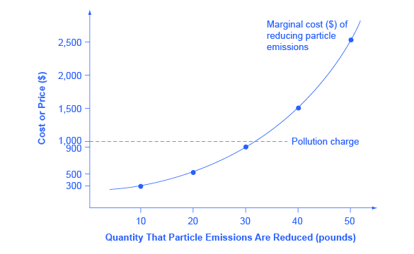
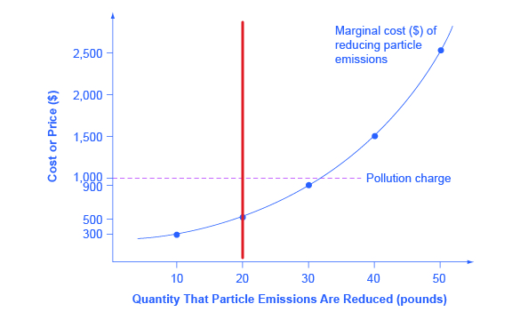

---
output:
  xaringan::moon_reader:
    css: ["default", "extra.css"]
    lib_dir: libs
    seal: false
    nature:
      highlightStyle: github
      highlightLines: true
      countIncrementalSlides: false
      ratio: '16:9'
---

```{r, echo = FALSE, warning = FALSE, message = FALSE}
##xaringan::inf_mr()
## For offline work: https://bookdown.org/yihui/rmarkdown/some-tips.html#working-offline
## Images not appearing? Put images folder inside the libs folder as that is the main data directory

library(tidyverse)
library(readxl)
library(stargazer)
##library(kableExtra)
##library(modelr)

knitr::opts_chunk$set(echo = FALSE,
                      eval = TRUE,
                      error = FALSE,
                      message = FALSE,
                      warning = FALSE,
                      comment = NA)
```

background-image: url('libs/Images/background-forest_v3.png')
background-size: 105%
background-class: center
class: middle

.size45[**II. Evaluating Policy Design Options**]

<br>

.size50[

**Today's Agenda**

Approaches to Environmental Policy Design

- "Green" Tax Policies
]

<br>

.center[.size40[
  Justin Leinaweaver (Spring 2024)
]]

???

## Prep for Class
1. Publish discussion board for next class


---

background-image: url('libs/Images/background-forest_v3.png')
background-size: 100%
background-position: center
class: middle

.center[.size50[**Assignment 4 (Due Apr 28th)**

Getting Involved in our Community]]

.size40[
1. Find (or create) an opportunity to get actively involved in your issue locally, and

2. Write a report describing what you did, who you worked with and what you learned from the experience.
]

???

Reminder, you have until the end of April to complete your community involvement piece of the project.

- Don't let this fall off your radar

- Spring Break is coming up and that's often a great time to get involved outside!

<br>

**IMPORTANT**
1. I must sign off on your activity plan BEFORE you do it,

2. Your report must include evidence for all claims (e.g. documentation of the activity through photos, etc.), and

### Questions on this assignment?


---

background-image: url('libs/Images/background-forest_v3.png')
background-size: 100%
background-position: center
class: middle

# Section 2: Evaluating Policy Design Options
.size55[
1. .textblue[**Command & Control Regulations**]

2. "Green" Taxes

3. "Green" Subsidies

4. Adaptive Governance
]

???

Last week we explored command and control regulations.

### In super broad strokes, what does it mean to use a regulatory approach for addressing an environmental problem?

- (Create rules that alter the behavior of specific actors)
    - Firms/Consumers must use technology X, OR
    - Firms/Consumers cannot emit more than a set limit of pollution Y

+ (In econ speak, per textbook: Using rules to force polluters to adapt their production functions to the social costs of pollution)

<br>

**SLIDE**: Let's make sure we're all clear on the supply and demand diagram from last week


---

```{r, fig.retina=3, fig.asp=0.618, fig.align='center', out.width='95%', fig.width=6, cache=TRUE}
## Let's build supply and demand curves
p1 <- tibble(
  Price = 1:100,
  Quantity = 100:1
) |>
  ggplot(aes(x = Quantity, y = Price)) +
  geom_point(color = "white") +
  theme_classic() +
  coord_cartesian(xlim = c(0, 125)) +
  scale_x_continuous(breaks = seq(0, 100, 20)) +
  labs(x = "Quantity Produced", y = "Price per Widget") +
  annotate("segment", x = 0, xend = 100, y = 100, yend = 0, color = "red", size = 1.3) +
  annotate("text", x = 115, y = 5, label = "Demand", size = 5, color = "red", hjust = .5)

p1 +
  annotate("text", x = 115, y = 72, label = "Supply\n(MC)", size = 5, color = "blue", hjust = .5) +
  annotate("segment", x = 0, xend = 100, y = 15, yend = 65, color = "blue", size = 1.3) #+
  #annotate("segment", x = 56.5, xend = 56.5, y = 43, yend = 0, linetype = "dashed") +
  #annotate("segment", x = 0, xend = 56.5, y = 43, yend = 43, linetype = "dashed")
```

???

### What does the supply line represent and why is it increasing?
- (Marginal costs e.g. amount it costs to produce one more widget)
- (Assumes marginal costs increase with quantity of product produced, e.g. sourcing more materials for your factory or building new equipment to extract oil from harder to work places, etc.)

<br>

### What does the demand line represent and why is it decreasing?
- (Amount of widgets you can sell at a given price point)
- (Only so many people want the product at all and (almost) everyone's desire for it will be sensitive to the price you charge for it.)

<br>

### As the owner of the factory how many widgets should I make?

- (**SLIDE**)


---

```{r, fig.retina=3, fig.asp=0.618, fig.align='center', out.width='95%', fig.width=6, cache=TRUE}
## Let's build supply and demand curves
p1 +
  annotate("text", x = 115, y = 72, label = "Supply\n(MC)", size = 5, color = "blue", hjust = .5) +
  annotate("segment", x = 0, xend = 100, y = 15, yend = 65, color = "blue", size = 1.3) +
  annotate("segment", x = 56.5, xend = 56.5, y = 43, yend = 0, linetype = "dashed") +
  annotate("segment", x = 0, xend = 56.5, y = 43, yend = 43, linetype = "dashed")
```

???

Equilibrium point where the lines cross maximizes your profit given the costs of production.

- Producer surplus: The profit earned by the factory is the area between the dashed horizontal line and the blue line

- Consumer surplus: Area above dashed horizontal line up to red line is the amount of money consumers get to keep

<br>

### And how do we change the visualization if we add a C&C regulation requiring a specific technology or an absolute emission limit?

- (**SLIDE**)
  
  
---

```{r, fig.retina=3, fig.asp=0.618, fig.align='center', out.width='95%', fig.width=6, cache=TRUE}
## Let's build supply and demand curves
p1 +
  annotate("text", x = 115, y = 90, label = "Supply\n(MC)", size = 5, color = "blue", hjust = .5) +
  annotate("segment", x = 0, xend = 100, y = 35, yend = 85, color = "blue", size = 1.3) +
  annotate("segment", x = 43, xend = 43, y = 56, yend = 0, linetype = "dashed") +
  annotate("segment", x = 0, xend = 43, y = 56, yend = 56, linetype = "dashed") +
  annotate("segment", x = 0, xend = 100, y = 15, yend = 65, color = "grey", size = 1.3)
```

???

Rules that mandate emissions limits or the specific techology a factory has to use increases the marginal costs of production.

- This shifts the equilibrium point to the left

- The factory will produce fewer widgets and charge a higher price for them

- The net effect on the economy is complicated and can either be positive or negative depending on the design of the regulation.

<br>

### Any questions on the basics of the approach?


---

background-image: url('libs/Images/10-1-cartoon_measuring_smoke_stack.jpg')
background-size: 100%
background-position: center
class: center

???

Last week we explored this approach to environmental problem-solving using case studies, opinion pieces and reviews of empirical research.

### Bottom line, what do we, as policy-designers, need to keep in mind if we chose to address an environmental problem with command and control type regulations?

*Let them make this list as it is their assignment!*

- Piggy-back on established institutions for support in oversight and enforcement

- Useful especially if the problem is particularly dangerous or time horizons are VERY long

- Be careful of economy wide effects (overall effect on the economy is hard to predict, could grow or shrink depending on many other factors involved)
    - Must be paired with assistance for impacted workers?

- Be careful of political interests in the design (lobbying and/or protection of well connected industries)

- Regulations have got to keep up with changes in the market and technology (no drift!)

- Depends on balance of "dirty" vs "clean" industries in the target economy

- C&C most realistic if changes are small OR industries carefully targeted?

- Enforcement at the individual level is hard if community doesn't buy-in

<br>

### In terms of your projects, is anybody leaning towards C&C so far? OR has anybody ruled it out completely?


---

background-image: url('libs/Images/11-1-Green_taxation_v2.png')
background-size: 100%
background-position: center
class: top, center

.size65[**Policy Design: "Green" Taxes**]

???

This week we shift to your next policy design option: "Green" taxation policies ([12.3 Market-Oriented Environmental Tools (OpenStax 2016)](https://opentextbc.ca/principlesofeconomics/chapter/12-3-market-oriented-environmental-tools/))

<br>

Let's talk textbook treatment of the approach first.

- Note that the textbook chapter also explores marketable permits and property rights as other ways to use the market to address pollution.

- We'll focus this week just on the tax piece: "Pollution Charges"

<br>

### In super broad strokes, what does it mean to use a tax to address an environmental problem?

- (Apply a charge to some behavior (emitting pollution) forcing the polluter to consider cutting back on those emissions)

- (Instead of mandating a specific technology or emissions limit with a rule, use a tax to make some of the costs of the pollution you create part of your production function)  

<br>

Like last week, let's walk through some of the key elements of this mechanism before we dig into the political arguments about it.


---

```{r, fig.retina=3, fig.asp=0.618, fig.align='center', out.width='95%', fig.width=6, cache=TRUE}
## The Basics of Carbon Pricing
## Set up the plot, clarify the axes
p3 <- tibble(
  Abatement_cost = 0:100,
  Pollution = 0:100
) |>
  ggplot(aes(x = Pollution, y = Abatement_cost)) +
  geom_point(color = "white") +
  theme_classic() +
  #coord_cartesian(xlim = c(0, 125)) +
  #scale_x_continuous(breaks = seq(0, 100, 25), limits = c(0,100)) +
  scale_y_continuous(breaks = seq(0, 100, 25), labels = str_c("$", seq(0, 100, 25))) +
  labs(x = "Quantity of Pollution", y = "Price per unit of Pollution") 

p3 +
  ggtitle("The Basics of Taxing Pollution: A Single Firm")
```

???

Our first big change from last week is that designing pollution taxes means focusing primarily on cutting pollution, not impacting widget production numbers.

- In other words, we don't actually care how many widgets a factory makes.

- Our interest is in how much pollution is produced by an entity and how much it would cost to cut that amount.

<br>

This visualization represents the trade-off for a single firm (e.g. widget factory)

- The x-axis: The amount of pollution emitted per unit of time
    - For simplicity, we assume pollution can range from 0 to 100 tons per day
    - Works for any units (e.g. gigatons per year)

- The y-axis: The price per unit of pollution
    - We can think of this as tons or any other unit
    
<br>

**SLIDE**: Let's start with a baseline of zero regulations or taxes on pollution.


---

```{r, fig.retina=3, fig.asp=0.618, fig.align='center', out.width='95%', fig.width=6, cache=FALSE}
## Pollution with zero tax
p3 +
  #annotate("segment", x = 0, xend = 100, y = 0, yend = 0, linetype = "dashed") +
  annotate("point", x = 100, y = 0, size = 5, color = "blue") +
  ggtitle("The Basics of Taxing Pollution: A Single Firm")
```

???

Here we see the pollution produced by a single factory facing no regulations or taxes of any kind.

- In this hypothetical our factory is producing 100 tons of pollution, and

- ...is paying nothing for those emissions.


---

class: middle

.pull-left[
```{r, fig.retina=3, fig.align='center', out.width='100%', fig.asp=0.85, fig.width=5.5}
## Let's build supply and demand curves
p1 +
  annotate("text", x = 115, y = 72, label = "Supply\n(MC)", size = 5, color = "blue", hjust = .5) +
  annotate("segment", x = 0, xend = 100, y = 15, yend = 65, color = "blue", size = 1.3) +
  annotate("segment", x = 56.5, xend = 56.5, y = 43, yend = 0, linetype = "dashed") +
  annotate("segment", x = 0, xend = 56.5, y = 43, yend = 43, linetype = "dashed") +
  annotate("point", x = 56.5, y = 43, size = 5, color = "blue")
```
]

.pull-right[
```{r, fig.retina=3, fig.align='center', out.width='100%', fig.asp=0.85, fig.width=5.5}
## Pollution with zero tax
p3 +
  #annotate("segment", x = 0, xend = 100, y = 0, yend = 0, linetype = "dashed") +
  annotate("point", x = 100, y = 0, size = 5, color = "blue") +
  ggtitle("The Basics of Taxing Pollution: A Single Firm")
```
]

???

Just for symmetry, we can connect this back to our supply and demand curves.

- The blue dot on each plot represents the current baseline for the factory.

<br>

In the production function on the left the owner produces at the equilibrium between supply and demand
- Completely ignores the social costs of pollution.

- In the pollution plot on the right no emission cuts have been required yet.

### Make sense?

<br>

**SLIDE**: Ok, set aside the supply and demand curves and let's zoom in on the pollution production.


---

```{r, fig.retina=3, fig.asp=0.618, fig.align='center', out.width='95%', fig.width=6, cache=TRUE}
## Add marginal cost of abatement
p3 +
  annotate("segment", x = 0, xend = 100, y = 100, yend = 0, color = "blue", size = 1.3) +
  annotate("text", x = 87, y = 30, label = "Marginal cost\nof abatement") +
  ggtitle("The Basics of Taxing Pollution: A Single Firm")
```

???

This blue line represents the marginal cost of abatement.

### Anybody tell us what this means? How to read this line?

- (What it would cost for the factory to reduce each unit of pollution)
    - e.g. new technology, better processes, swapping components, etc.
    
- Moving along the curve from right to left represents the cost of eliminating one more ton of emissions
    - Cost is super low at first, but becomes higher and higher as emissions approach zero.

<br>
    
**SLIDE**: For example...


---

```{r, fig.retina=3, fig.asp=0.618, fig.align='center', out.width='95%', fig.width=6, cache=TRUE}
## Add marginal cost of abatement
p3 +
  annotate("segment", x = 0, xend = 100, y = 100, yend = 0, color = "blue", size = 1.3) +
  annotate("text", x = 87, y = 30, label = "Marginal cost\nof abatement") +
  ggtitle("The Basics of Taxing Pollution: A Single Firm") +
  annotate("segment", x = 75, xend = 75, y = 0, yend = 25, linetype = "dashed") +
  annotate("segment", x = 0, xend = 75, y = 25, yend = 25, linetype = "dashed")
```

???

Here we see that for a price of $25 per unit of pollution the factory could cut its emissions by 25 tons (from 100 down to 75)

### Make sense?

<br>

### So, in the case of our factory producing 100 units of pollution what tax would we need to implement to eliminate 75% of the pollution?

(**SLIDE**)


---

```{r, fig.retina=3, fig.asp=0.618, fig.align='center', out.width='95%', fig.width=6, cache=TRUE}
## Add marginal cost of abatement
p3 +
  annotate("segment", x = 0, xend = 100, y = 100, yend = 0, color = "blue", size = 1.3) +
  annotate("text", x = 87, y = 30, label = "Marginal cost\nof abatement") +
  ggtitle("The Basics of Taxing Pollution: A Single Firm") +
  annotate("segment", x = 25, xend = 25, y = 0, yend = 75, linetype = "dashed") +
  annotate("segment", x = 0, xend = 25, y = 75, yend = 75, linetype = "dashed")
```

???

For a price of $75 per unit this factory could eliminate 75% of the pollution from its production processes!

### Make sense?


---

```{r, fig.retina=3, fig.asp=0.618, fig.align='center', out.width='95%', fig.width=6, cache=TRUE}
## Add marginal external cost
p3 +
  annotate("segment", x = 0, xend = 100, y = 100, yend = 0, color = "blue", size = 1.3) +
  annotate("text", x = 87, y = 30, label = "Marginal cost\nof abatement") +
  annotate("segment", x = 0, xend = 100, y = 0, yend = 100, color = "red", size = 1.3) +
  annotate("text", x = 82, y = 95, label = "Marginal external\n cost") +
  ggtitle("The Basics of Taxing Pollution: A Single Firm")
```

???

This red line represents the marginal external cost of the pollution.

### Can anybody tell us what this means? How to read this line?
- (This is the social cost of the externalities produced by the factory.)
    - e.g. How much damage is done by the pollution?

- (The cost is assumed to rise as emissions increase, reflecting the notion that a tiny bit of pollution is hardly noticeable, but that the damage from each additional ton emitted increases as pollution increases, reaching $100 per ton when the quantity reaches 100 tons.)

<br>

**SLIDE**: To help us understand...


---

```{r, fig.retina=3, fig.asp=0.618, fig.align='center', out.width='95%', fig.width=6, cache=TRUE}
## Add marginal external cost
p3 +
  annotate("segment", x = 0, xend = 100, y = 0, yend = 100, color = "red", size = 1.3) +
  annotate("text", x = 82, y = 95, label = "Marginal external\n cost") +
  ggtitle("The Basics of Taxing Pollution: A Single Firm")
```

???

We can hide the abatement line for a moment.

- This line represents the harms pollution does to society.


---

```{r, fig.retina=3, fig.asp=0.618, fig.align='center', out.width='95%', fig.width=6, cache=TRUE}
## Add marginal external cost
p3 +
  annotate("segment", x = 0, xend = 100, y = 0, yend = 100, color = "red", size = 1.3) +
  annotate("text", x = 82, y = 95, label = "Marginal external\n cost") +
  ggtitle("The Basics of Taxing Pollution: A Single Firm") +
  annotate("segment", x = 75, xend = 75, y = 0, yend = 75, linetype = "dashed") +
  annotate("segment", x = 0, xend = 75, y = 75, yend = 75, linetype = "dashed") +
  annotate("point", x = 75, y = 75, size = 5)
```

???

Here we see that when the factory emits 75 units of pollution it imposes $75 worth of harm on society.

### Make sense?


---

```{r, fig.retina=3, fig.asp=0.618, fig.align='center', out.width='95%', fig.width=6, cache=TRUE}
## Add marginal external cost
p3 +
  annotate("segment", x = 0, xend = 100, y = 100, yend = 0, color = "blue", size = 1.3) +
  annotate("text", x = 87, y = 30, label = "Marginal cost\nof abatement") +
  annotate("segment", x = 0, xend = 100, y = 0, yend = 100, color = "red", size = 1.3) +
  annotate("text", x = 82, y = 95, label = "Marginal external\n cost") +
  ggtitle("The Basics of Taxing Pollution: A Single Firm")
```

???

So, these two lines represent the pollution problem from both the factory and societies' perspectives.

<br>

### Ok policy designers, what is the "right" pollution tax rate for this hypothetical?

<br>

### Ok, but WHY is the intersection of the two lines the "right" answer?

*Force this discussion*

<br>

**SLIDE**: Let's explain and reinforce the logic of the equilibrium point.


---

```{r, fig.retina=3, fig.asp=0.618, fig.align='center', out.width='95%', fig.width=6, cache=TRUE}
## Hypothetical $25 tax
label1 <- "MC[A]"

p3 +
  annotate("segment", x = 0, xend = 100, y = 100, yend = 0, color = "blue", size = 1.3) +
  annotate("text", x = 92, y = 1, label = label1, parse=TRUE) +
  annotate("segment", x = 0, xend = 100, y = 0, yend = 100, color = "red", size = 1.3) +
  annotate("text", x = 82, y = 95, label = "Marginal external\n cost") +
  #annotate("segment", x = 75, xend = 75, y = 0, yend = 75, linetype = "dashed") +
  annotate("segment", x = 0, xend = 100, y = 25, yend = 25, linetype = "dashed") +
  ggtitle("Setting our Pollution Tax: $25")
```

???

### Ok, per this visualization, what is the effect of a $25 pollution tax on the factory?

- (**SLIDE**)


---

```{r, fig.retina=3, fig.asp=0.618, fig.align='center', out.width='95%', fig.width=6, cache=TRUE}
## Hypothetical $25 tax
p3 +
  annotate("segment", x = 0, xend = 100, y = 100, yend = 0, color = "blue", size = 1.3) +
  annotate("text", x = 92, y = 1, label = label1, parse=TRUE) +
  annotate("segment", x = 0, xend = 100, y = 0, yend = 100, color = "red", size = 1.3) +
  annotate("text", x = 82, y = 95, label = "Marginal external\n cost") +
  annotate("segment", x = 75, xend = 75, y = 0, yend = 25, linetype = "dashed") +
  annotate("segment", x = 0, xend = 75, y = 25, yend = 25, linetype = "dashed", color = "blue") +
  ggtitle("Setting our Pollution Tax: $25") +
  #annotate("point", x = 75, y = 75, size = 5) +
  annotate("point", x = 75, y = 25, size = 5, color = "blue")
```

???

The tax determines the factory's pollution.

- So, with a $25 pollution tax the factory will cut 25 units of pollution.

<br>

### Now, how do we translate the $25 pollution tax in terms of how it reduces the harms done to society?

- (**SLIDE**)


---

```{r, fig.retina=3, fig.asp=0.618, fig.align='center', out.width='95%', fig.width=6, cache=TRUE}
## Hypothetical $25 tax
p3 +
  annotate("segment", x = 0, xend = 100, y = 100, yend = 0, color = "blue", size = 1.3) +
  annotate("text", x = 92, y = 1, label = label1, parse=TRUE) +
  annotate("segment", x = 0, xend = 100, y = 0, yend = 100, color = "red", size = 1.3) +
  annotate("text", x = 82, y = 95, label = "Marginal external\n cost") +
  annotate("segment", x = 75, xend = 75, y = 0, yend = 75, linetype = "dashed") +
  annotate("segment", x = 0, xend = 75, y = 25, yend = 25, linetype = "dashed", color = "blue") +
  annotate("segment", x = 0, xend = 75, y = 75, yend = 75, linetype = "dashed", color = "red") +
  ggtitle("Setting our Pollution Tax: $25") +
  annotate("point", x = 75, y = 75, size = 5, color = "red") +
  annotate("point", x = 75, y = 25, size = 5, color = "blue")
```

???

The factory's pollution production determines the cost to society.

- Here we see a $25 tax leading to a cut of 25 units of pollution.

So, when thinking through the logic of a pollution tax you start with how the tax changes production and then how that production impacts society.

### Make sense?

<br>

### Now, analyze this $25 pollution tax for me. Is this the "right" policy design for society? Why or why not?

This set-up encourages us to think about how every widget the factory produces is actually paid for BOTH by society AND by the factory!

- In order to make a profit selling widgets the factory is paying $25 (the tax) and society is paying $75 (harms from the pollution)!

- Therefore, each $1 of profit for the factory at this production level is accompanied by $3 of harm to society!

### Does this make sense?

<br>

(**SLIDE**: Hypothetical $75 tax)


---

```{r, fig.retina=3, fig.asp=0.618, fig.align='center', out.width='95%', fig.width=6, cache=TRUE}
## Set a tax at the equilibrium, $50 per unit
p3 +
  annotate("segment", x = 0, xend = 100, y = 100, yend = 0, color = "blue", size = 1.3) +
  annotate("text", x = 87, y = 30, label = "Marginal cost\nof abatement") +
  annotate("segment", x = 0, xend = 100, y = 0, yend = 100, color = "red", size = 1.3) +
  annotate("text", x = 82, y = 95, label = "Marginal external\n cost") +
  annotate("segment", x = 25, xend = 25, y = 0, yend = 75, linetype = "dashed") +
  annotate("segment", x = 0, xend = 25, y = 75, yend = 75, linetype = "dashed", color = "blue") +
  annotate("segment", x = 0, xend = 25, y = 25, yend = 25, linetype = "dashed", color = "red") +
  ggtitle("Setting our Pollution Tax: $75") +
  annotate("point", x = 25, y = 25, size = 5, color = "red") +
  annotate("point", x = 25, y = 75, size = 5, color = "blue")
```

???

Alright, let's fix this!

- The $25 pollution tax leaves society accepting 3x the harms of the benefits being created.

<br>

So, we impose a $75 per unit tax on pollution and cut 75 units of pollution!

### Is this the "right" policy design for this society? Why or why not?

- We've reversed the imbalance, but haven't necessarily made things any better!

- Remember, the production of the factory is needed for the local economy to function!
    - The factory means jobs, growth, tax dollars for public goods, etc.

- In terms of economic efficiency, the factory is now spending WAY more on harm reduction than society will benefit.
    - At this level of pollution tax the factory is paying $3 in costs to provide society only $1 in benefit!

### Does this make sense?

<br>

(**SLIDE**: Pigovian tax)


---

```{r, fig.retina=3, fig.asp=0.618, fig.align='center', out.width='95%', fig.width=6, cache=TRUE}
## Set a tax at the equilibrium, $50 per unit
p3 +
  annotate("segment", x = 0, xend = 100, y = 100, yend = 0, color = "blue", size = 1.3) +
  annotate("text", x = 87, y = 30, label = "Marginal cost\nof abatement") +
  annotate("segment", x = 0, xend = 100, y = 0, yend = 100, color = "red", size = 1.3) +
  annotate("text", x = 82, y = 95, label = "Marginal external\n cost") +
  annotate("segment", x = 50, xend = 50, y = 0, yend = 50, linetype = "dashed") +
  annotate("segment", x = 0, xend = 50, y = 50, yend = 50, linetype = "dashed") +
  ggtitle("The Basics of Taxing Pollution: Pigou's Solution")
```

???

### So, why is the "equilibrium" here the "right" design?

British economist Arthur Pigou writing at the turn of the last century (19th to 20th) proposed a tax focused on the equilibrium point between these two curves.

- In other words, set the tax rate at the intersection of these two lines

- Reduce the externality to the point where the marginal costs to society equal the marginal costs to the factory.

- Anywhere to the right of that point, the harms to society outweigh the benefits to the factory.

- Anywhere to the left of the intersection, it would cost more to eliminate a ton of emissions than the harm that additional ton would cause.

<br>

Pigou's aim was achieving an efficient economic outcome.

- In economic terms this typically means maximizing the amount of utility we can produce from a set number of resources.

- Sounds like he chose the market as his preferred source of wisdom, no?

<br>

**SLIDE**: Let's talk for a sec about the "goodness" of economic efficiency as our guiding principle in policy design.


---

background-image: url('libs/Images/08-1-Life-Worth-Balance.webp')
background-size: 100%
background-position: center

???

### Do we have any concerns with Pigou's logic here?

#### - Alternative wisdoms worth considering?

#### - Who benefits from this framing and who suffers?

<br>

1. Measuring the components, societal harms and economic benefits, is HARD and CONTESTED
    - What is the value of a human life?
    - What is the value of enabling someone to get a job?

2. Is $1 of societal harm always worth $1 of economic benefit?
    - e.g. is the value of one more beanie baby equal to five more childhood asthma cases?
    
3. What if the marginal external cost curve is not linear?
    - This curve assumes an unending Earth, but...
    - What about tipping points and irreversibilities?
    
4. What about inequality in the distribution of the harms?
    - Where is this factory located? 
    - WHO is doing the suffering?
    
<br>

**SLIDE**: Let's talk about the benefits of a tax-based approach to environmental pollution.

    


---

background-image: url('libs/Images/11-1-OET-Fig1.jpg')
background-size: 90%
background-position: center

???

This figure helps us understand the benefits of using "green" taxes to reduce pollution.
- Importantly, the use of a tax changes individual behavior very differently than a regulation.
    - Let's unpack what that means.

<br>

The textbook uses this Figure to illustrate the logic of a "green" or Pigovian tax.

### Which of the curves we've been studying so far does this represent?
- (**SLIDE**)


---

background-image: url('libs/Images/background-forest_v3.png')
background-size: 100%
background-position: center
class: middle

.pull-left[
```{r, fig.retina=3, fig.asp=0.9, fig.align='center', out.width='100%', fig.width=5, cache=TRUE}
## Add marginal external cost
p3 +
  annotate("segment", x = 0, xend = 100, y = 100, yend = 0, color = "blue", size = 1.3) +
  annotate("text", x = 87, y = 30, label = "Marginal cost\nof abatement") +
  annotate("segment", x = 0, xend = 100, y = 0, yend = 100, color = "red", size = 1.3) +
  annotate("text", x = 82, y = 95, label = "Marginal external\n cost") +
  ggtitle("The Basics of Taxing Pollution: A Single Firm")
```
]

.pull-right[

<br>

<br>

```{r, echo = FALSE, fig.align = 'center', out.width = '100%'}

```
]

???

This represents a more realistic version of the marginal cost of abatement (blue line).

### Why is a curved version of the line "probably more realistic"?

- (Probably more accurate to assume that abatement costs at the low end are similar and at the very high end become astronomical)
    - Might not be actually possible to eliminate all, or even most, of the pollution.
    
<br>
    
**SLIDE**: Let's use this figure to illustrate the difference between the effects of a pollution tax and a C&C regulation to cut emissions?


---

background-image: url('libs/Images/background-forest_v3.png')
background-size: 100%
background-position: center
class: middle

.pull-left[
```{r, fig.retina=3, fig.asp=0.9, fig.align='center', out.width='100%', fig.width=5, cache=TRUE}
## Add marginal external cost
p3 +
  annotate("segment", x = 0, xend = 100, y = 100, yend = 0, color = "blue", size = 1.3) +
  annotate("text", x = 15, y = 5, label = "MC[E]", parse = TRUE) +
  annotate("segment", x = 0, xend = 100, y = 0, yend = 100, color = "red", size = 1.3) +
  annotate("text", x = 15, y = 95, label = "MC[A]", parse = TRUE) +
  ggtitle("The Basics of Taxing Pollution: A Single Firm") +
  annotate("segment", linetype = "dashed", color = "red", linewidth = 1.3, x = 80, xend = 80, y = 0, yend = 100)
```
]

.pull-right[

<br>

<br>

```{r, echo = FALSE, fig.align = 'center', out.width = '100%'}

```
]

???

*MC_A - Abatement Cost*

*MC_E - External or Societal Cost*

<br>

In the presence of a strict regulation capping emissions a hard vertical line is drawn somewhere on these plots.

- Here we see a hard cap implemented as a regulation that requires a cut of 20 pounds of emissions.

<br>

### So, what happens to our factory and our community after this cap is imposed?
- (Yay! Pollution is reduced by 20 units!)

### And why is this a sub-optimal outcome according to Pigou?
1. Factory doing much more harm to society than it generates in benefits, AND

2. This is almost certainly as good as it is going to get!
    - The business is forced to comply and there's no benefit in pushing emissions below this threshold.
    - In other words, there is no incentive for the factory to "do more."

In many instances, C&C regulations tend to help society achieve a specific goal but often that represents the limits of what we will accomplish with it.

<br>

### Does everybody understand why the factory is likely to stop its pollution cutting work at this point and not lower?

### If you are the factory, why not keep going to make yourself even more efficient?

- Investments like that will likely pay off in the long-run, but in the meantime they mean you are redirecting your spending towards changing your production and not focusing on making stuff to sell!


---

background-image: url('libs/Images/11-1-OET-Fig1.jpg')
background-size: 90%
background-position: center

???

Instead of the C&C regulation, let's say we implement the tax at the level shown here. 

### How does each firm with this marginal cost of abatement respond to it?

<br>

Think of the tax as presenting you, the firm, with a series of decisions.

- For every widget you produce you decide if you'd rather pay the tax or invest in making your production more efficient (less polluting).

- **SLIDE**


---

background-image: url('libs/Images/07_1-Tax_vs_CandC_2.png')
background-size: 90%
background-position: center

???

### What would you choose to do to cut the first ten pounds of your pollution? Pay the $1000 tax or invest $300 to make your factory more efficient (cleaner)?

1. $300 is WAY cheaper than $1000, so definitely choose to save $700, PLUS

2. Invest in yourself! 
    - More efficient factory is more profitable (more stuff, less waste, same inputs)

<br>

### Does society care if we get less pollution because you made fewer widgets or improved the operations of your factory?

- Make the improvements!
    - Keep those jobs!
    - Keep making the stuff we want/need!
    
    
    
    
---

background-image: url('libs/Images/07_1-Tax_vs_CandC_3.png')
background-size: 90%
background-position: center

???

### Ok, what would you choose to do to cut the second ten pounds of your pollution? Pay the $1000 tax or invest $500 to make your factory more efficient (cleaner)?

### Everybody following this logic?

<br>

In sum,

- The tax provides the firm much more opportunity to tailor its response to its circumstances.

- Each unit of pollution incurs a $1k tax, HOWEVER, 

- It can eliminate the first ten pounds of pollution for $300 which is way cheaper than the tax, so it does that.

- It can eliminate the second ten pounds for $500 which is half the tax, so do that!

- It can eliminate the next ten pounds for $900 which is still cheaper, so do that too!

<br>

At this point our $1k tax has eliminated 30 lb of pollution through inspiring innovation and investment!

- Those innovations and investments can frequently help boost a local economy too!

- Investment can mean new jobs, better widgets and make a business more competitive in the marketplace.

<br>

### Now, what happens when we cross the line of the tax? What will a firm do if it wants production at say the 40lb level?

- (**SLIDE**)


---

```{r, fig.retina=3, fig.asp=0.618, fig.align='center', out.width='95%', fig.width=6, cache=TRUE}
## Let's build supply and demand curves
p1 +
  annotate("text", x = 115, y = 90, label = "Supply\n(MC)", size = 5, color = "blue", hjust = .5) +
  annotate("segment", x = 0, xend = 100, y = 35, yend = 85, color = "blue", size = 1.3) +
  annotate("segment", x = 43, xend = 43, y = 56, yend = 0, linetype = "dashed") +
  annotate("segment", x = 0, xend = 43, y = 56, yend = 56, linetype = "dashed") +
  annotate("segment", x = 0, xend = 100, y = 15, yend = 65, color = "grey", size = 1.3)
```

???

Even if a factory chooses to produce at this level and pay the tax for it we should still see less pollution.

- In a way similar to how C&C regulations work, the tax increases the marginal costs of production

- In other words, the factory is being forced to consider the societal harms as part of their production function and should, therefore, produce less pollution.

### Make sense?


---

background-image: url('libs/Images/11-1-OET-Fig1.jpg')
background-size: 90%
background-position: center

???

Bottom line:

1. Unlike with a C&C strict cap, the pollution tax gives the factory owner a decision to make.
    - Ether stop producing additional widgets to avoid the tax OR pay the tax and produce more widgets with pollution.

2. The tax also incentivizes businesses to invest in themselves to be more efficient.
    - Those incentives make cleaner production more profitable and so each factory may choose to go beyond the tax!
    
<br>

### Any questions on this figure or how a tax influences decision-making differently from C&C regs?

<br>

Let's take this out of the realm of industry and into our lives for a sec.

### Per the chapter, what kinds of pollution taxes do we face in our day-to-day lives?
- (Taxes on gasoline to reduce air pollution and pay for road upkeep)

- (Pay for garbage pickup, especially with a "pay as you throw" policy to incentivize less waste production at the household level)


---

```{r, fig.retina=3, fig.align='center', out.width='100%', fig.asp=0.618, cache=TRUE}
## Make a US map of gas taxes
library(sf)
library(maps)

## Input data (states should be lowercase for the shapefile)
d <- read_excel("07_1-Gas_Taxes_by_State2023.xlsx") |>
  mutate(
    state = tolower(State),
    gas_cat = case_when(
      gasolineTax < .23 ~ "Lowest 25%",
      gasolineTax < .29 ~ "Low-Middle 25%",
      gasolineTax < .35 ~ "Upper-Middle 25%",
      gasolineTax >= .35 ~ "Highest 25%",
    ),
    gas_cat = factor(gas_cat, levels = c("Lowest 25%", "Low-Middle 25%", "Upper-Middle 25%", "Highest 25%"))
  )

## Define US states shapefile object
states <- st_as_sf(map("state", plot = FALSE, fill = TRUE))

left_join(states, d, by = c("ID" = "state")) |>
  ggplot(aes(fill = gas_cat)) +
  geom_sf() +
  scale_fill_brewer(type = "seq", palette = 7, na.translate = F) +
  labs(title = "Gasoline Taxes (2023)", fill = "$ Per Gallon",
       caption = "Source: Federation of Tax Administrators (Jan 2023)") +
  theme_minimal() +
  coord_sf(datum = NA, crs = 5070)

# Extract missouri data
d_mo <- d |> 
  arrange(desc(gasolineTax)) |> 
  mutate(Rank = 1:50) |> 
  filter(State == "Missouri") |> 
  mutate(
    gasolineTax = str_c("$", gasolineTax),
    Rank = str_c(Rank, "th out of 50")
    )
```

???

[FEDERATION OF TAX ADMINISTRATORS -- JANUARY 2023 Current Rates Link](https://www.taxadmin.org/assets/docs/Research/Rates/mf.pdf)

`r summary(d$gasolineTax)`

<br>

Let's zoom in on the gas tax we pay when we fuel up our cars.

### What is the current gasoline tax in Missouri?
- Current: `r d_mo$gasolineTax`

- Rank: `r d_mo$Rank`

- Current law plans to increase by 2.5 cents per year until 2025 at 29.5 cents per gallon

<br>

### Any idea why we're so low on this tax nationally?


---

background-image: url('libs/Images/11-1-OET-Fig1.jpg')
background-size: 90%
background-position: center

???

### If Missouri's gas tax were meant to reduce emissions, per this figure, how good a job is it doing for each of you?

<br>

### Brainstorm: What are the individual characteristics that predict whether or not a gas tax would cause a person to use less gasoline as opposed to just paying the tax and keeping on the road?

*ON BOARD*

- Price of the tax itself
- Access to public transit
- Quality of public transit
- Price of public transit
- Price of hybrid or electric vehicles
- Access to charging stations for an electric vehicle
- Tax incentives to buy an electric vehicle
- ?

<br>

So, clearly, lots of factors go into your personal math and this means that different individuals have different personal pollution abatement curves!

**SLIDE**: These differences are what make the tax more efficient than regulations


---

```{r, fig.retina=3, fig.align='center', out.width='85%', fig.asp=0.7, fig.width=7}
## Niskanen examples in Fig 2a and 2b
## Firm 1 and Firm 2
p4_both <- p3 +
  annotate("segment", x = 0, xend = 100, y = 0, yend = 100, color = "red", size = 1.3) +
  annotate("text", x = 82, y = 95, label = "MC[E]", parse=TRUE) +
  geom_abline(intercept = 75, slope = -1, color = "skyblue1", size = 1.3) +
  geom_abline(intercept = 125, slope = -1, color = "skyblue3", size = 1.3) +
  annotate("text", x = 60, y = 5, label = "MC[A1]", parse=TRUE, color = "skyblue1") +
  annotate("text", x = 110, y = 5, label = "MC[A2]", parse=TRUE, color = "steelblue4") +
  ggtitle("Two Firms: 1 and 2")  +
  coord_cartesian(xlim = c(0, 125))

p4_both
```

???

[Carbon Pricing and Regulations Compared: An Economic Explainer by the Niskanen Center](https://www.niskanencenter.org/carbon-pricing-and-regulations-compared-an-economic-explainer/)

Here we see two factories, Firm 1 and Firm 2.

- Both firms have identical marginal external cost curves (e.g. their pollution impacts society in the same ways)

- BUT the firms have very different abatement curves.

- **Remember, our goal should be to get as big a pollution cuts as we can while minimizing harms to our economy!**


---

class: middle

.pull-left[
```{r, fig.retina=3, fig.align='center', out.width='100%', fig.asp=0.85, fig.width=5.5}
## Niskanen examples in Fig 2a and 2b
## Firm 1
p4a <- p3 +
  annotate("segment", x = 0, xend = 100, y = 0, yend = 100, color = "red", size = 1.3) +
  annotate("text", x = 82, y = 95, label = "MC[E]", parse=TRUE) +
  geom_abline(intercept = 75, slope = -1, color = "skyblue1", size = 1.3) +
  annotate("text", x = 90, y = 1, label = "MC[A1]", parse=TRUE, color = "skyblue3") +
  ggtitle("Firm 1")  +
  coord_cartesian(xlim = c(0, 125))

p4a
```
]

.pull-right[
```{r, fig.retina=3, fig.align='center', out.width='100%', fig.asp=0.85, fig.width=5.5}
p4b <- p3 +
  annotate("segment", x = 0, xend = 100, y = 0, yend = 100, color = "red", size = 1.3) +
  annotate("text", x = 110, y = 95, label = "MC[E]", parse=TRUE) +
  geom_abline(intercept = 125, slope = -1, color = "steelblue4", size = 1.3) +
  annotate("text", x = 115, y = 20, label = "MC[A1]", parse=TRUE, color = "steelblue4") +
  ggtitle("Firm 2") +
  coord_cartesian(xlim = c(0, 125))

p4b
```
]

???

Let's split these out so we can track the impacts of our policies for each of them.

### Still with me?


---

class: middle

.pull-left[
```{r, fig.retina=3, fig.align='center', out.width='100%', fig.asp=0.85, fig.width=5.5}
## Niskanen examples in Fig 2a and 2b
## Baseline emissions
## No regs and no taxes = 125 + 75 = 200 units of pollution
p4a +
  annotate("point", x = 75, y = 0, size = 5)
```
]

.pull-right[
```{r, fig.retina=3, fig.align='center', out.width='100%', fig.asp=0.85, fig.width=5.5}
p4b +
  annotate("point", x = 125, y = 0, size = 5)
```
]

.center[.size40[**Baseline**]]

.center[.size35[Emissions = 75 (Firm 1) + 125 (Firm 2) = 200]]

.center[.size35[Abatement = 0 (Firm 1) + 0 (Firm 2) = $0]]

???

In a world without regulations or taxes each firm produces as many widgets as it thinks it can sell profitably

- This means Firm 1 produces 75 units of pollution and Firm 2 produces 125 units.
    - Combined this is 200 units of pollution hitting society

- It also means that neither firm is paying any abatement costs to lower their pollution.

### Everybody understand these calculations?

<br>

Ok, now let's evaluate what happens when we implement a command and control style regulation.

- **SLIDE**


---

class: middle

.pull-left[
```{r, fig.retina=3, fig.align='center', out.width='100%', fig.asp=0.85, fig.width=5.5}
## Niskanen examples in Fig 2a and 2b
## C&C Option: Mandate all factories cut to 50 units
p4a +
  annotate("polygon", x = c(50, 75, 50), y = c(0, 0, 25.5), fill = "lightblue", alpha = .5) +
  annotate("point", x = 75, y = 0, size = 5, color = "steelblue3") +
  annotate("point", x = 50, y = 25.5, size = 5) +
  annotate("segment", x = 50, xend = 50, y = 0, yend = 25.5, linetype = "dashed")

## Area of right triangle (ab/2)
area_a <- round((25.5*25)/2, 0)
```
]

.pull-right[
```{r, fig.retina=3, fig.align='center', out.width='100%', fig.asp=0.85, fig.width=5.5}
p4b +
  annotate("polygon", x = c(50, 125, 50), y = c(0, 0, 74.5), fill = "lightblue", alpha = .5) +
  annotate("point", x = 125, y = 0, size = 5, color = "steelblue3") +
  annotate("point", x = 50, y = 74.5, size = 5) +
  annotate("segment", x = 50, xend = 50, y = 0, yend = 74.5, linetype = "dashed")

## Area of right triangle (ab/2)
area_b <- round((75*74.5)/2, 0)
```
]

.center[.size40[**Command and Control Regulation**]]

.center[.size35[Emissions = 50 (Firm 1) + 50 (Firm 2) = 100]]

.center[.size35[Abatement = `r area_a` (A) + `r area_b` (B) = $`r area_a+area_b`]]

???

Imagine a new regulation that puts a firm cap of 50 units of pollution per Firm.

- In other words, no firm can emit more than 50 lb of pollution.

<br>

Here we see the results of this regulation.

### What can you tell me from these plots?

1. This policy succeeds in cutting emissions in half
    - Remember, the baseline was 200 units of pollution total

2. The Firms collectively pay north of $3k in abatement costs
    - Money not spent in production, e.g. lost to our economy
    - The blue triangles represent the abatement costs (remember the area of a right triangle is ab/2)
    
3. The Firm with the harder production to clean up is forced to implement way more cuts.
    - Not captured in these figures but this likely means a big negative impact to the economy

<br>

### Make sense?


---

class: middle

.pull-left[
```{r, fig.retina=3, fig.align='center', out.width='100%', fig.asp=0.85, fig.width=5.5}
## Niskanen examples in Fig 2a and 2b
## C&C Option: Mandate all factories cut emissions in 1/2
## Here we've accomplished a cut of 100 units of pollution BUT not the most efficient way to do it!
p4a +
  annotate("polygon", x = c(37.5, 75, 37.5), y = c(0, 0, 37.5), fill = "lightblue", alpha = .5) +
  annotate("point", x = 75, y = 0, size = 5, color = "steelblue3") +
  annotate("point", x = 37.5, y = 37.5, size = 5) +
  annotate("segment", x = 37.5, xend = 37.5, y = 0, yend = 35, linetype = "dashed")

## Area of right triangle (ab/2)
area_a <- round((37.5*37.5)/2, 0)
```
]

.pull-right[
```{r, fig.retina=3, fig.align='center', out.width='100%', fig.asp=0.85, fig.width=5.5}
p4b +
  annotate("polygon", x = c(62.5, 125, 62.5), y = c(0, 0, 62.5), fill = "lightblue", alpha = .5) +
  annotate("point", x = 125, y = 0, size = 5, color = "steelblue3") +
  annotate("point", x = 62.5, y = 62.5, size = 5) +
  annotate("segment", x = 62.5, xend = 62.5, y = 0, yend = 62.5, linetype = "dashed")

## Area of right triangle (ab/2)
area_b <- round((62.5*62.5)/2, 0)
```
]

.center[.size40[**Command and Control Regulation 2 (Pigou!)**]]

.center[.size35[Emissions = 37.5 (Firm 1) + 62.5 (Firm 2) = 100]]

.center[.size35[Abatement = `r area_a` (A) + `r area_b` (B) = $`r area_a+area_b`]]

???

As an alternative, imagine an INCREDIBLY complicated regulation that aims to implement an absolute cut to EVERY individual firm's equilibrium point.

- This regulation is almost certainly IMPOSSIBLE to write, BUT...

<br>

### What's the effect of this "market perfect" regulation?

- This policy ALSO succeeds in cutting the emissions in half, and

- Abatement costs cut DRAMATICALLY!
    - 3,113 - 2,656 = $457!
    
### Is everybody clear on how this is "better" but likely impossible?

- Requires information from each Firm they may not have or be willing to share, and

- Requires concrete measures of societal harms we definitely don't have and everyone would argue about
    - What is the cost of 1 asthma case or 1 heart attack prevented?

<br>

**SLIDE**: Now, let's replace these hard and fast regulations with a pollution tax of $50 per unit.


---

class: middle

.pull-left[
```{r, fig.retina=3, fig.align='center', out.width='100%', fig.asp=0.85, fig.width=5.5}
## Niskanen examples in Fig 2a and 2b
## Green tax approach: $50 tax
p4a +
  annotate("polygon", x = c(24.5, 75, 24.5), y = c(0, 0, 50), fill = "lightblue", alpha = .5) +
  annotate("point", x = 75, y = 0, size = 5, color = "steelblue3") +
  annotate("segment", x = 0, xend = 100, y = 50, yend = 50, linetype = "dashed") +
  annotate("point", x = 24.5, y = 50, size = 5) +
  annotate("segment", x = 24.5, xend = 24.5, y = 0, yend = 50, linetype = "dashed")

## Area of right triangle (ab/2)
area2_a <- round((50*50.5)/2, 0)
```
]

.pull-right[
```{r, fig.retina=3, fig.align='center', out.width='100%', fig.asp=0.85, fig.width=5.5}
p4b +
  annotate("polygon", x = c(75.5, 125, 75.5), y = c(0, 0, 50), fill = "lightblue", alpha = .5) +
  annotate("point", x = 75.5, y = 50, size = 5) +
  annotate("segment", x = 0, xend = 125, y = 50, yend = 50, linetype = "dashed") +
  annotate("segment", x = 75.5, xend = 75.5, y = 0, yend = 50, linetype = "dashed")

## Area of right triangle (ab/2)
area2_b <- round((50*49.5)/2, 0)
```
]

.center[.size40[**"Green" Taxes**]]

.center[.size35[Emissions = 24.5 (Firm 1) + 75.5 (Firm 2) = 100]]

.center[.size35[Abatement = `r area2_a` (A) + `r area2_b` (B) = $`r area2_a+area2_b`]]

???

### Ok, what happened here?

The tax creates an incentive to innovate and get more efficient!

- This means that a well designed tax can get us to the same level of abatement as a firm cut, but at MUCH lower cost to the economy!

- We don't end up cutting to the equilibrium points but instead the tax finds the cheapest places to cut across all the firms!

Remember, cuts and abatement costs represent real pain to real people in our community.
- Pollution cuts are important but ideally we should achieve them at the lowest pain possible, right?

### Questions on this?

<br>

**SLIDE**: So, green taxes are more flexible, more efficient and... 


---

```{r, fig.retina=3, fig.asp=0.618, fig.align='center', out.width='95%', fig.width=6, cache=TRUE, eval=TRUE}
## Let's build supply and demand curves that move with innovation!
## Have to install transformr for lines moving
#install.packages("transformr")
library(gganimate)

d1 <- tibble(
  Quantity = 1:100,
  Supply1 = 42 + .5*Quantity,
  Supply2 = 12 + .5*Quantity,
  Demand = 100 - 1*Quantity
) |>
  pivot_longer(cols = Supply1:Supply2, names_to = "Scenario", values_to = "Value")

d1 |>
  ggplot(aes(x = Quantity)) +
  geom_line(aes(y = Demand), color = "red", linewidth = 1.2) +
  geom_line(aes(y = Value), color = "blue", linewidth = 1.2) +
  theme_classic() +
  coord_cartesian(xlim = c(0, 125)) +
  scale_x_continuous(breaks = seq(0, 100, 20)) +
  scale_y_continuous(breaks = seq(0, 100, 20), limits = c(0, 100)) +
  labs(x = "Quantity Produced", y = "Price per Widget",
       title = "Green Taxes: Innovation can lower the MC") +
  annotate("text", x = 115, y = 5, label = "Demand", size = 5, color = "red", hjust = .5) +
  annotate("text", x = 119, y = 85, label = "Marginal\nCost", size = 5, color = "blue", hjust = .5) +
  transition_states(Scenario, wrap=FALSE) +
  shadow_wake(wake_length = .5, colour = "grey")
```

???

Designing a tax means using the power of the market to reduce pollution.

- Markets, as all good capitalists believe, move MUCH faster and more efficiently to produce profits than top-down regulators possibly can.

- The key is that the tax makes finding a way to pollute less during production a profit-maximizing decision.

- If you make "being green" profitable then the market will take care of it for you.

<br>

Rather than mandating one type of technology or one allowable emission level the tax creates an incentive to constantly innovate.

- Any firm that can develop a process that produces widgets at a lower MC can enter the market and be successful.

<br>

Note, C&C regulations also create incentives like this but typically not in as dynamic a fashion.

### Questions on the basics from the textbook?

<br>

**SLIDE**: For today I gave you readings that aim to pitch you the pros and cons of "green" taxes, but I'd like to attack it this way first.


---

background-image: url('libs/Images/08-1-springfield_bike_trail.jpg')
background-size: 100%
background-position: center
class: top, center

.size50[.content-box-blue[**$2 Gas Tax vs No Gas Cars < 2 miles**]]

???

Let's go back to our personal choices and gas usage for a second.

### Which policy would you prefer to combat pollution levels in SGF: 1) A regulation that required absolutely everyone to ride public transit for any journey of less than 2 miles OR 2) a $2 per gallon gasoline tax? Why?

*DISCUSS*

#### - Which cuts pollution faster?

#### - Which provides greater flexibility?

#### - Which policy reinforces inequality more?

#### - Which policy is cheaper/easier to implement?

<br>

### Help me figure out a harder trade-off for you in this room. How high would our gas tax have to be to get YOU to opt out of driving more often?

<br>

Remaining time, let's talk about the other readings.


---

background-image: url('libs/Images/11-1-heritage.png')
background-size: 85%
background-position: center

???

Let's start with the opposition from the right.

### What are the key premises in the argument made by Loris and Williamson (2019) from the Heritage Foundation?

*ON BOARD*

+ (?)

<br>

### How convincing do you find this argument?


---

background-image: url('libs/Images/11-1-Energy_Justice_Network.png')
background-size: 95%
background-position: center

???

And now some opposition from the left!

### What are the key premises in the argument made by Ewall from the Energy Justice Network?

*ON BOARD*

+ (?)

<br>

### How convincing do you find this argument?


---

background-image: url('libs/Images/11-1-Green_taxation_v2.png')
background-size: 100%
background-position: center
class: top, center

.size65[**Policy Design: "Green" Taxes**]

???

### Having discussed those two arguments and thought about the gas tax some more, where do you end up on the gas tax vs C&C regulation debate?

### - Any early takeaways on how you would decide between these two design options?

*Force this discussion*

<br>

**SLIDE**: If time remains, discuss the competing national plans

**SLIDE**: Assignment for Thursday


---

background-image: url('libs/Images/11-1-carbon-tax-plans-compared.png')
background-size: 50%
background-position: left
class: middle, center, slideblue

.pull-right[
.size40[
The Energy Innovation and Carbon Dividend Act ([Link](https://energyinnovationact.org/))

<br>

The Baker Shultz Carbon Dividends Plan: Bipartisan Climate Roadmap ([Link](https://clcouncil.org/Bipartisan-Climate-Roadmap.pdf))
]]

???

Let's review some policy options for the US.

+ Lavelle 2019 ([Link](https://insideclimatenews.org/news/07032019/carbon-tax-proposals-compare-baker-shultz-exxon-conocophillips-ccl-congress/)) Reviews two competing carbon tax plans 

### If you had to pick one, which way do you lean and why?
+ Discuss

### Did anybody dislike both? Why?
+ Discuss


---

background-image: url('libs/Images/background-forest_v3.png')
background-size: 100%
background-position: center
class: middle

.size50[**Assignment for Thursday**]

.size45[
Submit to Canvas a real world example of .textblue[**this approach**] being used to .textblue[**successfully**] address an environmental problem .textblue[**similar to the one in your project**].
]

.size45[
.textblue[**Present as an argument**]: This case shows that addressing environmental problem X can be done successfully using "green" taxes.
]

???

Thursday we repeat our model from last week!

- Everybody submit evidence and an argument to Canvas for class on Thursday!

<br>

### Questions on the assignment?
