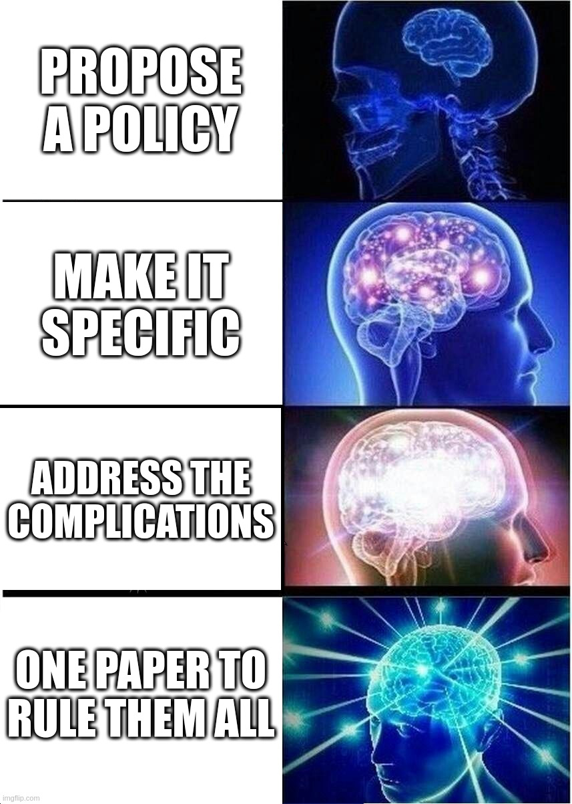
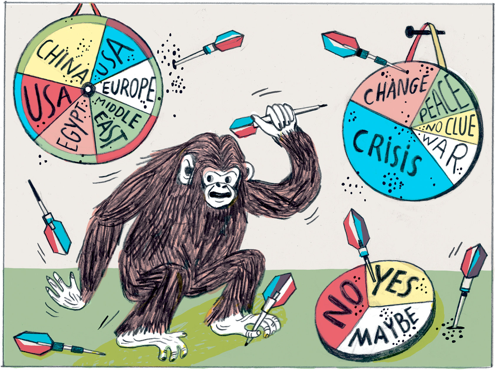

# Today's Agenda {background-image="Images/background-forest_v3.png" .center}

```{r}
library(tidyverse)
library(readxl)
```

<br>

::: {.r-fit-text}
**III. Designing an Environmental Policy**

- Complications 1: Risk Aversion / Acceptance
:::

<br>

::: r-stack
Justin Leinaweaver (Spring 2025)
:::

::: notes
Prep for Class

1. **Run slides off of laptop today so you can update the slides as we go**

2. Bring pennies to class for coin flipping (1 per person)

3. Prep Google Form to collect county fair responses AND email to distribute it
    - https://forms.gle/SbPGy5Mp73zN9wGd6
:::


## The Development of your Project {background-image="Images/background-forest_v3.png" .center}

<br>

:::: {.incremental}
::: {.r-fit-text}
1. Mapped the impact of a problem on our community

2. Applied that map to four policy design options

3. **Currently road testing your problem framing**
:::
::::

::: notes

Time to take stock of how far you've come in order to look ahead to your final paper.

<br>

**REVEAL**: Paper 1 asked you to map the contours of a problem in a real community

- In your first paper you selected a problem, established an empirical basis for it and identified key stakeholders involved in it

<br>

**REVEAL**: In your second paper you used your map to evaluate four policy design options for addressing the problem

- e.g. how does each policy meet the science of the problem and the needs of the stakeholders

<br>

**REVEAL**: Where we are now!

- Your community engagement project and fusion day poster will force you to take these ideas into the real world

- What does the problem really look like? AND

- How does the community react to your developing problem-framing?
:::


## Our Planned Policy-Making Process {background-image="Images/background-forest_v3.png" .center}

<br>

::: {.r-fit-text}

1) **Describe** the problem facing our community

2) **Investigate** the relevant stakeholders

3) **Frame** the problem

4) Propose a **policy**

:::

::: notes

Going back to our policy-making process from week 4

- Your work so far this semester has gotten you up to step 3!

<br>

Your final paper asks you to reflect on all of this in order to design a policy for addressing your chosen problem. 

- We have lots of time before this is due but I want to keep reminding you of how all of these earlier pieces help you build to this.
:::


## Assignment 5: Proposing a Policy {background-image="Images/background-forest_v3.png" .center}

<br>

Propose a policy to address your selected environmental problem that balances the interests of the relevant stakeholders against the constraints of established institutions and uncertainty.

::: notes

The Prompt

<br>

Let's talk about my expectations for this paper.

- Note that I've put these details on Canvas.
:::


## {background-image="Images/background-forest_v3.png" .center}

:::: {.columns}
::: {.column width="50%"}

<br>

<br>

<br>

**Final proposal should be a complete, stand-alone policy proposal**
:::

::: {.column width="50%"}
```{r, fig.align='center'}

```
:::
::::

::: notes

Do NOT assume the reader is familiar with your other assignments or has a deep understanding of the problem itself.

<br>

You should be able to give your paper to a person interested in your problem and they should be able to understand why solving the problem is complicated and be convinced that your policy is a good idea.

- This means you should DEFINITELY take the best bits from your earlier papers and add them to this one.

<br>

### Does that make sense?

<br>

SLIDE: Ok, let's get more specific
:::


## A convincing policy proposal: {background-image="Images/background-forest_v3.png" .center}

::: {.incremental}

- Advances your policy recommendation in **EVERY** paragraph,

- Includes a clear and compelling problem definition,

- Identifies and appeals to specific stakeholders,

- Considers the complications, and

- Offers guidance for measuring its effectiveness over time.
:::

::: notes

To be clear, we've covered the basics you'll need for the first three parts of this assignment.

- The material we cover for the next few weeks will give you tools for the last two: Complications and thinking about impacts over time

<br>

The bottom line here is I'm looking for you to connect your ideas in very concrete ways to the material we've been studying all semester.

- Problem framings matter,

- Generating stakeholder buy-in matters,

- Engaging substantively with the complications matters, and

- Planning for measuring success matters.

<br>

I am much more interested in **small, specific proposals** that are adapted to the real obstacles you face rather than broad and impossible reconstructions of society.

- My expectation is not that you've designed the ultimate plan that makes everyone happy.
    - That's not a thing that exists in the real world.

- My expectation is that you propose a policy that explicitly considers and tries to navigate past these complications.

<br>

**Any questions on the prompt or any of this advice?**
:::


## Complicating Factors to Consider When Designing Your Policy {background-image="Images/background-forest_v3.png" .center}

<br>

- Risk aversion (or risk acceptance)

- Temporal discounting and uncertainty

- Collective action problems and free-riding

- Inequality

- Greenwashing

::: notes

Over the next three weeks we'll explore these important topics.

- Each of these represents an additional layer on top of our baseline model of politics.

- Each of these represents an additional way of thinking about the obstacles you will face with your stakeholders.

<br>

Today we explore risk aversion and risk acceptance.

- Disputes over perceived risk tend to seriously complicate defining the problem and evaluating proposed solutions.

<br>

**SLIDE**: Of course, to talk about risk we have to first talk about probability.
:::


## {background-image="Images/background-forest_v3.png"}

{.absolute width="75%" right=0}

{.absolute width="30%" left=50 bottom=200}

::: notes

*Distribute pennies*

<br>

**Let’s start with this, what is the probability of getting heads when you flip a penny?**

- **How do you know?**

<br>

**Assuming a probability of 50%, how many heads would you expect if i asked you to flip your coin ten times?**

- (5 heads, right?)

<br>

Ok, let's test your intuition!

- Flip your penny ten times and record the number of heads.

<br>

*Gather results and update next slide*
:::


## {background-image="Images/background-forest_v3.png" .center}

```{r, fig.retina=3, fig.align='center', fig.asp=0.618, out.width = '95%', fig.width=5}
## Testing with fake data
# classsize <- 17
# d <- tibble(
#   heads = rbinom(n = classsize, size = 10, prob = .5)
#   #heads = c()
# )

## SP24 Results
#library(tidyverse)

d <- tibble(
 heads = c(4, 7, 3, 3, 4, 7, 4, 5, 9, 6, 4, 6, 5, 3, 5, 6, 7, 6),
 tails = 0
)

classsize = nrow(d)

## Make bar plot
p1 <- ggplot(data = d, aes(x = heads)) +
  geom_bar() +
  labs(y = "", x = "Number of Heads in Ten Flips") +
  scale_x_continuous(breaks = 0:10, limits = c(0,10)) +
  geom_hline(yintercept = seq(2,6,2), color = "white") +
  theme_minimal()

p1

## SP23 Results
# d <- tibble(
#  heads = c(6, 6, 4, 2, 5, 4, 4, 7, 5, 6, 7, 8, 1, 7, 6, 6, 5, 2),
#  tails = 0
# )

# SP22 Results
# d <- tibble(
#  heads = c(6, 4, 4, 8, 7, 2, 2, 7, 4, 4, 6, 4, 6, 4, 9, 8, 5, 6, 5),
#  tails = 0
# )
```

::: notes

**What do we learn from our experiment?**

- **Was our estimate of the probability of getting heads wrong or did we do our experiment wrong?**

<br>

Over just a few flips of the coin, many results are possible.

- However, as a class you just flipped the coin `r classsize*10` times.

- That is plenty times to start to zoom in on the actual probability of these pennies. 

<br>

SLIDE: If we average all of your flips together we get:
:::


## {background-image="Images/background-forest_v3.png" .center}

```{r, fig.align='center', fig.asp=0.618, fig.width=5}
## Make bar plot with mean
p1 +
  geom_vline(xintercept = mean(d$heads), color = "red", size = 1.2) +
  annotate("text", x = 8, y = 5, label = str_c("Mean: ", round(mean(d$heads), 1)), color = "red", size = 6)

```

::: notes

**Given this result, what is the probability of heads using our pennies?**

<br>

Ok, let's make sure we're clear.

**Based on this exercise, I want you to define the word probabiility for me.**

<br>

(The probability is the likelihood of an event over the long run.)

- If we flip these pennies many, many, many times we should get heads about this proportion of the time.

- In other words, the probability is what we expect to happen if we could repeat a choice or an action many, many times.
:::


## {background-image="Images/background-forest_v3.png" .center}

```{r, fig.align='center'}
knitr::include_graphics('Images/05-1-weather_forecast.png')
```

::: notes

Think about this as it relates to the weather.

<br>

**When the weather person tells you there is a 25% chance of rain today, what are they telling you?**

<br>

If you lived this day one hundred times, it would rain approximately 25 times.

- in other words, they ran a computer simulation of today's weather a bunch of times and on one quarter of their simulations it rained, and on 3/4's of them it didn't

<br>

**So, when the weather forecast is for a 50% chance of rain today, what does that actually mean?**

- (SLIDE)
:::


## {background-image="Images/05-1-confused_weatherman.jpg" .center}

::: notes

(It rained in half of the simulations)

- In other words, they have no idea what is going to happen today.

<br>

**What does this mean for us, a group of people who will only live today one time?**

- **Do I bring an umbrella to work on a 50% chance of rain day or not?**

+ ?

<br>

THIS is where your personal level of risk aversion or acceptance comes in!

- The probability tells you the tendency of an event, but not the certainty of it.

- YOU then have to decide the risks and rewards of acting as if that event will or won't happen.

<br>

### Don’t worry about the math, just tell me, does the intuition of a  probability make sense?

+ It is the likelihood of an event **over the long run**.
:::


## {background-image="Images/05-1-County_Fair.webp" .center}

::: notes
Now that you are all masters of probability, let’s dig into each of your risk profiles by gambling!

<br>

Imagine you are at the county fair with your best girl or guy and you come across a game called "Heads you win, Tails you lose."
:::


## Let's play a game! {background-image="Images/12_11-County_Fair_v2.png" .center}

<br>

::::: {.columns}
:::: {.column width="50%"}
::: {.r-fit-text}
Flip a fair coin ONE time

- Heads pays you **$5**

- Tails pays you **nothing**
:::
::::

:::: {.column width="50%"}

::::
:::::

::: notes

The game is simple: Heads you win, Tails you lose 

- Flip a fair coin, heads pays $5, tails you get nothing.

<br>

Everybody take a minute to think about this game.

- Now, write down the maximum amount of money you would pay to play this game.

- Don't say it out loud, just write down your answer!

<br>

**Everybody have their answer written down?**

<br>

Ok, rewind your imaginary date and let's replay the game!
:::


## Let's play a game! {background-image="Images/12_11-County_Fair_v2.png" .center}

<br>

::::: {.columns}
:::: {.column width="50%"}
::: {.r-fit-text}
Flip a fair coin ONE time

- Heads pays you **$100**

- Tails pays you **nothing**
:::
::::

:::: {.column width="50%"}

::::
:::::

::: notes

You and your date arrive at the fair and see this game where heads pays you $100!

- Take a minute to think about it and write down the maximum amount you would pay to play this game.

<br>

*Send out Email with Google Form link*

- Update following with new data
:::


## {background-image="Images/12_11-County_Fair_v2.png" .center}

```{r, fig.align='center', fig.asp=1, fig.width=7}
# Import the Data (Fake data SP23)
d <- read_csv("12-1-County Fair Game (Spring 2024).csv") |>
  select(name = `Name?`,
         choice5 = `Flip a fair coin: Heads pays you $5, tails you get nothing\nWhat is the maximum amount of money you would pay to play this game?`,
         choice100 = `Flip a fair coin: Heads pays you $100, tails you get nothing\nWhat is the maximum amount of money you would pay to play this game?`)

# Outputs
# bars of choice 5
d |>
  ggplot(aes(x = choice5, y = reorder(name, choice5))) +
  geom_col() +
  labs(x = "Maximum amount you would pay", y = "",
       title = "Version 1: Heads Pays $5") +
  theme_bw() +
  scale_x_continuous(labels = scales::dollar_format())
```

::: notes

Here are our results focused on the first version of the game.

### Explain to me your choices here.

<br>

**SLIDE**: Version 2

:::

## {background-image="Images/12_11-County_Fair_v2.png" .center}

```{r, fig.align='center', fig.asp=1, fig.width=7}
# bars of choice 100
d |>
  ggplot(aes(x = choice100, y = reorder(name, choice100))) +
  geom_col() +
  labs(x = "Maximum amount you would pay", y = "",
       title = "Version 2: Heads Pays $100") +
  theme_bw() +
  scale_x_continuous(labels = scales::dollar_format())
```

::: notes

Here are our results focused on the second version of the game.

### Explain to me your choices here.

<br>

**SLIDE**: Link the results!
:::


## {background-image="Images/12_11-County_Fair_v2.png" .center}

```{r, fig.align='center', fig.asp=.9, fig.width=7}
d |>
  mutate(
    percent_win5 = choice5/5,
    percent_win100 = choice100/100
  ) |>
  ggplot(aes(x = percent_win5, y = percent_win100)) +
  geom_abline(slope = 1, intercept = 0, linewidth = .1) +
  geom_point() +
  ggrepel::geom_text_repel(aes(label = name)) +
  theme_bw() +
  scale_x_continuous(labels = scales::percent_format(), limits = c(0,1)) +
  scale_y_continuous(labels = scales::percent_format(), limits = c(0,1)) +
  labs(x = "Version 1 (% of $5)", y = "Version 2 (% of $100)",
       title = "What are you willing to pay to play these games?")
#title = "How much variation in our risk profiles?"
```

::: notes

Here I've converted all of your maximums into a % of the possible winnings.

- So, if you would pay $2.50 for the $5 game then you would pay half the possible winnings to play (e.g. 50%)

<br>

Anybody on the 45 degree line represents someone equally willing to take on the risk regardless of the stakes

- **Why aren't all the observations on the diagonal line?**

- **Shouldn't your offer to play the $100 game be exactly 20 times your answer in the $5 game?**

<br>

Everyone has a different relationship to risk

- Some people are more willing to take on risk to win greater rewards and some people are not

- Not right or wrong, just different willingness to accept risk.

<br>

Your relationship to risk is sensitive to both the size of the risk AND the size of the reward!

- If you are above the diagonal line then you are someone who is more willing to take on risk when the stakes are high, e.g. you are risk acceptant

- If you are below the line then you are more price sensitive, e.g. you are more risk averse

<br>

**Does that make sense?**

<br>

**So, what do we learn about our class from this?**
:::


## {background-image="Images/05-1-intersection.jpg" .center}

::: notes

Important note, this is not just about games of chance!

- Your decision-making is constantly influenced by your feelings about risk.

<br>

**Who here has a car?**

<br>

**Ok, drivers, so you're cruising down the road and you see this ahead of you. What do you see and what do you do about it?**

- *Force discussion*

<br>

**Make this clear for me, how do stop lights illustrate different peoples' levels of risk aversion?**

- **What are your options and how are they tied to the rewards?**

<br>

1. Run a red light and get home faster (value!), BUT 

2. You MAY get pulled over OR cause an accident

<br>

**Any questions about these basic introductions to probabilities or risk aversion?**
:::


## {background-image="Images/background-forest_v3.png" .center}

```{r, fig.align='center'}

```

::: notes

In our discussions of "politics" and problem-solving in a political world I've encouraged you to think about:

- You live in a community that has long established institutions and identities that create expectations for behavior

- You, personally, have multiple identities and each carries DIFFERENT obligations that change your behavior, and

- In these complex situations problem definitions MUST be adapted to the community you are trying to change

<br>

**How does our discussion about risk today impact our models of politics and problem-solving?**

<br>

(A key complicating factor!)

- Interests defined not just by what people want BUT ALSO by their risk tolerance!

- Two stakeholders presented with the exact same policy may each choose to behave in completely different ways BECAUSE of their different willingnesses to accept risk!

<br>

**SLIDE**: Let's take this risk aversion complication into our readings for today
:::


## Ehrlich & Ehrlich (2008) {background-image="Images/background-forest_v3.png" .center}

::: {.r-fit-text}
Too Many People, Too Much Consumption
:::

<br>

::: {.fragment}
Therefore, a combination of overpopulation and overconsumption has us on track for disaster
:::

::: notes
Ok, let's examine the Ehrlich and Ehrlich paper first.

<br>

**What is the conclusion of the argument by Ehrlich and Ehrlich?**

- (**REVEAL**: Therefore, a combination of overpopulation x overconsumption has us on track for disaster.)

<br>

**Take a few minutes on your own to identify the key premises the authors use to support this conclusion.**

<br>

*Split class into three groups*

<br>

Groups, work together to get a diagram of this argument up on the board!

- Go!

<br>

*PRESENT and DISCUSS*

<br>

**SLIDE**: My version

:::


## Ehrlich & Ehrlich (2008) {background-image="Images/background-forest_v3.png" .center}

- We are rapidly depleting the natural capital of the Earth

- Damage = Population x Consumption x Technology

- Population control is controversial

- Overconsumption is complex and difficult to reduce

- Technology improvements cannot save us

Therefore, a combination of overpopulation and overconsumption has us on track for disaster

::: notes

*SAVE CONVINCINGNESS ARGUMENT FOR LATER*

<br>


**What are the strongest and weakest parts of this argument?**

- *DISCUSS*

<br>

**How does this argument help us think about the importance of risk aversion and acceptance when trying solve an environmental problem?**

<br>

VERY risk averse, right?

<br>

**OLD Notes**

+ (We are rapidly depleting the natural capital of the Earth; soil, groundwater, biodiversity)
+ (Negative Impact = Pop x Consumption x Technology)
+ (Technology improvements can help but cannot save us)
+ (Many past human societies have collapsed under the weight of overpopulation and environmental neglect, e.g. see Easter Island, the Mayans, and Nineveh)
+ (It is getting harder to locate the resources we need, e.g. have to mine deeper, use poorer soils, etc)
+ (Population control is controversial on both the left and the right though for different reasons and the media is "pro-natalist" in its framings of these stories, e.g. more births are good)
+ (Tackling overconsumption is complex and very, very difficult)

:::


## Simon (1993) {background-image="Images/background-forest_v3.png" .center}

::: {.r-fit-text}
Population Growth Is Not Bad for Humanity
:::

<br>

::: {.fragment}
Therefore, "the energetic effort of humankind will prevail in the future" over whatever environmental challenges we face.
:::

::: notes
Let's jump to the second article.

<br>

**What is the conclusion of the article by Julian Simon?**

- (**REVEAL**)

<br>

**Take a few minutes on your own to identify the key premises Simon uses to support this conclusion.**

<br>

Groups, work together to get a diagram of this argument up on the board!

- Go!

<br>

*PRESENT and DISCUSS*

<br>

**SLIDE**: My version

:::


## Simon (1993) {background-image="Images/background-forest_v3.png" .center}

- Overpopulation hysteria is costly to society

- Trusting markets means trusting that shortages produce innovation

- The only limit to innovation is a shortage of people!

- More people = Larger stock of human knowledge

Therefore, "the energetic effort of humankind will prevail in the future" over whatever environmental challenges we face.


::: notes
*SAVE CONVINCINGNESS ARGUMENT FOR LATER*

<br>

**What are the strongest and weakest parts of this argument?**

- *DISCUSS*

<br>

**How does this argument help us think about the importance of risk aversion and acceptance when trying solve an environmental problem?**

<br>

VERY risk acceptant, right?

<br>

**Old NOTES**

+ (Overpopulation hysteria has cost us dearly, distracted us from improving lives through targeting economic and political systems)
+ (The research shows "that faster population growth is not associated with slower economic growth")
+ (Market-directed economies do better than centrally planned ones)
+ (As with man-made production capital, so it is with natural resources: Shortages lead to the discovery of substitutes)
+ (Shortages ACTUALLY tend to leave us better off than before)
+ (The only serious shortage is ACTUALLY human beings!)
+ (The most important benefit of population size and growth is the increase it brings to the stock of useful knowledge.)
+ (Progress is limited largely by the availability of trained workers.)

Therefore, it is reasonable to expect "that the energetic effort of humankind will prevail in the future, as they have in the past, to increase worldwide our numbers, our health, our wealth, and our opportunities" (10))
:::


## Risk aversion and population growth {background-image="Images/background-forest_v3.png" .center}

<br>

Ehrlich, P. & Ehrlich, A. (2008, August 4). Too Many People, Too Much Consumption. *Yale Environment 360*.

<br>

Simon, J. (1993). Population Growth Is Not Bad for Humanity. *PRI Review*, 3(6).

::: notes
**Bottom line, which side is more convincing to you? Why?**

- **Is your feeling on this consistent with your risk level as determined by our game to start class?**

<br>

*OPTIONAL or just jump to 10 minutes reflecting on their projects and then 5-10 minutes sharing*

Let's think about this as problem-solvers in a community.

- **Where is the room between these two sides for addressing environmental harms?**

- **In other words, could we present a problem-framing that gets both these actors on our side?**

<br>

**Is everybody clear on how differing levels of risk aversion complicate environmental problem-solving?**
:::


## Complicating Factors to Consider When Designing Your Policy {background-image="Images/background-forest_v3.png" .center}

<br>

How does risk aversion (or risk acceptance) complicate your efforts to address your specific environmental problem?

::: notes

Everybody take a few minutes to reflect on how our material from today impacts your specific environmental problem.

<br>

Alright, let's share!
:::

