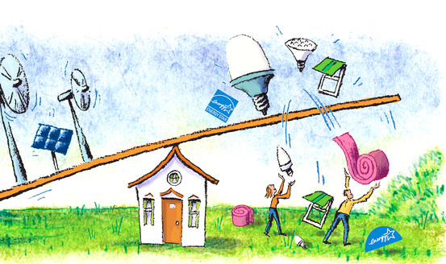
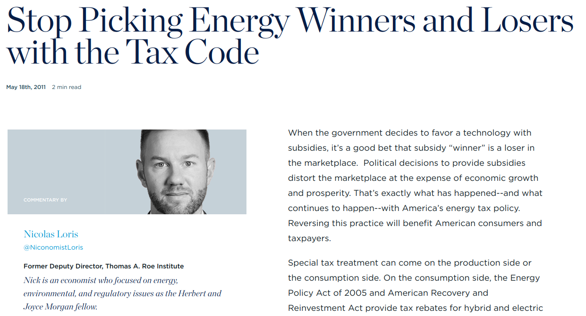
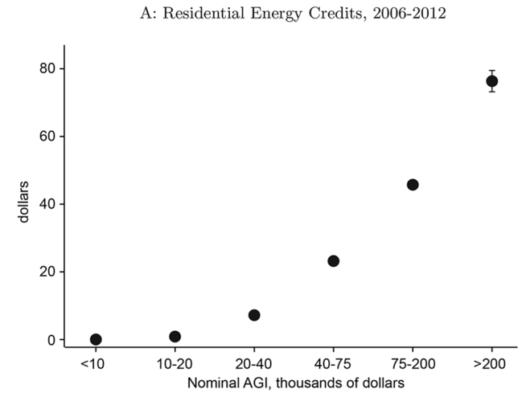
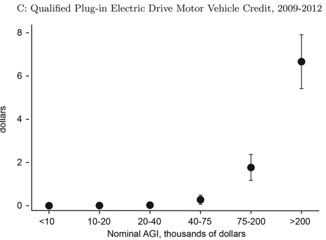
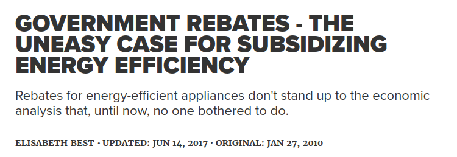
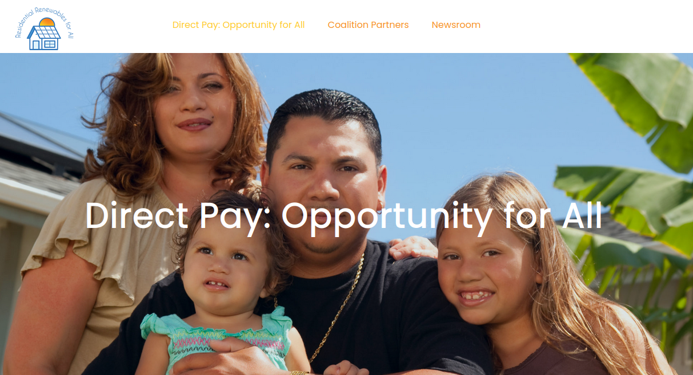

# Today's Agenda {background-image="libs/Images/background-forest_v3.png" background-size="1920px 1080px"}

```{r}
library(tidyverse)
library(readxl)
```

```{=html}
<style type="text/css">
    :root {
        --r-main-font-size: 43px;
    }
</style>
```
<br>

**II. Evaluating Policy Design Options**

-   "Green" Subsidy Policies

<br>

::: r-stack
Justin Leinaweaver (Spring 2024)
:::

::: notes
Prep for Class

1.  Publish discussion board for next class

2.  Take your time going through the policy design refresher material, do the on board pros vs cons lists
:::

## Assignment 4 {background-image="libs/Images/background-forest_v3.png" background-size="1920px 1080px"}

**Getting Involved in our Community**

<br>

**Find or create** an opportunity to get **actively involved in your issue locally** (e.g. litter pickup, river cleanup, working with a local NGO or city agency on your issue, etc.)

**Write a report** describing what you did, who you worked with and what you learned that will help you with solving your chosen policy problem.

::: notes
Reminder, you have until the end of April to complete your community involvement piece of the project.

-   Spring Break is coming up and that's often a great time to get involved outside!

<br>

Don't forget:

1.  I must sign off on your activity plan **BEFORE** you do it, AND

2.  Your report must include evidence for all claims (e.g. documentation of the activity through photos, etc.)

<br>

### Questions on this assignment?
:::

## Section 2 {background-image="libs/Images/background-forest_v3.png" background-size="1920px 1080px"}

**Evaluating Policy Design Options**

<br>

1.  **Command & Control Regulations**

2.  "Green" Taxes

3.  "Green" Subsidies

4.  Adaptive Governance

::: notes
Let's refresh our memories on the policies design approaches so far.

<br>

Two weeks ago we considered how command and control regulations can be used to address pollution externalities

<br>

### What is a pollution externality?

-   (Externality means "external" to the primary market exchange, e.g. outside the sale of widgets from factory to consumer)

<br>

### In econ speak, how does a C&C regulation change the production of a polluter?

-   (**SLIDE**)
:::

##  {background-image="libs/Images/background-forest_v3.png" background-size="1920px 1080px"}

```{r, fig.retina=3, fig.asp=0.618, fig.align='center', out.width='95%', fig.width=8, cache=TRUE}
tibble(
  Price = 1:100,
  Quantity = 100:1
) |>
  ggplot(aes(x = Quantity, y = Price)) +
  geom_point(color = "white") +
  theme_classic() +
  coord_cartesian(xlim = c(0, 125)) +
  scale_x_continuous(breaks = seq(0, 100, 20)) +
  scale_y_continuous(labels = scales::dollar_format()) +
  labs(x = "Quantity Produced", y = "Price per Widget",
       title = "C&C Regulations Increase the Costs of Production") +
  annotate("segment", x = 0, xend = 100, y = 15, yend = 65, color = "grey", linewidth = 1.3) +
  annotate("segment", x = 0, xend = 100, y = 35, yend = 85, color = "blue", linewidth = 1.3) +
  annotate("text", x = 115, y = 85, label = "Supply\n(MC + Regs)", size = 5, color = "blue", hjust = .5) +
  annotate("segment", x = 0, xend = 100, y = 100, yend = 0, color = "red", linewidth = 1.3) +
  annotate("text", x = 115, y = 5, label = "Demand", size = 5, color = "red", hjust = .5) +
  annotate("segment", x = 56, xend = 56, y = 43, yend = 0, linetype = "dashed", color = "grey") +
  annotate("segment", x = 43, xend = 43, y = 56, yend = 0, linetype = "dashed") +
  annotate("segment", x = 0, xend = 43, y = 56, yend = 56, linetype = "dashed")
```

::: notes
C&C regulations increase the marginal costs of producing widgets which leads to fewer widgets being produced

<br>

### Why is the equilibrium so powerful?

### - In other words, why can't a factory simply increase its production (and pollution) despite the added costs?

-   (Each additional widget costs more to make than you can sell it for so exceeding the equilibrium is a net loss)

<br>

### Examples from your case studies of a C&C regulation raising the costs of production?

-   (Production or technology standards?)

-   (Pollution limits?)

-   (Information + reporting requirements?)

<br>

### *ON BOARD*: What are the pros and cons of choosing this policy design approach?

Pros:

-   Can tackle big, hard to address problems (massive costs, super long time horizons),
-   most effective when piggybacking on established institutions for infrastructure/oversight/enforcement

Cons:

-   Vulnerable to lobbying,
-   Government moves slowly,
-   Very often imposes actual costs on real people in the short term (need for cushioning?),
-   Must be able to "keep up with" changes in the problem or economy over time (drift problem)
:::

## Section 2 {background-image="libs/Images/background-forest_v3.png" background-size="1920px 1080px"}

**Evaluating Policy Design Options**

<br>

1.  Command & Control Regulations

2.  **"Green" Taxes**

3.  "Green" Subsidies

4.  Adaptive Governance

::: notes
Last week we analyzed the use of "green" taxes to address pollution externalities.

<br>

### In econ speak, how is a "green" tax different from a C&C approach?

### - Does it also aim to increase the marginal costs of production?

-   (**SLIDE**)
:::

##  {background-image="libs/Images/background-forest_v3.png" background-size="1920px 1080px"}

```{r, fig.asp=0.618, fig.width=7, cache=TRUE}
## Hypothetical $75 tax
tibble(
  Abatement_cost = 0:100,
  Pollution = 0:100
) |>
  ggplot(aes(x = Pollution, y = Abatement_cost)) +
  geom_point(color = "white") +
  theme_classic() +
  #coord_cartesian(xlim = c(0, 125)) +
  scale_x_continuous(breaks = seq(0, 100, 25), limits = c(0,100)) +
  scale_y_continuous(breaks = seq(0, 100, 25), labels = str_c("$", seq(0, 100, 25))) +
  labs(x = "Quantity of Pollution", y = "Price per unit of Pollution")  +
  annotate("segment", x = 0, xend = 100, y = 100, yend = 0, color = "blue", size = 1.3) +
  annotate("text", x = 10, y = 97, label = "MC[A]", parse=TRUE) +
  annotate("segment", x = 0, xend = 100, y = 75, yend = 75, linetype = "dashed") +
  ggtitle("Setting a $75 Tax on Pollution") +
  annotate("point", x = 25, y = 75, color = "darkblue", size = 4) +
  annotate("segment", x = 99, xend = 99, y = 70, yend = 5, arrow = arrow(ends = "both", length = unit(0.1, "inches"))) +
  annotate("point", x = 99, y = 1, size = 3) +
  annotate("segment", x = 80, xend = 80, y = 70, yend = 25, arrow = arrow(ends = "both", length = unit(0.1, "inches"))) +
  annotate("point", x = 80, y = 20, size = 3) +
  annotate("segment", x = 60, xend = 60, y = 70, yend = 45, arrow = arrow(ends = "both", length = unit(0.1, "inches"))) +
  annotate("point", x = 60, y = 40, size = 3)
```

::: notes
Yes, but indirectly!

-   Remember, shifting to a tax approach means focusing on the pollution itself and not directly on the production numbers

<br>

Here we see the marginal cost of abatement for our hypothetical widget factory in the presence of a \$75 tax on pollution.

<br>

### What does the marginal cost of abatement represent?

-   (The cost to the factory of cutting 1 unit of pollution)

<br>

### And what do these arrows illustrate?

-   (The decision of how to comply with the tax)

-   (Each unit of pollution presents an option between investing in your factory's efficiency or paying the tax)

<br>

### What is the goal, according to Pigou, of using a "green" tax to address a pollution externality?

-   (**SLIDE**)
:::

##  {background-image="libs/Images/background-forest_v3.png" background-size="1920px 1080px"}

```{r, fig.asp=0.618, fig.width=7, cache=TRUE}
## Set a tax at the equilibrium, $50 per unit
tibble(
  Abatement_cost = 0:100,
  Pollution = 0:100
) |>
  ggplot(aes(x = Pollution, y = Abatement_cost)) +
  geom_point(color = "white") +
  theme_classic() +
  #coord_cartesian(xlim = c(0, 125)) +
  scale_x_continuous(breaks = seq(0, 100, 25), limits = c(0,100)) +
  scale_y_continuous(breaks = seq(0, 100, 25), labels = str_c("$", seq(0, 100, 25))) +
  labs(x = "Quantity of Pollution", y = "Price per unit of Pollution")  +
  annotate("text", x = 95, y = 15, label = "MC[A]", parse=TRUE) +
  annotate("text", x = 95, y = 86, label = "MC[E]", parse=TRUE) +
  annotate("segment", x = 0, xend = 100, y = 100, yend = 0, color = "blue", size = 1.3) +
  annotate("segment", x = 0, xend = 100, y = 0, yend = 100, color = "red", size = 1.3) +
  annotate("segment", x = 50, xend = 50, y = 0, yend = 50, linetype = "dashed") +
  annotate("segment", x = 0, xend = 100, y = 50, yend = 50, linetype = "dashed") +
  ggtitle("The Basics of Taxing Pollution: Pigou's Solution") +
  annotate("point", x = 50, y = 50, size = 4) +
  annotate("text", x = 5, y = 55, label = "$50 Tax")
```

::: notes
According to Pigou, the goal is to set a tax rate that balances the harms done by pollution to society against the harms done to the factory / economy of reducing them.

-   Tax less than this and society suffers more than the factory gains

-   Tax more than this and the economy suffers more than society gains

<br>

### *ON BOARD*: What are the pros and cons of choosing this policy design approach for addressing an environmental problem?

Pros: - Promises efficient pollution cuts, - incentivizes cleaner processes, - ?

Cons: - Also vulnerable to lobbying, - Very hard to determine the equilibrium point between abatement and external costs, - ?

<br>

Just to be clear, even though a "green" tax forces a factory to spend more on its production processes, the dynamics involved are VERY different from the C&C approach

<br>

-   (**SLIDE**: The aim is to achieve pollution cuts in the most efficient manner possible across the entire economy.)

-   (**SLIDE**: Investment incentivizes innovation!)
:::

#  {background-image="libs/Images/background-forest_v3.png" background-size="1920px 1080px"}

::: columns
::: {.column width="50%"}
```{r, fig.align='center', fig.asp=0.85, fig.width=5.5, cache=TRUE}
## Niskanen examples in Fig 2a and 2b
## Green tax approach: $50 tax
tibble(
  Abatement_cost = 0:100,
  Pollution = 0:100
) |>
  ggplot(aes(x = Pollution, y = Abatement_cost)) +
  geom_point(color = "white") +
  theme_classic() +
  #coord_cartesian(xlim = c(0, 125)) +
  #scale_x_continuous(breaks = seq(0, 100, 25), limits = c(0,100)) +
  scale_y_continuous(breaks = seq(0, 100, 25), labels = str_c("$", seq(0, 100, 25))) +
  labs(x = "Quantity of Pollution", y = "Price per unit of Pollution") +
  annotate("segment", x = 0, xend = 100, y = 0, yend = 100, color = "red", linewidth = 1.3) +
  annotate("text", x = 82, y = 95, label = "MC[E]", parse=TRUE) +
  geom_abline(intercept = 75, slope = -1, color = "blue", linewidth = 1.3) +
  annotate("text", x = 90, y = 7, label = "MC[A]", parse=TRUE) +
  ggtitle("Firm 1") +
  coord_cartesian(xlim = c(0, 125)) +
  annotate("polygon", x = c(24.5, 75, 24.5), y = c(0, 0, 50), fill = "lightblue", alpha = .5) +
  annotate("point", x = 75, y = 0, size = 5, color = "steelblue3") +
  annotate("segment", x = 0, xend = 100, y = 50, yend = 50, linetype = "dashed") +
  annotate("point", x = 24.5, y = 50, size = 5) +
  annotate("segment", x = 24.5, xend = 24.5, y = 0, yend = 50, linetype = "dashed") +
  annotate("text", x = 5, y = 55, label = "$50 Tax")
```
:::

::: {.column width="50%"}
```{r, fig.align='center', fig.asp=0.85, fig.width=5.5, cache=TRUE}
tibble(
  Abatement_cost = 0:100,
  Pollution = 0:100
) |>
  ggplot(aes(x = Pollution, y = Abatement_cost)) +
  geom_point(color = "white") +
  theme_classic() +
  #coord_cartesian(xlim = c(0, 125)) +
  #scale_x_continuous(breaks = seq(0, 100, 25), limits = c(0,100)) +
  scale_y_continuous(breaks = seq(0, 100, 25), labels = str_c("$", seq(0, 100, 25))) +
  labs(x = "Quantity of Pollution", y = "Price per unit of Pollution") +
  annotate("segment", x = 0, xend = 100, y = 0, yend = 100, color = "red", linewidth = 1.3) +
  annotate("text", x = 120, y = 95, label = "MC[E]", parse=TRUE) +
  geom_abline(intercept = 125, slope = -1, color = "blue", linewidth = 1.3) +
  annotate("text", x = 115, y = 22, label = "MC[A]", parse=TRUE) +
  ggtitle("Firm 2") +
  coord_cartesian(xlim = c(0, 125)) +
  annotate("polygon", x = c(75.5, 125, 75.5), y = c(0, 0, 50), fill = "lightblue", alpha = .5) +
  annotate("point", x = 75.5, y = 50, size = 5) +
  annotate("segment", x = 0, xend = 125, y = 50, yend = 50, linetype = "dashed") +
  annotate("segment", x = 75.5, xend = 75.5, y = 0, yend = 50, linetype = "dashed") +
  annotate("text", x = 5, y = 55, label = "$50 Tax")
```
:::
:::

::: r-stack
**1. Green taxes offer more efficient pollution control**
:::

::: notes
The first advantage of the "green" tax approach: Efficiency

<br>

The aim is to achieve pollution cuts in the most efficient manner possible across the entire economy.

-   The tax requires cleaner firms to abate more so dirtier firms can abate less

<br>

On balance this break-down of cuts gets us to the same goal AT A LOWER OVERALL ECONOMIC COST.
:::

##  {background-image="libs/Images/background-forest_v3.png" background-size="1920px 1080px"}

::: r-stack
**2. Green taxes are relatively easier to design**
:::


::: notes
The second advantage of the "green" tax approach: Easier rule-making

<br>

C&C regulations ask the government to insert itself in the production processes of every polluting industry in the country

1.  The level of expertise and information needed for this is astronomical
    -   Or you just do it badly
2.  The government also needs to be able to somewhat predict the future of technology
    -   Requiring a technology that is rapidly out of date harms the economy

<br>

The tax approach simply says to every relevant business that pollution is costly, just like the costs they pay for employees or materials

-   The idea then is that each business decides what to do about this new cost for their specific circumstances

-   They decide how to act and how quickly
:::

##  {background-image="libs/Images/background-forest_v3.png" background-size="1920px 1080px"}

::: r-stack
**3. Green taxes incentivize innovation**
:::

```{r, fig.asp=0.72, fig.align='center', fig.width=7, cache=TRUE}
tibble(
  Price = 1:100,
  Quantity = 100:1
) |>
  ggplot(aes(x = Quantity, y = Price)) +
  geom_point(color = "white") +
  theme_classic() +
  coord_cartesian(xlim = c(0, 125)) +
  scale_x_continuous(breaks = seq(0, 100, 20)) +
  scale_y_continuous(labels = scales::dollar_format()) +
  labs(x = "Quantity Produced", y = "Price per Widget") +
  annotate("segment", x = 0, xend = 100, y = 15, yend = 65, color = "blue", linewidth = 1.3) +
  annotate("segment", x = 0, xend = 100, y = 35, yend = 85, color = "grey", linewidth = 1.3) +
  annotate("text", x = 115, y = 65, label = "Supply\n(Tax Innovation)", size = 4, color = "blue", hjust = .5) +
  annotate("segment", x = 0, xend = 100, y = 100, yend = 0, color = "red", linewidth = 1.3) +
  annotate("text", x = 115, y = 5, label = "Demand", size = 5, color = "red", hjust = .5) +
  annotate("segment", x = 56, xend = 56, y = 43, yend = 0, linetype = "dashed") +
  annotate("segment", x = 43, xend = 43, y = 56, yend = 0, linetype = "dashed", color = "grey") +
  annotate("segment", x = 0, xend = 43, y = 56, yend = 56, linetype = "dashed", color = "grey") +
  annotate("segment", x = 0, xend = 56, y = 43, yend = 43, linetype = "dashed")
```

::: notes
The third advantage of the "green" tax approach is that it is supposed to incentivize innovation

-   This picture shows us the inverse of the C&C approach

-   Innovation leads to cheaper production which lowers prices, increases profit, AND this is happening while pollution levels are falling!

<br>

By taxing the pollution we create a market incentive for all firms to cut their pollution.

-   Your path to greater profits can come from making cleaner/better products

-   As you invest in your factory we expect you to be more efficient and innovative

-   Putting a price on pollution also invites new businesses to arise that see their own profit in helping industries emit less pollution

<br>

### What examples from our case studies were the most persuasive endorsements of this approach? Why?
:::

##  {background-image="libs/Images/background-forest_v3.png" background-size="1920px 1080px"}

::: r-stack
**Policy Design Option 3: "Green" Subsidies**
:::



::: notes
This week we shift to your next option: "Green" subsidies

### Per the Tarver (2021) article on Investopedia, and before we get into the critiques, talk to me about how this approach tries to solve an environmental problem.

-   Government provides the money you need to make "better" (e.g. "cleaner", more "environmental") choices!

<br>

There are two broad ways to do this even though both basically have the same effect

-   **SLIDE**: Pay subsidies directly to industry
:::

## Paying Subsidies to Industry {background-image="libs/Images/background-forest_v3.png" background-size="1920px 1080px"}


::: notes
### What does this approach look like in the real world?

### - Per the readings, what does a subsidy to industry typically look like?

-   This is a direct payment to a specific industry

-   Typically take the form of tax credits or reimbursements paid to the company "for part of the cost of the production of a good or service"
:::

##  {background-image="libs/Images/background-forest_v3.png" background-size="1920px 1080px"}

```{r, fig.asp=0.618, fig.width=6, cache=FALSE}
tibble(
  Abatement_cost = 0:100,
  Pollution = 0:100
) |>
  ggplot(aes(x = Pollution, y = Abatement_cost)) +
  geom_point(color = "white") +
  theme_classic() +
  scale_y_continuous(breaks = seq(0, 100, 25), labels = str_c("$", seq(0, 100, 25))) +
  labs(x = "Quantity of Pollution", y = "Price per unit of Pollution") +
  annotate("segment", x = 0, xend = 100, y = 100, yend = 0, color = "blue", linewidth = 1.3) +
  annotate("text", x = 87, y = 30, label = "Marginal cost\nof abatement") +
  annotate("segment", x = 0, xend = 100, y = 0, yend = 100, color = "red", linewidth = 1.3) +
  annotate("text", x = 82, y = 95, label = "Marginal external\n cost") +
  annotate("segment", x = 50, xend = 50, y = 0, yend = 50, linetype = "dashed") +
  annotate("segment", x = 0, xend = 50, y = 50, yend = 50, linetype = "dashed") +
  ggtitle("'Green' Subsidies to Industry")
```

::: notes
Tell me this story using the plots we've been using to think about the effects of policy on the economics of production.

### How do subsidies to industry help us solve an environmental problem?

### - How do these lines change?

-   (**SLIDE**)
:::

##  {background-image="libs/Images/background-forest_v3.png" background-size="1920px 1080px"}

```{r, fig.asp=0.618, fig.width=6, eval=TRUE}
## ANIMATED: Falling Abatement Costs
d3 <- tibble(
  Quantity = 1:100,
  Abatement_cost1 = 100 + -1*Quantity,
  Abatement_cost2 = 70 + -1*Quantity,
  External_cost = 0 + 1*Quantity
) |>
  pivot_longer(cols = Abatement_cost1:Abatement_cost2, names_to = "Scenario", values_to = "Value") |>
  mutate(
    Emitted = if_else(Scenario == "Abatement_cost1", 50, 35)
  )

d3 |>
  ggplot(aes(x = Quantity)) +
  geom_line(aes(y = External_cost), color = "red", linewidth = 1.2) +
  geom_line(aes(y = Value), color = "blue", linewidth = 1.2) +
  theme_classic() +
  scale_x_continuous(limits = c(0, 100)) +
  scale_y_continuous(breaks = seq(0, 100, 25), labels = str_c("$", seq(0, 100, 25)), limits = c(0, 100)) +
  labs(x = "Quantity of Pollution", y = "Price per unit of Pollution",
       title = "Green subsidies directly lower the abatement costs") +
  annotate("text", x = 87, y = 30, label = "Marginal cost\nof abatement") +
  annotate("text", x = 82, y = 95, label = "Marginal external\n cost") +
  gganimate::transition_states(Scenario, wrap=FALSE) +
  #shadow_wake(wake_length = .05, colour = "grey") +
  geom_segment(aes(x = 0, xend = Emitted, y = Emitted, yend = Emitted), linetype = "dashed") +
  geom_segment(aes(x = Emitted, xend = Emitted, y = 0, yend = Emitted), linetype = "dashed") +
  geom_point(aes(x = Emitted, y = Emitted), size = 5)
```

::: notes
*Wait for animated slide to move*

Gov't essentially pays firms to adopt cleaner/more efficient processes of production

-   Not really focused on supply/demand curves at all

-   Company keeps producing widgets to meet the market demand but government spending reduces the emissions for that level of production.

### Make sense?

<br>

### Why do we think democratic governments typically use tax credits rather than direct payments in most of these cases?

1.  (Much more palatable in terms of political messaging)
    -   Cutting taxes for business = good
    
    -   Government handouts to business = less good

2.  (Much less noticeable public effects)
    -   Tax credits lowers the revenues to the government
    
    -   Direct payments increase spending totals (and debt/deficit/political grandstanding)

3.  (Considerably easier to adjust tax policy (established processes) vs creating new government spending with legislation)
:::

## Paying Subsidies to Consumers {background-image="libs/Images/background-forest_v3.png" background-size="1920px 1080px"}


::: notes
### What does this approach look like in the real world?

### - Per the readings, what does a subsidy to industry typically look like?

-   Money provided to consumers

-   Often through tax credits, e.g. solar panels for your house or buying an electric vehicle

-   Sometimes through rebates (e.g. buy a water pump for your house, send us the receipt and get \$200 back!)
:::

##  {background-image="libs/Images/background-forest_v3.png" background-size="1920px 1080px"}

```{r, fig.asp=0.618, fig.width=6, cache=TRUE}
tibble(
  Abatement_cost = 0:100,
  Pollution = 0:100
) |>
  ggplot(aes(x = Pollution, y = Abatement_cost)) +
  geom_point(color = "white") +
  theme_classic() +
  scale_y_continuous(breaks = seq(0, 100, 25), labels = str_c("$", seq(0, 100, 25))) +
  labs(x = "Quantity of Pollution", y = "Price per unit of Pollution") +
  annotate("segment", x = 0, xend = 100, y = 100, yend = 0, color = "blue", linewidth = 1.3) +
  annotate("text", x = 87, y = 30, label = "Marginal cost\nof abatement") +
  annotate("segment", x = 0, xend = 100, y = 0, yend = 100, color = "red", linewidth = 1.3) +
  annotate("text", x = 82, y = 95, label = "Marginal external\n cost") +
  annotate("segment", x = 50, xend = 50, y = 0, yend = 50, linetype = "dashed") +
  annotate("segment", x = 0, xend = 50, y = 50, yend = 50, linetype = "dashed") +
  ggtitle("'Green' Subsidies to Industry")
```

::: notes
Tell me this story using the plots we've been using to think about the effects of policy on the economics of production.

### How do subsidies to consumers help us solve an environmental problem?

### - How do these lines change?

-   (**SLIDE**)
:::

##  {background-image="libs/Images/background-forest_v3.png" background-size="1920px 1080px"}

<br>

::: r-stack
**Green Subsidies: Picking Winners and Losers**
:::

<br>

::: columns
::: {.column width="50%"}
```{r, fig.retina=3, fig.align='center', out.width='100%', fig.asp=0.85, fig.width=5.5, eval=TRUE}
## Dirty Firm: Animate decreasing demand line
library(gganimate)

d10a <- tibble(
  Quantity = 1:100,
  Demand1 = 100 - 1*Quantity,
  Demand2 = 80 - 1*Quantity,
  Supply = 0 + 1*Quantity
) |>
  pivot_longer(cols = Demand1:Demand2, names_to = "Scenario", values_to = "Value")

d10a |>
  ggplot(aes(x = Quantity)) +
  annotate("segment", x = 0, xend = 100, y = 100, yend = 0, color = "darkgrey", linewidth = 1.25) +
  geom_line(aes(y = Value), color = "red", linewidth = 1.2) +
  geom_line(aes(y = Supply), color = "blue", linewidth = 1.2) +
  theme_classic() +
  coord_cartesian(xlim = c(0, 125)) +
  scale_x_continuous(breaks = seq(0, 100, 20)) +
  scale_y_continuous(breaks = seq(0, 100, 20), limits = c(0, 100)) +
  labs(x = "Quantity Produced", y = "Price per Widget",
       title = "Leaving a Dirty Firm Behind") +
  annotate("text", x = 115, y = 5, label = "Demand", size = 5, color = "red", hjust = .5) +
  annotate("text", x = 119, y = 85, label = "Supply\n(MC)", size = 5, color = "blue", hjust = .5) +
  gganimate::transition_states(Scenario, wrap=FALSE)
```
:::

::: {.column width="50%"}
```{r, fig.retina=3, fig.align='center', out.width='100%', fig.asp=0.85, fig.width=5.5, eval=TRUE}
## Cleaner Firm: Animate increasing demand line
d10b <- tibble(
  Quantity = 1:100,
  Demand1 = 100 - 1*Quantity,
  Demand2 = 120 - 1*Quantity,
  Supply = 0 + 1*Quantity
) |>
  pivot_longer(cols = Demand1:Demand2, names_to = "Scenario", values_to = "Value")

d10b |>
  ggplot(aes(x = Quantity)) +
  annotate("segment", x = 0, xend = 100, y = 100, yend = 0, color = "darkgrey", linewidth = 1.25) +
  geom_line(aes(y = Value), color = "red", linewidth = 1.2) +
  geom_line(aes(y = Supply), color = "blue", linewidth = 1.2) +
  theme_classic() +
  coord_cartesian(xlim = c(0, 125)) +
  scale_x_continuous(breaks = seq(0, 100, 20)) +
  scale_y_continuous(breaks = seq(0, 100, 20), limits = c(0, 100)) +
  labs(x = "Quantity Produced", y = "Price per Widget",
       title = "Boosting a Clean Firm") +
  annotate("text", x = 115, y = 5, label = "Demand", size = 5, color = "red", hjust = .5) +
  annotate("text", x = 119, y = 85, label = "Supply\n(MC)", size = 5, color = "blue", hjust = .5) +
  gganimate::transition_states(Scenario, wrap=FALSE)
```
:::
:::

::: notes
If demand for a product or service is low, tax credits or rebates can help offset the high cost.

-   The subsidy increases the demand line for the "preferred" firm and lowers it for the "dirty" firm.

-   This is absolutely having the government pick winners and losers.

### Questions on these plots?
:::

## Targeting Government Subsidies {background-image="libs/Images/background-forest_v3.png" background-size="1920px 1080px"}

<br>

::: columns
::: {.column width="50%"}


<br>

::: r-stack
**Consumers**
:::
:::

::: {.column width="50%"}


<br>

::: r-stack
**Industry**
:::
:::
:::

::: notes
### Big question, what do these two approaches have fundamentally in common?

-   Importantly, whichever way we go with this the aim is basically the same, to provide government money to a business!

    -   I know it feels like the consumer path is meant to benefit you, but it isn't focused on that.

-   Using tax dollars to boost services or industries we like at the expense of those we do not.

-   Whether paid to industry or consumers, both paths have the same effects (lower abatement costs and more supply of a favored good/service/industry)

<br>

### Questions on the basics here?

<br>

Let's segue to the environment more directly.
:::

## Subsidies for Pollution Control {.smaller background-image="libs/Images/background-forest_v3.png" background-size="1920px 1080px"}

<br>

"Subsidies are forms of **financial government support** for activities believed to be environmentally friendly. Rather than charging a polluter for emissions, a subsidy rewards a polluter for reducing emissions. Examples of subsidies include **grants, low-interest loans, favorable tax treatment, and procurement mandates**. Subsidies have been used for a wide variety of purposes, including: brownfield development after a hazardous substance contamination; agricultural grants for erosion control; low-interest loans for small farmers; grants for land conservation; and loans and grants for recycling industrial, commercial and residential products. **While subsidies offer incentives to reduce emissions similar to a tax, they also encourage market entry to qualify for the subsidy**" ([Link](https://www.epa.gov/environmental-economics/economic-incentives#subsidies)).

::: notes
Here is how the EPA defines "Subsidies for Pollution Control."

### Everybody clear on the definition as applied to environmental problems?

#### - Any of these program types you're not familiar with?

- Grants: Direct provision of money 

- Low-interest loans: Lending money at rates better than what is available in the marketplace

- Favorable tax treatment: Investments in your factory processes become tax deductible, reduce tariffs on the imports you rely on, etc

- Procurement mandates: e.g. In December 2021, the Biden Administration issued an Executive Order calling for most federal vehicle acquisitions to be zero-emission vehicles by 2035

<br>

### Everybody clear on what kinds of programs you'll need to find for our case work on Thursday?

<br>

Well, as you know from the readings for today, subsidies make a lot of people mad!

-   We need to take these arguments seriously if we intend to use subsidies as our chosen policy tool.

### My challenge for us today is to see these critiques NOT as deal-breakers, but instead as design challenges!
:::

##  {background-image="libs/Images/background-forest_v3.png" background-size="1920px 1080px"}



::: notes
Let's start with our old friend from the [Heritage Foundation Nicolas Loris](https://www.heritage.org/environment/commentary/stop-picking-energy-winners-and-losers-the-tax-code).

- To start, make a list of all the main reasons Loris argues subsidies make for bad government policy

- Work with the people around you and get ready to report back

<br>

*ON BOARD*

- ?

<br>

Back to your groups!

### What is the lesson for us as policy designers of each of these critiques?

### - In other words, a "good" subsidy design should...

<br>

*Build a list ON THE BOARD across the articles*

-   ?
:::

##  {background-image="libs/Images/background-forest_v3.png" background-size="1920px 1080px"}

<br>

::: r-stack
**Are Clean Energy Tax Credits Equitable? (Davis 2015)**
:::

<br>

::: columns
::: {.column width="50%"}

:::

::: {.column width="50%"}

:::
:::

::: notes
Ok, jump to the [Davis (2015)](https://energyathaas.wordpress.com/2015/07/20/are-clean-energy-tax-credits-equitable/) post on the equity of green tax credits.

- Start again with a list of all the main reasons Davis argues green subsidies using tax policy CAN make for bad policy

- Work with the people around you and get ready to report back

<br>

*ON BOARD*

- ?

<br>

Back to your groups!

### What is the lesson for us as policy designers of each of these critiques?

### - In other words, a "good" subsidy design should...

<br>

*Build a list ON THE BOARD across the articles*

-   ?
:::

##  {background-image="libs/Images/background-forest_v3.png" background-size="1920px 1080px"}



::: notes
Last critique comes from [Best (2017)](https://psmag.com/economics/clunkernomics-not-so-simple-7514) and focuses on subsidizing consumer purchases

- I grant you, the tone of this article undermines its credibility somewhat, however, still covers some good research in a simple way that should help us in our design exercise.

<br>

Start again with a list of all the main reasons Davis argues green subsidies using tax policy CAN make for bad policy

- Work with the people around you and get ready to report back

<br>

*ON BOARD*

- ?

<br>

Back to your groups!

### What is the lesson for us as policy designers of each of these critiques?

### - In other words, a "good" subsidy design should...

<br>

*Build a list ON THE BOARD across the articles*

-   ?
:::

##  {background-image="libs/Images/background-forest_v3.png" background-size="1920px 1080px"}



::: notes
As we think about "good" designs, a community activist coalition called "Residential Renewables for All" has advice for us!

<br>

### What specifically is this group asking policy designers to keep in mind when using subsidies to address environmental problems?

#### - What is "direct pay" and how would it address the equity concerns about green subsidies?

:::

##  {background-image="libs/Images/background-forest_v3.png" background-size="1920px 1080px"}

```{r, fig.asp=0.618, fig.width=6, cache=TRUE}
## Non-refundable $1,000 Credit
nonref <- tibble(
  Policy = "Non-refundable",
  Taxes = seq(0, 2000, 100),
  Subsidy = 1000
  ) |>
  mutate(
    Net = if_else(Taxes - Subsidy < 0, Taxes, Subsidy)
  )

nonref |>
  ggplot(aes(x = Taxes, y = Net)) +
  geom_line(color = "red", linewidth = 1.2) +
  labs(x = "Taxes Owed ($)", y = "Subsidy Received ($)",
       title = "Hypothetical $1k 'Green' Subsidy'") +
  theme_minimal() +
  annotate("text", x = 1800, y = 900, label = "Non-Refundable", color = "red")
```

::: notes
This plot illustrates the effect of delivering a \$1k green subsidy as a non-refundable tax credit. 

- The x-axis shows how much a person owes in federal taxes. 

- The y-axis is how much of the \$1k subsidy they will actually receive.

<br>

Most tax credits are non-refundable 

- They reduce or eliminate the income tax you owe 

- So, if you don't owe anything (because you make too little money) the credit = \$0 for you!

<br>

We know the tax code is a super attractive way for government to offer benefits: 

1. Less noticeable way to spend money, 

2. lowers revenue but doesn't raise spending/debt, 

3. we already have a massive tax infrastructure with many other tax credits built into it.

<br>

The problem is that this has the capacity to exclude a lot of people from the effects of the subsidy.
:::


##  {background-image="libs/Images/background-forest_v3.png" background-size="1920px 1080px"}

```{r, fig.asp=0.618, fig.width=6, cache=TRUE}
## Non-refundable $1,000 Credit
nonref <- tibble(
  Policy = "Non-refundable",
  Taxes = seq(0, 2000, 100),
  Subsidy = 1000
  ) |>
  mutate(
    Net = if_else(Taxes - Subsidy < 0, Taxes, Subsidy)
  )

nonref |>
  ggplot(aes(x = Taxes, y = Net)) +
  geom_line(color = "red", linewidth = 1.2) +
  labs(x = "Taxes Owed ($)", y = "Subsidy Received ($)",
       title = "Hypothetical $1k 'Green' Subsidy'") +
  theme_minimal() +
  annotate("text", x = 1800, y = 900, label = "Non-Refundable", color = "red")
```

::: notes

This is NOT an unknown problem to all involved in these issues.

### Put your political analyst hats on and tell me why the great majority of tax credits are non-refundable rather than refundable?

<br>

Giving money to "hard working" Americans (e.g. those with a job) is popular, while giving money to those without a job is not.

- Money for me, a hard working person = good; money for you, a drain on society = bad

<br>

Rough stereotypes in our society about who contributes and who doesn't

- Mitt Romney quote: "there are 47 percent of the people who will vote for the president no matter what" because they are "dependent upon government ... believe that they are victims ... believe the government has a responsibility to care for them ... these are people who pay no income tax."

- The myth of pulling yourself up by your bootstraps

- The myth of the "welfare queen"

<br>

So, we know there is a big hole in this subsidy.

- Meaning, it isn't actually helping everybody in the same way.

<br>

But how big is the hole?

### Anybody have a guess for what proportion of federal tax filers owe nothing?

### - Owing $1,000 in taxes doesn't sound like very much, does it?

- (**SLIDE**)
:::


##  {background-image="libs/Images/background-forest_v3.png" background-size="1920px 1080px"}

```{r, fig.asp=0.618, fig.width=6, cache=TRUE}
library(readxl)
d <- read_excel("libs/Data/TaxPolicyCenter_No_Tax_2021.xlsx") |>
  mutate(
    Row = 1:11, 
    pct_nonpaying = pct_nonpaying/100,
    pct_joint = pct_joint/100,
    pct_wchildren = pct_wchildren/100
  )

d |>
  ggplot(aes(x = reorder(Income, Row), y = pct_nonpaying)) +
  geom_col(fill = "darkblue") +
  geom_hline(yintercept = seq(.25, .75, .25), color = "white") +
  coord_flip() +
  theme_minimal() +
  labs(x = "Income Level", y = "",
       title = "All Tax Units with Zero Income Tax (2021)",
       caption = "Source: Tax Policy Center") +
  scale_y_continuous(labels = scales::percent_format())
```

::: notes
Data from the nonpartisan Tax Policy Center (jointly operated by the Urban Institute and the Brookings Institution) [Link](https://www.taxpolicycenter.org/model-estimates/tax-units-zero-or-negative-income-tax-liability-august-2021/t21-0162-distribution)

- Here we see the proportion of all tax filers in income categories who owe zero federal income taxes (after credits and deductions).

<br>

### What do we learn from this?

- Almost no one earning less than $30k would receive a penny of the subsidy (Almost 2% of the 20-30k range only)

- **85% of the 30-40k range get NOTHING from the subsidy**

- And remember, the credit depends on what you owe and this plot tracks $0 owed, not sub-$1k owed. Many of the tax payers below 50k would not see much, if anything, from the subisdy.

- Pretty clear why the research shows green subsidies are inequitable!

<br>

**SLIDE**: If you think that's something, take a look at the breakdown for tax filers with children
:::


##  {background-image="libs/Images/background-forest_v3.png" background-size="1920px 1080px"}

```{r, fig.asp=0.618, fig.width=6, cache=TRUE}
d |>
  pivot_longer(cols = c(pct_nonpaying, pct_wchildren), names_to = "Category", values_to = "Values") |>
  mutate(
    Category = if_else(Category == "pct_wchildren", "With Children", "All Filers")
  ) |>
  ggplot(aes(x = reorder(Income, Row), y = Values, fill = Category)) +
  geom_col(position = "dodge") +
  geom_hline(yintercept = seq(.25, .75, .25), color = "white") +
  coord_flip() +
  theme_minimal() +
  labs(x = "Income Level", y = "",
       title = "All Tax Units with Zero Income Tax (2021)",
       caption = "Source: Tax Policy Center",
       fill = "") +
  scale_y_continuous(labels = scales::percent_format()) +
  scale_fill_manual(values = c("red", "blue"))  +
  guides(fill = guide_legend(reverse = TRUE))
```

::: notes

This is nuts!

<br>

**For families with kids, you have to get to income levels above $100k in order to see any benefit of a non-refundable subsidy!**

- You have to get past $200k to see the subsidy reach a number of the consumers you are trying to change the behavior of.

<br>

### Make sense?
:::


##  {background-image="libs/Images/background-forest_v3.png" background-size="1920px 1080px"}

```{r, fig.asp=0.618, fig.width=6, cache=TRUE}
## Non-refundable $1,000 Credit
ref <- tibble(
  Policy = "Refundable",
  Taxes = seq(0, 2000, 100),
  Subsidy = 1000
  ) |>
  mutate(
    Net = 1000
  )

rbind(nonref, ref) |>
  ggplot(aes(x = Taxes, y = Net, color = Policy, linetype = Policy)) +
  geom_line(linewidth = 1.2) +
  labs(x = "Taxes Owed ($)", y = "Subsidy Received ($)",
       title = "Hypothetical $1k 'Green' Subsidy'") +
  theme_minimal() +
  annotate("text", x = 1800, y = 900, label = "Non-Refundable", color = "red") +
    annotate("text", x = 200, y = 900, label = "Refundable", color = "blue") +
  guides(color = "none", linetype = "none") +
  scale_color_manual(values = c("red", "blue"))
```

::: notes

The 300 environmental justice advocates, environmental groups, and renewable energy companies in Residential Renewables for All are calling for a refundable credit.

- A refundable credit means that if you owe less in taxes than the size of the subsidy the government sends you a check for the difference.

- This approach guarantees everyone has access to the full subsidy but likely at a much higher cost

- This starts to look more like politically problematic "spending"

<br>

However, 

1. If the goal is to get more people to pay for more efficient products and services, and

2. We are worried about equity in our society, 

Then we need to think about this carefully.

<br>

Notes

- Regan, L., Wong, B., Preston, B. L., & Curtright, A. E. (2021). Incentivizing Solar: Catalyzing Solar Energy Technology Adoption to Address the Challenge of Climate Change. RAND Corporation. https://www.rand.org/pubs/perspectives/PEA1372-1.html

+ "In contrast to nonrefundable credits, refundable tax credits can be monetized without any tax liability. They have been referred to as direct pay tax credits because the Department of the Treasury effectively pays eligible participants the difference if the value of the credit exceeds the tax liability, even if the liability is zero" (9).

+ "These direct payments were treated as an overpayment of taxes and were able to be monetized as cash refunds after filing a federal tax return" (10).

+ "If the original intention of the ITC was to decrease solar installation costs, spur industry growth, and reduce barriers to market entry, reenabling the refundable provisions would eliminate dependence on tax equity financing and tax credit rollover. Direct pay is a more efficient project finance option, eliminating the premium paid to tax equity and third-party investors for project financing and ensuring that project installers receive the full benefit. There are other benefits that the refundable tax credit provides besides effective financial utilization and equity. Between 2009 and 2011, the refundable solar tax credit program allowed 110,000 projects to monetize the credit. The largest number of projects were residential solar systems. Additionally, the program was attributed with the creation of 75,000 direct and indirect jobs (Steinberg, Porro, and Goldberg, 2012). However, the refundable solar tax credit proved expensive because of the high uptake. Therefore, expanding access to the ITC for more individuals ultimately results in the federal government bearing a greater burden of solar generation deployment costs" (18-19).

:::


## {background-image="libs/Images/background-forest_v3.png" background-size="1920px 1080px"}

::: {.r-stack} 
**Policy Design Option 3: "Green" Subsidies**
:::


::: notes

### So, where do we end up on the question of subsidies as a policy tool for addressing environmental problems?

### - What are the pros and cons of using subsidies to address an environmental problem?

*ON BOARD*

Pros: 

- ?

Cons: 

- ?

:::


## Assignment for Thursday {background-image="libs/Images/background-forest_v3.png" background-size="1920px 1080px"}

<br>

Submit to Canvas a real world example of **this approach** being used to **successfully** address an environmental problem **similar to the one in your project**.

<br>

**Present as an argument**: This case shows that addressing environmental problem X can be done successfully using "green" subsidies.

::: notes

Thursday we repeat our model from last week!

<br>

As you search, keep in mind the list of "things" we call subsidies listed in the EPA document.

- "Examples of subsidies include grants, low-interest loans, favorable tax treatment, and procurement mandates."

<br>

### Questions on the assignment?

:::
