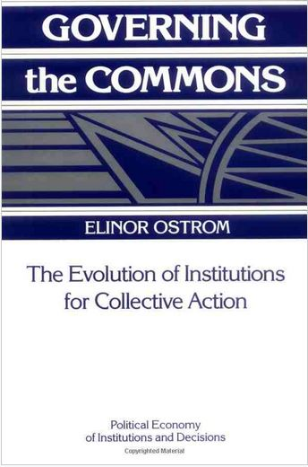

# Today's Agenda {background-image="libs/Images/background-forest_v3.png" }

```{r}
library(tidyverse)
library(readxl)
```

<br>

**II. Evaluating Policy Design Options**

-   Adaptive Governance Policies

<br>

::: r-stack
Justin Leinaweaver (Spring 2024)
:::

::: notes
Prep for Class

1.  Publish discussion board for next class
:::


## Assignment 4 {background-image="libs/Images/background-forest_v3.png"}

<br>

**Getting Involved in our Community**

**Find or create** an opportunity to get **actively involved in your issue locally** (e.g. litter pickup, river cleanup, working with a local NGO or city agency on your issue, etc.)

**Write a report** describing what you did, who you worked with and what you learned that will help you with solving your chosen policy problem.

::: notes
Reminder, you have until the end of April to complete your community involvement piece of the project.

<br>

Don't forget:

1.  I must sign off on your activity plan **BEFORE** you do it, AND

2.  Your report must include evidence for all claims (e.g. documentation of the activity through photos, etc.)

<br>

### Questions on this assignment?
:::


## Section 2 {background-image="libs/Images/background-forest_v3.png" }

**Evaluating Policy Design Options**

<br>

1.  Command & Control Regulations

2.  "Green" Taxes

3.  **"Green" Subsidies**

4.  Adaptive Governance

::: notes
In this second section of the class we've been evaluating different options for designing an environmental policy.

<br>

Given our break last week, let's dive in with a quick refresher!

<br>

**What does it mean to use command and control regulations to solve an environmental problem?**

<br>

**What does it mean to use "green" taxes to solve an environmental problem?**

<br>

**And what does it mean to use a "green" subsidy to address an environmental problem?**

- (**SLIDE**: Pros and cons...)
:::


## Policy Design Approach 3 {background-image="libs/Images/background-forest_v3.png" }

**"Green" Subsidies**

<br>

:::: {.columns}

::: {.column width="50%"}
```{r, fig.retina=3, out.width='100%'}

```
:::

::: {.column width="50%"}
```{r, fig.retina=3, out.width='100%'}

```
:::
::::

::: notes

**What are the pros and cons of choosing a subsidy approach to solving an environmental problem?**

- Pros: Easier to pass tax incentives than regulations of almost any kind; Can be targeted rather precisely; Requires low uncertainty

- Cons: Requires government to pick winners and losers in the marketplace; May bolster the fortunes of companies who can't compete; May disproportionately benefit the rich

<br>

### What examples from our case studies were the most persuasive endorsements of this approach? Why?

#### - Examples of diverse programs that all can be classified as subsidies? e.g. grants, low-interest loans, favorable tax treatment, and procurement mandates
:::


## {background-image="libs/Images/13-1-fishing.jpg"}

<p style="color: white;">**Policy Design Option 4: Adaptive Governance**</p>

::: notes

Today we shift to our final policy design option, adaptive governance.

<br>

As I think you saw in our reading for today this approach involves quite a bit more than the single mechanisms we've been considering so far.

<br>

However, before we get into this approach let's take a detour into discussing one of my favorite human beings, Elinor Ostrom, the author of the chapter you read for today.
:::


## Elinor Ostrom (1933-2012) {background-image="libs/Images/background-forest_v3.png" }

:::: {.columns}
::: {.column width="50%"}
```{r, out.width='70%'}

```
:::

::: {.column width="50%"}
```{r, out.width='100%'}
knitr::include_graphics('libs/Images/13-1-ostrom.jpg')
```
:::
::::

::: notes
Her story is a super cool one!

<br>

Working in the business world in the early 1960’s she was told not to pursue a PhD because no one would ever hire a woman professor.

<br>

Her response?

- Go to UCLA and get a PhD in Political Science,

- Get a series of excellent academic jobs, and...
:::


## NOBEL PRIZE WINNER Elinor Ostrom {background-image="libs/Images/background-forest_v3.png" }

:::: {.columns}
::: {.column width="50%"}
```{r, out.width='70%'}
knitr::include_graphics('libs/Images/10-1-Ostrom_Cover2.jpg')
```
:::

::: {.column width="50%"}
```{r, out.width='100%'}
knitr::include_graphics('libs/Images/13-1-ostrom.jpg')
```
:::
::::

::: notes
Produce research so good they gave her the Nobel Prize in **ECONOMICS** in 2009. 

<br>

You might not know it but Economics is one of the most insular academic departments in the social sciences.

- In terms of the research they cite in their work they tend to ignore almost everything produced by other disciplines.

<br>

Dr. Ostrom's research was so good they gave her, a political scientist, the most prestigious award in economics.

- This award was entirely merited and a HUGE deal.

- And we will NEVER let them take her from us!
:::


## NOBEL PRIZE WINNER Elinor Ostrom {background-image="libs/Images/background-forest_v3.png" }

:::: {.columns}
::: {.column width="50%"}

<br>

"What we have ignored is what citizens can do and the importance of real involvement of the people involved - versus just having somebody in Washington make a rule."
:::

::: {.column width="50%"}
```{r, out.width='100%'}
knitr::include_graphics('libs/Images/13-1-ostrom.jpg')
```
:::
::::

::: notes
Dr. Ostrom's research revolutionized our understanding of resource management problems.

<br>

She came to graduate studies during a period in which there was a great deal of concern raised by Garrett Hardin's "Tragedy of the Commons" metaphor.

- We'll talk more about that in a few weeks.

<br>

Long story short, Hardin was peddling a theory of resource use that predicted ecological collapse under a number of conditions.

- Hardin was arguing that anywhere our natural resources were owned in "common" they were certain to collapse.

<br>

The thing was, as Ostrom explored the world of resource management she kept finding success stories and not repeated environmental catastrophes!

- Her study of the success stories she found around the world became the basis for her Nobel Prize winning research.
:::


## {background-image="libs/Images/13-1-fishing_boat.jpg"}

{.absolute bottom=50 right=50 width="450"}

::: notes

Let's kick things off by discussing the collapse of the cod fishery in the North Atlantic in the 1990s

- Essentially a perfect storm of pollution, climate change and wild overfishing absolutely decimated the cod population in the North Atlantic

- In short, cod were valuable and vulnerable at the same time our fishing technology got too good

<br>

On its face this looks like the kind of collapse we should expect in any commons

- No country "owns" the Atlantic Ocean therefore it is a "commons" meaning it is owned by no one

- Put differently you can say a commons is owned "in common" by the entire world

<br>

In essence, this case is an example of Hardin's Tragedy of the Commons come to life.

- Hardin argues no resource managed in common could reach any other end.

<br>

HOWEVER, Ostrom noted that this "common requires collapse" viewpoint is dangerous, often wrong and gives us very few tools to address it

- So she set out to develop something better!

<br>

#### Notes
+ Chart source: Kenneth T. Frank; Brian Petrie; Jae S. Choi; William C. Leggett (2005). "Trophic Cascades in a Formerly Cod-Dominated Ecosystem". Science. 308 (5728): 1621–1623.
:::


## Common Pool Resources (CPR) {background-image="libs/Images/background-forest_v3.png"  .center}

...refers to a natural or man-made resource system that is sufficiently large as to make it costly (but not impossible) to exclude potential beneficiaries from obtaining benefits from its use. 

::: {.fragment}
...it is essential to distinguish between the *resource system* and the flow of *resource units* produced by the system, while still recognizing the **dependence** of one on the other" (Ostrom 1990, 30).
:::

::: notes
Ostrom's first important change in our approach to managing shared resources was to get us thinking in terms of common pool resources

<br>

**According to this key quote, what is a common pool resource?**

- **How do I identify a CPR in the real world?**

<br>

Three key elements here:

1. A natural or man-made resource system
2. large enough to make it hard to keep people from using it
3. where using it produces benefits

<br>

**Does the North Atlantic cod fishery meet these criteria?**

- (Yep! Natural system, HUGE, each fish caught provides a benefit to the fisherman)

<br>

So, the North Atlantic cod fishery is a CPR, but how does that help us?

- **REVEAL**

- Per Ostrom, every CPR should be disaggregated into two component parts: the system and the units

<br>

**In our North Atlantic example, what is the resource system and what are the resource units?**

- (**SLIDE**)
:::


## Common Pool Resources (CPR) {background-image="libs/Images/background-forest_v3.png"  .center}

<br>

:::: {.columns}
::: {.column width="50%"}
**Resource System**

```{r}
knitr::include_graphics('libs/Images/13-1-ocean.jpg')
```
:::

::: {.column width="50%"}
**Resource Units**

```{r}
knitr::include_graphics('libs/Images/13-1-cod-fish.jpg')
```
:::
::::

::: notes
Per Ostrom, our understanding of shared natural resource problems is better if we learn to think of them as flow variables.

- In a sense, a CPR is like taking water from a hose

- You can turn the hose on or off to control when you are taking benefits from it, and

- You can turn the hose up or down to control the rate of resource extraction

<br>

Why adopt this approach?

<br>

FIRST, it gives us a much more nuanced view of the resource problem

- An analysis of this problem now has three targets to consider

1. The health of the system itself which exists separately from the health of the resource unit

2. The health of the resource unit which is linked to, but also separate, from the health of the system

3. AND the relationship between them

<br>

SECOND, this work to deepen our understanding of the component pieces lets us ask more useful questions

- Bad, borderline meaningless question: How do we save the North Atlantic cod fishery?

- Good Question: Under what conditions can we produce the "maximum quantity" of units "without harming the stock or the resource system itself"?
    
- A small, but crucial distinction.

<br>

### Quotes from the chapter
- "Resource systems are best thought of as **stock variables** that are capable, under favorable conditions, of producing **maximum quantity of a flow variable without harming the stock** or the resource system itself (Ostrom 1990, 30)."
:::


## Common Pool Resources (CPR) {background-image="libs/Images/background-forest_v3.png" .center}

<br>

```{r}
tibble(
  "Resource Systems" = c("Fishing Grounds"),
  "Resource Units" = c("Tons of fish")
) |>
  kableExtra::kbl(align = c("l", "c")) |>
  kableExtra::kable_styling(font_size = 40) |>
  kableExtra::column_spec(1, width = "13em") |>
  kableExtra::column_spec(2, width = "13em")
```

::: notes
So, Ostrom's first big shift in our efforts to manage natural resources focuses on how we come to understand the problem itself

- Most shared resource problems can be analyzed as CPR problems

- CPRs can be thought of as resource systems that produce a flow of units

- The system, the units and the dependence between them can each be analyzed separately

- We really don't need to waste time debating the limits and historical antecedents of "the commons."

<br>

**Any questions on Ostrom's first analytical step toward managing natural resources with adaptive governance?**

<br>

**SLIDE**: Let's consider some shared resource problem examples and see how it hard it is to think of them as CPRs.
:::


## Common Pool Resources (CPR) {background-image="libs/Images/10-1-farm_lake.jpg"}

::: notes
Imagine a freshwater source, e.g. a small lake, at the intersection of six farms

- All six farms pull water from this lake to irrigate their fields

<br>

**In this hypothetical, what is the system and what are the units in this common pool resource (CPR)?**

- (**SLIDE**)
:::


## Common Pool Resources (CPR) {background-image="libs/Images/background-forest_v3.png"  .center}

<br>

```{r}
tibble(
  "Resource Systems" = c("Fishing Grounds", "Groundwater Basins", "Irrigation Canals"),
  "Resource Units" = c("Tons of fish", "Cubic meters of water", "Cubic meters of water")
) |>
  kableExtra::kbl(align = c("l", "c")) |>
  kableExtra::kable_styling(font_size = 40) |>
  kableExtra::column_spec(1, width = "13em") |>
  kableExtra::column_spec(2, width = "13em")
```

::: notes

Fighting over "the lake" isn't really the point.

<br>

Negotiations are likely to be much more productive when the involved parties come to think of it in these terms.

- How many units can be removed without harming the lake (e.g. crossing an evaporative tipping point)?

- By what processes does the lake generate new units? Can we speed up those processes (e.g. windshields, planting patterns, etc.)?

<br>

### Make sense?
:::


## {background-image="libs/Images/13-1-cow_grass.jpg"}

::: notes

Imagine a group of farmers all feeding their livestock on public lands.

- Cheaper to feed your cows with free food, right?

<br>

### What is the system and what are the units in this common pool resource (CPR)?

- (**SLIDE**)
:::


## Common Pool Resources (CPR) {background-image="libs/Images/background-forest_v3.png"  .center}

<br>

```{r}
tibble(
  "Resource Systems" = c("Fishing Grounds", "Groundwater Basins", "Irrigation Canals", "Public Grazing Areas"),
  "Resource Units" = c("Tons of fish", "Cubic meters of water", "Cubic meters of water", "Tons of fodder")
) |>
  kableExtra::kbl(align = c("l", "c")) |>
  kableExtra::kable_styling(font_size = 40) |>
  kableExtra::column_spec(1, width = "13em") |>
  kableExtra::column_spec(2, width = "13em")
```

::: notes
Again, this framing directs us to think about each component, the system and the units, separately.

- Each has different characteristics and this gives policy designers more ways to target the problem. 

<br>

### Questions on these basic CPRs?

<br>

Let's talk pollution!
:::


## {background-image="libs/Images/13-1-pipe_dump_river_v2.png"}

<p style="color: white;">**How is this a CPR problem?**</p>

::: notes

Here we see a factory dumping pollution into a nearby river.

<br>

### How can we model this as a CPR? 

### - What is the system and what are the units?

- (**SLIDE**)
:::


## Common Pool Resources (CPR) {background-image="libs/Images/background-forest_v3.png"  .center}

```{r}
tibble(
  "Resource Systems" = c("Fishing Grounds", "Groundwater Basins", "Irrigation Canals", "Public Grazing Areas"),
  "Resource Units" = c("Tons of fish", "Cubic meters of water", "Cubic meters of water", "Tons of fodder")
) |>
  add_row(`Resource Systems` = "River", `Resource Units` = "Tons of waste absorbed") |>
  kableExtra::kbl(align = c("l", "c")) |>
  kableExtra::kable_styling(font_size = 40) |>
  kableExtra::column_spec(1, width = "13em") |>
  kableExtra::column_spec(2, width = "13em")
```

::: notes
The units here can be conceptualized as the amount of waste the river can absorb before being too degraded for other important uses.

### Make sense?

<br>

### Does anybody have a problem with accepting this as a problem-framing for the river pollution example? Why or why not?

*Force this discussion*

<br>

Is it ceding too much ground to the polluter?

- We know problem framings are powerful as they dictate who the stakeholders are, the "wisdom" you have chosen to prioritize and the kinds of policy designs that are acceptable.

- This framing sets the goal as maximizing the absorptive capacity of pollution rather than the elimination of it or the "cleanliness" of the river.

<br>

Before we get to the policy advice I want to highlight how broadly this CPR concept can be applied. 
:::


## {background-image="libs/Images/10-1-Parking_lot.jpeg"}

::: notes
**How is a parking lot a common pool resource?**

- (**SLIDE**)
:::


## Common Pool Resources (CPR) {background-image="libs/Images/background-forest_v3.png"  .center}

```{r}
tibble(
  "Resource Systems" = c("Fishing Grounds", "Groundwater Basins", "Irrigation Canals", "Public Grazing Areas"),
  "Resource Units" = c("Tons of fish", "Cubic meters of water", "Cubic meters of water", "Tons of fodder")
) |>
  add_row(`Resource Systems` = "River", `Resource Units` = "Tons of waste absorbed") |>
  add_row(`Resource Systems` = "Parking Lot", `Resource Units` = "Parking spaces filled") |>
  #add_row(`Resource Systems` = "Bridge", `Resource Units` = "?") |>
  kableExtra::kbl(align = c("l", "c")) |>
  kableExtra::kable_styling(font_size = 40) |>
  kableExtra::column_spec(1, width = "13em") |>
  kableExtra::column_spec(2, width = "13em")
```

::: notes
Public Parking lot as a resource system

- Parking spots are the units

- Having a parking spot provides utility to the user

- Difficult (costly) to prevent access to the spaces (and cost increases with size of lot)

- Limited number of spaces available before it is no longer useful for others in society

<br>

### Make sense?
:::


## {background-image="libs/Images/10-1-sunshine_skyway_bridge.jpg"}

::: notes

**How is a bridge a common pool resource?**

- (**SLIDE**)
:::


## Common Pool Resources (CPR) {background-image="libs/Images/background-forest_v3.png" .center}

```{r}
tibble(
  "Resource Systems" = c("Fishing Grounds", "Groundwater Basins", "Irrigation Canals", "Public Grazing Areas"),
  "Resource Units" = c("Tons of fish", "Cubic meters of water", "Cubic meters of water", "Tons of fodder")
) |>
  add_row(`Resource Systems` = "River", `Resource Units` = "Tons of waste absorbed") |>
  add_row(`Resource Systems` = "Parking Lot", `Resource Units` = "Parking spaces filled") |>
  add_row(`Resource Systems` = "Bridge", `Resource Units` = "Number of crossings") |> #
  kableExtra::kbl(align = c("l", "c")) |>
  kableExtra::kable_styling(font_size = 35) |>
  kableExtra::column_spec(1, width = "13em") |>
  kableExtra::column_spec(2, width = "13em")
```

::: notes

Bridge as a resource system

- Number of crossings possible in a given time are the units

- Crossing the bridge provides utility to the user

- Difficult (costly) to prevent access to the bridge (especially as it gets bigger, more lanes)

- Limited number of crossings available before its value is degraded or ended

<br>

### Make sense?


<br>

So, Ostrom encouraged us to embrace a conceptual approach to problem solving that is incredibly adaptable to many kinds of resource issue.

- AND, one that promises to help us ask and answer more useful questions / design better policies
:::


## Ostrom's CPR Cases {background-image="libs/Images/09-1-Alpabzug-Alpine-Cow-Parade_v3.png" .center}

<br>

1. Torbel, Switzerland
2. Villages in Japan
3. Huertas in Valencia
4. Huertas in Murcia and Orihuela
5. Huertas in Alicante
6. Zanjeras in the Philippines

::: notes
For today I had you read the chapter in her book where she describes six places in the world that a CPR has NOT resulted in a tragedy and the policy design lessons she learned from them.

<br>

### What is the system and what are the units for each of these six cases?
- Shared grazing land in high mountain meadows and forests
    - Torbel, Switzerland
    - Villages in Japan
    
- Shared irrigation resources
    - Huertas in Valencia
    - Huertas in Murcia and Orihuela
    - Huertas in Alicante
    - Zanjeras in the Philippines

<br>

As you all know, case selection DRAMATICALLY impacts the conclusions we can draw from any analysis.

<br>

So, let's start by discussing Ostrom's case selection.

- **What criteria did Ostrom use to select her cases?**

- (**SLIDE**)
:::


## Ostrom's CPR Cases {background-image="libs/Images/09-1-Alpabzug-Alpine-Cow-Parade_v3.png" .center}

- Small CPRs only

- CPR fits in one country

- 15,000 maximum participants

- Users dependent on CPR

::: notes

**What do these conditions mean for the conclusions we can draw by studying them?**

- (Can't automatically apply to international problems?)
- ?
:::


## Ostrom's Design Principles {background-image="libs/Images/background-forest_v3.png"  .center .smaller}

1. Clearly defined boundaries
2. Congruence between appropriation / provision rules and local conditions
3. Collective-choice arrangements
4. Monitoring
5. Graduated Sanctions
6. Conflict-resolution mechanisms
7. Minimal recognition of rights to organize
8. Nested enterprises

::: notes

*Make 8 groups, one per principle*

Groups, in a few minutes you're going to introduce your principle to the class in two ways:

1. Tell us in broad strokes how it works, and

2. Give us specific examples from the six case studies of this principle in action.

<br>

### Everybody understand the task?

Get to it!
:::


## 1. Clearly Defined Boundaries {background-image="libs/Images/13-1-farm_fence_v2.png"}

::: notes
The first principle is that successful CPRs have clearly defined boundaries

- **Group 1, explain the principle and give us examples of it in action.**

<br>

This includes two elements:

1. Clearly define who has the right to withdraw resource units from the CPR.

2. Clearly define the boundaries of the CPR itself.

<br>

**Why is this a useful design principle?**

- Ostrom argues we must label who the “outsiders” are and agree on what is included in the CPR.

- If anyone can come along and appropriate CPR resources, what incentive do you have to sacrifice for the future?

<br>

**Why might implementing this principle cause problems?**

- Defining boundaries is HARD and will be contentious,

- Defining the user base is hard and can lead to discrimination,

- How do we maintain boundaries over time as the users or boundaries change due to natural processes or use?
:::


## 2. Match Rules to Local Conditions {background-image="libs/Images/13-1-Philippines_rice_terraces_v2.png"}

::: notes

Second principle, successful CPRs Match Rules to Local Conditions

- **Group 2, explain the principle and give us examples of it in action.**

<br>

Ostrom examined water problems in four garden areas in Spain (huertas).

- All users had to pay fees for access to water.

- HOWEVER, fees indexed to local demand and supply of water.

- Therefore, in those huertas where water was more available (e.g. more rain this season), fees were lower.

<br>

**Why is this a useful design principle?**

- (Flexibility to local conditions might make people feel they are not being ruled by an unreasonable entity)

- (Might make compliance better if people feel fairly treated.)

<br>

**Why might implementing this principle cause problems?**

1. (There will likely be debate about what the local conditions imply.)
    - If I want low fees, I will use this principle as the basis of my argument.
    
2. (Different rules for different people using the same CPR could lead to huge dissatisfaction.)
:::


## 3. Collective-Choice Arrangements {background-image="libs/Images/13-1-farmers_collective.jpg"}

::: notes
Third principle, successful CPRs have inclusive Collective-Choice Arrangements

- **Group 3, explain the principle and give us examples of it in action.**

<br>

Rules not created and maintained by some external authority.

- The appropriators themselves participate in making the operational rules.

<br>

**Why is this a useful design principle?**

- (Make the people whose behavior you need to change feel ownership of the process = better compliance?)

<br>

**In what ways could this principle create big problems?**

1. (The bigger the group, the harder it is to make collective decisions.)
2. (Big disconnect possible between winners and losers from resource use.)
3. (Difficulty of understanding the science means not everyone has an informed opinion.)
4. Should everyone interested in the CPR get a vote or just a certain subset of users? What about kids who will inherit the farm?
:::


## 4. Monitoring {background-image="libs/Images/13-1-water_testing_v2.png"}

::: notes
Fourth principle, successful CPRs arrange for monitoring

- **Group 4, explain the principle and give us examples of it in action.**

<br>

Monitors must:

1. Actively audit CPR conditions AND 

2. Should either be the appropriators themselves or be fully accountable to them.

<br>

**Why is this a useful design principle?**

- ?

<br>

**In what ways could this principle create big problems?**

1. (Establishing monitors’ and scientists’ independence from appropriators; Must be able to trust their work.)

2. (Uncertainty about what to monitor.)

3. Who here has a job? If you don't do what your boss asked or have to give her bad news, how do you do it?
:::


## 5. Graduated Sanctions {background-image="libs/Images/13-1-slap-on-wrist_v2.png"}

::: notes
Fifth principle, successful CPRs have graduated sanctions

- **Group 5, explain the principle and give us examples of it in action.**

<br>

Rule breakers must be punished, but the punishment should fit the crime.

- e.g. first offense or accidental rule breaking may require small punishments only to keep people on track.

- The punishment should be imposed by the other appropriators or by officials accountable to them.

<br>

**Why is this a useful design principle?**

- ?

<br>

**In what ways could this principle create big problems?**

1. (How to agree the appropriate level of penalty amongst the appropriators?)

2. (Who benefits if the commons is a zero-sum game when someone gets punished? I might!)
    - Possible conflict of interest?
    - Although I might deal fairly in the hope they will do the same for me.
:::


## 6. Conflict-Resolution Mechanisms {background-image="libs/Images/13-1-mediation_v2.png"}

::: notes
Sixth principle, successful CPRs have Conflict-Resolution Mechanisms

- **Group 6, explain the principle and give us examples of it in action.**

<br>

Rapid access to low-cost local arenas to resolve conflicts.

<br>

**Why is this a useful design principle?**

- Full trial is very costly and time-consuming, not needed for many disputes.

<br>

**In what ways could this principle create big problems?**

- ?
:::


## 7. Recognition of Rights to Organize {background-image="libs/Images/13-1-right-to-organize_v2.png"}

::: notes
Seventh principle, successful CPRs have Minimal Recognition of Rights to Organize

- **Group 7, explain the principle and give us examples of it in action.**

<br>

Local areas must be empowered to make rules the central government will not overrule.

<br>

**Why is this a vital principle?**

- (If locals can appeal to central government to overrule the CPRs rules, then the local rules are meaningless.)

<br>

**In what ways could this principle create big problems?**

- ?
:::


## 8. Nested Enterprises {background-image="libs/Images/13-1-nested_levels_v2.png"}

::: notes
Eighth principle, successful CPRs have Nested Enterprises

- **Group 8, explain the principle and give us examples of it in action.**

<br>

For CPRs part of larger systems, all of the important stuff is organized in levels.

- Provision, monitoring, enforcement, arbitration done at the level appropriate to the problem.

<br>

**Why is this a useful design principle?**

- ?

<br>

**In what ways could this principle create big problems?**

- ?
:::


## Ostrom's Design Principles {background-image="libs/Images/background-forest_v3.png"  .center .smaller}

1. Clearly defined boundaries
2. Congruence between appropriation / provision rules and local conditions
3. Collective-choice arrangements
4. Monitoring
5. Graduated Sanctions
6. Conflict-resolution mechanisms
7. Minimal recognition of rights to organize
8. Nested enterprises

::: notes

*Create new groups (5 each?) to draw in different people from different focuses in prior exercise*

<br>

Ok, new groups I want you to evaluate ALL of these principles.

- In other words, as policy designers, which is the best place to start when trying to implement an adaptive governance plan to address a CPR problem?

- Which **ONE** would you start with? Why?

<br>

*DISCUSS*

- **Any sufficient conditions or does accomplishing something require at least a handful of these?**

- **Can we rank the principles? Are all equally necessary?**

- **Where would you move next?**

<br>

#### Other Ostrom Notes

- Hardin's oversimplification misses the many success stories around the world (e.g. Main lobsters, montreal protocol)

Why a struggle? 

- "...involves making tough decisions under uncertainty, complexity, and substantial biophysical constraints as well as conflicting human values and interests."

- 5 factors make it easier:

1. Resources and use can be easily monitored
2. only moderate rate of change in important factors (e.g. population, technology)
3. social capital e.g. dense social networks
4. easy to exclude outsiders
5. users support monitoring and enforcement

Selective Pressures

- Many success stories (long-term sustainable resource use) in small communities with effective, local, self-governing rights.

Requirements of Adaptive Governance in Complex Systems

1. Providing info (trustworthy, congruent in scale with environment and decisions; congruent with decision-makers needs in terms of timing and content.
2. Dealing with conflict (conflict resolution mechanisms needed to prevent escalation to dysfunction; must have broad buy-in; no single approach is always the right one)
3. Inducing rule compliance (but allowing modest rule violations; graduated sanctions; must be seen as BOTH effective and legitimate; Tradeable Environmental Allowances (TEAs) may be helpful but carry their own problems)
4. Providing infrastructure (physical and technological infrastructure vital but often ignored; 
5. Be prepared for change (Adaptation is vital as every element is in flux; fixed rules will fail)

Strategies for accomplishing the above

1. Analytic deliberation (well structured dialogue between all parties)
2. Nesting (Inst arrangements must be complex, redundant and nested in many layers; Sole authority, whether government or an individual, often leads to failure; efficiency of control is NOT a virtue in these systems)
3. Institutional variety(Employ mixtures of institutional types (e.g. hierarchies, markets and community self-governance) to change incentives, increase information, monitor use and induce compliance. Bad actor may evade one but others will compensate.
:::


## For Next Class {background-image="libs/Images/background-forest_v3.png"  .center}

<br>

Submit to Canvas a real world example of **this approach** being used to **successfully** address an environmental problem **similar to the one in your project**.

**Present as an argument**: This case shows that addressing environmental problem X can be done successfully using adaptive governance policies.

::: notes
**Is everybody working on an environmental problem that can easily be conceptualized as a CPR? Any hard ones?**

<br>

**Anybody need help brainstorming how to find a relevant case?**

<br>

**Any other questions?**
:::


