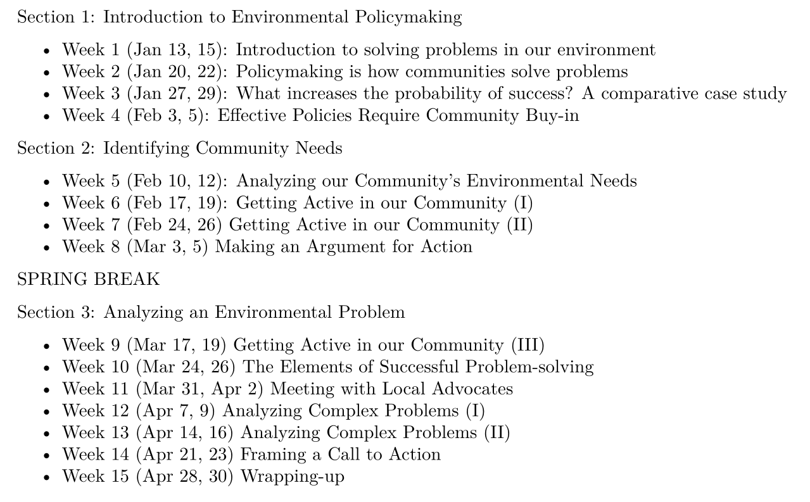
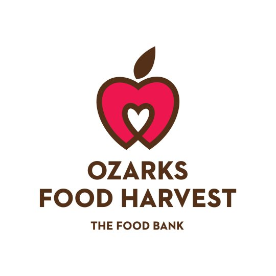
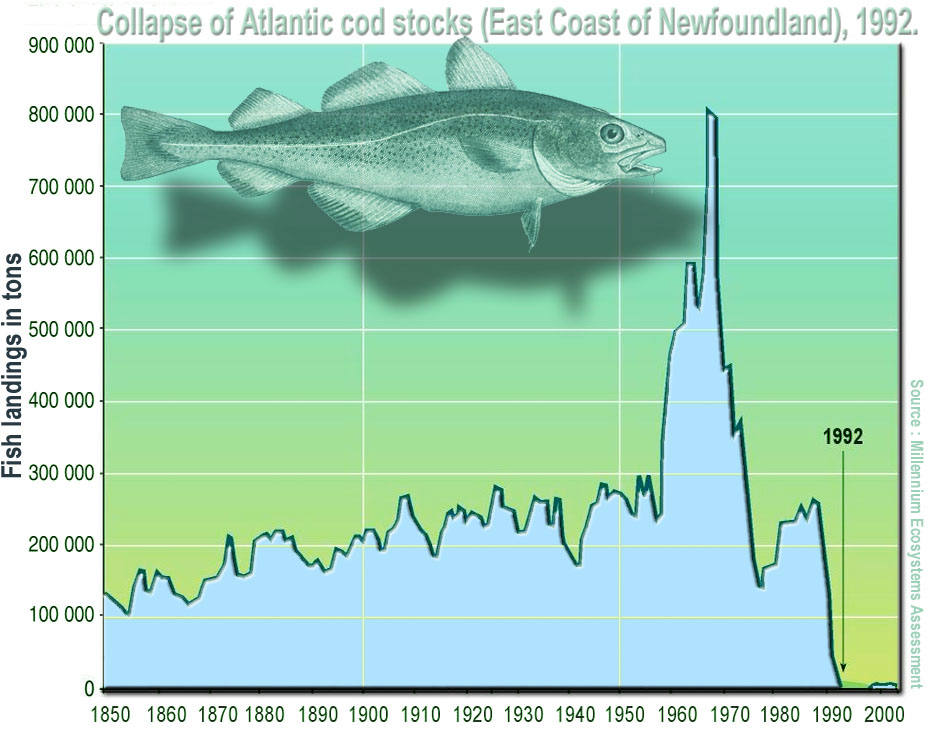
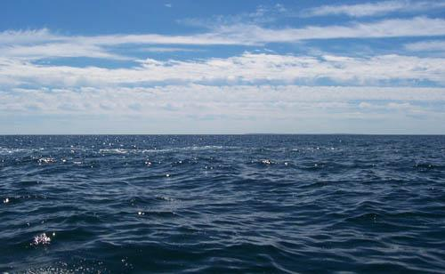
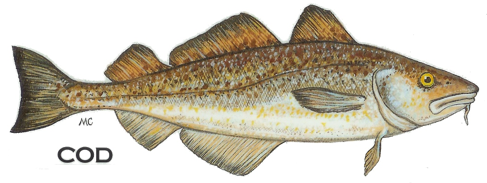

# Today's Agenda {background-image="Images/background-forest_v3.png" }

```{r}
library(tidyverse)
library(readxl)
```

<br>

::: {.r-fit-text}

**Section 3: Analyzing an Environmental Problem**

- Ostrom's principles of adaptive governance

:::

<br>

::: r-stack
Justin Leinaweaver (Spring 2026)
:::

::: notes
Prep for Class

1. Check Canvas submissions

<br>

Last Thursday we put in a volunteer shift at the Distribution Center of Ozark's Food Harvest

- While I am always grateful to you for being willing to put some effort into helping our community in concrete ways

- **SLIDE**: I also want to make sure we connect this work to the work of our class

:::


## {background-image="Images/background-forest_v3.png" .center}



::: notes

In Sections 1 and 2 I gave you a crash course in thinking about community problems from a policy-based perspective

- This meant thinking big picture about your goals, how you fit in a given community, and how every community already exists in a complex mess of interests, institutions and interactions

- We then headed out into the community to get our hand's dirty and to directly see the kinds of problems getting attention and how we can get involved in those places

<br>

This final section of our class seeks to deepen your ability to analyze environmental problems and the policies put in place to address them

- **SLIDE**: Let's apply the semester's material to our experience volunteering at OFH

:::


## {background-image="Images/background-forest_v3.png" .center}

:::: {.columns}
::: {.column width="40%"}

:::

::: {.column width="60%"}

Hughes (2006): DOC'S KEY

- **D**efinition
- **O**bjectives
- **C**onstraints
- **S**trategies
- **K**eepers
- **E**xperiment
- **Y**es!

:::
::::

::: notes

To start, talk me through the work we did last Thursday using Hughes problem-solving process

- My interest is primarily on the DOC piece of this as that is what we experienced

- We don't know what they've tried and failed with in the past

<br>

- **D: What is the problem we were working on?**

- **O: What were the objectives of the session?**

- **C: How did constraints shape our assigned work?**

<br>

Now do this exercise again, but focus entirely on your experience as a volunteer

- **What specifically were you asked to do last Thursday?**

<br>

**How did they structure YOUR PERSONAL experience in order to make you glad to be doing it and willing to do it again in the future?**

- *Apply each of the DOC to that experience*

- *Was the goal recruiting and retaining volunteers or maximizing work output?*

<br>

**In all honest sincerity, did you enjoy the volunteering session they organized? Why or why not?**

<br>

**Would you do it again, even if not required by a class, courtroom or outside pressure? Why or why not?**

<br>

**SLIDE**: Applying Clark and Peterson

<br>

*DOC'S KEY notes*

- Definition (problem and outcome; avoid letting strategies be presented as the problem; problems are neutral and don't typically need 'must' or 'should'), 
- Objectives (set clear targets), 
- Constraints (be aware of boundaries, limitations, assumptions, unacceptable impacts), 
- Strategies (Brainstorm and be creative), 
- Keepers (Choose the best strategy), 
- Experiment (Test a strategy and adapt), 
- Yes! (Implement)

:::


## {background-image="Images/background-forest_v3.png" .center}

:::: {.columns}
::: {.column width="65%"}

**The Collaborative Approach (Clarke & Peterson 2016)**

- Is an adaptive process
- Uses the most appropriate science and technology
- Is implementable
- Incurs low transaction costs
- Has appropriate funding
- Is measurable
- Is socially legitimate

:::

::: {.column width="35%"}

<br>

<br>


:::
::::

::: notes

**What elements of Clarke & Peterson's (2016) collaborative approach were in evidence in our work at OFH?**

<br>

**Thinking like a designer of policy solutions to concrete problems, what lessons can we take from our experiences last week?**

<br>

Ok, let's shift focus to our new material

- This week I want to introduce you to a remarkably compelling approach to community problem-solving 

- **SLIDE**: Adaptive governance

:::


## {background-image="Images/13-1-fishing.jpg"}

<p style="color: white;">**Adaptive Governance**</p>

::: {.incremental}

1. <p style="color: white;">**Stakeholders, stakeholders, stakeholders!**</p>

2. <p style="color: white;">**A theory of policy design**</p>

:::

::: notes

Today we shift to the work of Elinor Ostrom on adaptive governance.

- I love this reading for so MANY reasons

<br>

**REVEAL**: First, I believe Ostrom's adaptive governance beautifully reinforces the best lessons of what it takes to locate our activism in a real community

- My hope is that this will help you see why I spend so much time in the first half of the semester talking about stakeholders and the community
    
<br>
    
**REVEAL**: Second, Ostrom's adaptive governance helps to move us from the big picture of an environmental problem and into the weeds of policy design

- Ostrom's Adaptive Governance will help you identify the policy design choices we must consider in order to accomplish big things in a community

<br>

**SLIDE**: Before we get into this approach let's take a detour into discussing one of my favorite human beings: Elinor Ostrom

:::


## Elinor Ostrom (1933-2012) {background-image="Images/background-forest_v3.png" }

:::: {.columns}
::: {.column width="50%"}

{.absolute width="350"}

:::

::: {.column width="50%"}

{.absolute width="450"}

:::
::::

::: notes

**Has anybody encountered Dr. Ostrom or her work before?**

<br>

Her story is brilliant

<br>

Working in the business world in the early 1960’s she was told not to pursue a PhD because no one would ever hire a woman professor.

<br>

Her response?

- Go to UCLA and get a PhD in Political Science,

- Get a series of excellent academic jobs, and...
:::


## NOBEL PRIZE WINNER Elinor Ostrom {background-image="Images/background-forest_v3.png"}

:::: {.columns}
::: {.column width="50%"}

{.absolute width="375"}

:::

::: {.column width="50%"}

{.absolute width="400"}

:::
::::

::: notes
Produce research so good they gave her the Nobel Prize in **ECONOMICS** in 2009. 

<br>

You might not know it but Economics is one of the most insular academic departments in the social sciences.

- In terms of the research they cite in their work they tend to ignore almost everything produced by other disciplines.

<br>

Dr. Ostrom's research was so good they gave her, a political scientist, the most prestigious award in economics.

- This award was entirely merited and a HUGE deal.

- And we will NEVER let them take her from us!
:::


## NOBEL PRIZE WINNER Elinor Ostrom {background-image="Images/background-forest_v3.png" }

:::: {.columns}
::: {.column width="50%"}

<br>

"What we have ignored is what citizens can do and the importance of real involvement of the people involved - versus just having somebody in Washington make a rule."
:::

::: {.column width="50%"}
```{r, out.width='100%'}
knitr::include_graphics('Images/13-1-ostrom.jpg')
```
:::
::::

::: notes
Dr. Ostrom's research revolutionized our understanding of resource management problems.

<br>

She came to graduate studies during a period in which there was a great deal of concern raised by Garrett Hardin's "Tragedy of the Commons" metaphor.

- We'll talk more about that in a few weeks.

<br>

Long story short, Hardin was peddling a theory of resource use that predicted ecological collapse under a number of conditions.

- Hardin was arguing that anywhere our natural resources were owned in "common" they were certain to collapse.

<br>

The thing was, as Ostrom explored the world of resource management she kept finding success stories and not repeated environmental catastrophes!

- Her study of the success stories she found around the world became the basis for her Nobel Prize winning research.

<br>

**SLIDE**: Let's dig into adaptive governance by first discussing common pool resources (CPRs)

:::


## {background-image="Images/13-1-fishing_boat.jpg"}

{.absolute bottom=50 right=50 width="450"}

::: notes

Let's use a real-world environmental catastrophe as a way of introducing the common pool resource concept

<br>

For hundreds of years fishing was a way of life in the North Atlantic

- Entire coastal economies depended on the fish for survival

- Everyday fishing boats would head out to sea, frequently into international waters, and catch cod

<br>

In the 1990s a perfect storm of pollution, climate change, improvements in fishing technology and WILD levels of over-fishing absolutely destroyed the cod population in the North Atlantic

- The fishery essentially collapsed

<br>

This represents a particularly difficult kind of environmental problem to address

- The resource is shared by everyone, so it is owned by no one

- Under these conditions it can be hard to develop policy solutions that will be effective over time

- THIS is what Hardin's "Tragedy of the Commons" was predicting

<br>

Fundamentally, Ostrom's work was born out of a frustration with the way Hardin was framing this "tragedy" as inevitable

- That seemed implausible given how long our species has survived

<br>

So, Ostrom's first useful piece of advice for us as problem-solvers was to encourage us to try and define "the commons" more precisely

- **SLIDE**: Hence, the CPR

:::


## Common Pool Resources (CPR) {background-image="Images/background-forest_v3.png"  .center}

...refers to a natural or man-made resource system that is sufficiently large as to make it costly (but not impossible) to exclude potential beneficiaries from obtaining benefits from its use. 

...it is essential to distinguish between the *resource system* and the flow of *resource units* produced by the system, while still recognizing the **dependence** of one on the other" (Ostrom 1990, 30).

::: notes
*Let them read the slide*

<br>

The definition on the slide is a little tough to unpack, but let's talk it through.

- At its simplest, every CPR can be disaggregated into two component parts: a system and its units

- Let's talk first about identifying CPRs in the world

<br>

FIRST, the "system" in a CPR can be either natural or man-made

- e.g. both the ocean and a drainage ditch can be a CPR

<br>

SECOND, the "system" in a CPR must be large enough to make it hard to keep people from using it

- Clearly true of the ocean, but can be equally true when talking about things like rainwater for irrigation

<br>

FINALLY, the "system" in a CPR must produce benefits to those who use it

:::


## Common Pool Resources (CPR) {background-image="Images/background-forest_v3.png"  .center}

<br>

:::: {.columns}
::: {.column width="50%"}
**Resource System**



:::

::: {.column width="50%"}
**Resource Units**

<br>



:::
::::

::: notes
We can now reframe the cod fishery collapse as a common pool resource management problem

- The ocean is the resource system and it is VERY hard to control who has access to it

- The fish are the resource units and each one is valuable

<br>

Ostrom encourages us to think about CPR management as an issue of flow.

- In a sense, managing a CPR is like taking water from a hose

- You can turn the hose on or off to control when you are taking benefits from it, and

- You can turn the hose up or down to control the rate of resource extraction

<br>

Why is this approach better than alternative framings?

<br>

FIRST, it allows us to study management problems in more productive ways:

1. Successful management requires understanding the system itself

    - A healthy system is more than just a source of resource units

2. Successful management requires understanding the units themselves

    - The health of the units is a more complex question than just asking about the system they live in

3. Successful management requires understanding how the "flow" of units from the system impacts both

<br>

SECOND, we can ask more useful questions

- Bad, borderline meaningless question: How do we save the North Atlantic cod fishery?

- Good Question: Under what conditions can we produce the "maximum quantity" of units "without harming the stock or the resource system itself"?
    
- A small, but crucial distinction.

<br>

### Quotes from the chapter
- "Resource systems are best thought of as **stock variables** that are capable, under favorable conditions, of producing **maximum quantity of a flow variable without harming the stock** or the resource system itself (Ostrom 1990, 30)."
:::


## Common Pool Resources (CPR) {background-image="Images/background-forest_v3.png" .center}

```{r}
tibble(
  "Resource Systems" = c("Fishing Grounds"),
  "Resource Units" = c("Tons of fish")
) |>
  kableExtra::kbl(align = c("l", "c")) |>
  kableExtra::kable_styling(font_size = 40) |>
  kableExtra::column_spec(1, width = "13em") |>
  kableExtra::column_spec(2, width = "13em")
```

::: notes
So, Ostrom's first big shift in our efforts to manage natural resources focuses on how we come to understand the problem itself

- Most shared resource problems can be analyzed as CPR problems

<br>

AND CPRs can be analyzed as resource systems that produce a flow of units

- The system, the units and the dependence between them can each be analyzed separately

- We really don't need to waste time debating the limits and historical antecedents of "the commons."

<br>

**Any questions on Ostrom's first analytical step toward managing natural resources with adaptive governance?**

<br>

**SLIDE**: Let's consider some shared resource problem examples and reframe each one as a CPR.
:::


## Common Pool Resources (CPR) {background-image="Images/10-1-farm_lake.jpg"}

::: notes
Imagine a freshwater source, e.g. a small lake, at the intersection of six farms

- All six farms pull water from this lake to irrigate their fields

<br>

**In this hypothetical, what is the system and what are the units in this common pool resource (CPR)?**

- (**SLIDE**)
:::


## Common Pool Resources (CPR) {background-image="Images/background-forest_v3.png"  .center}

```{r}
tibble(
  "Resource Systems" = c("Fishing Grounds", "Groundwater Basins", "Irrigation Canals"),
  "Resource Units" = c("Tons of fish", "Cubic meters of water", "Cubic meters of water")
) |>
  kableExtra::kbl(align = c("l", "c")) |>
  kableExtra::kable_styling(font_size = 40) |>
  kableExtra::column_spec(1, width = "13em") |>
  kableExtra::column_spec(2, width = "13em")
```

::: notes

Fighting over "the lake" isn't really the point.

<br>

Negotiations are likely to be much more productive when the involved parties come to think of it in these terms.

- How many units can be removed without harming the lake (e.g. crossing an evaporative tipping point)?

- By what processes does the lake generate new units? Can we speed up those processes (e.g. windshields, planting patterns, etc.)?

<br>

### Make sense?
:::


## {background-image="Images/13-1-cow_grass.jpg"}

::: notes

Imagine a group of farmers all feeding their livestock on public lands.

- Cheaper to feed your cows with free food, right?

<br>

### What is the system and what are the units in this common pool resource (CPR)?

- (**SLIDE**)
:::


## Common Pool Resources (CPR) {background-image="Images/background-forest_v3.png"  .center}

```{r}
tibble(
  "Resource Systems" = c("Fishing Grounds", "Groundwater Basins", "Irrigation Canals", "Public Grazing Areas"),
  "Resource Units" = c("Tons of fish", "Cubic meters of water", "Cubic meters of water", "Tons of fodder")
) |>
  kableExtra::kbl(align = c("l", "c")) |>
  kableExtra::kable_styling(font_size = 40) |>
  kableExtra::column_spec(1, width = "13em") |>
  kableExtra::column_spec(2, width = "13em")
```

::: notes
Again, this framing directs us to think about each component, the system and the units, separately.

- Each has different characteristics and this gives policy designers more ways to target the problem. 

<br>

### Questions on these basic CPRs?

<br>

Let's talk pollution!
:::


## {background-image="Images/13-1-pipe_dump_river_v2.png"}

<p style="color: white;">**How is this a CPR problem?**</p>

::: notes

Here we see a factory dumping pollution into a nearby river.

<br>

### How can we model this as a CPR? 

### - What is the system and what are the units?

- (**SLIDE**)
:::


## Common Pool Resources (CPR) {background-image="Images/background-forest_v3.png"  .center}

```{r}
tibble(
  "Resource Systems" = c("Fishing Grounds", "Groundwater Basins", "Irrigation Canals", "Public Grazing Areas"),
  "Resource Units" = c("Tons of fish", "Cubic meters of water", "Cubic meters of water", "Tons of fodder")
) |>
  add_row(`Resource Systems` = "River", `Resource Units` = "Tons of waste absorbed") |>
  kableExtra::kbl(align = c("l", "c")) |>
  kableExtra::kable_styling(font_size = 40) |>
  kableExtra::column_spec(1, width = "13em") |>
  kableExtra::column_spec(2, width = "13em")
```

::: notes
The units here can be conceptualized as the amount of waste the river can absorb before being too degraded for other important uses.

### Make sense?

<br>

### Does anybody have a problem with accepting this as a problem-framing for the river pollution example? Why or why not?

*Force this discussion*

<br>

Is it ceding too much ground to the polluter?

- We know problem framings are powerful as they dictate who the stakeholders are, the "wisdom" you have chosen to prioritize and the kinds of policy designs that are acceptable.

- This framing sets the goal as maximizing the absorptive capacity of pollution rather than the elimination of it or the "cleanliness" of the river.

<br>

Before we get to the policy advice I want to highlight how broadly this CPR concept can be applied. 
:::


## {background-image="Images/10-1-Parking_lot.jpeg"}

::: notes
**How is a parking lot a common pool resource?**

- (**SLIDE**)
:::


## Common Pool Resources (CPR) {background-image="Images/background-forest_v3.png"  .center}

```{r}
tibble(
  "Resource Systems" = c("Fishing Grounds", "Groundwater Basins", "Irrigation Canals", "Public Grazing Areas"),
  "Resource Units" = c("Tons of fish", "Cubic meters of water", "Cubic meters of water", "Tons of fodder")
) |>
  add_row(`Resource Systems` = "River", `Resource Units` = "Tons of waste absorbed") |>
  add_row(`Resource Systems` = "Parking Lot", `Resource Units` = "Parking spaces filled") |>
  #add_row(`Resource Systems` = "Bridge", `Resource Units` = "?") |>
  kableExtra::kbl(align = c("l", "c")) |>
  kableExtra::kable_styling(font_size = 40) |>
  kableExtra::column_spec(1, width = "13em") |>
  kableExtra::column_spec(2, width = "13em")
```

::: notes
Public Parking lot as a resource system

- Parking spots are the units

- Having a parking spot provides utility to the user

- Difficult (costly) to prevent access to the spaces (and cost increases with size of lot)

- Limited number of spaces available before it is no longer useful for others in society

<br>

**Make sense?**

:::


## {background-image="Images/10-1-sunshine_skyway_bridge.jpg"}

::: notes

**How is a bridge a common pool resource?**

- (**SLIDE**)
:::


## Common Pool Resources (CPR) {background-image="Images/background-forest_v3.png" .center}

```{r}
tibble(
  "Resource Systems" = c("Fishing Grounds", "Groundwater Basins", "Irrigation Canals", "Public Grazing Areas"),
  "Resource Units" = c("Tons of fish", "Cubic meters of water", "Cubic meters of water", "Tons of fodder")
) |>
  add_row(`Resource Systems` = "River", `Resource Units` = "Tons of waste absorbed") |>
  add_row(`Resource Systems` = "Parking Lot", `Resource Units` = "Parking spaces filled") |>
  add_row(`Resource Systems` = "Bridge", `Resource Units` = "Number of crossings") |> #
  kableExtra::kbl(align = c("l", "c")) |>
  kableExtra::kable_styling(font_size = 35) |>
  kableExtra::column_spec(1, width = "13em") |>
  kableExtra::column_spec(2, width = "13em")
```

::: notes

Bridge as a resource system

- Number of crossings possible in a given time are the units

- Crossing the bridge provides utility to the user

- Difficult (costly) to prevent access to the bridge (especially as it gets bigger, more lanes)

- Limited number of crossings available before its value is degraded or ended

<br>

**Make sense?**

<br>

So, Ostrom encouraged us to embrace a conceptual approach to problem solving that is incredibly adaptable to many kinds of resource issue.

- AND, one that promises to help us ask and answer more useful questions / design better policies

<br>

**SLIDE**: Let's apply this to your selected local environmental problems!

:::


## {background-image="Images/background-forest_v3.png" .center}

::: {.r-fit-text}
**Analyzing your Environmental Problem as a CPR**
:::

<br>

**How many different ways can you describe your chosen problem as a common pool resource?**

- e.g. system, units and flow

::: notes

Over the last few weeks, each of you has been doing work focused on a specific, local environmental problem

- What I'd like us to do is to try and convert these into the CPR terminology

- e.g. resource systems, resource units and resource flows

<br>

Take a few minutes to brainstorm and write down a few options

- I'm asking for "a few" because it is SUPER valuable for problem-solvers to be able to see their problem from very different perspectives

- So, how many different can you conceive of your topic as a flow problem to be managed?

- Go!

<br>

Share what you've come up with with the person next to you

- Use this as a test run before I ask you to pitch your CPR problems to the class

- Go!

<br>

*PRESENT and DISCUSS each*

<br>

Developing multiple different CPR versions of a given problem is an excellent strategy for a budding problem-solver

1. Different CPRs lead to very different policies even for the same problem

    - The relevant stakeholders change, the standards change, the terms of "progress" change
    
2. When you get into your community and get to work you may find existing institutional barriers make one version of the CPR harder to work on than another

    - If you've got more than one you can keep working!

<br>

**Questions on this?**

<br>

**SLIDE**: Time for the design principles
:::


## Ostrom's CPR Cases {background-image="Images/09-1-Alpabzug-Alpine-Cow-Parade_v3.png" .center}

<br>

1. Torbel, Switzerland
2. Villages in Japan
3. Huertas in Valencia
4. Huertas in Murcia and Orihuela
5. Huertas in Alicante
6. Zanjeras in the Philippines

::: notes
For today I had you read the chapter in her book where she describes six places in the world that a CPR has NOT resulted in a tragedy and the policy design lessons she learned from them.

<br>

**What are the CPRs in each of these six cases?**

- Cases 1 (Switzerland) and 2 (Japan) are shared grazing land in high mountain meadows and forests

- The rest are about water for irrigation (Valencia, Murcia and Orihuela, Alicante, the Philippines)

<br>

As you all know, case selection DRAMATICALLY impacts the conclusions we can draw from any analysis.

- So, let's start by discussing Ostrom's case selection.

- **What criteria did Ostrom use to select her cases?**

- (**SLIDE**)
:::


## Ostrom's CPR Cases {background-image="Images/09-1-Alpabzug-Alpine-Cow-Parade_v3.png" .center}

- Small CPRs only

- CPR fits in one country

- 15,000 maximum participants

- Users dependent on CPR

::: notes

**What do these conditions mean for the conclusions we can draw by studying them?**

- (Can't automatically apply to international problems?)

- (Can't easily apply to less valuable or important problems? e.g. where users are not dependent on the resource)

<br>

From these success stories, and others, Ostrom proposes eight design principles to help us solve environmental problems

- In short, I want you to think about these as gateways into designing environmental policy

- Each principle suggests a causal mechanism that has been associated with successfully managing an environmental resource

<br>

**SLIDE**: Let's step through them and then we can begin analyzing adaptive governance as an approach to environmental problem-solving

:::


## 1. Clearly Defined Boundaries {background-image="Images/13-1-farm_fence_v2.png"}

::: notes

The first principle is that successful CPRs have clearly defined boundaries

<br>

This includes two BIG elements:

1. You must clearly define the boundaries of the resource system, and

2. You must clearly define who has the right to extract units from the resource

<br>

In short, if anyone can come along and extract value from the CPR then what incentive do you have to sacrifice for the future?

<br>

Analysis time!

- **What are the substantial obstacles for any community trying to implement this principle?**

- Defining boundaries is HARD and will be contentious,

- Defining the user base is hard and can lead to discrimination,

- How do we maintain boundaries over time as the users or boundaries change due to natural processes or use?

:::


## 2. Match Rules to Local Conditions {background-image="Images/13-1-Philippines_rice_terraces_v2.png"}

::: notes

Second principle, successful CPRs Match Rules to Local Conditions

<br>

For example, in the four garden areas experiencing water shortages in Spain:

- All users had to pay fees for access to water, HOWEVER

- The fees were indexed to local demand and supply of water.

- Lots of rain this year, fees go down

- Not much rain, fees go up

- Farmers choose to grow drought resistant crops, fees go down!

<br>

The hope is that:

1. People are more likely to comply with rules if they believe they are fair, and 

2. Well designed rules should encourage efficiency!

<br>

Analysis time!

- **What are the substantial obstacles for any community trying to implement this principle?**

- There will likely be debate about what the local conditions imply. 

- Different rules for different people using the same CPR could lead to huge dissatisfaction (e.g. our area got more rain than yours so our fees are lower OR fewer people in my part of the valley so fees are lower)

:::


## 3. Collective-Choice Arrangements {background-image="Images/13-1-farmers_collective.jpg"}

::: notes
Third principle, successful CPRs have inclusive Collective-Choice Arrangements

<br>

Rules are not created and maintained by some external authority.

- The users themselves participate in making the rules

<br>

The idea is that you put the users in charge of rule-making because:

1. They have the most information about the resource and what it can do,

2. If they feel ownership of the process they will be more likely to comply with the rules

<br>

Analysis time!

- **What are the substantial obstacles for any community trying to implement this principle?**

- The bigger the group, the harder it is to make collective decisions.

- Big disconnect possible between winners and losers from resource use.

- Difficulty of understanding the science means not everyone has an informed opinion

- Should everyone interested in the CPR get a vote or just a certain subset of users? What about kids who will inherit the farm?

:::


## 4. Monitoring {background-image="Images/13-1-water_testing_v2.png"}

::: notes
Fourth principle, successful CPRs arrange for active monitoring of the resource

<br>

By "active" we mean on site monitoring of BOTH:

- The health of the system, and

- The extraction of the units by the users

<br>

Ostrom also notes that this monitoring works best if either:

- The monitors ARE the users themselves (e.g. everybody pays attention), OR

- The monitors are fully accountable to the users

- This can't just be something you outsource to "government" to pay attention to!

<br>

Analysis time!

- **What are the substantial obstacles for any community trying to implement this principle?**

- Establishing monitors’ and scientists’ independence from appropriators; Must be able to trust their work.

- Uncertainty about what to monitor.

- Who here has a job? If you don't do what your boss asked or have to give her bad news, how do you do it?

:::


## 5. Graduated Sanctions {background-image="Images/13-1-slap-on-wrist_v2.png"}

::: notes
Fifth principle, successful CPRs have graduated sanctions

<br>

Rule breakers must be punished, but the punishment should fit the crime.

- e.g. first offense or accidental rule breaking may require small punishments only to keep people on track.

- The punishment should be imposed by the other appropriators or by officials accountable to them.

<br>

Importantly, Ostrom notes that in many of the cases she studied it takes very little in the way of punishment to achieve wide compliance

- Users frequently want to ensure they are not being taken advantage of and correcting minor rule-breaking with minor punishments reassures all users of fairness

<br>

Analysis time!

- **What are the substantial obstacles for any community trying to implement this principle?**

- How to agree the appropriate level of penalty amongst the appropriators?

- Who benefits if the commons is a zero-sum game when someone gets punished? I might!

- Possible conflicts of interest? Although I might deal fairly in the hope they will do the same for me.

:::


## 6. Conflict-Resolution Mechanisms {background-image="Images/13-1-mediation_v2.png"}

::: notes
Sixth principle, successful CPRs have Conflict-Resolution Mechanisms

<br>

In short, conflicts will inevitably arise...

- Users arguing about extracting resources, or the health of the system, or the the current context (e.g. amount of rain)

<br>

So, successful management plans provide rapid access to low-cost local arenas to resolve conflicts.

- A full trial is very costly and time-consuming, not needed for many disputes.

- Need local mediators to stop conflicts before they become serious

<br>

Analysis time!

- **What are the substantial obstacles for any community trying to implement this principle?**

- Finding acceptable local mediators is hard!

- Need to carefully account for any right to appeal so as not to disrupt the balance of the management plan

:::


## 7. Recognition of Rights to Organize {background-image="Images/13-1-right-to-organize_v2.png"}

::: notes
Seventh principle, successful CPRs have Minimal Recognition of Rights to Organize

<br>

Local areas must be empowered to make rules the central government will not overrule.

- If locals can appeal to central government to overrule the CPRs rules, then the local rules are meaningless.

<br>

Analysis time!

- **What are the substantial obstacles for any community trying to implement this principle?**

- Governments are reticent to cede their authority permanently

- Other citizens may also feel strongly about the management of the resource

:::


## 8. Nested Enterprises {background-image="Images/13-1-nested_levels_v2.png"}

::: notes
Eighth principle, successful CPRs have Nested Enterprises

<br>

For CPRs part of larger systems, all of the important stuff is organized in levels.

- Provision, monitoring, enforcement, arbitration done at the level appropriate to the problem.

<br>

Seems similar to the flexibility of rules advocated by the second principle

- Chapter references the different kinds of rules needed for users of a small, tertiary canal vs those using a much larger secondary canal.

<br>

Analysis time!

- **What are the substantial obstacles for any community trying to implement this principle?**

- Adds complexity to an already challenging problem

:::


## Ostrom's Design Principles {background-image="Images/background-forest_v3.png"  .center}

1. Clearly defined boundaries
2. Congruence between rules and local conditions
3. Collective-choice arrangements
4. Monitoring
5. Graduated Sanctions
6. Conflict-resolution mechanisms
7. Minimal recognition of rights to organize
8. Nested enterprises

::: notes

**Any questions on the design principles at an intuitive level?**

<br>

**Which of these stand out to you as most important? Why?**

<br>

**Any seem less important than the others? Why or why not?**

<br>

**Do you believe any one of these on their own represents a sufficient condition for sustainably managing a CPR? Why or why not?**

<br>

Ostrom's book notes that future research is needed to identify if all of these are absolutely necessary and if any of them are sufficient conditions for successful management of a CPR.

- **SLIDE**: So, let's pick up the baton!

<br>

*Other Ostrom Notes*

- Hardin's oversimplification misses the many success stories around the world (e.g. Main lobsters, montreal protocol)

- Why a struggle? "...involves making tough decisions under uncertainty, complexity, and substantial biophysical constraints as well as conflicting human values and interests."

- 5 factors make it easier:

    1. Resources and use can be easily monitored
    2. only moderate rate of change in important factors (e.g. population, technology)
    3. social capital e.g. dense social networks
    4. easy to exclude outsiders
    5. users support monitoring and enforcement

Selective Pressures

- Many success stories (long-term sustainable resource use) in small communities with effective, local, self-governing rights.

Requirements of Adaptive Governance in Complex Systems

1. Providing info (trustworthy, congruent in scale with environment and decisions; congruent with decision-makers needs in terms of timing and content.
2. Dealing with conflict (conflict resolution mechanisms needed to prevent escalation to dysfunction; must have broad buy-in; no single approach is always the right one)
3. Inducing rule compliance (but allowing modest rule violations; graduated sanctions; must be seen as BOTH effective and legitimate; Tradeable Environmental Allowances (TEAs) may be helpful but carry their own problems)
4. Providing infrastructure (physical and technological infrastructure vital but often ignored; 
5. Be prepared for change (Adaptation is vital as every element is in flux; fixed rules will fail)

Strategies for accomplishing the above

1. Analytic deliberation (well structured dialogue between all parties)
2. Nesting (Inst arrangements must be complex, redundant and nested in many layers; Sole authority, whether government or an individual, often leads to failure; efficiency of control is NOT a virtue in these systems)
3. Institutional variety(Employ mixtures of institutional types (e.g. hierarchies, markets and community self-governance) to change incentives, increase information, monitor use and induce compliance. Bad actor may evade one but others will compensate.

:::


## For Next Class {background-image="Images/background-forest_v3.png"  .center}

<br>

**Evaluating Ostrom's Principles using Success Stories**

Find us an example of a community, operating at a relatively small level, successfully addressing **YOUR** chosen environmental problem.

- Prompts on Canvas

::: notes

I'd like our work for Thursday to focus on both Ostrom's design principles and the environmental problems you each are focusing on

- SO, find us a success case in a small-ish community (e.g. not global or national, and maybe not state level either)

- Then use that case to re-analyze Ostrom's principles

<br>

**Questions on the assignment?**

<br>

Canvas DISCUSSION: Ostrom's Principles and Successful Policies (10pts)

In order to deepen your analysis of your chosen problem, AND to help us reflect on Ostrom's design principles in adaptive governance I would like you to find an example of a community, operating at a relatively small level, successfully addressing YOUR chosen environmental problem.

1. Remind us: What is the environmental problem you are focused on in our community?
2. Briefly describe the case you have selected (e.g. who is the community, what did they do and why do they believe it was successful?)
3. Which of Ostrom's design principles of adaptive governance are being implemented in your success case? Be specific and tie your claims to evidence
4. Which of Ostrom's design principles of adaptive governance are not in evidence in this case? Be specific and acknowledge your uncertainties here (e.g. are you sure about this?)
5. What specific lessons can you draw from this case for working on your problem in our community?

Notes:

- Make sure to provide evidence to support your claims (APA citations).
- Across your answers to items 3 and 4 above you must cover ALL of the design principles in the reading.


:::


