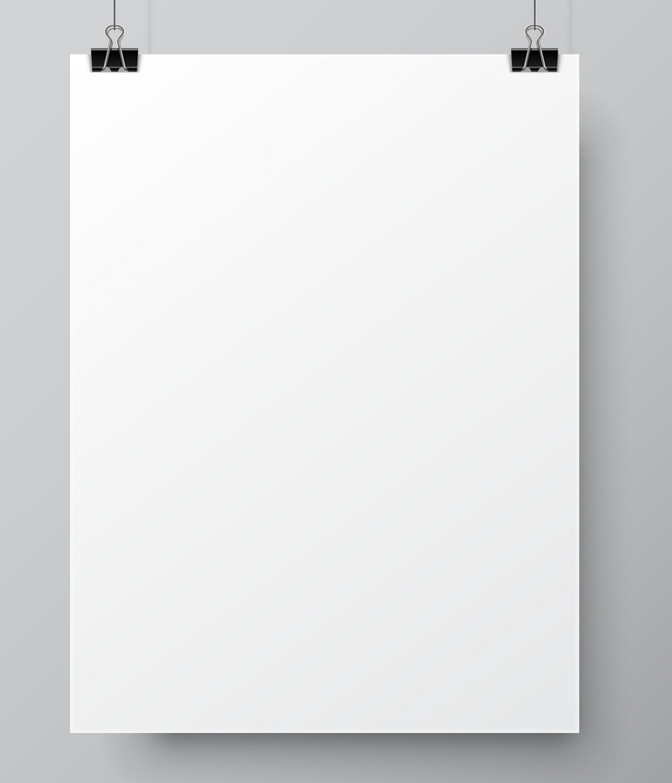
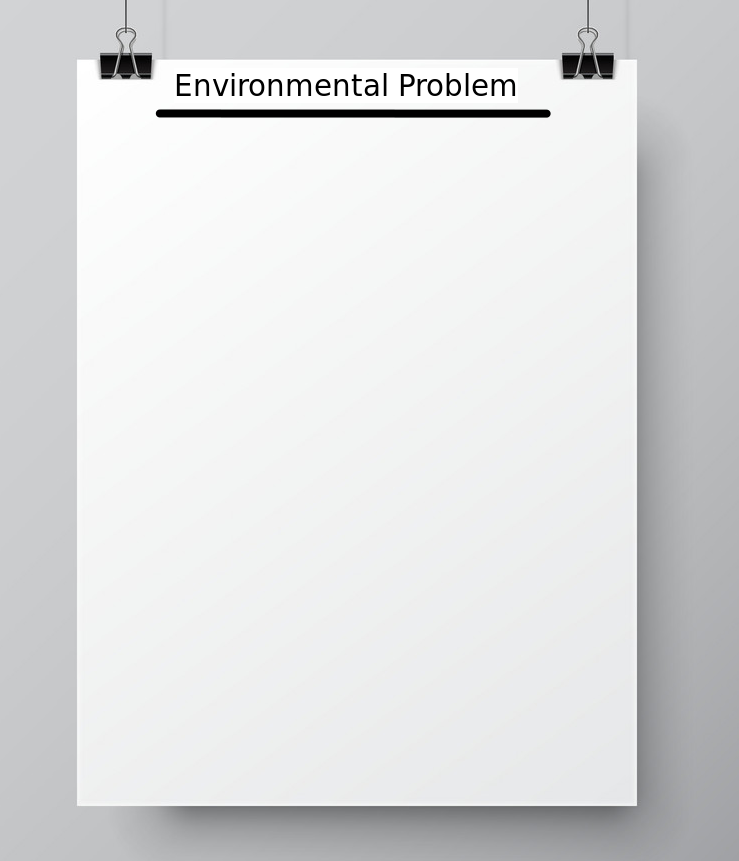
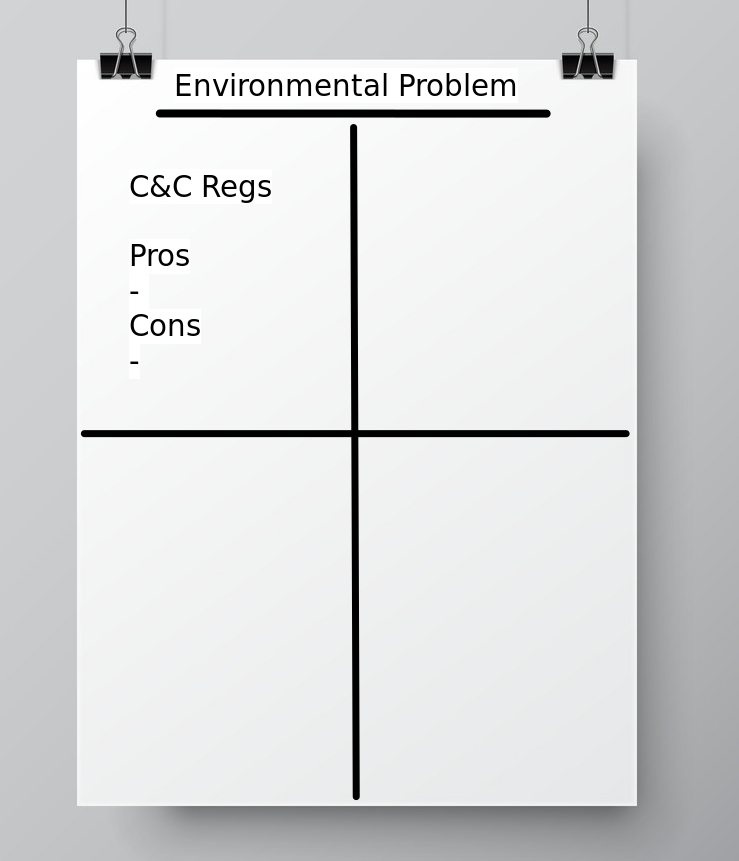
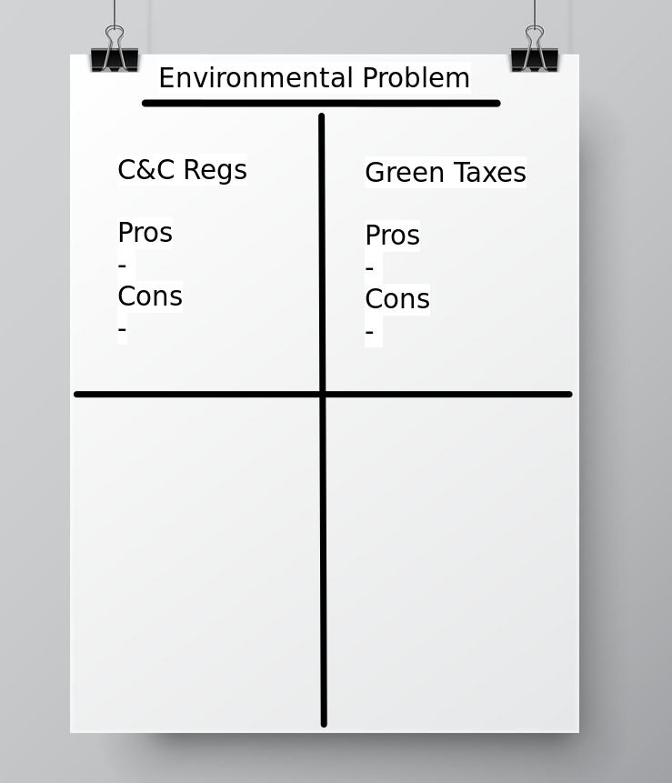
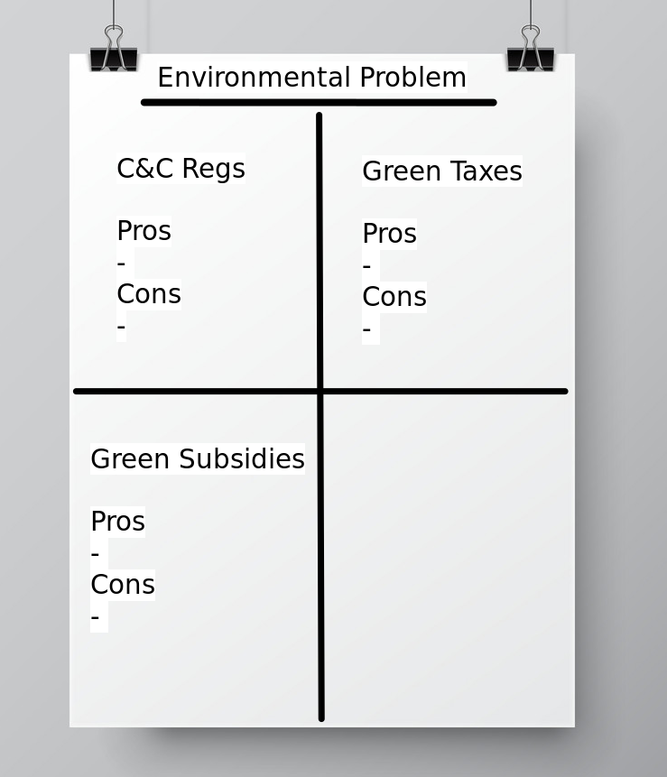
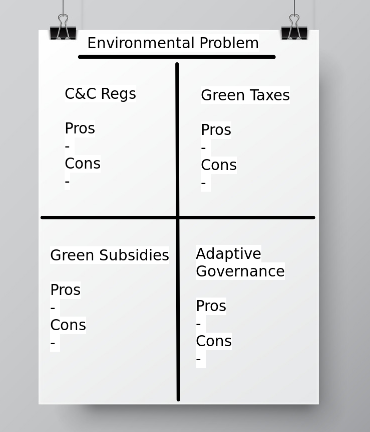

# Today's Agenda {background-image="libs/Images/background-forest_v3.png" }

```{r}
library(tidyverse)
library(readxl)
```

<br>

::: {.r-fit-text}
**Develop Analyses for Report 2**
:::

<br>

::: r-stack
Justin Leinaweaver (Spring 2024)
:::

::: notes
Prep for Class

1. Bring poster paper and sticky tac

2. Check submissions to Canvas
:::


## Paper 2 {background-image="libs/Images/background-forest_v3.png" .center}

<br>

Which of the four policy approaches is the "right" one for you?

- Analyze the pros and cons of each option **SEPERATELY** for your chosen environmental problem

::: notes
**Questions on the prompt?**

<br>

This week we'll work on the paper.
:::


## {background-image="libs/Images/background-forest_v3.png" .center}

```{r, fig.align='center'}

```

::: notes

Ok, does everybody have a poster?
:::


## {background-image="libs/Images/background-forest_v3.png" .center}

```{r, fig.align='center'}

```

::: notes

Next step, write your environmental problem at the top of the paper.
:::


## {background-image="libs/Images/background-forest_v3.png" .center}

```{r, fig.align='center'}

```

::: notes

Now split the poster into 4 quadrants.

Focus on our first approach, C&C regulations, and take 8 minutes to make a pros and cons list for your problem on the poster.

<br>

Use the full 8 minutes!

- This is a brainstorming session and you want as much in these boxes as you can think of.
    - Write drunk, edit sober!

- Once your poster is done we'll go around the room and give each other feedback and refine these lists.
:::


## {background-image="libs/Images/background-forest_v3.png" .center}

```{r, fig.align='center'}

```

::: notes

8 minutes, build your pros and cons list for green taxes
:::


## {background-image="libs/Images/background-forest_v3.png" .center}

```{r, fig.align='center'}

```

::: notes

8 minutes, build your pros and cons list for green subsidies
:::


## {background-image="libs/Images/background-forest_v3.png" .center}

```{r, fig.align='center'}

```

::: notes
8 minutes, build your pros and cons list for adaptive governance

<br>

Everybody grab a bit of sticky tak OR tape and use it to hang your poster on the wall.

<br>

Now, every other person starting with X, stay by your poster.

20 mins: Everyone else walk the circle, check out the other posters and give your fellow researchers feedback

- Are their lists clear enough?

- Are the lists long enough to be a thorough evaluation?

- Anything they are missing?

<br>

20 mins: Swap roles and do it again!
:::


## For Next Class {background-image="libs/Images/background-forest_v3.png" .center}

<br>

::: {.r-fit-text}
Write your rough draft
:::

::: notes
**Questions?**
:::