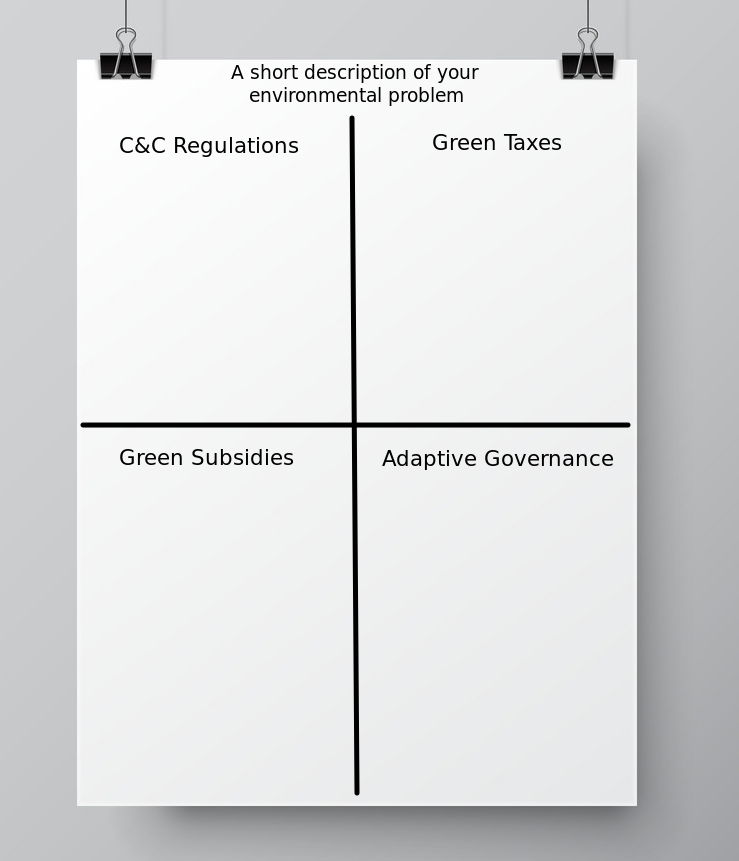

# Today's Agenda {background-image="libs/Images/background-forest_v3.png" }

```{r}
library(tidyverse)
library(readxl)
```

<br>

::: {.r-fit-text}
**Develop Analyses for Report 2**
:::

<br>

::: r-stack
Justin Leinaweaver (Spring 2024)
:::

::: notes
Prep for Class

1. Bring poster paper

2. Check submissions to Canvas

<br>

**SLIDE**: This week we work on your second paper.
:::


## Paper 2 {background-image="libs/Images/background-forest_v3.png" .center}

<br>

Which of the four policy approaches is the "right" one for you?

- Analyze the pros and cons of each option **SEPERATELY** for your chosen environmental problem

::: notes
**Questions on the prompt?**

<br>

Today I want us to help each other gather our thoughts together on the project and road test some policy proposals
:::


## {background-image="libs/Images/background-forest_v3.png" .center}

```{r, fig.align='center'}
knitr::include_graphics('libs/Images/11-1-Poster1.png')
```

::: notes
Everybody come get a sheet of poster paper

<br>

**Does everybody have a poster?**
:::


## {background-image="libs/Images/background-forest_v3.png" .center}

```{r, fig.align='center'}

```

::: notes
Step 1: Set up the poster

- Write a short description of your environmental problem across the top of the paper

- Add a 2x2 grid with a box for each of our policy design approaches

<br>

You are now going to brainstorm a specific policy under each of these headers that could be used to solve your specific local environmental problem.

- Your Canvas submission for today represents a jump start on this brainstorming

- Each of those "strong pro" arguments is the root of a policy proposal for addressing your problem
    - e.g. some specific reason why that option fits some part of your problem
    
<br>

Two notes for your poster

1. Don't work ahead on this as I'll give you some guidance for each and we'll touch base along the way.

2. Try to leave space under your policy in each box for notes or tweaks or comments to remember
:::


## Brainstorming Policies {background-image="libs/Images/background-forest_v3.png" .center}

:::: {.columns}
::: {.column width="60%"}

<br>

**C&C Regulations**

- Who are you targeting? 

- What do they have to do? 

- How will it be enforced?
:::

::: {.column width="40%"}
```{r, fig.align='center'}

```
:::
::::

::: notes
Be as specific as possible for each of these elements

- BUT, don't stress if the details don't all add up yet

<br>

**Questions?**

- 7 mins: Go!

<br>

*Get a volunteer to share theirs so we can discuss if it is "specific enough."*

<br>

*Give the class 2 minutes to tweak and then move to next*
:::


## Brainstorming Policies {background-image="libs/Images/background-forest_v3.png" .center}

:::: {.columns}
::: {.column width="60%"}

<br>

**Green Taxes**

- Who are you targeting? 

- What action are you taxing?

- How expensive is the tax?

- What will you do with the money?
:::

::: {.column width="40%"}
```{r, fig.align='center'}

```
:::
::::

::: notes
Ok, let's repeat the exercise for the tax approach!

<br>

**Questions?**

- 7 mins: Go!

<br>

PAIRS: Quick check for clarity and specificity

- Don't worry if it's convincing, just give your partner a check to make sure the policy is specific
:::


## Brainstorming Policies {background-image="libs/Images/background-forest_v3.png" .center}

:::: {.columns}
::: {.column width="60%"}

<br>

**Green Subsidies**

- Who are you targeting? 

- What do they have to do to get it?

- How much do they get?

- How will you pay for it?
:::

::: {.column width="40%"}
```{r, fig.align='center'}

```
:::
::::

::: notes
Ok, let's repeat the exercise for the subsidy approach!

<br>

**Questions?**

- 7 mins: Go!

<br>

PAIRS: Quick check for clarity and specificity

- Don't worry if it's convincing, just give your partner a check to make sure the policy is specific
:::


## Brainstorming Policies {background-image="libs/Images/background-forest_v3.png" .center}

:::: {.columns}
::: {.column width="60%"}

<br>

**Adaptive Governance**

- What is the resource system? 

- What are the resource units? 

- Who are you empowering to make the rules? (e.g. the boundaries)
:::

::: {.column width="40%"}
```{r, fig.align='center'}

```
:::
::::

::: notes
Ok, let's repeat the exercise for the adaptive governance approach!

<br>

**Questions?**

- 7 mins: Go!

<br>

PAIRS: Quick check for clarity and specificity

- Don't worry if it's convincing, just give your partner a check to make sure the policy is specific
:::


## Exchange Pitches! {background-image="libs/Images/background-forest_v3.png" .center}

```{r, fig.align='center'}

```

::: notes
*Have half the class put their posters up on the walls and stand by them*

<br>

Your job now is to pitch your proposals to everyone else in class and get feedback on your ongoing project

- Which of the four policy proposals do they like the best? why?

- Which the least? Why?

- Take notes! These reactions are the evals you need for this paper (and the final one!)

<br>

In X minutes we'll swap roles and repeat the exercise!

- Go!

<br>

Swap and repeat exercise...
:::


## For Next Class {background-image="libs/Images/background-forest_v3.png" .center}

<br>

::: {.r-fit-text}
Convert your notes into an outline

- Policy examples with pros and cons lists

- Add real-world examples
:::

::: notes
**Questions?**
:::