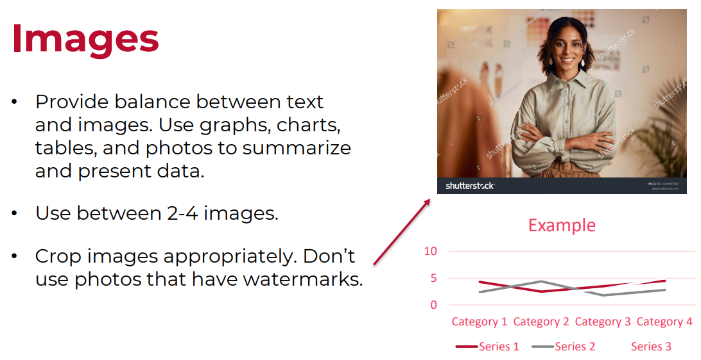
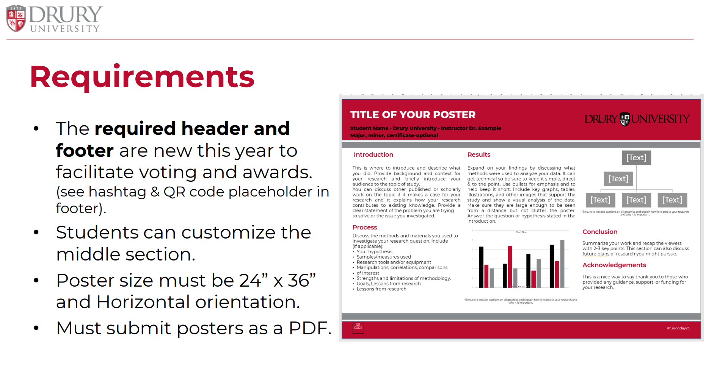
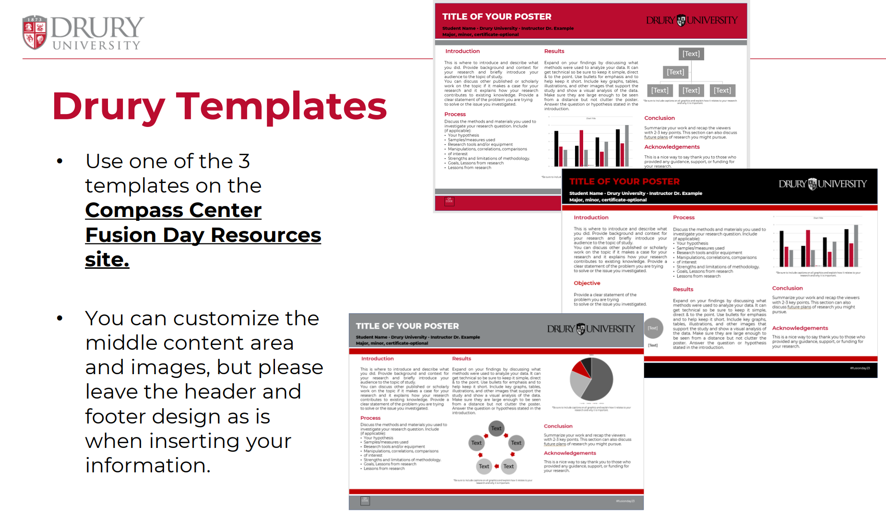
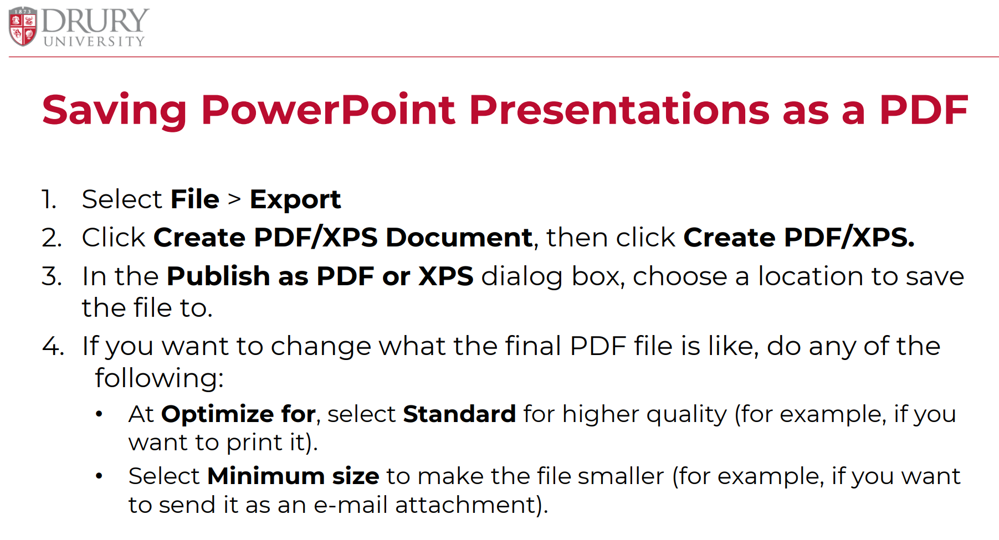
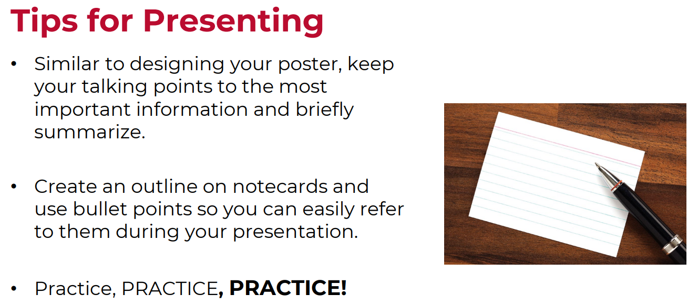
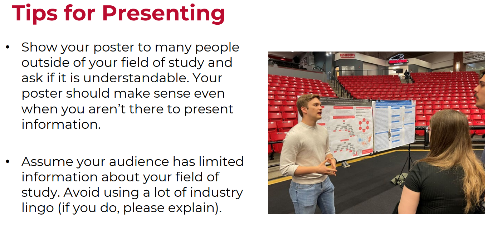

# Today's Agenda {background-image="libs/Images/background-forest_v3.png" }

```{r}
library(tidyverse)
library(readxl)
```

<br>

<br>

::: {.r-fit-text}
**Design a Poster for Fusion Day**
:::

<br>

<br>

::: r-stack
Justin Leinaweaver (Spring 2024)
:::

::: notes
Prep for Class

1. [Compass Center Resources](https://www.drury.edu/academic-affairs/fusion-day/compass-center-fusion-day-resources/)

<br>

This week we design your posters for Fusion Day.

- **SLIDE**: Let's talk details!
:::


## Assignment 3: Fusion Day Poster {background-image="libs/Images/background-forest_v3.png" .center}

**Big Picture Aim**

<br>

Design and present a poster for Fusion Day that introduces your **problem framing and proposed policy solutions** to our community.

::: notes
This is your chance to practice pitching your problem and possible solutions to our community.

<br>

It is super useful for you to:

1. Get feedback on your project from lots of different perspectives, and

2. Practice tightening your arguments before writing the final paper
:::


## Assignment 3: Fusion Day Poster {background-image="libs/Images/background-forest_v3.png" .center}

::: {.incremental}
1. **Problem Framing**: Convince the community member that we have a serious, local environmental problem that **they should care about**.

2. **Community Engagement**: Give the community member concrete options for **how they can get involved** in the problem locally (with your community engagement project as an example).

3. **Policy Solutions**: Propose **TWO policy options** we could implement in our community to address this problem
:::

::: notes
Your poster needs to hit three tasks

<br>

**REVEAL**: Pitch your problem framing (a baseline argument)

**REVEAL**: Community engagement

**REVEAL**: Policy solutions
:::


## Assignment 3: Fusion Day Poster {background-image="libs/Images/background-forest_v3.png" .center}

**Submission Requirements**

<br>

This assignment requires three elements:

1. **Submit** your Fusion Day poster to **Canvas**, 

2. **Submit** your poster to the **Compass Center** before the deadline, and 

3. **Present** your poster on **Fusion Day**.

::: notes
Three components to completing this class assignment.
:::


## Assignment 3: Fusion Day Poster {background-image="libs/Images/background-forest_v3.png" .center}

```{r, fig.align='center'}
knitr::include_graphics("libs/Images/10_2-Poster_Assignment.png")
```

::: notes
Here's the assignment prompt on Canvas

<br>

**Questions on any of the elements to this assignment?**

<br>

Before we get to work I want to share some advice from the Compass Center

- NOTE: ALL of the following slides/guidance are available on the Compass Center website

- **SLIDE**
:::


## Compass Center Advice {background-image="libs/Images/background-forest_v3.png" .center}

**Layout**

<br>

::: {.r-fit-text}
- Use bullet points not paragraphs

- Spell check!

- All words should be readable from 3 feet away
:::


## Compass Center Advice {background-image="libs/Images/background-forest_v3.png" .center}

```{r}

```


## Compass Center Advice {background-image="libs/Images/background-forest_v3.png" .center}

```{r}

```


## {background-image="libs/Images/11_1-Compass_Center6.png" background-size='85%'}


## {background-image="libs/Images/11_1-Compass_Center7.png"  background-size='85%'}


## {background-image="libs/Images/11_1-Compass_Center8.png" background-size='85%'}

## {background-image="libs/Images/11_1-Compass_Center9.png" background-size='85%'}


## Compass Center Advice {background-image="libs/Images/background-forest_v3.png" .center}

```{r}

```


## Compass Center Advice {background-image="libs/Images/background-forest_v3.png" .center}

```{r}

```


## Compass Center Advice {background-image="libs/Images/background-forest_v3.png" .center}

```{r}
knitr::include_graphics("libs/Images/11_1-Compass_Center14.png")
```


## Compass Center Advice {background-image="libs/Images/background-forest_v3.png" .center}

```{r}
knitr::include_graphics("libs/Images/11_1-Compass_Center15.png")
```


## Compass Center Advice {background-image="libs/Images/background-forest_v3.png" .center}

```{r}

```


## Compass Center Advice {background-image="libs/Images/background-forest_v3.png" .center}

```{r}

```


## Compass Center Advice {background-image="libs/Images/background-forest_v3.png" .center}

```{r}
knitr::include_graphics("libs/Images/11_1-Compass_Center18.png")
```


## Compass Center Advice (Slide 9) {background-image="libs/Images/background-forest_v3.png" .center}

```{r}
knitr::include_graphics("libs/Images/11_1-Compass_Center19.png")
```


## Assignment 3: Fusion Day Poster {background-image="libs/Images/background-forest_v3.png" .center}

```{r, fig.align='center'}
knitr::include_graphics("libs/Images/10_2-Poster_Assignment.png")
```

::: notes
Let's aim to share your progress in class on Thursday!

- Get and give some feedback!
:::
