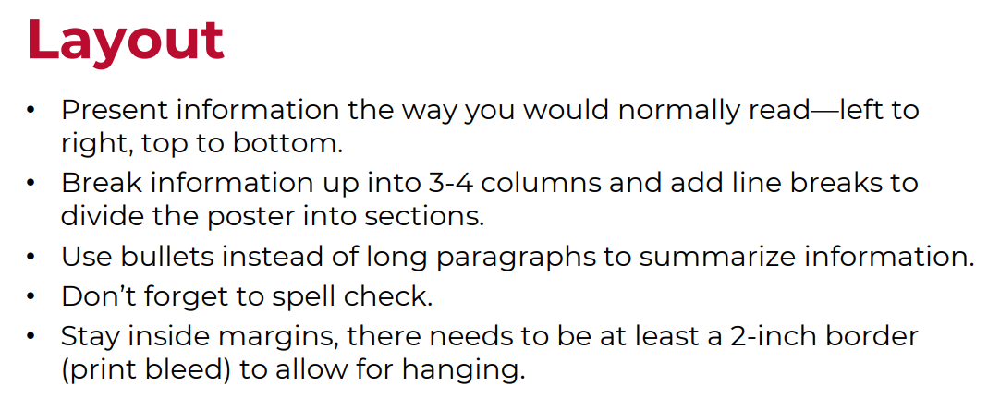
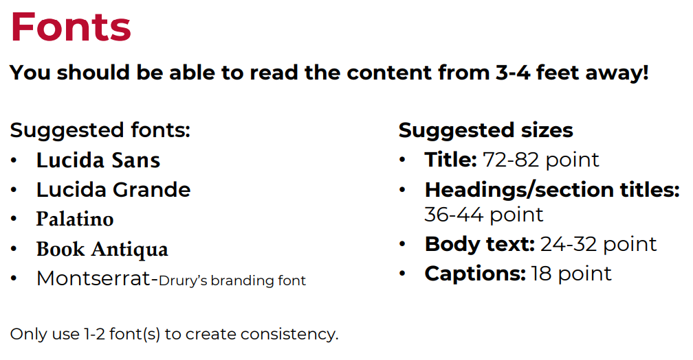
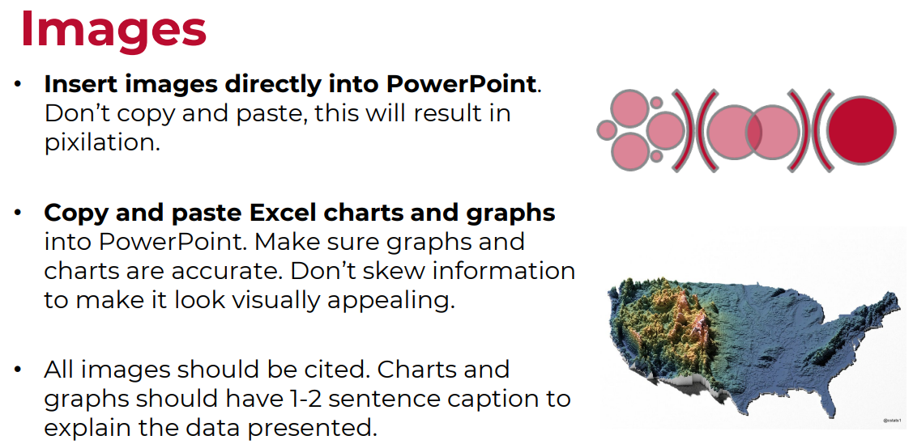
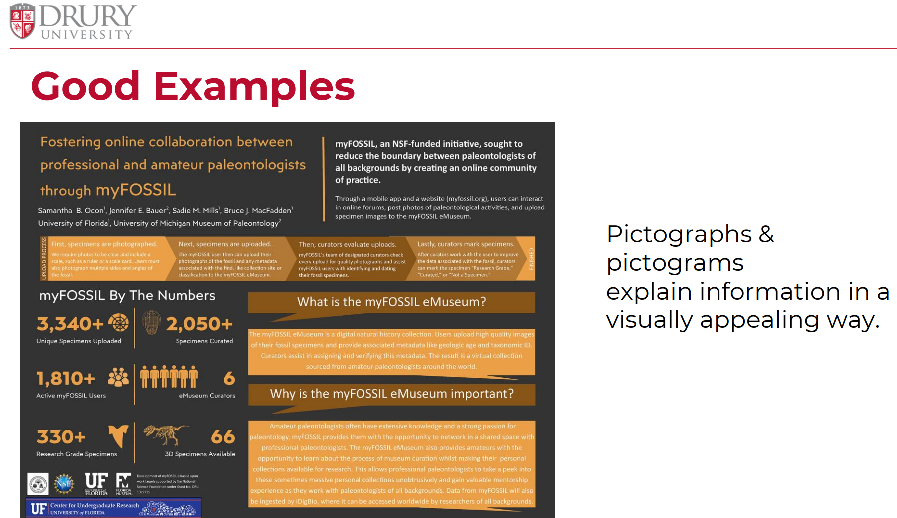
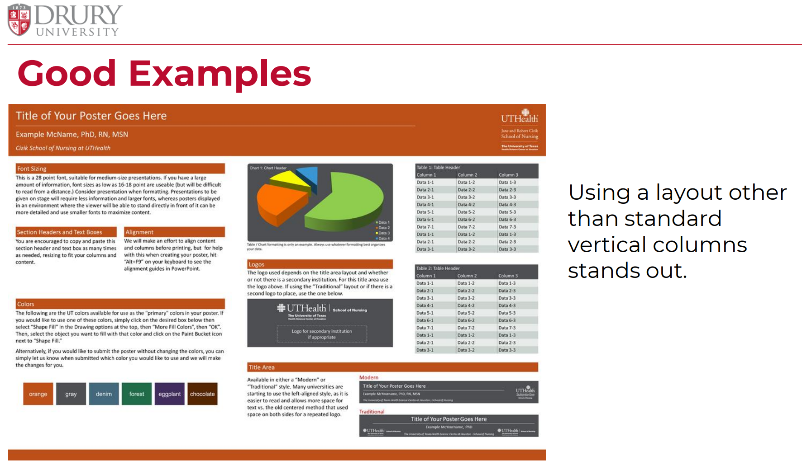
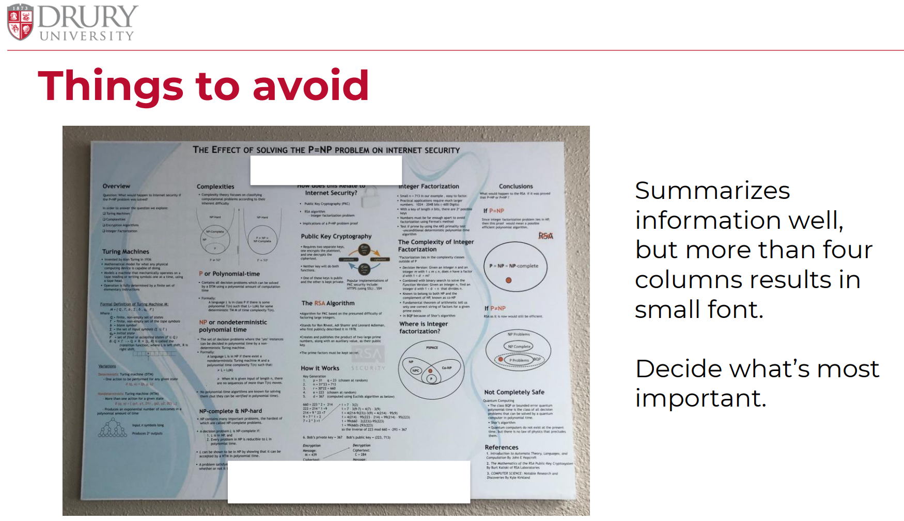
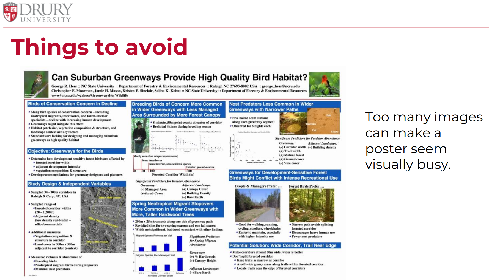

# Today's Agenda {background-image="libs/Images/background-forest_v3.png" }

```{r}
library(tidyverse)
library(readxl)
```

<br>

<br>

**Design a Poster for Fusion Day**

<br>

<br>

::: r-stack
Justin Leinaweaver (Spring 2024)
:::

::: notes
Prep for Class

1. [Compass Center Resources](https://www.drury.edu/academic-affairs/fusion-day/compass-center-fusion-day-resources/)
:::


## Assignment 3: Fusion Day Poster {background-image="libs/Images/background-forest_v3.png" .center}

**Getting Feedback from our Community**

```{r, echo = FALSE, fig.align = 'center'}
knitr::include_graphics("libs/Images/11_1-FD22 wide shot.jpg")
```

::: notes
Design a poster for Fusion Day that introduces your problem to the community and offers a test run of different solutions. 

- Your job is to present this poster during Fusion Day in order to collect community feedback on your problem framing (and proposed solution)
:::


## Assignment 3: Fusion Day Poster {background-image="libs/Images/background-forest_v3.png" .center}

<br>

1. Argument: We have a serious, local environmental problem

2. Community Engagement: What have you done to get involved?

3. Present **at least one** policy option we could implement in our community to address this problem

::: notes
Here's what I'd like your poster to include.

- A well supported argument, and

- A series of options you are inviting the community to weigh-in on.

<br>

### Questions on the components here?

<br>

**SLIDE**: Let's step through some advice from the Compass Center
:::

## Compass Center Advice {background-image="libs/Images/background-forest_v3.png" .center}

```{r}

```

## Compass Center Advice {background-image="libs/Images/background-forest_v3.png" .center}

```{r}

```


## Compass Center Advice {background-image="libs/Images/background-forest_v3.png" .center}

```{r}
knitr::include_graphics("libs/Images/11_1-Compass_Center3.png")
```


## Compass Center Advice {background-image="libs/Images/background-forest_v3.png" .center}

```{r}

```


## Compass Center Advice {background-image="libs/Images/background-forest_v3.png" .center}

```{r}
knitr::include_graphics("libs/Images/11_1-Compass_Center5.png")
```


## Compass Center Advice {background-image="libs/Images/background-forest_v3.png" .center}

```{r}

```

## Compass Center Advice {background-image="libs/Images/background-forest_v3.png" .center}

```{r}

```


## Compass Center Advice {background-image="libs/Images/background-forest_v3.png" .center}

```{r}

```


## Compass Center Advice {background-image="libs/Images/background-forest_v3.png" .center}

```{r}

```


## Compass Center Advice {background-image="libs/Images/background-forest_v3.png" .center}

```{r}
knitr::include_graphics("libs/Images/11_1-Compass_Center12.png")
```


## Compass Center Advice {background-image="libs/Images/background-forest_v3.png" .center}

```{r}
knitr::include_graphics("libs/Images/11_1-Compass_Center13.png")
```


## Compass Center Advice {background-image="libs/Images/background-forest_v3.png" .center}

```{r}
knitr::include_graphics("libs/Images/11_1-Compass_Center14.png")
```


## Compass Center Advice {background-image="libs/Images/background-forest_v3.png" .center}

```{r}
knitr::include_graphics("libs/Images/11_1-Compass_Center15.png")
```


## Compass Center Advice {background-image="libs/Images/background-forest_v3.png" .center}

```{r}
knitr::include_graphics("libs/Images/11_1-Compass_Center16.png")
```


## Compass Center Advice {background-image="libs/Images/background-forest_v3.png" .center}

```{r}
knitr::include_graphics("libs/Images/11_1-Compass_Center17.png")
```


## Compass Center Advice {background-image="libs/Images/background-forest_v3.png" .center}

```{r}
knitr::include_graphics("libs/Images/11_1-Compass_Center18.png")
```


## Compass Center Advice (Slide 9) {background-image="libs/Images/background-forest_v3.png" .center}

```{r}
knitr::include_graphics("libs/Images/11_1-Compass_Center19.png")
```


## Assignment 3: Fusion Day Poster {background-image="libs/Images/background-forest_v3.png" .center}

<br>

1. Argument: We have a serious, local environmental problem

2. Community Engagement: What have you done to get involved?

3. Present **at least one** policy option we could implement in our community to address this problem

::: notes
Let's aim to share your progress in class on Thursday!

- Get and give some feedback!
:::
