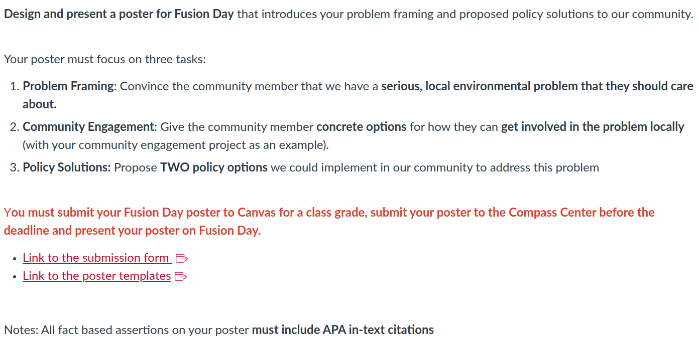
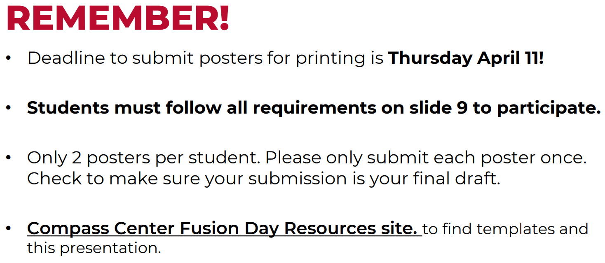
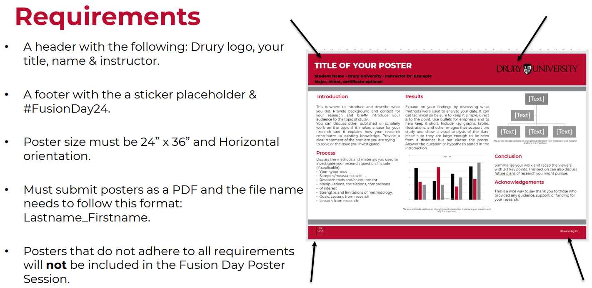

# Today's Agenda {background-image="libs/Images/background-forest_v3.png" }

```{r}
library(tidyverse)
library(readxl)
```

<br>

<br>

::: {.r-fit-text}
**Design a Poster for Fusion Day**
:::

<br>

<br>

::: r-stack
Justin Leinaweaver (Spring 2024)
:::

::: notes
Prep for Class

1. [Compass Center Resources](https://www.drury.edu/academic-affairs/fusion-day/compass-center-fusion-day-resources/)
:::


## Assignment 3: Fusion Day Poster {background-image="libs/Images/background-forest_v3.png" .center}

```{r, fig.align='center'}

```

::: notes
**Questions on the components here?**
:::


## Compass Center Advice {background-image="libs/Images/background-forest_v3.png" .center}

```{r}

```


## Compass Center Advice (Slide 9) {background-image="libs/Images/background-forest_v3.png" .center}

```{r}

```

::: notes
Alright, let's kick things off today walking around and checking out where we are!

<br>

Then we get back to work!
:::

