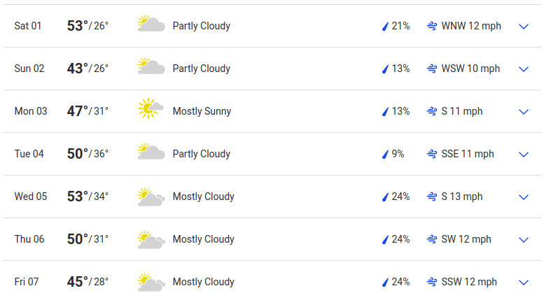

# Today's Agenda {background-image="libs/Images/background-forest_v3.png" }

```{r}
library(tidyverse)
library(readxl)
```

<br>

**III. Designing an Environmental Policy**

<br>

Complicating Factors in Environmental Policymaking

- Risk Aversion / Acceptance

<br>

::: r-stack
Justin Leinaweaver (Spring 2024)
:::

::: notes
Prep for Class

1. Bring pennies to class for coin flipping (1 per person)

2. **Run slides off of laptop today so you can update the slides as we go**

3. Prep Google Form to collect county fair responses AND email to distribute it
    - https://forms.gle/ZFe8ZGHLsSQnHN2o7

<br>

### SETUP NOTES FOR YOU
+ CORE201 FA15 1.2 and FA17 1.2
+ US PUBLIC POLICY 14.1
+ ADD Applied arguments: Ehrlich (averse) vs Simon (acceptant)
:::


## {background-image="libs/Images/background-forest_v3.png" .center}

```{r}
tibble(
  col1 = c("Participation", "1. The Problem", "2. Evaluating Designs", "3. Community Feedback", "4. Getting Involved", "5. Policy Design", "Total"),
  col2 = c("", "(Feb 24)", "(Apr 7)", "(Apr 15)", "(Apr 28)", "(Final)", ""),
  col3 = c(15, 15, 20, 15, 15, 20, 100)
) |>
  kableExtra::kbl(align = c("l", "c", "c"), col.names = c("", "", "%")) |>
  kableExtra::kable_styling(font_size = 40) |>
  kableExtra::column_spec(1, width = "20em") |>
  kableExtra::column_spec(2, width = "7em") |>
  kableExtra::row_spec(c(0, 7), bold = TRUE, background = "#b3ccff")
```

::: notes

Time to take stock of how far you've come in order to start looking ahead to your final paper.

- Paper 1: Selected a problem, defined it using evidence and identified key stakeholders involved in it

- Paper 2: You have evaluated four broad approaches to solving your problem in order to build an argument for your chosen policy design

- Paper 3: You have, or you're about to, engaged in our community in order to learn more about your problem and the stakeholders involved

- Paper 4: On Fusion Day you will have a chance to get community feedback on the policy options you are considering. 

<br>

**Remember, posters must be submitted to Canvas AND to the official Fusion Day website for approval and printing!**

### Any questions on the poster submission?
    
<br>

Your final paper asks you to reflect on all of this in order to design a policy for addressing your chosen problem. 

- We have lots of time before this is due but I want to keep reminding you of how all of these earlier pieces help you build to this.
:::


## Assignment 5: Proposing a Policy {background-image="libs/Images/background-forest_v3.png" .center}

<br>

Propose a policy to address your selected environmental problem that balances the interests of the relevant stakeholders against the constraints of established institutions and uncertainty.

::: notes

The Prompt

<br>

Let's talk about my expectations for this paper.

- Note that I've put these details on Canvas.
:::


## {background-image="libs/Images/background-forest_v3.png" .center}

:::: {.columns}
::: {.column width="50%"}

<br>

<br>

<br>

**Final proposal should be a complete, stand-alone policy proposal**
:::

::: {.column width="50%"}
```{r, fig.align='center'}
knitr::include_graphics('libs/Images/10-1-four_brains.jpg')
```
:::
::::

::: notes

Do NOT assume the reader is familiar with your other assignments or has a deep understanding of the problem itself.

<br>

You should be able to give your paper to a person interested in your problem and they should be able to understand why solving the problem is complicated and be convinced that your policy is a good idea.

- This means you should DEFINITELY take the best bits from your earlier papers and add them to this one.

<br>

### Does that make sense?

<br>

SLIDE: Ok, let's get more specific
:::


## A convincing policy proposal: {background-image="libs/Images/background-forest_v3.png" .center}

<br>

- Advances your policy recommendation in **EVERY** paragraph,

- Includes a clear and compelling problem definition,

- Identifies and appeals to specific stakeholders,

- Is adapted to the complicating factors relevant to your problem (e.g. institutions, uncertainty, free-riding, inequality, etc.), and

- Offers guidance for measuring its effectiveness over time.

::: notes

The bottom line here is I'm looking for you to connect your ideas in very concrete ways to the material we've been studying all semester.
- Problem framings matter,
- Generating stakeholder buy-in matters,
- Engaging substantively with the complications matters, and
- Planning for measuring success matters.

<br>

### Bottom line: I'm **much** more interested in **small, specific proposals** that are adapted to the real obstacles you face rather than broad and impossible reconstructions of society.

- My expectation is not that you've designed the ultimate plan that makes everyone happy.
    - That's not a thing that exists in the real world.

- My expectation is that you propose a policy that explicitly considers and tries to navigate past these complications.

<br>

### Does that make sense?

### Any questions on the prompt or any of this advice
:::


## Complicating Factors to Consider When Designing Your Policy {background-image="libs/Images/background-forest_v3.png" .center}

<br>

- Risk aversion (or risk acceptance)

- Temporal discounting and uncertainty

- Collective action problems and free-riding

- Inequality

- Greenwashing

::: notes

Over the next three weeks we'll explore these important topics.

- Each of these represents an additional layer on top of our baseline model of politics.

- Each of these represents an additional way of thinking about the obstacles you will face with your stakeholders.

<br>

Today we explore risk aversion and risk acceptance.

- All people in a community perceive risk differently and these differences make problem-solving much harder.

- Disputes over perceived risk tend to seriously complicate defining the problem and evaluating proposed solutions.

<br>

Of course, to talk about risk we have to first talk about probability.
:::


## {background-image="libs/Images/background-forest_v3.png"}

{.absolute width="75%" right=0}

{.absolute width="30%" left=50 bottom=200}

::: notes

*Distribute pennies*

### Let’s start with this, what is the probability of getting heads when you flip a penny?

#### - How do you know?

<br>

### Assuming a probability of 50%, how many heads would you expect if i asked you to flip your coin ten times?

+ (5)

<br>

Ok, let's test your intuition!

Flip your penny ten times and record the number of heads.

<br>

*Gather results and update next slide*
:::


## {background-image="libs/Images/background-forest_v3.png" .center}

```{r, fig.retina=3, fig.align='center', fig.asp=0.618, out.width = '95%', fig.width=5}
## Testing with fake data
# classsize <- 17
# d <- tibble(
#   heads = rbinom(n = classsize, size = 10, prob = .5)
#   #heads = c()
# )

## SP23 Results
#library(tidyverse)

d <- tibble(
 heads = c(6, 6, 4, 2, 5, 4, 4, 7, 5, 6, 7, 8, 1, 7, 6, 6, 5, 2),
 tails = 0
)

classsize = nrow(d)

## Make bar plot
p1 <- ggplot(data = d, aes(x = heads)) +
  geom_bar() +
  labs(y = "", x = "Number of Heads in Ten Flips") +
  scale_x_continuous(breaks = 0:10, limits = c(0,10)) +
  geom_hline(yintercept = seq(2,6,2), color = "white") +
  theme_minimal()

p1

# SP22 Results
# d <- tibble(
#  heads = c(6, 4, 4, 8, 7, 2, 2, 7, 4, 4, 6, 4, 6, 4, 9, 8, 5, 6, 5),
#  tails = 0
# )
```

::: notes

**What do we learn from our experiment?**

- **Was our estimate of the probability of getting heads wrong or did we do our experiment wrong?**

<br>

Over just a few flips of the coin, many results are possible.

- However, as a class you just flipped the coin `r classsize*10` times.

- That is plenty times to start to zoom in on the actual probability of these pennies. 

<br>

SLIDE: If we average all of your flips together we get:
:::


## {background-image="libs/Images/background-forest_v3.png" .center}

```{r, fig.align='center', fig.asp=0.618, fig.width=5}
## Make bar plot with mean
p1 +
  geom_vline(xintercept = mean(d$heads), color = "red", size = 1.2) +
  annotate("text", x = 8, y = 5, label = str_c("Mean: ", round(mean(d$heads), 1)), color = "red", size = 6)

```

::: notes

### Given this result, what is the probability of heads using our pennies?

<br>

Ok, let's make sure we're clear.

### Based on this exercise, i want you to define the word probabiility for me.

(The probability is the likelihood of an event over the long run.)

+ If we flip these pennies many, many, many times we should get heads about this proportion of the time.

<br>

In other words, the probability is what we expect to happen if we could repeat a choice or an action many, many times.
:::


## {background-image="libs/Images/background-forest_v3.png" .center}

```{r, fig.align='center'}

```

::: notes

Think about this as it relates to the weather.

### When the weather person tells you there is a 25% chance of rain today, what are they telling you?

+ If you lived this day one hundred times, it would rain approximately 25 times.
    - That's what they mean by 25%
    
+ In other words, they ran a computer simulation of today's weather a bunch of times and on one quarter of their simulations it rained, and on 3/4's of them it didn't

<br>

### When the weather forecast is for a 50% chance of rain today, what does that actually mean?

+ (SLIDE)
:::


## {background-image="libs/Images/05-1-confused_weatherman.jpg" .center}

::: notes

(It rained in half of the simulations)
- In other words, they have no idea what is going to happen today.

<br>

### So, what does this mean for us, a group of people who will only live today one time?
#### - Do I bring an umbrella to work on a 50% chance of rain day or not?

+ ?

<br>

THIS is where your personal level of risk aversion or acceptance comes in!

- The probability tells you the tendency of an event, but not the certainty of it.

- YOU then have to decide the risks and rewards of acting as if that event will or won't happen.

<br>

### Don’t worry about the math, just tell me, does the intuition of a  probability make sense?

+ It is the likelihood of an event **over the long run**.
:::


## {background-image="libs/Images/05-1-County_Fair.webp" .center}

::: notes
Now that you are all masters of probability, let’s dig into each of your risk profiles by gambling!

Imagine you are at the county fair with your best girl or guy and you come across a game called "Heads you win, Tails you lose."
:::


## Heads you win, Tails you lose {background-image="libs/Images/background-forest_v3.png" .center}

**Flip a fair coin: Heads pays you $5, tails you get nothing**

```{r, fig.align='center'}

```

::: notes
The game: Flip a fair coin, heads pays $5, tails you get nothing.

- Everybody take a minute to think about this game.

- Now, write down the maximum amount of money you would pay to play this game.

- Don't say it out loud, just write down your answer!

<br>

### Everybody have their answer written down?

Ok, rewind your imaginary date and let's replay the game!
:::


## Heads you win, Tails you lose {background-image="libs/Images/background-forest_v3.png" .center}

**Flip a fair coin: Heads pays you $100, tails you get nothing**

```{r, fig.align='center'}

```

::: notes

You and your date arrive at the fair and see this game where heads pays you $100!

- Take a minute to think about it and write down the maximum amount you would pay to play this game.

<br>

*Send out Email with Google Form link*

- Update following with new data
:::


## {background-image="libs/Images/05-1-County_Fair.webp" .center}

```{r, fig.align='center', fig.asp=1, fig.width=7}
# Import the Data (Fake data SP23)
d <- read_csv("County Fair Game (Spring 2024).csv") |>
  select(name = `Name?`,
         choice5 = `Flip a fair coin: Heads pays you $5, tails you get nothing\nWhat is the maximum amount of money you would pay to play this game?`,
         choice100 = `Flip a fair coin: Heads pays you $100, tails you get nothing\nWhat is the maximum amount of money you would pay to play this game?`)

# Outputs
# bars of choice 5
d |>
  ggplot(aes(x = choice5, y = reorder(name, choice5))) +
  geom_col() +
  labs(x = "Maximum amount you would pay", y = "",
       title = "Version 1: Heads Pays $5") +
  theme_bw() +
  scale_x_continuous(labels = scales::dollar_format())
```

::: notes

Here are our results focused on the first version of the game.

### Explain to me your choices here.

<br>

**SLIDE**: Version 2

:::

## {background-image="libs/Images/05-1-County_Fair.webp" .center}

```{r, fig.align='center', fig.asp=1, fig.width=7}
# bars of choice 100
d |>
  ggplot(aes(x = choice100, y = reorder(name, choice100))) +
  geom_col() +
  labs(x = "Maximum amount you would pay", y = "",
       title = "Version 2: Heads Pays $100") +
  theme_bw() +
  scale_x_continuous(labels = scales::dollar_format())
```

::: notes

Here are our results focused on the second version of the game.

### Explain to me your choices here.

<br>

**SLIDE**: Link the results!
:::


## {background-image="libs/Images/05-1-County_Fair.webp" .center}

```{r, fig.align='center', fig.asp=.9, fig.width=7}
d |>
  mutate(
    percent_win5 = choice5/5,
    percent_win100 = choice100/100
  ) |>
  ggplot(aes(x = percent_win5, y = percent_win100)) +
  geom_abline(slope = 1, intercept = 0, linewidth = .1) +
  geom_point() +
  ggrepel::geom_text_repel(aes(label = name)) +
  theme_bw() +
  scale_x_continuous(labels = scales::percent_format(), limits = c(0,1)) +
  scale_y_continuous(labels = scales::percent_format(), limits = c(0,1)) +
  labs(x = "Version 1: Heads Pays $5", y = "Version 2: Heads Pays $100",
       title = "Percent of winning amount you would pay")
```

::: notes

Here I've converted all of your maximums into a % of the possible winnings.

- So, if you would pay $2.50 for the $5 game then you would pay half the winnings (e.g. 50%)

<br>

The 45 degree line maps equal proportions

- So, any dot on the line is someone whose maximums are the same proportions in both games.

- If your dot is below the 45 degree line then you would pay more to play version 1 than version 2

- Above the line you are more willing to pay more to play the $100 game

<br>

### What do we learn from comparing and contrasting your amounts? 
### - Is there a correct answer?

- No! Everyone has a different relationship with risk.
    - Some people are more / less willing to take on risk to win profit.
    - Not right or wrong, just different willingness to risk.
    - In other words, some people are more risk acceptant and others are more risk averse.

<br>

### Why aren't all the numbers in the $100 game exactly 20 times the answers in the $5 game column?

### - What does all this tell us about human decision-making?

- Your relationship to risk is sensitive to both the size of the risk AND the size of the reward!

- Some people will be willing to accept risk when the reward is huge, but not when it is small (e.g. playing the lottery)

:::


## {background-image="libs/Images/05-1-intersection.jpg" .center}

::: notes

Important note: this is not just about games of chance.

Your decision-making is constantly influenced by your feelings about risk.

### Who here has a car?

<br>

### Ok, drivers, so you're cruising down the road and you see this ahead of you. What do you see and what do you do about it?

+ ?

<br>

### Make this clear for me, how do stop lights illustrate different peoples' levels of risk aversion?

+ Run a red light and get home faster (value!), BUT some probability of getting pulled over or an accident or hurting someone...

<br>

### Any questions about these basic introductions to probabilities or risk aversion?
:::


## {background-image="libs/Images/background-forest_v3.png" .center}

```{r, fig.align='center'}
knitr::include_graphics('libs/Images/05_1-monkey_darts_politics.jpg')
```

::: notes

Let's now take this back to our work building models of politics and problem-solving.

### What were some of the key things elements we argued were important when thinking strategically about problem-solving in a political world?

+ Interests, institutions and interactions
+ Problem definitions matter
+ Broad participation in rule-making seemed important
+ ?

<br>

### How does our discussion about risk today impact our models of politics and problem-solving?

(A key complicating factor!)

- Interests defined not just by what they want BUT ALSO by their risk tolerance!

- Two stakeholders presented with the exact same policy (e.g. rules of behavior) may each choose to behave in completely different ways BECAUSE of their different willingnesses to accept risk!

<br>

Let's now shift to the readings for today.
:::


## Ehrlich, P. & Ehrlich, A. (2008, August 4). Too Many People, Too Much Consumption. *Yale Environment 360*. {background-image="libs/Images/background-forest_v3.png" .center}

::: notes

Ok, let's examine the Ehrlich and Ehrlich paper first.

<br>

### What is the conclusion of the argument by Ehrlich and Ehrlich?

- (**SLIDE**: Therefore, a combination of overpopulation x overconsumption has us on track for disaster.)
:::


## Ehrlich, P. & Ehrlich, A. (2008, August 4). Too Many People, Too Much Consumption. *Yale Environment 360*. {background-image="libs/Images/background-forest_v3.png" .center}

<br>

Therefore, a combination of overpopulation and overconsumption has us on track for disaster

::: notes
**Take a few minutes on your own to identify the key premises the authors use to support this conclusion.**

<br>

### Consolidate lists with person next to you.

<br>

*ON BOARD*

+ (We are rapidly depleting the natural capital of the Earth; soil, groundwater, biodiversity)
+ (Negative Impact = Pop x Consumption x Technology)
+ (Technology improvements can help but cannot save us)
+ (Many past human societies have collapsed under the weight of overpopulation and environmental neglect, e.g. see Easter Island, the Mayans, and Nineveh)
+ (It is getting harder to locate the resources we need, e.g. have to mine deeper, use poorer soils, etc)
+ (Population control is controversial on both the left and the right though for different reasons and the media is "pro-natalist" in its framings of these stories, e.g. more births are good)
+ (Tackling overconsumption is complex and very, very difficult)

<br>

### Add all of this together and tell me, which perspective on risk does the Ehrlich and Ehrlich piece represent? Risk acceptance or aversion? Why?

+ (Aversion!)

<br>
:::


## Simon, J. (1993). Population Growth Is Not Bad for Humanity. *PRI Review*, 3(6). {background-image="libs/Images/background-forest_v3.png" .center}

::: notes

Let's jump to the second article.

### What is the conclusion of the article by Julian Simon?

- (**SLIDE**: Therefore, it is reasonable to expect "that the energetic effort of humankind will prevail in the future, as they have in the past, to increase worldwide our numbers, our health, our wealth, and our opportunities" (10))
:::


## Simon, J. (1993). Population Growth Is Not Bad for Humanity. *PRI Review*, 3(6). {background-image="libs/Images/background-forest_v3.png" .center}

<br>

Therefore, it is reasonable to expect "that the energetic effort of humankind will prevail in the future, as they have in the past, to increase worldwide our numbers, our health, our wealth, and our opportunities" (10)

::: notes
**Take a few minutes on your own to identify the key premises Simon uses to support this conclusion.**

<br>

### Consolidate lists with person next to you.

<br>

*ON BOARD*

+ (Overpopulation hysteria has cost us dearly, distracted us from improving lives through targeting economic and political systems)
+ (The research shows "that faster population growth is not associated with slower economic growth")
+ (Market-directed economies do better than centrally planned ones)
+ (As with man-made production capital, so it is with natural resources: Shortages lead to the discovery of substitutes)
+ (Shortages ACTUALLY tend to leave us better off than before)
+ (The only serious shortage is ACTUALLY human beings!)
+ (The most important benefit of population size and growth is the increase it brings to the stock of useful knowledge.)
+ (Progress is limited largely by the availability of trained workers.)

<br>

### So, which perspective on risk does the Simon piece represent? Risk acceptance or aversion?
- (Acceptance!)
:::


## Bottom line, which side is more convincing? {background-image="libs/Images/background-forest_v3.png" .center}

<br>

Ehrlich, P. & Ehrlich, A. (2008, August 4). Too Many People, Too Much Consumption. *Yale Environment 360*.

<br>

Simon, J. (1993). Population Growth Is Not Bad for Humanity. *PRI Review*, 3(6).

::: notes
**Bottom line, which side is more convincing to you? Why?**

<br>

### Is your feeling on this consistent with your risk level as determined by our game to start class?

<br>

### Is everybody clear on how differing levels of risk aversion complicate environmental problem-solving?
:::


## Complicating Factors to Consider When Designing Your Policy {background-image="libs/Images/background-forest_v3.png" .center}

<br>

How does risk aversion (or risk acceptance) complicate your efforts to address your specific environmental problem?

::: notes

Everybody take a few minutes to reflect on how our material from today impacts your specific environmental problem.

<br>

Alright, let's share!
:::

