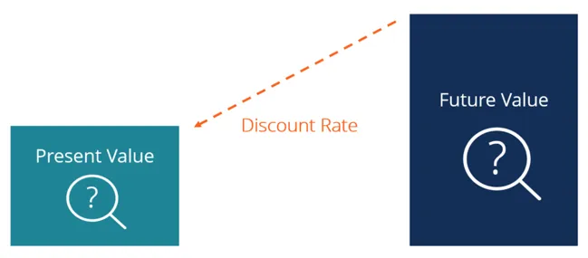
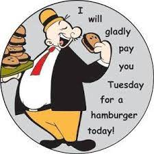
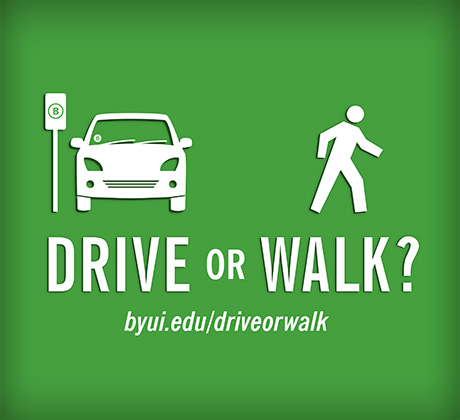
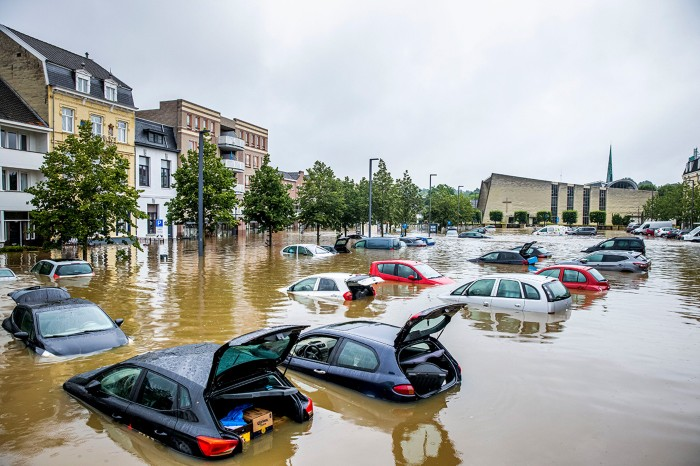

## Today's Agenda {background-image="libs/Images/background-forest_v3.png" .center}

```{r}
library(tidyverse)
library(readxl)
library(haven)
library(gganimate)
```

<br>

::: {.r-fit-text}
**III. Designing an Environmental Policy**

- Complications 2: Temporal Discounting & Uncertainty
:::

<br>

::: r-stack
Justin Leinaweaver (Spring 2024)
:::

::: notes
Prep for Class

1. Run slides on laptop IF you are recording student values electronically

2. Build a Google Form to collect data and prep email to distribute it
    - https://forms.gle/pNtYq8RtixoeqTAB8

3. Old US Public policy notes (14.2) covered temporal discounting
:::


## Fusion Posters Due Today! {background-image="libs/Images/background-forest_v3.png" .center}

```{r}
knitr::include_graphics("libs/Images/11_1-Compass_Center19.png")
```

::: notes
Remember, posters must be submitted to Canvas AND to the official Fusion Day website for approval and printing!

- In other words, you have to submit TWICE!

<br>

**Any questions on the poster or the submission?**
:::


## Complicating Factors to Consider When Designing Your Policy {background-image="libs/Images/background-forest_v3.png" .center}

<br>

- Risk aversion (acceptance)

- Temporal discounting and uncertainty

- Collective action problems and free-riding

- Inequality

- Greenwashing

::: notes

This final section of our class is our chance to dig into some of the complications you as policy designers need to be aware of when trying to solve environmental problems.

<br>

**SLIDE**: On Tuesday we started by exploring the complications created by stakeholders different perceptions of risk.
:::


## {background-image="libs/Images/06-1-risk_meter.jpeg" .center}

::: notes

Talk to me about how risk aversion complicates policy-making and problem-solving

- **In other words, what were your takeaways from last class?**

<br>

All people vary in their attitudes towards risk

- Depending on the context of a situation some people tend to be more willing than others to take on a risk in order to obtain a benefit

- **Give me an example of a situation in your day-to-day life in which you are more risk averse**

- **Give me an example of a situation in your day-to-day life in which you are more risk acceptant**

<br>

Let's take this into the projects you are working on.

- **Give me an example of how risk complicates the problem you are trying to address.**

<br>

**Which of the four policy design options are best suited for dealing with stakeholders who have different levels of risk aversion?**

- (Subsidies are AWESOME for this)
    - Free money can pretty easily overcome small amounts of risk aversion

- (C&C might not be popular but may be necessary if risk acceptance levels are too high)
    - e.g. create a rule that says a specific industry may not gamble with public health for profit
:::


## {background-image="libs/Images/06-1-time_horizons_sharks.webp" .center}

::: notes

Today we shift to our second set of complications: Temporal discounting and uncertainty

- Just as people differ in their approaches to risk, they differ in their approaches to time and uncertainty.

<br>

Let's consider our friend here

- His goal is to cross a body of water to reach a point on the other side.

- In this toy example we'll say he has two options to choose from

<br>

Option 1 is to focus on the short-term risks

- e.g. steer the boat to dodge every rough wave and shark in his path

- This focus protects what he has, maximizes his short-term survival and minimizes short-term costs

- The problem is that all this movement reacting to the immediate risks means he never reaches the other side of the sea

<br>

Option 2 is to focus on the long-term risks

- e.g. steer the boat to stay on track for the goal on the distant shore

- This focus mostly ignores the waves and sharks

- The problem is that this distant focus may incur serious costs along the way (e.g. sinking and/or being eaten)
:::


## {background-image="libs/Images/12_2-machu-picchu-huayna-picchu.jpg" .center}

<br>

<br>

<br>

<br>

<br>

<br>

<br>

<br>

::: {.fragment}

```{r, fig.align = 'center', fig.width = 10, fig.height=1}
## Manual Dimension
d1 <- tibble(
  x = c(-3, 3),
  y = c(1, 1),
  labels = c("Short-Term", "Long-Term")
)

ggplot(data = d1, aes(x = x, y = y)) +
  geom_point(size = 8) +
  theme_void() +
  coord_cartesian(xlim = c(-4, 4)) +
  geom_label(aes(label = labels), size = 7) +
  annotate("segment", x = -2.2, xend = 2.2, y = 1, yend = 1, arrow = arrow(ends = "both"))
```
:::

::: notes

I assume we all intuitively understand that neither extreme is likely a good primary strategy.

- You cannot ignore the short-term and hope to survive

- You cannot ignore the long-term and hope to achieve your goals

<br>

**REVEAL**: For our purposes we want to recognize that people vary in their placement along a dimension running between these extremes

- AND, just like the variance in risk profiles, your placement along this dimension will be different depending on the specific context of the problem you are dealing with

- This means all of the stakeholders you are working with, or on, undoubtedly come to your problem with different time scales in mind

<br>

Key takeaways as policy designers:

1. There is no "correct" time horizon (e.g. no "right" choice for everyone.), and

2. The same individuals will adopt different time horizons for different kinds of decisions.

<br>

**SLIDE**: Ok, we need tools to help us quantify and analyze time horizons.
:::


## Temporal Discounting {background-image="libs/Images/background-forest_v3.png" .center}

<br>

```{r, fig.align='center'}

```

::: notes

Temporal discounting is an approach developed by economists and policy analysts for thinking about the impact of different time horizons.

- Discounting simply means: To count at less than face value.

- In short, "discounting" is what you do anytime someone asks you to think about the value of a possible future

<br>

All people discount the future due to uncertainty but the amounts people discount by will vary considerably.

- I'm hoping you covered this in some depth in Environmental Economics.

<br>

Let's clarify the intuition by talking about money

- **Why is money you may receive in the future less valuable than money you could receive right now?**

<br>

- (You might die: Uncertainty in "if" you will be around to receive it)

- (The payer might die: Uncertainty if the institution that is going to pay you will still exist at payment due date)

- (Inflation may ruin the value of the money: Uncertainty in what the money will be worth when you get it)

<br>

**SLIDE**: I assume death and insolvency make sense, but let's talk uncertainty caused by inflation for a second.
:::


## {background-image="libs/Images/06-1-popeye1.gif" .center}

::: notes
**Anybody watch popeye cartoons growing up?**

<br>

He was a "sailor man" who got into scrapes starting in comic strips of the 1930s.

- When he ate spinach he became super strong and then he'd inevitably beat the crap out of the problem.

<br>

I loved these cartoons as a kid and they definitely got me to eat my spinach.

- I digress, this isn't actually about Popeye at all.
:::


## Discounting for Inflation {background-image="libs/Images/background-forest_v3.png" .center}

<br>

```{r, fig.align='center'}

```

::: notes

My shortcut to thinking about temporal discounting due to inflation is all about Wimpy.

<br>

J Wellington Wimpy was the "straight man" to Popeye's character.

- He was a con man always trying to get people to pay for his beloved hamburgers.

- The gag was that he would try to convince people to buy him a burger with the promise that he would pay them next week.

<br>

Hilarious joke during the great depression, right?
:::


## {background-image="libs/Images/12_2-Inflation-FRED-2024-03.png" .center}

::: notes

Setting aside the depressing nature of old-timey cartoons, let's bring this back to the discount rate.

<br>

Here we see the Federal Reserve Bank's estimate of the Consumer Price Index.

- This is an attempt to estimate the "price" of the common goods consumers depend on.

<br>

I've plotted this as a percentage change per month

- So, points above the line was a month when "things" were getting more expensive

- Below the line, "things" were getting cheaper

<br>

Looking at the recent US experience of inflation we see:

- The grey section was a recession (e.g. two or more quarters of shrinking GDP) and prices fell

- Covid shutdowns made prices rise as supply chains were hit

- Since July 2022 things have settled back into a much more normal range

<br>

**SLIDE**: What do I mean by "normal" inflation?

<br>

*Figure Source*: [LINK](https://fred.stlouisfed.org/series/CPIAUCSL#) *5-ish year time frame, percent change, edit dimensions: 1050w x 600h*
:::


## {background-image="libs/Images/12_2-Inflation-FRED_longer-2024-03.png" .center}

::: notes
Here's quarterly inflation data going back to WW2

- Super high inflation shortly after WW2 as consumer economies roared back to life

- US economy hit hard by the oil embargoes of 1973-1974
    - OPEC refused to sell us oil because we supported the Israeli's in the 1973 Yom Kippur war
    
- You can see the financial mess in 2008 re the housing crisis

- And then covid hit supply chains

<br>

Takeaways:

1. People flipping out over inflation today have VERY short memories, and

2. Things are looking basically recovered now

<br>

Bringing this back to temporal discounting!

- Across essentially all 75 years inflation has been positive every quarter

- This means that since WW2 $1 today buys less stuff than it did one year ago

<br>

**SLIDE**: That last point is important in terms of buying a hamburger!
:::


## {background-image="libs/Images/06-1-Inflation_annotated2.png" .center}

::: notes

Let's use our inflation data here to talk in hamburger terms!

- Let's say at this point, mid-2020, a hamburger cost $1.

- At this point, 3 years later, that $1 burger now costs $1.20 due to inflation.

<br>

This means that over three years your dollar became less valuable.

- In 2020 it was worth an entire hamburger

- Three years later that same dollar buys about 80% of a hamburger

<br>

### Make sense?
:::


## {background-image="libs/Images/06-1-Inflation_annotated2.png"}

{.absolute left=0 bottom=175 width="35%"}

::: notes

If Wimpy expects positive inflation then burgers today are cheaper than burgers tomorrow, AND dollars today are more valuable than dollars tomorrow

- So, Wimpy tries to convince you to use a valuable dollar to buy him a cheap hamburger with the promise of paying you back later when dollars are easier to get

- **Make sense?**

<br>

You can see from this why those who have money are terrified of inflation.

- Every year the value of your money, in a growing economy, goes down

- This means you can't just hold cash and hope to be ok in the future, you are compelled to grow it just to stand still!

- This is how capitalism works for all its good and bad parts

<br>

Of course, Wimpy lived during the Great Depression so the "joke" here is way darker

- Wimpy's scam is that he has lost all hope and isn't sure he'll be alive next week to pay you back

- Eat today because tomorrow probably isn't coming.

- Hilarious, right? Oy.

<br>

In either version, Wimpy is demonstrating for us how a discount rate impacts decision-making.

- People may discount the future for many reasons and the level of that discount impacts their present decision-making.

<br>

**Questions on these concepts?**
:::


## {background-image="libs/Images/06-1-choices.jpg"}

::: notes

Let's play with this idea and explore your personal discount rates.

<br>

Everybody take out a piece of paper or something you can write on.

<br>

I'm going to ask you a series of questions

- Each question presents you with a simple choice to make when presented with a money decision

<br>

I want you to reflect on each decision and then write down your answers.

- Don't stress the "rightness" of these, and don't overthink it.

- Just trust your gut!

<br>

**SLIDE**: Offer number 1
:::


## Receiving a Benefit {background-image="libs/Images/12_2-Fork_in_Road_v2.png"}

<br>

<br>

**Offer 1: An immediate payment of $10**

<br>

::: {.fragment}

How much would I have to offer you (in total) to get you to wait one year for the payment?

:::

::: notes

Here's the set-up: You are being offered a payment of $10 right now

- In short, I will hand you $10 and we're all done

- **Everybody understand the basic set-up here?**

<br>

**REVEAL**: THIS is the question I want you to answer

<br>

DON'T think about this as a negotiation

- We're trying to get a sense of your discount rate, not how to extract money from me.

- So, what is **the smallest amount of money** I could offer you in total that would get you to wait one year for this payment?

<br>

**Does everybody understand the choice they are making?**

- Ok, write down your answer.
:::


## Receiving a Benefit {background-image="libs/Images/12_2-Fork_in_Road_v2.png"}

<br>

<br>

**Offer 2: An immediate payment of $1,000**

<br>

How much would I have to offer you (in total) to get you to wait one year for the payment?

::: notes
For the second offer let's increase the stakes to $1,000.

- You are now being offered $1k, no questions asked and no catch

<br>

The question again is what is the **smallest amount** you would accept in order to wait a year for this benefit?

- Think about this for a moment and write down your answer.
:::


## Receiving a Benefit {background-image="libs/Images/12_2-Fork_in_Road_v2.png"}

<br>

<br>

**Offer 3: An immediate payment of $1 million**

<br>

How much would I have to offer you (in total) to get you to wait one year for the payment?

::: notes
For the third offer let's increase the stakes to $1 million.

- You are now being offered a cool million, no questions asked and no catch

<br>

The question here is what is the **smallest amount** you would accept in order to wait a year for this benefit?

- Think about this for a moment and write down your answer.

<br>

**SLIDE**: Now let's consider the cost side of this personal equation.
:::


## Paying a Cost {background-image="libs/Images/12_2-Fork_in_Road_v2.png"}

<br>

<br>

**Debt 1: $1 million payable one year from today**

<br>

::: {.fragment}

What is **the most** you are willing to pay out of pocket right now to delay that bill by one year?

- e.g. 1 year &#8594; 2 years

:::

::: notes

Here's the new set-up: 

- You are on the hook for a $1 million dollar debt payable in exactly one year

- **Baseline make sense?**

<br>

**REVEAL**: The question I want you to answer...

<br>

I understand you're all broke students so I'm asking you to set aside reality for this exercise.

- We're trying to get a sense of how you think about future costs and the time value of money

- So, as a proportion of the debt, what is the **most** you would be willing to pay to buy yourself an extra year to pay it off?

<br>

**Does that make sense?**

- Ok, write down your answer.
:::


## Paying a Cost {background-image="libs/Images/12_2-Fork_in_Road_v2.png"}

<br>

<br>

**Debt 2: $1 million payable ten years from today**

<br>

What is **the most** you are willing to pay out of pocket right now to delay that bill by one year?

- e.g. 10 years &#8594; 11 years

::: notes

Scenario 2 is a situation in which you still owe $1 million, but the deal was for a ten year loan.

- So, what is the **most** you would pay to buy yourself an extra year to pay it off?

- e.g. A ten year loan becomes an 11 year loan

<br>

**Does that make sense?**

- Ok, write down your answer.
:::


## Paying a Cost {background-image="libs/Images/12_2-Fork_in_Road_v2.png"}

<br>

<br>

**Debt 3: $1 million payable fifty years from today**

<br>

What is **the most** you are willing to pay out of pocket right now to delay that bill by one year?

- e.g. 50 years &#8594; 51 years

::: notes

Scenario 3 is a situation in which you still owe $1 million, but the deal was for a fifty year loan.

- So, what is the **most** you would pay to buy yourself an extra year to pay it off?

- e.g. A 50 year loan becomes a 51 year loan

<br>

**Does that make sense?**

- Ok, write down your answer.

<br>

*Send out Email with Google Form link*

- Update following with new data
:::


## Results: Receiving a Benefit {background-image="libs/Images/12_2-Fork_in_Road_v2.png" .center}

```{r, fig.align='center', fig.asp=1, fig.width=7}
# Import the Data (Fake data SP23)
d <- read_csv("12-2-Estimating your Discount Rate (Spring 2024).csv") |>
  select(name = `Name?`,
         benefit1 = `Benefit 1 ($10): What is the smallest total amount of money I could offer that would get you to wait one year for payment?`,
         benefit2 = `Benefit 2 ($1,000): What is the smallest total amount of money I could offer that would get you to wait one year for payment?`,
         benefit3 = `Benefit 3 ($1 million): What is the smallest total amount of money I could offer that would get you to wait one year for payment?`,
         cost1 = `Cost 1 ($1 million): What is the most you are willing to pay out of pocket right now to delay that bill from one to two years?`,
         cost2 = `Cost 2 ($1 million): What is the most you are willing to pay out of pocket right now to delay that bill from ten to eleven years?`,
         cost3 = `Cost 3 ($1 million): What is the most you are willing to pay out of pocket right now to delay that bill from fifty to fifty-one years?`)

# Convert to interest rates
d <- d |>
  mutate(
    benefit1_pct = (benefit1 - 10) / 10,
    benefit2_pct = (benefit2 - 1000) / 1000,
    benefit3_pct = (benefit3 - 1e6) / 1e6
  )
```

<br>

**Offer 1: Wait one year for $10**

- Average: `r scales::dollar(mean(d$benefit1))`

**Offer 2: Wait one year for $1,000**

- Average: `r scales::dollar(mean(d$benefit2))`

**Offer 3: Wait one year for $1 million**

- Average: `r scales::dollar(mean(d$benefit3))`

::: notes
Aggregate results focused on receiving a delayed benefit

<br>

**What do we learn from this?**

- **Any insights into class discount rates and the role played by the size of the benefit?**

<br>

**SLIDE**: Let's unpack the individual results
:::


## Results: Receiving a Benefit {background-image="libs/Images/12_2-Fork_in_Road_v2.png" .center}

```{r, fig.align='center', fig.asp=1, fig.width=7}
# Outputs
# bars of choice 1
d |>
  ggplot(aes(x = benefit1, y = reorder(name, benefit1))) +
  geom_col() +
  labs(x = "", y = "",
       title = "Offer 1: Wait one year for $10") +
  theme_bw() +
  scale_x_continuous(labels = scales::dollar_format())
```

::: notes
Here are our results focused on your first choice.

- **Explain to me your choices here**

<br>

**SLIDE**: Let's look across the offers!
:::


## Results: Receiving a Benefit {background-image="libs/Images/12_2-Fork_in_Road_v2.png" .center}

:::: {.columns}
::: {.column width="33%"}
```{r, fig.align='center', fig.asp=1.5, fig.width=4.5}
d |>
  ggplot(aes(x = benefit1, y = reorder(name, benefit1))) +
  geom_col() +
  labs(x = "", y = "",
       title = "Offer 1: Wait one year for $10") +
  theme_bw() +
  scale_x_continuous(labels = scales::dollar_format())
```
:::

::: {.column width="33%"}
```{r, fig.align='center', fig.asp=1.5, fig.width=4.5}
d |>
  ggplot(aes(x = benefit2, y = reorder(name, benefit2))) +
  geom_col() +
  labs(x = "", y = "",
       title = "Offer 2: Wait one year for $1,000") +
  theme_bw() +
  scale_x_continuous(labels = scales::dollar_format(scale = 1/1000, suffix = "k"))
```
:::

::: {.column width="33%"}
```{r, fig.align='center', fig.asp=1.5, fig.width=4.5}
d |>
  ggplot(aes(x = benefit3, y = reorder(name, benefit3))) +
  geom_col() +
  labs(x = "", y = "",
       title = "Offer 3: Wait one year for $1,000,000") +
  theme_bw() +
  scale_x_continuous(labels = scales::dollar_format(scale = 1/1e6, suffix = "m"))
```
:::
::::

::: notes
Here are our results focused on the three benefit choices.

- **Explain to me your choices here**

<br>

**What changed across the offers for you?**

<br>

**SLIDE**: Let's convert to the same scale
:::


## Results: Receiving a Benefit {background-image="libs/Images/12_2-Fork_in_Road_v2.png" .center}

:::: {.columns}
::: {.column width="33%"}
```{r, fig.align='center', fig.asp=1.5, fig.width=4.5}
d |>
  ggplot(aes(x = benefit1_pct, y = reorder(name, benefit1_pct))) +
  geom_col() +
  labs(x = "Interest Demanded", y = "",
       title = "Offer 1: Wait one year for $10") +
  theme_bw() +
  scale_x_continuous(labels = scales::percent_format())
```
:::

::: {.column width="33%"}
```{r, fig.align='center', fig.asp=1.5, fig.width=4.5}
d |>
  ggplot(aes(x = benefit2_pct, y = reorder(name, benefit2_pct))) +
  geom_col() +
  labs(x = "Interest Demanded", y = "",
       title = "Offer 2: Wait one year for $1,000") +
  theme_bw() +
  scale_x_continuous(labels = scales::percent_format())
```
:::

::: {.column width="33%"}
```{r, fig.align='center', fig.asp=1.5, fig.width=4.5}
d |>
  ggplot(aes(x = benefit3_pct, y = reorder(name, benefit3_pct))) +
  geom_col() +
  labs(x = "Interest Demanded", y = "",
       title = "Offer 3: Wait one year for $1,000,000") +
  theme_bw() +
  scale_x_continuous(labels = scales::percent_format())
```
:::
::::

::: notes
Here I've converted all of your reports into an interest rate.

- e.g. In a sense, how much you would demand as a return for waiting one full year to get your money

- Rank order is exactly the same but now all responses approximate the interest rate you would demand for waiting a year

<br>

**Make sense?**

<br>

**SLIDE**: Let's use the new scale to compare results
:::


## {background-image="libs/Images/12_2-Fork_in_Road_v2.png" .center}

```{r, fig.align='center', fig.asp=.85, fig.width=7}
max1 <- max(d$benefit1_pct, d$benefit2_pct, d$benefit3_pct)

d |>
  ggplot(aes(x = benefit1_pct, y = benefit1_pct)) +
  ggrepel::geom_text_repel(aes(label = name), nudge_y = .2) +
  geom_point(size = 2) +
  theme_bw() +
  scale_x_continuous(labels = scales::percent_format(), limits = c(0, max1)) +
  scale_y_continuous(labels = scales::percent_format(), limits = c(0, max1)) +
  labs(x = "Offer 1: Wait one year for $10", y = "Offer 1: Wait one year for $10") +
  geom_abline(intercept = 0, slope = 1, linewidth = .2)
```

::: notes
Let's ease into analyzing the relationship between your discount rates and the three offers

<br>

Here I've put your demand for offer 1 on BOTH the x-axis and the y-axis

- The 45 degree line represents equal proportions so all of your points are on the line

<br>

**Does everybody understand what I'm showing you?**

<br>

**SLIDE**: Let's watch what happens across the three offers
:::


## {background-image="libs/Images/12_2-Fork_in_Road_v2.png" .center}

```{r, fig.align='center', fig.asp=.75, fig.width=7, eval=TRUE}
# Offer 1 x offer 2 x offer 3
d |>
  mutate(
    extra_benefit1_pct = benefit1_pct
  ) |>
  pivot_longer(cols = benefit1_pct:benefit3_pct, names_to = "Scenario", values_to = "Values") |>
  mutate(
    Scenario = case_when(
      Scenario == "benefit1_pct" ~ "Offer 1: Wait for $10",
      Scenario == "benefit2_pct" ~ "Offer 2: Wait for $1,000",
      Scenario == "benefit3_pct" ~ "Offer 3: Wait for $1,000,000"
    )
  ) |>
  ggplot(aes(x = extra_benefit1_pct, y = Values)) +
  geom_text(aes(label = name)) +
  #ggrepel::geom_text_repel(aes(label = name)) +
  geom_point(color = "white", size = 0) +
  theme_bw() +
  scale_x_continuous(labels = scales::percent_format(), limits = c(0, max1)) +
  scale_y_continuous(labels = scales::percent_format(), limits = c(0, max1)) +
  geom_abline(intercept = 0, slope = 1, linewidth = .2) +
  transition_states(Scenario) +
  #shadow_mark(color = "grey") +
  labs(x = "Offer 1: Wait one year for $10", y = "{closest_state}")
```

::: notes
The animation now cycles the y-axis across the three offers

- Anytime your dot goes above the 45 degree line is you demanding MORE money to wait one year

- Dots below the 45 degree line mean you demanded more to wait on $10 than the higher amounts

<br>

**What do we see here?**

- **What do we learn about how our class values, or doesn't value, future benefits?**

<br>

**SLIDE**: Let's move to dealing with costs!
:::


## Results: Delaying a Cost {background-image="libs/Images/12_2-Fork_in_Road_v2.png" .center}

:::: {.columns}
::: {.column width="33%"}
```{r, fig.align='center', fig.asp=1.5, fig.width=4.5}
# bars of cost1
d |>
  ggplot(aes(x = cost1, y = reorder(name, cost1))) +
  geom_col() +
  labs(x = "", y = "",
       title = "Pay to delay debt one year (1 to 2 yrs)") +
  theme_bw() +
  scale_x_continuous(labels = scales::dollar_format())
```
:::

::: {.column width="33%"}
```{r, fig.align='center', fig.asp=1.5, fig.width=4.5}
# bars of cost1
d |>
  ggplot(aes(x = cost2, y = reorder(name, cost2))) +
  geom_col() +
  labs(x = "", y = "",
       title = "Pay to delay debt one year (10 to 11 yrs)") +
  theme_bw() +
  scale_x_continuous(labels = scales::dollar_format())
```
:::

::: {.column width="33%"}
```{r, fig.align='center', fig.asp=1.5, fig.width=4.5}
# bars of choice 3
d |>
  ggplot(aes(x = cost3, y = reorder(name, cost3))) +
  geom_col() +
  labs(x = "", y = "",
       title = "Pay to delay debt one year (50 to 51 yrs)") +
  theme_bw() +
  scale_x_continuous(labels = scales::dollar_format())
```
:::
::::

::: notes
**How many different types of discount rate are evident in our class?**

<br>

**SLIDE**: Just for fun let's animate it again!
:::


## {background-image="libs/Images/12_2-Fork_in_Road_v2.png" .center}

```{r, fig.align='center', fig.asp=.75, fig.width=7, eval=TRUE}
# Offer 1 x offer 2 x offer 3
max2 <- max(d$cost1, d$cost2, d$cost3)

d |>
  mutate(
    extra_cost1 = cost1
  ) |>
  pivot_longer(cols = cost1:cost3, names_to = "Scenario", values_to = "Values") |>
  mutate(
    Scenario = case_when(
      Scenario == "cost1" ~ "Debt 1: Delay 1 to 2 years",
      Scenario == "cost2" ~ "Debt 2: Delay 10 to 11 years",
      Scenario == "cost3" ~ "Debt 3: Delay 50 to 51 years"
    )
  ) |>
  ggplot(aes(x = extra_cost1, y = Values)) +
  geom_text(aes(label = name)) +
  #ggrepel::geom_text_repel(aes(label = name)) +
  geom_point(color = "white", size = 0) +
  theme_bw() +
  scale_x_continuous(labels = scales::dollar_format(), limits = c(0, max2)) +
  scale_y_continuous(labels = scales::dollar_format(), limits = c(0, max2)) +
  geom_abline(intercept = 0, slope = 1, linewidth = .2) +
  transition_states(Scenario) +
  #shadow_mark(color = "grey") +
  labs(x = "Debt 1: Delay 1 to 2 years", y = "{closest_state}")
```

::: notes
**What do we see here?**

- **How does time affect your discount rate?**

<br>

**SLIDE**: Comparing costs and benefits
:::


## Results: Benefits vs Costs {background-image="libs/Images/12_2-Fork_in_Road_v2.png" .center}

<br>

:::: {.columns}
::: {.column width="50%"}
**Offer 1: Wait for $10**

- Average: `r scales::dollar(mean(d$benefit1))`

**Offer 2: Wait for $1,000**

- Average: `r scales::dollar(mean(d$benefit2))`

**Offer 3: Wait for $1 million**

- Average: `r scales::dollar(mean(d$benefit3))`
:::

::: {.column width="50%"}
**Debt 1: Delay 1 to 2 years**

- Average: `r scales::dollar(mean(d$cost1))`

**Debt 2: Delay 10 to 11 years**

- Average: `r scales::dollar(mean(d$cost2))`

**Debt 3: Delay 50 to 51 years**

- Average: `r scales::dollar(mean(d$cost3))`
:::
::::

::: notes
**What do we learn from this about how time horizons affect stakeholders?**

<br>

**Which side, benefits or costs, represents the problem you are working on in this class?**

<br>

**SLIDE**: Unfortunately for our class material, the environment is almost always about costs!
:::


## Discount Rates & Environmental Risks {background-image="libs/Images/background-forest_v3.png" .center}

<br>

:::: {.columns}
::: {.column width="35%"}

<br>

```{r, fig.align='center'}

```
:::

::: {.column width="65%"}
```{r, fig.align='center'}

```
:::
::::

::: notes

In environmental policy terms we are almost never estimating interest rates for future payouts

- In environmental policy terms we are almost always talking about avoiding future harms.

- e.g. What would you be willing to pay today to prevent bigger costs on you in the future?

<br>

For example, let's say we are on a trajectory of climate change producing ASTRONOMICAL costs on society 50 years from now

- How much are you willing to pay out of pocket today to delay or reduce those future costs?

<br>

**Is everybody clear on how discount rates vary across people and across the context of different problems?**

- Your discount rate is sensitive to so many things related to a problem

<br>

**SLIDE**: Let's turn to the reading so we can talk more about uncertainty as a complicating factor in policy-making.
:::


## Pindyck (2007) {background-image="libs/Images/background-forest_v3.png" .center}

**[Uncertainties in Environmental Policymaking](https://www.youtube.com/watch?v=dJvooI1Ec9o)**

<br>

1. Uncertainty over ecological processes, economic impacts of the harms and the costs of limiting the damages

2. Nonlinear costs and benefits (plus "tipping points")

3. Irreversibilities

4. Very long time horizons

::: notes
I really appreciate how this Pindyck (2007) helps us think through how uncertainty complicates environmental policy-making

- Specifically he identifies a series of complications that he argues make environmental problem-solving harder than most other forms of public and private decision-making

<br>

**Is everybody clear on these four complications?**

- **Any questions on these?**

<br>

Let's see this uncertainty in action

- *Click link in title to open NYT video on malarial nets in Africa*

<br>

**Which uncertainties are being highlighted here?**

<br>

This reporting is from Zambia in 2015 but the problem is widespread and growing

- While the obvious harm is that these nets are not preventing cases of malaria, the environmental harms of this fishing are serious

- Many of these insecticide-treated nets are dragged through the same lakes and rivers people drink from, raising concerns about toxins. 
    - Specifically, the nets are typically treated with permethrin which is carcinogenic and toxic to fish
    
- The holes in the nets are so fine that they catch everything, wiping out juvenile fish stocks and preventing those fish from reproducing which threatens the fisheries they are used in

- I do want to be careful here to say that the evidence bears out that the vast majority of mosquito nets are being used as intended!

<br>

**Does everybody see how uncertainty can undermine even a well designed policy?**

<br>

**NOTES**

Uncertainty in Three Levels

- "But in addition, environmental problems usually involve three compounding levels of uncertainty—uncertainty over the underlying physical or ecological processes, uncertainty over the economic impacts of environmental change, and uncertainty over technological changes that might ameliorate those economic impacts and/or reduce the cost of limiting the environmental damage in the first place. (By ‘‘economic impacts,’’ I mean to include health impacts, lost consumer and producer surplus from degraded air, water, fisheries, and other public goods, as well as lost output resulting directly from changes in climate, resource availability, etc.) These compounding levels of uncertainty apply to both the benefit and cost sides of policy design and evaluation" (49).

Nonlinear costs and benefits

- "In other words, the damage likely to be caused by air or water pollution or by GHG emissions does not increase linearly with the level of pollution or emissions. Instead, the damage might be barely noticeable for low levels of pollution and then become severe or even catastrophic once some (uncertain) threshold is reached. Likewise, the cost of pollution abatement may be very low for low levels of abatement but then become extremely high for higher or total abatement. This means that one cannot simply use expected values; the expected value of the cost or benefit function will be very different from the function of the expected value" (47).

“Tipping points”

- "Furthermore, the precise shapes of the functions are unknown. This is particularly important if we believe that there is a threshold or "tipping point" at which the impact of a pollutant becomes extremely severe, but we do not know where that point is. For example, how large an increase in GHG concentrations—or in mean temperature—would it take for the consequences to be near-catastrophic? And at what point would over-fishing or habitat destruction lead to the collapse or extinction of a fish or animal population? The lack of answers to these questions suggests that environmental policy should be "precautionary" (47).

Irreversibilities

- Type 1 (a la Joni Mitchell "pave paradise and put up a parking lot"): Environmental damage can be irreversible

- Type 2 (opposite direction): Too much protection (e.g. prevent the use of a wilderness area) harms the economy and those sunk costs can also never be recovered

Very long time horizons

- "The problems of global climate change and nuclear waste disposal are well-known examples with long time horizons, but there are also others. For some forests and the ecosystems they contain, clear-cutting and other interventions can have consequences that extend for many decades; likewise for chemical contaminations of land or water supplies. And the extinction of a species is, by definition, forever."

- "A long time horizon exacerbates the uncertainty over policy costs and benefits. It is hard enough to predict the impact of pollution or the costs of abatement five or ten years from now. Over a fifty-year horizon, the uncertainties are much greater" (48).

- "Clearly, with discount rates of 4 percent or more, it would be very hard to justify almost any policy that imposes costs today but yields benefits only fifty or a hundred years in the future."
:::


## Pindyck (2007) {background-image="libs/Images/background-forest_v3.png" .center}

**[Uncertainties in Environmental Policymaking](https://www.youtube.com/watch?v=dJvooI1Ec9o)**

<br>

1. Uncertainty over ecological processes, economic impacts of the harms and the costs of limiting the damages

2. Nonlinear costs and benefits (plus "tipping points")

3. Irreversibilities

4. Very long time horizons

::: notes

Everybody take 5 minutes to think about the problem they are working on in our community in terms of these uncertainties

- Make a list of the ways these uncertainties complicate your specific problem

<br>

Compare and contrast lists with the person next to you.

<br>

Ok, report back!

- **How does uncertainty complicate the problems you are working on?**

- *PRESENT and DISCUSS*

:::


## {background-image="libs/Images/background-forest_v3.png" .center}

::: {.r-fit-text}
**Policymaking in the face of uncertainty**
:::

<br>

:::: {.columns}
::: {.column width="45%"}
**Pindyck (2007)**

1. Uncertainty over ecology and economics

2. Nonlinear costs and benefits

3. Irreversibilities

4. Very long time horizons
:::

::: {.column width="10%"}

:::

::: {.column width="45%"}
**Policy Design Options**

- C&C

- Green Taxes

- Green Subsidies

- Adaptive Governance
:::
::::

::: notes
Work in small groups, get ready to report back

- **Which policy design option is "best" for addressing environmental problems with very high uncertainty?**

- Be ready to explain your pick, or at the least, to explain what you definitely wouldn't pick!

<br>

*PRESENT and DISCUSS each*
:::


## For Next Class {background-image="libs/Images/background-forest_v3.png" .center}

<br>

1. Readings in Syllabus

2. Submit to Canvas **before class**: 
    - What is the biggest obstacle to environmental cooperation according to Hardin (1968)?
    - What is the biggest obstacle to environmental cooperation according to Olson (1965)?

::: notes
TBD
:::