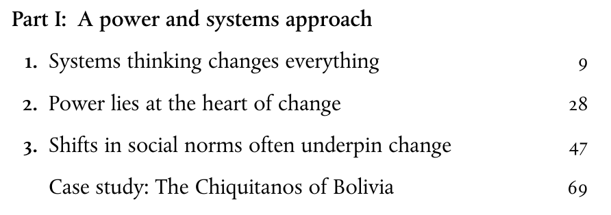
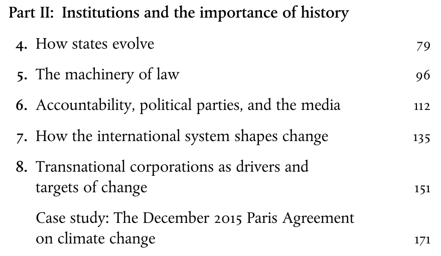

---
output:
  xaringan::moon_reader:
    css: ["default", "extra.css"]
    lib_dir: libs
    seal: false
    nature:
      highlightStyle: github
      highlightLines: true
      countIncrementalSlides: false
      ratio: '16:9'
---

```{r, echo = FALSE, warning = FALSE, message = FALSE}
##xaringan::inf_mr()
## For offline work: https://bookdown.org/yihui/rmarkdown/some-tips.html#working-offline
## Images not appearing? Put images folder inside the libs folder as that is the main data directory

library(tidyverse)
library(readxl)
library(stargazer)
##library(kableExtra)
##library(modelr)

knitr::opts_chunk$set(echo = FALSE,
                      eval = TRUE,
                      error = FALSE,
                      message = FALSE,
                      warning = FALSE,
                      comment = NA)
```

class: slideblue

.size80[**Today's Agenda**]

<br>

.size55[
Designing an Environmental Policy

+ The Limits of Activism
]

<br>

.center[.size40[
  Justin Leinaweaver (Spring 2022)
]]

???

## Prep for Class
1. Notes on the Green book in CORE 201 (FA17) 11-1, 13-1 and 13-2

2. Actual Green book is [freely available through OUP](https://oxfamilibrary.openrepository.com/bitstream/handle/10546/581366/bk-how-change-happens-211016-en.pdf?sequence=7).

<br>


---

background-image: url('libs/Images/13-2-Green_Change_Book.jpg')
background-size: 100%
background-position: center

???

Today I'd like us to dig into some of the big ideas raised by Duncan Green in his book, How Change Happens.

Dr Duncan Green is currently ([LSE Bio](https://www.lse.ac.uk/international-development/people/duncan-green)):
- A Senior Strategic Adviser at Oxfam Great Britain,

- A Professor in Practice in International Development at the London School of Economics

- Honorary Professor of International Development at Cardiff University, and 

- a Visiting Fellow at the Institute for Development Studies. 

<br>

He has written a number of books on activism and change:
- How Change Happens (OUP, October 2016)

- From Poverty to Power: How Active Citizens and Effective States can Change the World (Oxfam International, 2008, second edition 2012)

And a series of books on Latin America


---

background-image: url('libs/Images/13-2-Green_Change_Book.jpg')
background-size: 100%
background-position: center

???

In terms of real-world experience he was previously:
- Oxfam’s Head of Research, 

- a Visiting Fellow at Notre Dame University, 

- a Senior Policy Adviser on Trade and Development at the Department for International Development (DFID), 

- a Policy Analyst on trade and globalization at CAFOD, the Catholic aid agency for England and Wales, and 

- Head of Research and Engagement at the Just Pensions project on socially responsible investment.

<br>

So, we can assume he knows that on which he speaks!


---

background-image: url('libs/Images/background-forest_v3.png')
background-size: 100%
background-position: center
class: middle, center

## How Change Happens (Green 2016)

```{r}

```

???

The first two parts of Green's book set the stage, so to speak, for his views about activism.

In Part 1 he presents a theory of politics that focuses on systems, power and norms.

<br>

He describes his theory of change as a "Power and Systems Approach (PSA)" and presents it as a sort of critique of basically all model building in the social sciences.

- He defines a system as "...an interconnected set of elements coherently organized in a way that achieves something" (9).

- HOWEVER he argues that "[a] defining property of human systems is complexity: because of the sheer number of relationships and feedback loops among their many elements, they cannot be reduced to simple chains of cause and effect" (10).

<br>

No need to go down this philosophical rabbit hole.

In the rest of the chapter, and the book itself, Green proceeds to make recommendations that assume we CAN, in fact, achieve change by influencing society
- e.g. what some might describe as "simple chains of cause and effect..."

Without getting snarky here, it's clear to see from the chapter names in this section that he does think certain specific mechanisms exist to influence society.
- To keep him happy, we just have to agree to pretend they aren't "simple" :)


---

background-image: url('libs/Images/background-forest_v3.png')
background-size: 100%
background-position: center
class: middle, center

## Metaphors for Activism 

.pull-left[
```{r}

```
]

.pull-right[

```{r}

```
]

???

One intriguing idea that comes from this first part of the book is Green comparing and contrasting two metaphors for activism.

Green critiques the "baking a cake" approach to change that he says many groups adopt wherein they: 
- choose goal (cake), 
- pick well established methods (recipe), 
- find allies (get ingredients), and 
- done (policy change!).

<br>

He strongly prefers that groups adopt a "raising a child" metaphor.

You must be:
- Iterative, 
- Flexible, and 
- Collaborative.
- Think evolution, not physics

<br>

On the other hand, these two metaphors actually aren't different in any meaningful way except in the likelihood of success at the end.
- Both include a process and encourage you to find allies, his preferred metaphor simply emphasizes a need for flexibility in your plan.


---

background-image: url('libs/Images/background-forest_v3.png')
background-size: 100%
background-position: center
class: middle, center

## How Change Happens (Green 2016)

```{r}

```

???

In part 2 of the book Green gives us a crash course in thinking about the target of most activists: The State.

We can think of this as a section dedicated to thinking carefully about institutions, or what Douglass North would call "the rules of the game."


---

background-image: url('libs/Images/background-forest_v3.png')
background-size: 100%
background-position: center
class: middle

.center[
# Part III: 

.size50[**What Activists Can (and Can't) Do**]
]

.size50[
9) Citizen Activism and Civil Society

10) Leaders and Leadership

11) The Power of Advocacy
]

???

For today I assigned you the section of the book focused most directly on activism and achieving change in society.

- e.g. the portion I hope is most useful for us as policy designers.

<br>

*Create three groups, assign one to each*

Go sit with your groups!


---

background-image: url('libs/Images/background-forest_v3.png')
background-size: 100%
background-position: center
class: middle

.center[.size50[**What Activists Can (and Can't) Do**]]

.size50[
1. Diagram the central argument

2. Critically analyze the argument

3. Specific guidance for solving environmental problems?
]

???


Groups you have 20 minutes to extract the best ideas from the chapter to share with the rest of the class.

1. What is the central argument in the chapter? 
    - Put your diagram on the board

2. Critically analyze the argument
    - Ultimately, explain if you find it convincing

3. What are the specific lessons we can extract from this chapter to help us solve our environmental problems?
    - Group 1, how specifically do we use or plan for effective citizen advocacy?
    - Group 2, how specifically do we use or foster the right kinds of leadership?
    - Group 3, how specifically do we use or implement effective advocacy?
    
Answering that third question may require you to think beyond the chapter!

### Questions?

Get to it!


---

background-image: url('libs/Images/13-2-protest.webp')
background-size: 47%
background-position: left
class: middle, center, slidegreen

.pull-right[
.size50[**How specifically do we use or plan for effective citizen advocacy?**]
]

???

1. What is the central argument in the chapter? 

2. Critically analyze the argument. Ultimately, explain if you find it convincing

3. What are the specific lessons we can extract from this chapter to help us solve our environmental problems? Group 1, how specifically do we use or plan for effective citizen advocacy?

<br>

#### Chapter 9 Notes

### How does Green define "citizen activism"?
- (p181: Any individual action with social consequences)
    - Often involes collective action
    - Often a demonstration of "power with"
    - As a conduit for "vital feedback to state decision makers" and/or a mechanism for problem solving that bypasses the state.

### Why in the middle of this discussion does he switch to discussing CSOs?
- (Civil society organizations)
- Green seems to argue that citizen activism can move a society using either protest or support.

### If we think of these as different tactics for achieving change, how best do we figure out which is the right tactic for a given situation?
### - In other words, when should i protest and when should i focus on providing community support?

The end of the chapter shifts hard into offering us guidance for supporting citizen activism (p193).
- WHAT DO HIS CASE STUDIES SUGGEST WE SHOULD DO?

### Does accepting the importance of citizen activism to change make our jobs, proposing solutions to environmental problems, easier or harder?


---

background-image: url('libs/Images/13-2-Leadership.jpg')
background-size: 47%
background-position: left
class: middle, center, slidegreen

.pull-right[
.size50[**How specifically do we use or foster the right kinds of leadership?**]
]

???

1. What is the central argument in the chapter? 

2. Critically analyze the argument. Ultimately, explain if you find it convincing

3. What are the specific lessons we can extract from this chapter to help us solve our environmental problems? Group 2, how specifically do we use or foster the right kinds of leadership?

<br>

#### Chapter 10 Notes

- Leaders operate at the "interface between structure and agency, striving to leave their mark on the institutions, cultures and traditions in which they live and work" (p199).
- Good leaders prevent organizations from fragmenting into competing groups...
- Good leaders offer orgs a shared purpose and passion, building up alliances.
- Get things moving, but leave the finishing to others (p204)
Therefore, leadership at all levels is central to change.


### According to Green is "leadership" necessary or sufficient for change?

### - Under what conditions is it helpful?

### - Under what conditions is it irrelevant?


---

background-image: url('libs/Images/13-2-advocacy_v2.png')
background-size: 47%
background-position: left
class: middle, center, slidegreen

.pull-right[
.size50[**How specifically do we use or implement effective advocacy?**]
]

???

1. What is the central argument in the chapter? 

2. Critically analyze the argument. Ultimately, explain if you find it convincing

3. What are the specific lessons we can extract from this chapter to help us solve our environmental problems? Group 3, how specifically do we use or implement effective advocacy?

<br>

#### Chapter 11 Notes

Much of the chapter seems to involve a lengthy description of the various tactics Green believes a good advocate should master.

### What are some of the key tactics of advocacy raised in the chapter?
- Spectrum of tactics: cooperation, education, persuasion, litigation and contestation (Miller and Covey 1997).
- "...the rules of good lobbying: knowing what your targets can and can't deliver; treat them like human beings; persuade by appealing both to altruism and self-interest" (216).
- Can't reach the decision-maker, target the "influentials" (those with access to them).
- Trying to influence the public, use celebrities
- p217: wide range of possible tactics: street protest, litigation, insider persuasion, media campaigns, demonstration projects, and many more.
- p218: "The trick is to learn what people really care about, even if it's not top of your priority list."
- Tone and language matter too; humor can help
- "often" provoking repression by the authorities is a good strategy
- Making new laws is hard, try focusing on enforcing those already on the books.
- Research is an effective weapon (primarily in closed systems where decision-makers are more insulated from political pressures)
- think of policymaking as a funnel: Wide end (generate enthusiasm for an idea), middle (Tailor your demands to the policy process as it actually works (don't call for revolution, push to see para 2 in Art 4 amended)), tip end (work with the institution but keep public pressure on to avoid backsliding)
- Learn from advertising, craft the message to fit the audience.
- Look for critical junctures
- Learn how to construct effective alliances

(p224)
Old style: Good campaigns require a problem, a solution and a villain.
Systems thinking: problems are complex, interrelated and solutions are unknowable in advance

### Is this a useful list? Why or why not?

### What is the value-add here? In other words, is this common sense or does it provide us with useful advice?

### Which strike you as the most important lessons? Why?

### Which the least? Why?


---

background-image: url('libs/Images/background-forest_v3.png')
background-size: 100%
background-position: center
class: middle

.center[
# Part III: 

.size50[**What Activists Can (and Can't) Do**]
]

.size50[
9) Citizen Activism and Civil Society

10) Leaders and Leadership

11) The Power of Advocacy
]

???

Given all of that, I'd like us to debate a proposal.

### In order to graduate, every undergraduate student should complete a program in activism, leadership and advocacy?

### What do we think? Pros and cons?

<br>

### Alternative Proposal: All college students should be trained, not by individual majors, but primarily as leaders and advocates?

### What do we think? Pros and cons?


---

background-image: url('libs/Images/background-forest_v3.png')
background-size: 100%
background-position: center

class: middle

.size55[**Reflection Time**]

.size50[**The Limits of Activism**]

.size40[
1. How big a role is this complication in your environmental problem?

2. How can you adapt your chosen policy design to address this complication?
]

???

*Assuming 25 minutes left*

Everybody take 15 minutes to reflect on today's complication and do some writing/brainstorming on their final policy paper.

Now, take 10 mins to share what you wrote/brainstormed with classmates

- Get some feedback and see if hearing how other people are addressing this complication inspires you too!


