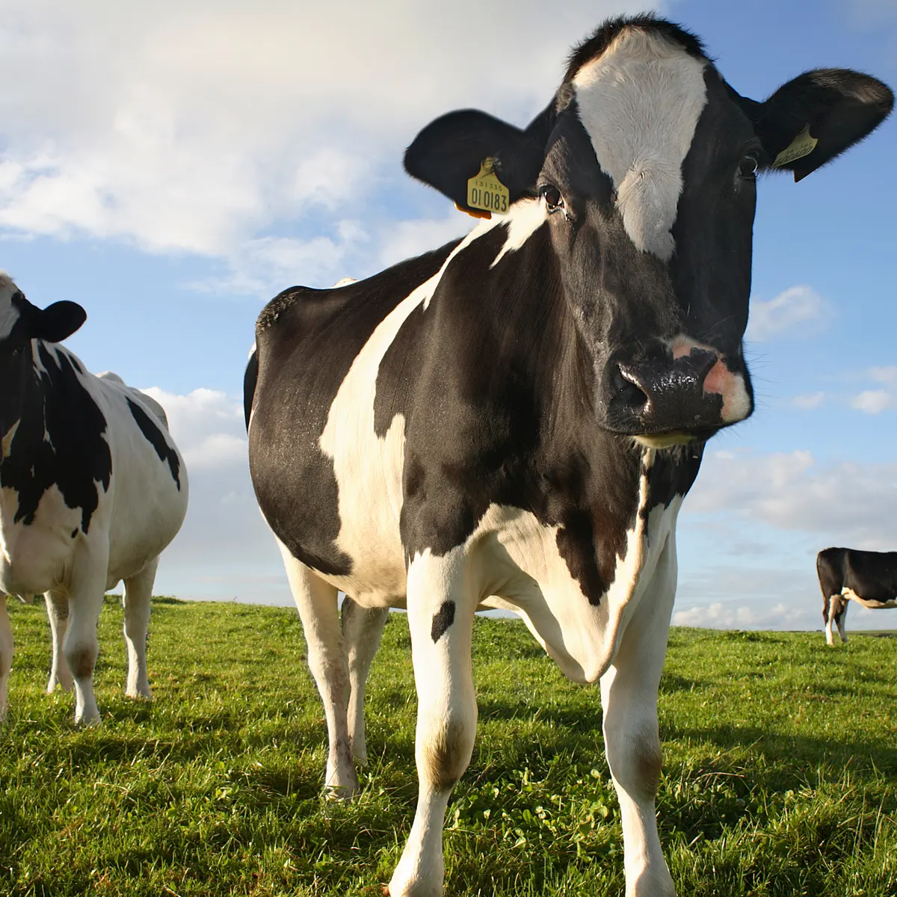

---
output:
  xaringan::moon_reader:
    css: ["default", "extra.css"]
    lib_dir: libs
    seal: false
    nature:
      highlightStyle: github
      highlightLines: true
      countIncrementalSlides: false
      ratio: '16:9'
---

```{r, echo = FALSE, warning = FALSE, message = FALSE}
##xaringan::inf_mr()
## For offline work: https://bookdown.org/yihui/rmarkdown/some-tips.html#working-offline
## Images not appearing? Put images folder inside the libs folder as that is the main data directory

library(tidyverse)
library(readxl)
library(stargazer)
##library(kableExtra)
##library(modelr)

knitr::opts_chunk$set(echo = FALSE,
                      eval = TRUE,
                      error = FALSE,
                      message = FALSE,
                      warning = FALSE,
                      comment = NA)
```

background-image: url('libs/Images/background-forest_v3.png')
background-size: 105%
background-class: center
class: middle

.size45[**III. Designing an Environmental Policy**]

<br>

.size50[

**Today's Agenda**

Complicating Factors in Environmental Policymaking

- Collective Action Problems and Free-Riding
]

<br>

.center[.size40[
  Justin Leinaweaver (Spring 2024)
]]

???

## Prep for Class
1. Prep Google form for tracking collective action game
    - https://forms.gle/ZnVHBHXu58q4aFf76
    
2. Prep email with link for the class

3. MAKE SURE when introducing the game to make clear that they get the shared points EVEN if they take some for themselves. SP23 many in the class were surprised after the game that they could have taken and gotten both.

<br>

Last week we began exploring some of the more common complications that arise when dealing with environmental problems.


---

background-image: url('libs/Images/background-forest_v3.png')
background-size: 100%
background-position: center
class: middle, center

.content-box-green[.size65[**Assignment 5: Proposing a Policy**]]

.size55[
Propose a policy to address your selected environmental problem that balances the interests of the relevant stakeholders against the constraints of established institutions and uncertainty.
]

???

I want to keep this at front of mind for you.

- Your final assignment in this capstone class is to tie together all of your work this semester into a policy proposal meant to address your chosen environmental problem.

<br>

**SLIDE**: A strong policy proposal...


---

background-image: url('libs/Images/background-forest_v3.png')
background-size: 100%
background-position: center
class: middle

.size35[
A convincing policy proposal:

- Advances your policy recommendation in **EVERY** paragraph,

- Includes a clear and compelling problem definition,

- Identifies and appeals to specific stakeholders,

- Is adapted to the complicating factors relevant to your problem (e.g. institutions, uncertainty, free-riding, inequality, etc.), and

- Offers guidance for measuring its effectiveness over time.
]

???

### Questions on the final project?


---

background-image: url('libs/Images/background-forest_v3.png')
background-size: 100%
background-position: center
class: middle

.center[.content-box-green[.size50[**Complicating Factors to Consider When Designing Your Policy**]]]

.size40[
- Risk aversion (or risk acceptance)

- Temporal discounting and uncertainty

- Collective action problems and free-riding

- Inequality

- Greenwashing
]

???

This final section of our class is our chance to dig into some of the complications you as policy designers need to be aware of when trying to solve environmental problems.


---

background-image: url('libs/Images/13_1-risk-assessment.jpg')
background-size: 100%
background-position: center
class: top, right

.size70[**Risk Aversion**]

???

### How does thinking about stakeholder risk aversion help you design a policy to solve an environmental problem?

<br>

### Does one of our policy options do this better than the others? Why or why not?


---

background-image: url('libs/Images/13_1-bad-ancestor.webp')
background-size: 100%
background-position: center
class: top, right

.textwhite[.size60[**Temporal Discounting**]]

???

### How does thinking about stakeholder perceptions of time help you design a policy to solve an environmental problem?

<br>

### Does one of our policy options do this better than the others? Why or why not?


---

background-image: url('libs/Images/13_1-tipping_point.jpg')
background-size: 100%
background-position: bottom
class: top, center

.content-box-blue[.size65[**Uncertainty / Tipping Points**]]

???

### How specifically does uncertainty impact the design of your policy proposal?

### - Nonlinear environmental cost and benefit functions?

### - Tipping points to worry about? 

### - "irreversibilities"?

### - Uncertanities in costs and benefits?

<br>

Ok, today we move to our next complication: Collective Action Problems and Free-Riding


---

background-image: url('libs/Images/background-forest_v3.png')
background-size: 100%
background-position: center
class: middle

.center[.size80[**Let's play a quick game!**]]

???

The game is very simple
- I will offer you some bonus points for your final paper and you will decide how many to take.

- I will give you two choices and you must select ONLY one of them

--

.size45[
- Option 1: Contribute 1/2 a bonus point to the class
]

???

<br>

**1) This option allows you to give every person in class 1/2 a bonus point**
- If everyone in a class of 20 chooses this, everyone gets +10 on their final paper

- Please note, I only keep whole numbers and I round down in this game
    - So, your 1/2 is 0 unless someone else makes the same choice

### Does everybody understand this first option?


--

.size45[
- Option 2: Take 5 bonus points for yourself
]

???

<br>

**2) If you choose this option, you get everything the class gets plus an additional 5 points just for you.**

- If half the class contributes 1/2 point you get all of those PLUS these five points

### Does everybody understand this option?

--

.size45[
- **Key RULE: Your choice MUST be made secretly**
]

???

<br>

**3) No one is allowed to see your choice, no one will know what you picked.**

- If you break this rule you get nothing.

<br>

I want to make this clear, only you and I will ever know the choice you made.

- Although, after the game you are welcome to disclose your choice if you want to.


---

background-image: url('libs/Images/background-forest_v3.png')
background-size: 100%
background-position: center
class: middle

.center[.size80[**Let's play a quick game!**]]

.size45[
- Option 1: Contribute 1/2 a bonus point to the class

- Option 2: Take 5 bonus points for yourself

- **Key RULE: Your choice MUST be made secretly**
]

???

### Is everyone clear on the rules? Any questions before we play?

<br>

I will send everyone a link to a Google Form

- On the form you have to give your name (so I can record the points) and make your choice.

No talking from this point on!

- Go!

<br>

### Before I reveal the results, any guesses as to the outcome?

### - What are you basing your guesses on?


---

background-image: url('libs/Images/background-forest_v3.png')
background-size: 100%
background-position: center
class: middle

.center[.size80[**Let's play a quick game!**]]

.size45[
- Option 1: Contribute 1/2 a bonus point to the class

- Option 2: Take 5 bonus points for yourself

- **Key RULE: Your choice MUST be made secretly**
]

???

*ON BOARD RESULTS (2 columns: Contribute vs Keep)*

<br>

### Ok, what do we learn from these results?

### - Anything about you as individuals?

### - Anything about the class as a whole?

### - Anything about the structure of the game?

<br>

**SLIDE**: This game is meant to illustrate a collective action problem 


---

background-image: url('libs/Images/background-forest_v3.png')
background-size: 100%
background-position: center
class: middle, center

.size55["A .textblue[collective action problem] or social dilemma is a situation in which all individuals would be better off cooperating but fail to do so because of conflicting interests between individuals that discourage joint action" (Wikipedia 2021).]

???

Let's start with the first sentence from the Wikipedia entry!

### Somebody take a stab at explaining this in english?

<br>

Often we introduce collective action problems using a Prisoner's Dilemma. 

### Has anybody ever heard of the Prisoner's Dilemma?

(**SLIDE**)


---

background-image: url('libs/Images/07-1-bank_robbery.jpg')
background-size: 100%
background-position: center

???

You can tell the story many different ways, but here's a quick version.

<br>

Two thieves rob a bank and decide to split up in order to make their getaway

- The plan is meet up later and divvy up the loot.

<br>

The cops catch each of them separately and bring them "downtown" for questioning.

- Both still had their guns with them when captured so are in some trouble / look pretty darn suspicious.

- e.g. gun possession is good for a couple years in jail


---

background-image: url('libs/Images/07-1-interrogation.png')
background-size: 100%
background-position: center

???

Now we introduce the dilemma facing our robbers

- The robbers are placed in separate interrogation rooms.

- Each is made an offer at essentially the same time.

- **The Offer**: The first one to confess to the robbery and agree to testify against the other person goes COMPLETELY free.

<br>

Put yourself in the shoes of one of the robbers.

- As a first pass, we can think of this as a simple decision for you.

- **SLIDE**


---

background-image: url('libs/Images/07-1-cartoon_thief.webp')
background-size: 60%
background-position: left
class: middle

.pull-right[
.size55[**Your Decision**]

.size45[
+ Confess quickly and go free (maybe)

+ Stay silent and go to jail
]]

???

*Read options on screen*

<br>

In a world where only you matter, the decision is pretty easy to think through as a cost-benefit analysis.

- Going free is pretty universally preferred to going to jail.

<br>

However, the outcome of this dilemma depends on both the choice YOU make AND the choice made by the other suspect.


---

background-image: url('libs/Images/12-1-Eric-Garland-Game-Theory.jpg')
background-size: 85%
background-position: center

???

That means, it's time for some game theory!

<br>

Game Theory is a theoretical approach to analyzing decision-making born from micro-economics.

- It primarily focuses on individuals (or groups who make decisions collectively)

- It is typically applied to competitive situations wherein outcomes are determined by the actions of all the players

- And ultimately it is meant to help us evaluate strategies for navigating these scenarios.

<br>

#### Old notes
- Game theory is "the branch of mathematics concerned with the analysis of strategies for dealing with competitive situations where the outcome of a participant's choice of action depends critically on the actions of other participants" (Oxford Languages).


---

class: middle, center

.size50[.center[.content-box-blue[**The Prisoner's Dilemma**]]]

<br>

<br>

```{css, echo=F}
/* Change the background color to white for shaded rows (even rows) */
.remark-slide thead, .remark-slide tr:nth-child(2n) {
      background-color: white;
}
```

```{r}
tibble(
  col1 = c("You", ""),
  col2 = c("Silence", "Confess"),
  Cooperate = c("2 years, 2 years", "Go Free, 10 years"),
  Defect = c("10 years, Go Free", "6 years, 6 years")
) |>
  kableExtra::kbl(align = c("l", "l", "c", "c"), col.names = c("", "", "Silence", "Confess")) |>
  kableExtra::add_header_above(c(" " = 2, "Other Suspect" = 2)) |>
  kableExtra::column_spec(column = 1:2, bold = TRUE, width = "10em") |>
  kableExtra::column_spec(column = 3:4, background = "#b3ccff", width = "25em") |>
  kableExtra::kable_styling(font_size = 35, bootstrap_options = "basic")
```

???

In game theoretic terms this is what we call a non-cooperative game in normal form.
- The four boxes represent the four possible outcomes of the game
- We get to a single box once we know the decision of each player.

<br>

*Go through a couple to make sure it's clear*

<br>

### So, in this position what would you do and why?

+ *Force discussion of each option*

<br>

### What pieces of context would influence how you think about the decision? 

+ (Is the other suspect your best friend or just some guy?)
+ (How much evidence do the cops already have?)
+ (Do you already have a record?)

<br>

**SLIDE**: So, how does game theory help us with this?


---

class: middle, center

.size50[.center[.content-box-blue[**The Prisoner's Dilemma**]]]

<br>

<br>

```{css, echo=F}
/* Change the background color to white for shaded rows (even rows) */
.remark-slide thead, .remark-slide tr:nth-child(2n) {
      background-color: white;
}
```

```{r}
tibble(
  col1 = c("You", ""),
  col2 = c("Silence", "Confess"),
  Cooperate = c("2 years, 2 years", "Go Free, 10 years"),
  Defect = c("10 years, Go Free", "6 years, 6 years")
) |>
  kableExtra::kbl(align = c("l", "l", "c", "c"), col.names = c("", "", "Silence", "Confess")) |>
  kableExtra::add_header_above(c(" " = 2, "Other Suspect" = 2)) |>
  kableExtra::column_spec(column = 1:2, bold = TRUE, width = "10em") |>
  kableExtra::column_spec(column = 3:4, background = "#b3ccff", width = "25em") |>
  kableExtra::kable_styling(font_size = 35, bootstrap_options = "basic")
```

<br>

<br>

.center[.size35[.content-box-red[**What is the most likely outcome of the game?**]]]

???

Game theory is designed to help us analyze social dilemmas like this.
- Tries to "solve" games like this one by identifying the most likely outcome.

<br>

For example, we expect the players in this game to pick their dominant strategy (if one exists)
- We define a "dominant strategy" as one that wins for you REGARDLESS of what the other player does.

We also expect the players to finish on an outcome that is Pareto optimal.
- Pareto optimality means no one can improve their final position without making the other person worse off.

<br>

A good place to start when analyzing these games is to find the Nash Equilibrium

- Approach named for the mathematician John Nash.

- Means thinking about your choice as if you had perfect information.

- e.g. You know what the other robber is going to do before he does it!

<br>

**SLIDE**: Demonstrate...


---

class: middle, center

.size50[.center[.content-box-blue[**The Prisoner's Dilemma**]]]

<br>

<br>

```{css, echo=F}
/* Change the background color to white for shaded rows (even rows) */
.remark-slide thead, .remark-slide tr:nth-child(2n) {
      background-color: white;
}
```

```{r}
tibble(
  col1 = c("You", ""),
  col2 = c("Silence", "Confess"),
  Cooperate = c("2 years", "Go Free"),
  Defect = c("10 years", "6 years")
) |>
  kableExtra::kbl(align = c("l", "l", "c", "c"), col.names = c("", "", "Silence", "Confess")) |>
  kableExtra::add_header_above(c(" " = 2, "Other Suspect" = 2)) |>
  kableExtra::column_spec(column = 1:2, bold = TRUE, width = "10em") |>
  kableExtra::column_spec(column = 3, background = "#b3ccff", width = "25em") |>
  kableExtra::column_spec(column = 4, background = "white", width = "25em") |>
  kableExtra::kable_styling(font_size = 35, bootstrap_options = "basic")
```

???

Let's focus the outcomes on just you alone for a moment (e.g. remove the other person's outcomes).

<br>

### Assuming you knew for certain that the other robber would stay silent, what would you do? Would you pick 2 years in jail or to go free? 

- *DISCUSS*

- (**SLIDE**)


---

class: middle, center

.size50[.center[.content-box-blue[**The Prisoner's Dilemma**]]]

<br>

<br>

```{css, echo=F}
/* Change the background color to white for shaded rows (even rows) */
.remark-slide thead, .remark-slide tr:nth-child(2n) {
      background-color: white;
}
```

```{r}
tibble(
  col1 = c("You", ""),
  col2 = c("Silence", "Confess"),
  Cooperate = c("2 years", "Go Free"),
  Defect = c("10 years", "6 years")
) |>
  kableExtra::kbl(align = c("l", "l", "c", "c"), col.names = c("", "", "Silence", "Confess")) |>
  kableExtra::add_header_above(c(" " = 2, "Other Suspect" = 2)) |>
  kableExtra::column_spec(column = 1:2, bold = TRUE, width = "10em") |>
  kableExtra::column_spec(column = 3, background = c("white", "yellow"), width = "25em") |>
  kableExtra::column_spec(column = 4, background = "white", width = "25em") |>
  kableExtra::kable_styling(font_size = 35, bootstrap_options = "basic")
```

???

Seems pretty easy to say that given a choice between jail and freedom a rational actor will choose freedom.

*Think of your elderly parents and your 16 children all who depend on you to keep them alive!*


---

class: middle, center

.size50[.center[.content-box-blue[**The Prisoner's Dilemma**]]]

<br>

<br>

```{css, echo=F}
/* Change the background color to white for shaded rows (even rows) */
.remark-slide thead, .remark-slide tr:nth-child(2n) {
      background-color: white;
}
```

```{r}
tibble(
  col1 = c("You", ""),
  col2 = c("Silence", "Confess"),
  Cooperate = c("2 years", "Go Free"),
  Defect = c("10 years", "6 years")
) |>
  kableExtra::kbl(align = c("l", "l", "c", "c"), col.names = c("", "", "Silence", "Confess")) |>
  kableExtra::add_header_above(c(" " = 2, "Other Suspect" = 2)) |>
  kableExtra::column_spec(column = 1:2, bold = TRUE, width = "10em") |>
  kableExtra::column_spec(column = 3, background = c("white", "yellow"), width = "25em") |>
  kableExtra::column_spec(column = 4, background = "#b3ccff", width = "25em") |>
  kableExtra::kable_styling(font_size = 35, bootstrap_options = "basic")
```

???

### Now, reverse it! What if you knew for certain the other robber was going to confess, what would you choose?

#### - In other words, what would you do if you knew they were going to sell your ass out?


---

class: middle, center

.size50[.center[.content-box-blue[**The Prisoner's Dilemma**]]]

<br>

<br>

```{css, echo=F}
/* Change the background color to white for shaded rows (even rows) */
.remark-slide thead, .remark-slide tr:nth-child(2n) {
      background-color: white;
}
```

```{r}
tibble(
  col1 = c("You", ""),
  col2 = c("Silence", "Confess"),
  Cooperate = c("2 years", "Go Free"),
  Defect = c("10 years", "6 years")
) |>
  kableExtra::kbl(align = c("l", "l", "c", "c"), col.names = c("", "", "Silence", "Confess")) |>
  kableExtra::add_header_above(c(" " = 2, "Other Suspect" = 2)) |>
  #kableExtra::column_spec(column = 1:2, bold = TRUE, width = "10em") |>
    kableExtra::column_spec(column = 1, bold = TRUE, width = "10em") |>
    kableExtra::column_spec(column = 2, bold = TRUE, width = "10em", background = c("white", "yellow")) |>
  kableExtra::column_spec(column = 3, background = c("white", "yellow"), width = "25em") |>
  kableExtra::column_spec(column = 4, background = c("white", "yellow"), width = "25em") |>
  kableExtra::kable_styling(font_size = 35, bootstrap_options = "basic")
```

???

Given the choice, I suspect most people choose 6 over 10 years of jail time.

<br>

This shows us that there IS a dominant strategy in this game.
- Regardless of what the other player chooses you reach your preferred outcome by confessing.

<br>

The dominant strategy in game theory refers to a situation where one player has a superior tactic regardless of how the other players act. 

- In this game, no matter what the other person does, your better outcome comes from confessing.

<br>

### Does this make sense?


---

class: middle, center

.size50[.center[.content-box-blue[**The Prisoner's Dilemma**]]]

<br>

<br>

```{css, echo=F}
/* Change the background color to white for shaded rows (even rows) */
.remark-slide thead, .remark-slide tr:nth-child(2n) {
      background-color: white;
}
```

```{r}
tibble(
  col1 = c("You", ""),
  col2 = c("Silence", "Confess"),
  Cooperate = c("2 years, 2 years", "Go Free, 10 years"),
  Defect = c("10 years, Go Free", "6 years, 6 years")
) |>
  kableExtra::kbl(align = c("l", "l", "c", "c"), col.names = c("", "", "Silence", "Confess")) |>
  kableExtra::add_header_above(c(" " = 2, "Other Suspect" = 2)) |>
  kableExtra::column_spec(column = 1:2, bold = TRUE, width = "10em") |>
  kableExtra::column_spec(column = 3, background = "white", width = "25em") |>
  kableExtra::column_spec(column = 4, background = c("white", "yellow"), width = "25em") |>
  kableExtra::kable_styling(font_size = 35, bootstrap_options = "basic")
```

???

The logic is mirrored for both subjects.

- If the second robber is certain you will confess, he would also prefer to confess
    - 6 years is better than 10 years in jail

- And if he knows you will stay silent he would still prefer to confess
    - Going free beats jail

<br>

For both players, confessing is the dominant strategy.

- Since both dominant strategies lead to only one outcome, that outcome is called the Nash Equilibrium.

- "a stable state of a system involving the interaction of different participants, in which no participant can gain by a unilateral change of strategy if the strategies of the others remain unchanged" (Oxford Languages).

<br>

In other words, assuming rational actors facing this simultaneous decision we expect both robbers to confess and to stay there no matter what.

### Make sense?

<br>

**SLIDE**: Now, back to the definition!


---

background-image: url('libs/Images/background-forest_v3.png')
background-size: 100%
background-position: center
class: middle, center

.size55["A .textblue[collective action problem] or social dilemma is a situation in which all individuals would be better off cooperating but fail to do so because of conflicting interests between individuals that discourage joint action" (Wikipedia 2021).]

???

### Does everybody now have a better sense of what this definition is talking about?

<br>

In short, collective action problems arise when individuals want to cooperate but can't seem to get there because of the complexities of the world.

- Our readings for today illustrate two ways the world conspires to make cooperation harder.


---

background-image: url('libs/Images/background-forest_v3.png')
background-size: 100%
background-position: center
class: middle

.size55[
Hardin, G. (1968). The Tragedy of the Commons. *Science*. 162(3859), 1243–1248.
]

???

For today I had you read a short excerpt from Garret Hardin’s "Tragedy of the Commons."

### Anybody ever read this before?

<br>

First and foremost let me tell you, I AGONIZED over whether or not to assign any piece of this reading to you.

- On the plus side this is one of, if not THE, most cited and assigned research articles studying policy and the environment.

- Nearly 50,000 citations.

<br>

**SLIDE**: The problem is...


---

background-image: url('libs/Images/07-1-tragedy_of_the_tragedy.png')
background-size: 100%
background-position: center
class: middle

???

Hardin's environmental concerns were driven almost entirely by his racism and disdain for the poor.

- I assigned you only the portion relevant to our work, that which describes the pasture thought experiment.

- The rest of the article is scary, but we'll deal with that on Thursday as we explore how inequality complicates environmental problem-solving.

<br>

**SLIDE**: Ok, let's talk about the "commons" concept here.


---

background-image: url('libs/Images/07-1-The_Ocean.jpg')
background-size: 100%
background-position: center
class: bottom

.center[
.size30[
.content-box-blue["...the natural resources and vital life-support services that]

.content-box-blue[belong to all humankind rather than to any one country"]

.content-box-blue[(Chasek, Downie and Brown 2014)]
]]

???

Here is the definition of a commons as provided by Oran Young.

### What specific resources does this definition refer to?

- Think oceans, seabed minerals, Antarctica and the atmosphere.

- None exist within the borders of any sovereign state.

<br>

Think of this like an Ostrom-style Common Pool Resource that is so large as to make excluding users from it nearly impossible.

### Any questions on the baseline concept?


---

background-image: url('libs/Images/07-1-empty_pasture.jpg')
background-size: 100%
background-position: center

???

### What did you submit to Canvas as your analysis of the biggest environmental obstacle identified by the Hardin piece? 

<br>

The tragedy of the commons is typically explained using a story about a pasture.

### Who owns this pasture?

- (No one?)
- (Everyone?)
- (Both?)

<br>

### Does it make sense that if no one owns the pasture, everyone owns it?

### - Does that equivalency make sense?


---

background-image: url('libs/Images/07-1-pasture.jpg')
background-size: 100%
background-position: center

???

For the sake of this discussion, all of you are ranchers who own herds of cattle.

On this commons you all choose to graze your cattle.

### Why would you choose to graze your cattle on the commons pasture and not your own land?

- (maximize benefits by not having to pay to feed them!)

<br>

So, let's go back to the problematic equivalency from a moment ago.

### Who actually pays to feed your cattle when they feed on the commons?
- (Everyone)
- (PLUS the environment and the public)


---

class: middle, slidegreen

.size50[.center[**Cost-Benefit Analysis: Add a Cow**]]

.pull-left[
```{r, fig.retina=3}

```
]

???

Let's put this in the language of simple cost-benefit analysis.

- We will expect each rancher to add a cow to their herd when the benefits outweigh the costs.

<br>

### What are the benefits of adding a cow to your herd?
- (Milk or meat, reproduction, friendship...)

### What are the costs?
- (Feed, care, housing)


---

class: middle, slidegreen

.size50[.center[**Cost-Benefit Analysis: Add a Cow**]]

.pull-left[
```{r, fig.retina=3}

```
]

.pull-right[

<br>

<br>

## To Your Farm
.size40[
+ Benefits = +1

+ Costs = -1
]]

???

To keep things simple, let's say each of you currently face the following decision.

<br>

The hypothetical costs and benefits of adding a cow to your herd is almost perfectly off-setting. 

- Add a cow to gain 1 but you also have to pay 1.

### In this instance, should you add a cow to your herd?
- (Probably not in this case)
    - (Maybe if as your scale increases the costs of adding each additional cow falls?)

<br>

Now, what happens to the CBA when we add a cow to the commons?

### How does using the commons to feed your new cow alter your CBA?

(**SLIDE**)


---

class: middle, slidegreen

.size50[.center[**Cost-Benefit Analysis: Add a Cow**]]

.pull-left[
```{r, fig.retina=3}

```
]

.pull-right[

<br>

<br>

## To the Commons
.size40[
+ Benefits = +1

+ Costs = -1/x
]]

???

### Why don't the benefits change?

<br>

### Explain the 1/x to me in the costs of adding a cow to the commons.
- (X is the population size)
    - Costs shared amongst everyone
    - The commons loses 1, but that cost is divided amongst the owners of the commons e.g. everybody.

### Does that make sense?

<br>

Important distinction here: Society pays MOST of the costs of feeding your cattle.
- That means we each pay part of the cost.

### So, if you are the only person around, should you add a cow to the commons?
- (Takes us back to the previous +1 + -1 = 0.)


---

class: middle, slidegreen

.size50[.center[**Cost-Benefit Analysis: Add a Cow**]]

.pull-left[
```{r, fig.retina=3}

```
]

.pull-right[

<br>

<br>

## To the Commons
.size40[
+ Benefits = +1

+ Costs = -1/x
]]

???

### What happens to the costs you face as the population around you gets bigger?
- (Your share of the cost shrinks to almost nothing)
    - The more of us there are, the smaller your individual share.

<br>

### So, what is the bottom line here? When should you add a cow to your herd?
- (1. When there is a commons to feed it, and)
- (2. When there are a lot of other people also using it.)

<br>

### And what does all of this mean for the survival of the commons?

(**SLIDE**)


---

background-image: url('libs/Images/13_2-cow_pasture.png')
background-size: 100%
background-position: center
class: middle

???

It's toast in the long-run.

<br>

And why is that?

**SLIDE**


---

background-image: url('libs/Images/13_2-cow_pasture.png')
background-size: 100%
background-position: center
class: middle

.size35[.content-box-blue[1) The benefits are real and immediate]]

<br>

.size35[.content-box-blue[2) The costs are small and shared]]

<br>

.size35[.content-box-blue[3) Even if you do the "right" thing, someone else will]]

.size35[.content-box-blue[add another cow and the commons will collapse]]

???

*Read criteria*

In essence, Hardin argues the Commons is a PD game and your dominant strategy is to defect every round!

<br>

### Can everybody now see why Ostrom, and many others, reacted so poorly to this argument?

- Hard to accept humanity is compelled to commit suicide

- Not much empirical evidence of this actually happening over and over again.

- As we noted in the PD game, other factors matter too for whether we decide to defect or not!

<br>

Clearly, the Hardin argument is limited, however, there is something important we should take from it.


---

background-image: url('libs/Images/13_2-cow_pasture.png')
background-size: 100%
background-position: center
class: middle

.center[.size45[.content-box-blue[Benefits Accrue to the Individual]]]

<br>

.center[.size45[.content-box-blue[+]]]

<br>

.center[.size45[.content-box-blue[Costs Imposed on the Collective]]]

<br>

.center[.size45[.content-box-red[= Resource Depletion (Destruction?)]]]


???

This represents the first kind of collective action problem that makes environmental problem solving complicated.

- In instances where the benefits of an action accrue to the individual but the costs of that action are shared by society we may tend to see resource exploitation.

<br>

### Does this make sense?


---

background-image: url('libs/Images/background-forest_v2.png')
background-size: 100%
background-position: center
class: middle

# Collective Action Problem (I)

.size45[
.center[
Individual Benefits + Collective Costs =

Resource Depletion
]]

<br>

.size55[
.center[**Which policy approach addresses this problem "best"?**]]

???

Let's talk about addressing this problem using the approaches we've been exploring over the last five weeks.

### What are the pros and cons of using regulations, taxes, subsidies or adaptive governance to address this type of problem?

<br>

### Does one of the approaches stand out more than the others?


---

background-image: url('libs/Images/07-1-logic_col_action.jpg')
background-size: 40%
background-position: center
class: slideblue

???

For today I asked you to also read an excerpt from Mancur Olson's book.

### What did you submit as your analysis of the Olson excerpts? 
### - e.g. What is the biggest obstacle to environmental cooperation according to Olson (1965)?

<br>

**SLIDE**: Let's go back to our prisoner's dilemma for a moment and see if we can think about free-riding more clearly.


---

class: middle, center

.size50[.center[.content-box-blue[**The Prisoner's Dilemma**]]]

<br>

<br>

```{css, echo=F}
/* Change the background color to white for shaded rows (even rows) */
.remark-slide thead, .remark-slide tr:nth-child(2n) {
      background-color: white;
}
```

```{r}
tibble(
  col1 = c("You", ""),
  col2 = c("Silence", "Confess"),
  Cooperate = c("2 years, 2 years", "Go Free, 10 years"),
  Defect = c("10 years, Go Free", "6 years, 6 years")
) |>
  kableExtra::kbl(align = c("l", "l", "c", "c"), col.names = c("", "", "Silence", "Confess")) |>
  kableExtra::add_header_above(c(" " = 2, "Other Suspect" = 2)) |>
  kableExtra::column_spec(column = 1:2, bold = TRUE, width = "10em") |>
  kableExtra::column_spec(column = 3:4, background = "#b3ccff", width = "25em") |>
  kableExtra::kable_styling(font_size = 35, bootstrap_options = "basic")
```

???

### How could we remake this table to represent the decision you had in our collective action game at the start of class?

- (**SLIDE**)


---

class: middle, center

.size50[.center[.content-box-blue[**A Modified Prisoner's Dilemma**]]]

<br>

<br>

```{css, echo=F}
/* Change the background color to white for shaded rows (even rows) */
.remark-slide thead, .remark-slide tr:nth-child(2n) {
      background-color: white;
}
```

```{r}
tibble(
  col1 = c("You", ""),
  col2 = c("Contribute", "Take"),
  Cooperate = c("1 point, 1 point", "5 points, 0 points"),
  Defect = c("0 points, 5 points", "5 points, 5 points")
) |>
  kableExtra::kbl(align = c("l", "l", "c", "c"), col.names = c("", "", "Contribute", "Take")) |>
  kableExtra::add_header_above(c(" " = 2, "Other Classmate" = 2)) |>
  kableExtra::column_spec(column = 1:2, bold = TRUE, width = "10em") |>
  kableExtra::column_spec(column = 3:4, background = "#b3ccff", width = "25em") |>
  kableExtra::kable_styling(font_size = 35, bootstrap_options = "basic")
```

???

So, here's the game you played against each other person in the class.

### Does this game have a dominant strategy? why or why not?
- ("Take"!)
    - BUT this assumes only one other player!
    
### Lessons of this version of the game for policy designers?
- (Individuals who feel disconnected from the community more likely to defect!)

<br>

### How does this table change if you played simultaneously against the rest of your class working together?
- (**SLIDE**)


---

class: middle, center

.size50[.center[.content-box-blue[**A Modified Prisoner's Dilemma**]]]

<br>

<br>

```{css, echo=F}
/* Change the background color to white for shaded rows (even rows) */
.remark-slide thead, .remark-slide tr:nth-child(2n) {
      background-color: white;
}
```

```{r}
tibble(
  col1 = c("You", ""),
  col2 = c("Contribute", "Take"),
  Cooperate = c("10 points, 10 points", "14 points, 9 points"),
  Defect = c("0 points, 5 points", "5 points, 5 points")
) |>
  kableExtra::kbl(align = c("l", "l", "c", "c"), col.names = c("", "", "Contribute", "Take")) |>
  kableExtra::add_header_above(c(" " = 2, "19 Others" = 2)) |>
  kableExtra::column_spec(column = 1:2, bold = TRUE, width = "10em") |>
  kableExtra::column_spec(column = 3:4, background = "#b3ccff", width = "25em") |>
  kableExtra::kable_styling(font_size = 35, bootstrap_options = "basic")
```

???

Let's identify the dominant strategies in this version of the game.

### If you knew the rest of the class was going to contribute, what should you do?
- (Take! 14 > 10)

### If you knew the rest of the class was going to take, what should you do?
- (Take! 5 > 0)

So, "take" remains the dominant strategy for you individually.

<br>

Imagine the other 19 are acting together.

### If you knew that one individual was going to contribute, what should you do?
- (Contribute! 10 > 5)

### If you knew that one individual was going to take, what should you do?
- (Contribute! 9 > 5)

So, "contribute" is the dominant strategy for the group acting united.

<br>

### So, what is the lesson from this? Why does free-riding happen?

- (**SLIDE**)


---

background-image: url('libs/Images/07-1-logic_col_action.jpg')
background-size: 40%
background-position: left
class: middle, center, slideblue

.pull-right[
.size45[
Costs to the Individual

+

Benefits to the Collective

=

Free-Riders!
]]

???

Mancur Olson identifies that flipping the costs and benefits ALSO leads to a serious problem: Free-riders.

- In Hardin's story, individuals make good choices for themselves which combine to make bad choices for society.

- In Olson's story, he shows us that it is REALLY hard to get individuals to pay tiny costs in exchange for big benefits for the wider society.

- In a system where you benefit from collective action whether you help or not, your individual incentives will push you to not help

<br>

### Does that make sense?


---

background-image: url('libs/Images/background-forest_v2.png')
background-size: 100%
background-position: center
class: middle

# Collective Action Problem (II)

.size45[
.center[
Individual Costs + Collective Benefits =

Free-Riders!
]]

<br>

.size55[
.center[**Which policy approach addresses this problem "best"?**]]

???

Let's talk about addressing this problem using the approaches we've been exploring over the last five weeks.

### What are the pros and cons of using regulations, taxes, subsidies or adaptive governance to address this type of problem?

### Does one of the approaches stand out more than the others?

<br>

### What does Olson teach us about group sizes that helps us think about collective action problems?


---

background-image: url('libs/Images/background-forest_v3.png')
background-size: 100%
background-position: center
class: middle, center

.content-box-green[.size60[**Complicating Factors to Consider When Designing Your Policy**]]

<br>

.size60[
How do collective action problems complicate your efforts to address your specific environmental problem?
]

???

Let's wrap up today by returning to your ongoing projects.

Everybody take a few minutes to reflect on how our material from today impacts your specific environmental problem.

<br>

Alright, let's share!


---

background-image: url('libs/Images/background-forest_v3.png')
background-size: 100%
background-position: center
class: middle

.size60[**For Next Class**]

<br>

.size45[
1. Readings in Syllabus

2. Submit to Canvas **before class**: 

How is your selected environmental problem complicated by issues of inequality (unequal voice, access, influence or impact)?
]

???

