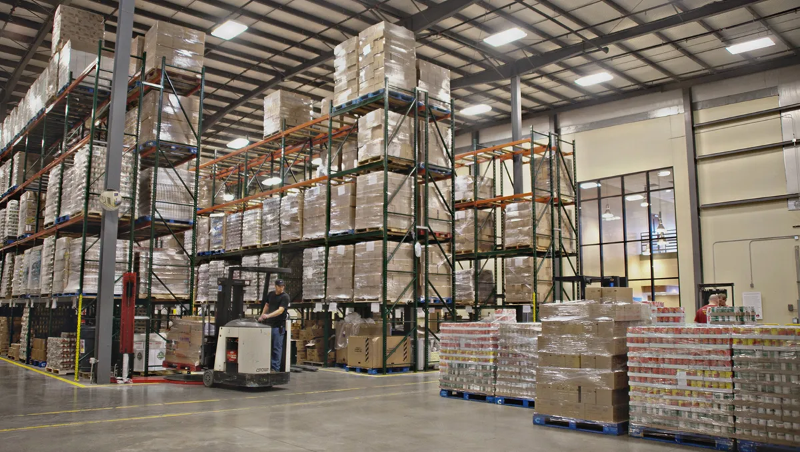
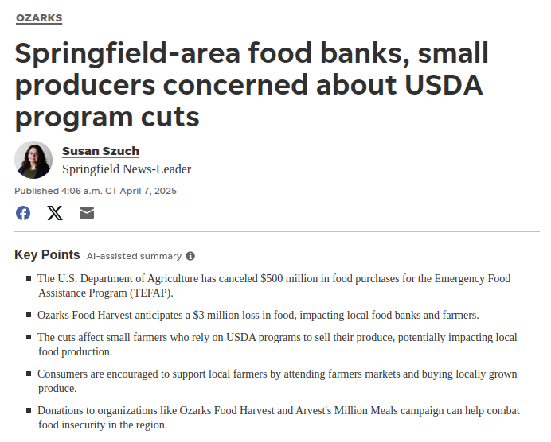
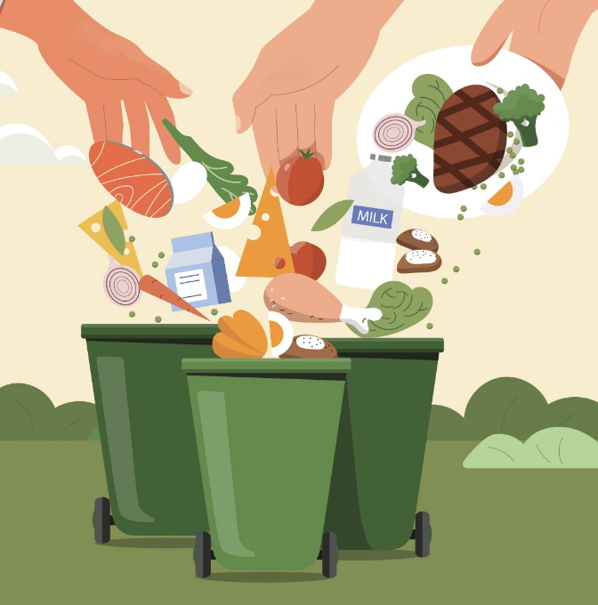

## Today's Agenda {background-image="Images/background-forest_v3.png" .center}

```{r}
library(tidyverse)
library(kableExtra)
library(readxl)
```

<br>

::: {.r-fit-text}

**Developing a Policy Guidance Document**

- Translate the lessons you've learned into useful advice

- *Sit with your group*

:::

<br>

::: r-stack
Justin Leinaweaver (Spring 2025)
:::

::: notes
Prep for Class

1. Record Canvas submissions

2. Publish group assignment for today

<br>

As you come in, sit in your groups!

<br>

**SLIDE**: Report back on volunteering

:::


## {background-image="Images/background-forest_v3.png" .center}

::: {.r-fit-text}
**How was your experience volunteering with OFH?**
:::

{style="display: block; margin: 0 auto"}

::: notes

**What kinds of specific activities did they have you do?**

<br>

**What did you learn from this experience that might help us address the food waste problem in our community?**

<br>

**Does anybody think they might volunteer there again? Why or why not?**

<br>

**Any ideas for how we could promote this kind of volunteering in our community?**

<br>

**SLIDE**: The news recently has not been kind to OFH and those facing food insecurity in our country.

:::


## {background-image="Images/background-forest_v3.png" .center}

{style="display: block; margin: 0 auto"}

::: notes

**Have you been following the news of the assault by Musk and Trump on government spending?**

<br>

These cuts will have incredibly substantive impacts on:

- Families facing food insecurity

- Local farmers whose business has been providing affordable food to the USDA for distribution

- International communities facing famine and starvation who have also benefited from these and other programs

<br>

Everybody needs to stay checked in to American politics right now

- If you care about these issues, make your voices heard!

<br>

**SLIDE**: Back to the process!

:::


## {background-image="Images/background-forest_v3.png" .center}

:::: {.r-fit-text}
**Engaging Productively as Problem-Solvers**

1) **Describe** the problem facing our community

2) **Investigate** the relevant stakeholders

3) **Frame** the problem for the stakeholders

4) **Design** a policy to address the problem

5) Take **action** to push the plan forward!

::::

::: notes

Over the last few weeks we have:

- Narrowed down each group's problem definition,

- Designed a map of the problem that specifies the types of relevant stakeholders

- Collected specific examples of stakeholders in our community identified by that map, and

- Developed a problem framing that could be used to convince key stakeholders in our community that we have an important, public problem that requires a collective decision to solve.

<br>

Basically, you have done the baseline work necessary to design a policy and push it into a community

<br>

Now, before we turn our focus to our backyard (e.g. Drury) I want to close the loop on your work analyzing our specific community

- Today that will involve developing a policy guidance document, and

- Next class we'll develop a list of policy examples consistent with this document

<br>

**SLIDE**: Canvas assignment for today

:::


## {background-image="Images/background-forest_v3.png" .center}

::: {.r-fit-text}
**Lessons Learned from Framing the Problem**
:::

<br>

Based on your problem framing report:

1. What is the SINGLE most important design element needed for new policy meant to reduce the food waste being generated by your CPR?

2. What is the SINGLE most important roadblock or deal-breaker that should be avoided when developing new policy meant to reduce the food waste being generated by your CPR?


::: notes

For today, each of you submitted one key design suggestion and one road-block to be avoided when designing policy to reduce food waste in our community

<br>

I would like these submissions to kick off a conversation in your group about designing a policy to reduce food waste.

- My goal for today is not to force you to get super specific (e.g. apply an 8% tax to soybean oil...)

<br>

**SLIDE**: My goal is that you produce a policy guidance statement

:::


## Policy Guidance Statement {background-image="Images/background-forest_v3.png" .center}

<br>

Based on your analysis of the local food waste problem, what is your best advice for designing a policy that has a good chance of being implemented and would make a positive difference in our community?

::: notes

I would like each group to produce, and submit, a short document that we could provide to anyone in our community who wants to tackle the food waste problem

- Think of this like a cheat sheet you could provide to a community group that would rapidly get them up to speed on this problem and what is needed.

- The details of the assignmen are on Canvas

<br>

I'm going to give you 45 minutes to develop and submit your list of suggestions

- My advice, take some time at first just to report back to each other on your problem framing reports

    - What did you learn from that exercise?
    
- Then discuss your Canvas submissions for today

    - What stood out for each of you?

- After all that start bulding your list of suggestions

<br>

**Questions on the assignment?**

- Go!

<br>

**SLIDE**: Report back

:::


## Food Waste as a CPR Problem {background-image="Images/background-forest_v3.png" .center}

<br>

:::: {.columns}

::: {.column width="50%"}

:::

::: {.column width="50%"}
**Systems**

- Households

- Restaurants

- Grocery Stores

**Units**

- Food Waste (lb)
:::

::::

::: notes

*PRESENT and DISCUSS each*

<br>

**FIRST, where should the policymaking consistent with your advice happen?**

- **In other words, what level of community do you suggest these policies focus on?**

- e.g. individual actions, neighborhood collaborations, business focused groups like the Chamber of Commerce, non-profit umbrella organizations, city council regulations, etc

<br>

**SECOND, where can individuals interested in making a difference on this CPR plug in?**

- **In other words, what specifically can I do to make a difference on this CPR?**

<br>

**SLIDE**: Next class

:::


## For Next Class {background-image="Images/background-forest_v3.png" .center}

<br>

::: {.r-fit-text}
**Policy Options that Match our Problem Framings**
:::

Find us real-world policy examples that are consistent with the insights from your work

1. What is the policy?

2. How does this reflect your policy guidance in action?

3. Evidence of effectiveness?


::: notes

Let's build a list of real-world policy examples that are consistent with the insights from your problem framing reports. 

- In other words, I want each of you to find us a real-world policy focused on reducing food waste that is consistent with the policy advice your group developed last class. 

- **Your group should have at least one example to illustrate each piece of advice in your guidance document**

- **Make this part of your planning now! Divy out the key suggestions from your Policy Guidance document.**

<br>

**Questions on the big picture aim of this piece of the exercise?**

<br>

For each policy you submit:

1. What is the policy? (Where was it implemented and what does it do?)

2. In what specific ways is this consistent with your problem framing report and policy advice statement?

3. Why has this policy been effective where it was implemented? (provide evidence of effectiveness)

<br>

**Questions on the assignment?**

- Go!

:::
