# Today's Agenda {background-image="libs/Images/background-forest_v3.png" }

```{r}
library(tidyverse)
library(readxl)
```

<br>

::: {.r-fit-text}
**III. Designing an Environmental Policy**

- Complications 4: Unequal Voice, Access & Impacts
:::

<br>

::: r-stack
Justin Leinaweaver (Spring 2024)
:::

::: notes
Prep for Class

1. Review Canvas submissions
:::


## Complicating Factors to Consider When Designing Your Policy {background-image="libs/Images/background-forest_v3.png" .center}

<br>

- Risk aversion (acceptance)

- Temporal discounting and uncertainty

- Collective action problems and free-riding

- Inequality

- Greenwashing

::: notes

Our last section of the class has been designed to encourage you to think about various complications that arise in policy design.

<br>

In terms of analyzing your stakeholders you have to keep in mind that each likely thinks about probabilities, risk aversion and temporal discounting very differently

<br>

In terms of the problem you are working on it is important to keep in mind complications like tipping points, nonlinear relationships and irreversibilities

<br>

On Tuesday we discussed how collective action problems complicate environmental problem-solving.

- Let's make sure we're still clear on the two primary examples
:::


## Collective Action Problems (I) {background-image="libs/Images/background-forest_v3.png" .center}

<br>

**Rapid resource depletion when...**

- Resource use benefits the user, and

- The costs of use are shared by all users

::: notes

The first type of collective action problem we discussed on Tuesday focused on the Hardin style Tragedy of the Commons dynamics.

- *Read formula on slide*

<br>

**SLIDE**: Let's illustrate this with the customary example...
:::


## {background-image="libs/Images/13_2-cow_pasture.png" .center}

::: notes
**How is a community grazing area an example of this dynamic in action?**

- **Tell me the cow story!**

<br>

Grazing your cattle on a commons leads to bad outcomes because...

- The benefits are entirely yours (add a cow to your herd), and

- The costs are shared with society

<br>

This means there is a strong incentive to increase the size of your herd (benefits outweigh the costs)

- If everyone follows that logic the commons may be destroyed

<br>

**SLIDE**: Pollution example...
:::


## {background-image="libs/Images/13_1-pollution_river.png" .center}

::: notes
**How is pollution being dumped into the river an example of this dynamic in action?**

<br>

Dumping your pollution into a river commons leads to bad outcomes because...

- The benefits are entirely yours (factory profits are yours), and

- The costs are shared with society (everyone pays for the waste)

<br>

This means there is a strong incentive to increase your production regardless of waste (benefits outweigh the costs)

- If everyone follows that logic the commons may be destroyed

<br>

Again, two simple conditions add together to predict a very dire outcome.

<br>

**SLIDE**: Sum it up...
:::


## Collective Action Problems (I) {background-image="libs/Images/background-forest_v3.png" .center}

<br>

**Rapid resource depletion when...**

- Resource use benefits the user, and

- The costs of use are shared by all users

::: notes
**Per this dynamic, under what conditions does this scenario produce the worst environmental outcomes?**

<br>

FIRST, More users = More destruction

- Number users increases, costs to each user lowers

- As cost lowers, likelihood of use increases

- You "owned," e.g. expected access to, a vanishingly small share of the resource in the first place

<br>

SECOND, benefits of the resource increase, likelihood of use increases

<br>

**Who here had a good example of this dynamic in action with the problem they are working on?**

<br>

**Per our discussions last class, what kinds of policy designs could help us overcome or address this problem?**

<br>

Lots of options!

- Target the user benefits with higher income taxes?
- Or make the costs target the individual more with a green tax on waste?
- Or privatize the commons
- Or C&C the use of the commons
- Or adaptive governance!

:::


## Collective Action Problems (II) {background-image="libs/Images/background-forest_v3.png" .center}

<br>

**Resource degradation when...**

- Costs imposed on individuals, and

- Benefits distributed widely across society

::: notes

The second type of collective action problem we discussed on Tuesday was born from Mancur Olson's work on how groups function.

- *Read formula on slide*

<br>

**What label does the literature call the users under this dynamic?**

- (Free riders!)

<br>

**What is a free-rider?**

- Someone who enjoys the benefits of other peoples' efforts without contributing to the provision of those benefits

<br>

**How is climate change a good example of the free-rider problem in action?**
:::


## {background-image="libs/Images/13_2-vehicles-air-pollution.jpg" .center}

::: notes

The climate is changing for a multitude of reasons with some of the largest being our GhG emissions.

- In the US, our transport sector is one of, if not currently, the biggest contributor to our emissions.

<br>

To lower our emissions every person would need to pay some of the costs

- e.g. find other ways to commute, warm their homes, buy less fuel intensive foods, fewer plastics, etc.

<br>

Given our current economic set-up, basically EVERY action you take creates emissions or contributes to the creation of emissions

- In the terms of our free-riding definition, the costs of resource protection is borne by the user.

<br>

The other side of this coin is that your personal contribution to climate change is VANISHINGLY small.

- If you stopped all your activities that made climate change worse it would cost you a ton and the climate system would basically be unchanged.

<br>

Equally bad is that, in this type of problem, YOU benefit from the sacrifices made by others!

- Even if you choose to do nothing OR to make the problem worse, you get the benefits from others sacrifices

- In the terms of our free-riding definition, the benefits of protection are distributed widely

<br>

Climate change is a really tough nut to crack as are all situations that create incentives for free-riding.
:::


## Collective Action Problems (II) {background-image="libs/Images/background-forest_v3.png" .center}

<br>

**Resource degradation when...**

- Costs of protection paid by the user, and

- Benefits of protection are distributed widely

::: notes
**Per this dynamic, under what conditions does this scenario produce the worst environmental outcomes?**

- **Why causes the incentive to free-ride to increase?**

<br>

Free-riding incentives increase as:

1. The size of the group of users increases,

2. The complexity of the problem increases, and

3. The size of the impact of your use on the system increases

<br>

**Who here is working on a problem that exhibits these characteristics or is dealing with free-riders?**

<br>

**Per our discussions last class, what kinds of policy designs could help us overcome or address this problem?**

<br>

- (Subsidize the good behavior?)
- (Tax the bad behavior?)
- (C&C regulation to mandate the good behavior / ban the bad?)
- (Smaller groups advantaged for stopping free-riding)
    - Easier to monitor, more social pressure to comply
- (Large groups need institutional designs to increase compliance)
    - Membership benefits for paying dues (access to a park, magazine, bumper stickers)
:::


## {background-image="libs/Images/08-1-climate_change_is_racism.webp" .center}

::: notes

Today I'd like us to explore the role of inequality in our current environmental problems

<br>

Not all people have equal voice in the system, meaning:

1. Some people have greater access to the key decision-makers and ability to influence the processes around them, and 

2. Some people suffer more of the environmental harms produced by actions in our communities

<br>

A big topic, but one we need to start grappling with as policy designers.

<br>

**SLIDE**: Our first two readings for today, Mildenberger (2019) and Kashwan (2020), ask us to consider this question.
:::


## {background-image="libs/Images/08-1-climate_change_is_racism.webp"}

<p style="color: white;">**How do the problematic roots of American environmentalism impact the processes of problem-solving and outcomes we observe today?**</p>

::: notes

My aim for today is not to apportion blame or simply lament these facts.

- Our job is to grapple with these facts and then to decide how, or if, we need to adapt our policy designs in response to them.

<br>

Let's start with Mildenberger (2019).

<br>

**What is the key conclusion of the argument in this article?**

- (**SLIDE**: Captured by the sub-title nicely, no?)
:::


## {background-image="libs/Images/background-forest_v3.png" .center}

```{r, fig.align='center'}
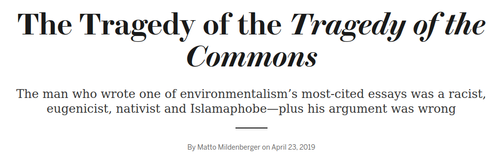
```

::: notes

I'd argue this is a compelling sub-title, but not really the central argument of the piece.

- In other words, this is more than just an exercise in re-evaluating a historical figure.

<br>

### What's the more affirmative or positive version of the conclusion?
- (**SLIDE**)
:::


## {background-image="libs/Images/background-forest_v3.png" .center}

```{r, fig.align='center'}

```

<br>

Therefore, "[to] create a just and vibrant climate future, we need to ... cast Hardin and his flawed metaphor overboard."

::: notes

Everybody now take a few minutes to diagram the argument that supports this conclusion.

- What are the key premises?

<br>

Compare and merge lists with the people around you.

<br>

Let's get this on the board!

*ON BOARD*

- (**SLIDE**: My version)

<br>

### Mildenberger 2019 Notes
- Garrett Hardin gives us Tragedy of the Commons metaphor
- Hardin used ecological causes to advance some super problematic policies (racist, eugenicist, nativist and Islamophobic who promoted lifeboat ethics)
- BUT, Hardin got the history wrong (See Susan Cox)
- AND, Hardin got the science wrong (See Ostrom)
- AND, Hardin got the morality wrong (Environmental sustainability cannot exist without environmental justice.)
- Climate change is NOT a tragedy of the commons because small changes 30 years ago could have unlocked a better future
- Our future was "stolen from us" "by powerful, carbon-polluting interests who blocked
policy reforms at every turn to preserve their short-term profits."
- Pressuring individuals to change their behavior is counterproductive because "interest groups have structured the choices available to us today."
- "The climate movement needs more people on this lifeboat, not fewer. We must make room for every human if we are going to build the political power necessary to face down the looming oil tankers and coal barges that send heavy waves in our direction."
- Conclusion: "To create a just and vibrant climate future, we need to ... cast Hardin and his flawed metaphor overboard."
:::


## Mildenberger (2019) {background-image="libs/Images/background-forest_v3.png" .center}

1. Hardin's argument is massively influential

2. Hardin gets the history wrong

3. Hardin gets the science wrong

4. Hardin gets the morality wrong

5. Hardin's argument makes addressing climate change harder

Therefore, "[to] create a just and vibrant climate future, we need to ... cast Hardin and his flawed metaphor overboard."

::: notes

Let's quickly step through these premises.
:::


## {background-image="libs/Images/background-forest_v3.png" .center}

::: {.r-fit-text}
**1) Hardin's argument is massively influential**
:::

<br>

```{r, echo = FALSE, fig.align = 'center', out.width = '100%'}
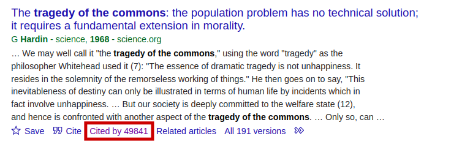
```

::: notes

*Slide image Source: Google Scholar (2022-04-03)*

<br>

Hardin's argument carries huge "weight"

- There's no getting around this key element

- The Tragedy of the Commons is probably the most cited piece of environmental policy research in modern history.

- It was at 52k last week

<br>

Unfortunately, when professors and other researchers in the social sciences seek out work on environmental problems they inevitably start with this.

<br>

**SLIDE**: Ok next premise, Hardin gets ALL of the history wrong
:::


## {background-image="libs/Images/background-forest_v3.png" .center}

::: {.r-fit-text}
**2) Hardin gets the history wrong**
:::

```{r, echo = FALSE, fig.align = 'center', out.width = '100%'}
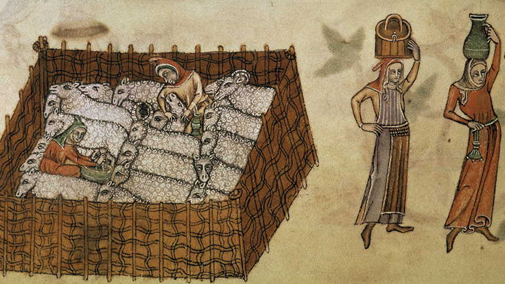
```

::: notes

As Mildenberger notes, in 1985 Dr. Susan Cox published an analysis of the law related to the commons systems in the medieval and post-medieval period in England

- Importantly, she found that there was no evidence of Hardin type tragedies in those places

- The bottom line was that the English commons system "succeeded admirably in its time."

<br>

How did the medieval and post-medieval English avoid the tragedy?

FIRST, the English "commons" severely restricted access

- "...the English common was not available to the general public but rather only to certain individuals who inherited or were granted the right to use it, and use of the common even by these people was not unregulated."

<br>

SECOND, the English "commons" were heavily regulated

- "The types and in some cases the numbers of animals each tenant could pasture were limited, based at least partly on a recognition of the limited carrying capacity of the land."

<br>

THIRD, the end of the "commons" was politics, not dramatic tragedy

- The decline of the commons system" came due to "widespread abuse of the rules governing the commons, land “reforms” chiefly designed to increase the holdings of a few landowners, improved agricultural techniques, and the effects of the industrial revolution."

<br>

The commons was important to survival and so, of course, the society learned to manage them!

- Humans are not suicidal lemmings

<br>

So, if the ToC wasn't evident in the historical commons, what about other societies that collapsed after wasting their resources?

- Hardin got those wrong too!

<br>

### Notes
+ *Image: British Library - Milking sheep in the pen and maids carrying the milk, manuscript illumination, anonymous in the Luttrell Psalter, c. 1340*
+ Cox, Susan. (1985). No Tragedy on the Commons. *Environmental Ethics*. Vol 7, Issue 1, p49-61.
:::


## {background-image="libs/Images/13-1-Anasazi_Mystery.jpg"}

::: {.r-fit-text}
<p style="color: white;">**The Chaco Anasazi**</p>
:::

::: notes
**Anybody ever heard of the Chaco Anasazi or visited the cliffside pueblos they built?**

<br>

The Chaco Anasazi

- Name means "the Ancient Ones" so clearly that's a label that we applied later...

- A large and thriving civilization that lasted approximately 500 years in the southwest US
    - (from about 600 AD to 1100 AD)

- Located in the San Juan Basin area of New Mexico

<br>

**SLIDE**: They were a thriving and dynamic civilization 
:::


## {background-image="libs/Images/background-forest_v3.png" .center}

:::: {.columns}
::: {.column width="60%"}
```{r, echo = FALSE, fig.align = 'center'}
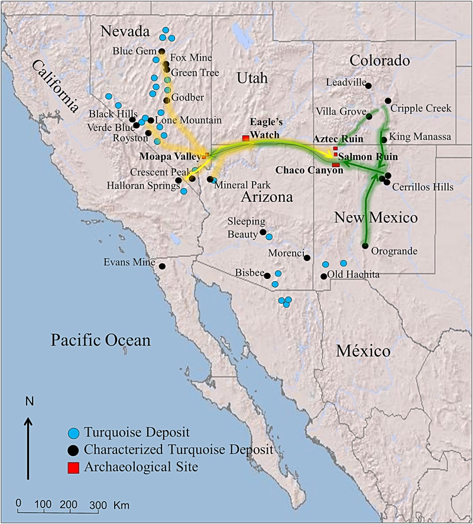
```
:::

::: {.column width="40%"}

<br>

<br>

```{r, echo = FALSE, fig.align = 'center'}
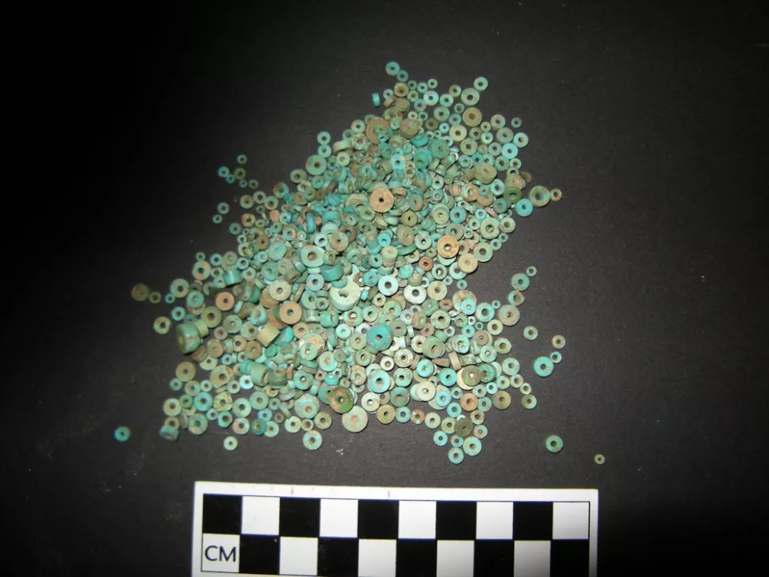
```
:::
::::

::: notes

Archaelogical evidence has shown us they maintained extensive trade ties across very large distances.

<br>

Excavataions of Chaco ruins have found jewelry made with turquoise

- The blue dots on the map represent sources of turqoise in this period

- This, and other evidence, indicates that the Chaco Anasazi developed a trade network that spanned several states: Colorado, Nevada and southeastern California

<br>

Quite impressive work for 600 AD, no?

<br>

**Notes**

- Evidence of turquoise beads from across the western US [Link](https://www.livescience.com/44703-turquoise-trade-network-revealed.html)

:::


## {background-image="libs/Images/13-1-anasazi3.jpg"}

{.absolute right=0 bottom=125 width="35%"}

::: notes
The Anasazi also built extensive public works to allow for city building and irrigation for larger farm lands

+ Damming rivers, managing forests, roads, etc

<br>

The Anasazi supported a thriving arts and science culture.

- This was an ancient civilization that was thriving and dynamic!
:::


## {background-image="libs/Images/13-1-anasazi2.jpg"}

::: {.r-fit-text}
<p style="color: white;">**Why did the Anasazi disappear?**</p>
:::

::: notes

*Source: Jared Diamond's Collapse book has such stories (although historians quibble with MANY of his details!)*

<br>

The question is, for a society as incredibly successful as they were, how did they disappear so rapidly?

<br>

They lived in a place, the US Southwest, whose environment was already somewhat strained (low rainfall, not a lot of forest land)

- As their population grew, demands on environment grew and environmental resources declined

<br>

Hardin's model predicts that in these circumstances the Anasazi people ARE COMPELLED to accelerate their downfall!

- Cut down that tree before someone else does!

- Use up that water before your neighbor can get to it!

- Race to the tragedy, baby!

<br>

**SLIDE**: But, once again, Hardin gets the history wrong!
:::


## {background-image="libs/Images/13-1-anasazi2.jpg"}

::: {.r-fit-text}
<p style="color: white;">**2) Hardin gets the history wrong**</p>
:::

::: notes

Extensive evidence shows that the tried a ton of policies to adapt to the changing climate

- They dammed rivers to promote agriculture,

- They utilized their extensive trade ties to acquire what they needed,

- They ventured further and further away to locate trees

<br>

The problem was not a suicidal urge to embrace collective action problems, it was the prolonged drought

- Eventually they hit the limits of their technology and they were screwed.

<br>

Contra Hardin, the lesson is **NOT** that humans are compelled to double-down on bad strategies and selfish abuses of the land.

- The actual story of societal collapse tied to environmental mismanagement is always a much more complicated one.

- Dare I say it, a political one?

<br>

So, Hardin clearly gets the history wrong

:::


## {background-image="libs/Images/07-1-interrogation.png"}

::: {.r-fit-text}
<p style="color: white;">**3) Hardin gets the science wrong**</p>
:::

<br>

<br>

<br>

<br>

<br>

<br>

::: {.r-fit-text}
<p style="color: white;">**Hardin's "Science":**</p>

<p style="color: white;">**Human reproduction is a "Tragedy of the Commons"**</p>
:::

::: notes

Unfortunately for Hardin, he also gets the science wrong!

<br>

The real purpose of Hardin's article is not to discuss collective action problems in general.

- His purpose was convince the developed world that human suffering and environmental damage were the creation of us letting poor countries have too many babies.

- Hence Mildenberger's subtitle accusing Hardin of racism, nativism and islamaphobia

<br>

Hardin's article presents the decision to reproduce as a one-shot Prisoner's Dilemma

- In this limited version of the model he argues that the dominant strategy is to defect

- In human terms this means the dominant strategy is to have a baby

<br>

**SLIDE**: Let's examine his logic using a 2x2 normal form game theory table like we examined on Tuesday.
:::


## Reproduction as a Prisoner's Dilemma {background-image="libs/Images/background-forest_v3.png" .center}

<br>

```{r}
tibble(
  col1 = c("You", ""),
  col2 = c("No Kids", "Have Kids"),
  Cooperate = c("No pay, no gain", "They pay, you gain"),
  Defect = c("You pay, no gain", "You pay, you gain")
) |>
  kableExtra::kbl(align = c("l", "l", "c", "c"), col.names = c("", "", "No Kids", "Have Kids"), table.attr = "quarto-disable-processing=true") |>
  kableExtra::add_header_above(c(" " = 2, "Other Parents" = 2)) |>
  kableExtra::column_spec(column = 1, bold = TRUE, width = "8em") |>
  kableExtra::column_spec(column = 2, bold = TRUE, width = "15em") |>
  kableExtra::column_spec(column = 3, width = "25em") |>
  kableExtra::column_spec(column = 4, width = "25em") |>
  kableExtra::kable_styling(font_size = 35, bootstrap_options = "basic")
```

::: notes
Here I have set up the table focused just on what you experience in each outcome.

- When Hardin refers to the "costs" of having kids he means the costs imposed on society of things like building and running schools and day cares, using environmental resources more quickly, etc.

- When Hardin refers to the "benefits" of having kids he means the things parents get like happiness, support in old age, extra hands on the farm, etc.

<br>

So, the four outcomes per Hardin are:

- If everyone decides not to have kids then no one pays the costs of caring for them and no one benefits from them

- If you have kids and others don't then society pays some of the costs to raise them and you benefit from having kids

- If others have kids and you do not, then you pay to support their kids and receive no benefits

- If everyone chooses to have kids, then everyone pays some costs and everyone benefits

<br>

**What is the Nash Equilibrium here?**

- **Is there a dominant strategy in this game?**

<br>

Everybody MUST have kids

- If others don't then you should (share the costs, keep the benefits)

- If others do then you should too (share the costs, get some benefits)

- SO, having kids is dominant strategy

<br>

**Why is this a batcrap insane model of human reproduction?**

1. Model assumes ZERO net benefit from adding kids to your community!

2. Assumes costs of adding children exceeds any and all benefits created
    - Assumes parents have INSANELY short time horizons and MASSIVE discount rates
    - This table only maybe holds if you make all your decisions with no eye toward any future (e.g. who tills the fields when you can't?)
    
3. Assumes we only get to play the game ONE time with no ability to talk to the other users

4. Assumes we have no ability to design institutions that can help us manage the problems we face.
    - e.g. parents shoulder more of the costs?
    
5. Assumes your decision to have kids is influenced by a fear that other people having kids impacts you

<br>

**SLIDE**: And what about Ostrom!
:::


## NOBEL PRIZE WINNER Elinor Ostrom {background-image="libs/Images/background-forest_v3.png" }

:::: {.columns}
::: {.column width="50%"}
```{r, out.width='70%'}
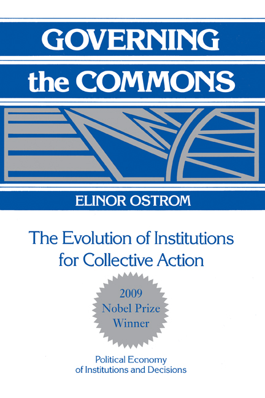
```
:::

::: {.column width="50%"}
```{r, out.width='100%'}
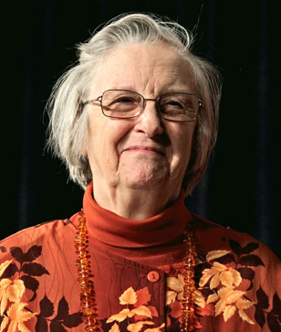
```
:::
::::

::: notes
Ostrom won her Nobel Prize in part based on her research showing Hardin's grasp of "science" was...

- Let's call it limited or otherwise motivated by something other than increasing our knowledge 

- Motivated reasoning is one hell of a drug!

<br>

Rather than just telling an angry story about death and destruction, Ostrom went around the world to study actual communities managing actual resources

- And what she found were incredible successes!

- And of course she did, our species is still here, no?

<br>

### So, Hardin's model includes borderline insane assumptions about parents, so why make them?

- (**SLIDE**: Because you're trying to justify a racism!)

:::


## Lifeboat Ethics {background-image="libs/Images/13-1-lifeboat_v2.png"}

<br>

<br>

<br>

<br>

<br>

<br>

<br>

::: {.r-fit-text}
**4) Hardin gets the morality wrong**
:::

::: notes

Hardin's real argument is that we must embrace the ethics of a lifeboat

- In his metaphor each country in the world is a lifeboat floating in the sea, and

- Poor countries are lifeboats overflowing with people

<br>

Sometimes bad things happen to countries (wars, natural disasters, famines, etc) and people fall out of their lifeboats

- Rich lifeboats prepare for bad times and can preserve and protect their people (get them back into the lifeboat), but poor countries do not prepare

- So, and I quote, "the poor fall out of their lifeboats and swim for a while in the water outside, hoping to be admitted to a rich lifeboat or in some other way to benefit from the 'goodies' on our rich lifeboats"

<br>

Is Hardin ok with us helping the poor people before they drown?

- Good lord, no!

- If the rich lifeboat decides to help the drowning people bad things will happen (e.g. the rich lifeboat can get swamped and everyone dies)

<br>

**SLIDE**: Hardin's policy proscriptions

:::


## {background-image="libs/Images/background-forest_v3.png" .center}

::: {.r-fit-text}
**4) Hardin gets the morality wrong**
:::

<br>

Hardin's policy argument is for the "rich" world to:

::: {.incremental}

1. Control the right to reproduction (don't fill your lifeboat)

2. Seal our borders against immigration (protect your lifeboat)

3. Accept human suffering in the poor world as a signal to the poor to push for better governments

:::

::: notes

In policy terms, Hardin's "Tragedy" is an argument that rich world MUST:

- **REVEAL** each

<br>

**So, what do we think of Hardin's metaphor?**

- *Encourage this discussion*

<br>

- **Does this sound like anything we hear in our politics today?**

<br>

- **Are there any merits to this model?**

:::


## {background-image="libs/Images/13_2-Climate_Cartoon_v3.png"}

::: {.r-fit-text}
**5) Hardin makes addressing climate change harder**
:::

::: notes
**And finally, how does Mildenberger argue that Hardin's model gets climate change wrong?**

<br>

Addressing climate change requires a different focus of action (contra-Hardin) 

- Climate change is NOT a tragedy of the commons because small changes 30 years ago could have unlocked a better future

- Our future was "stolen from us" "by powerful, carbon-polluting interests who blocked policy reforms at every turn to preserve their short-term profits."

- Pressuring individuals to change their behavior is counterproductive because "interest groups have structured the choices available to us today."

- "The climate movement needs more people on this lifeboat, not fewer. We must make room for every human if we are going to build the political power necessary to face down the looming oil tankers and coal barges that send heavy waves in our direction."

:::


## Mildenberger (2019) {background-image="libs/Images/background-forest_v3.png" .center}

1. Hardin's argument is massively influential

2. Hardin gets the history wrong

3. Hardin gets the science wrong

4. Hardin gets the morality wrong

5. Hardin's argument makes addressing climate change harder

Therefore, "[to] create a just and vibrant climate future, we need to ... cast Hardin and his flawed metaphor overboard."

::: notes

**Split class into small groups (4-ish)**

Groups, I want you to discuss Mildenberger's argument and get ready to report back your answer to a big question:

- **Because of the serious problems highlighted by Mildenberger, should we stop teaching Hardin's "Tragedy of the Commons" in classes that focus on environmental problems and policy-making?**

<br>

*REPORT back and DISCUSS*

<br>

**What are the strongest parts of Mildenberger's argument?**

<br>

**What are the weakest parts?**

<br>

**Do you buy that ToC thinking made addressing climate change harder for us today? Why or why not?**

<br>

So, that's the problematic legacy of the ToC

- **SLIDE**: Let's move to the Kashwan article to see other evidence of problems in our institutions
:::


## {background-image="libs/Images/background-forest_v3.png"}

Therefore, "American environmentalism’s racist roots have negatively impacted global conservation practices."

```{r, fig.align='center'}
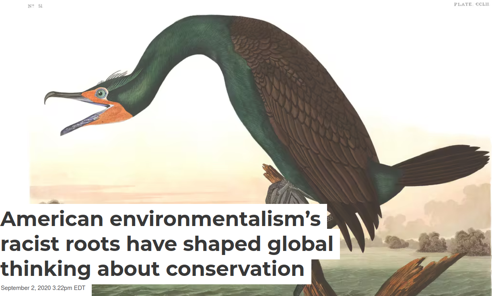
```

::: notes

*Groups!*

Ok, groups, let's shift our focus to the Kashwan article and get ready to report back your summary of this argument

- **What is Kashwan trying to convince us is needed for environmental problem-solving going forward?**

<br>

*REPORT back and DISCUSS*

<br>

**Which specific environmental groups were founded on some deeply troubling ideas?**

- (**SLIDE**)

:::


## {background-image="libs/Images/background-forest_v3.png"}

:::: {.columns}
::: {.column width="50%"}
```{r, fig.align='left'}


```
:::

::: {.column width="50%"}
```{r, fig.align='right'}
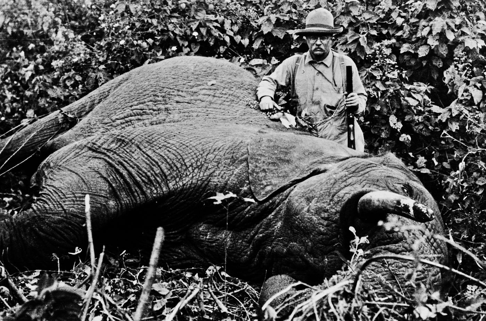

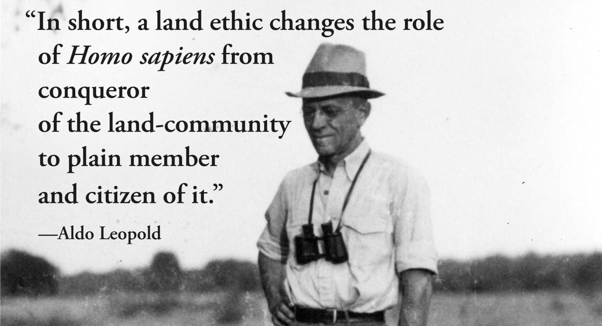
```
:::
::::

::: notes

- Sierra Club grappling with racist views of founder John Muir

- Audubon Society grappling with racist views of founder John James Audubon

- President Teddy Roosevelt launched and bolstered America's efforts to develop and protect national parks BUT his actions perpetuate a racist myth that trophy hunting protects wildlife
    - Trophy hunting "reinforce exploitative models of conservation by removing local communities from lands set aside as hunting reserves."

- Aldo Leopold, considered by many to be the father of wildlife ecology and modern conservation, argued that "overpopulation is the root cause of environmental problems" primarily overpopulation by "less-developed nations with large populations"

<br>

According to Kashwan these aren't just outdated views held by long dead people

- **How have these "racist roots" actually "impacted global conservation practices"?**

<br>

"Most notably, they are embedded in longstanding prejudices against local communities and a focus on protecting pristine wildernesses. This dominant narrative pays little thought to indigenous and other poor people who rely on these lands – even when they are its most effective stewards"

- BUT, it's the lifestyles of the rich with a disproportionate negative impact on the environment!

- Too much modern conservation focuses on building fortresses (national parks) to the exclusion of native/indigenous peoples

<br>

**And, according to Kashwan, what would a "socially just nature conservation" look like?**

- Condition 1: Indigenous and rural communities have concrete stakes in protecting those resources, and 

- Condition 2: They can participate in policy decisions.

<br>

**Are you persuaded by Kashwan's arguments? Do our modern organizations have a problem that needs to be addressed? Why or why not?**

<br>

**Should the Sierra Club diasavow John Muir? Should the Audubon Society change its name?**
:::


## Bullard, Mohai, Saha & Wright (2007) {background-image="libs/Images/background-forest_v3.png"}

```{r, fig.align='center'}
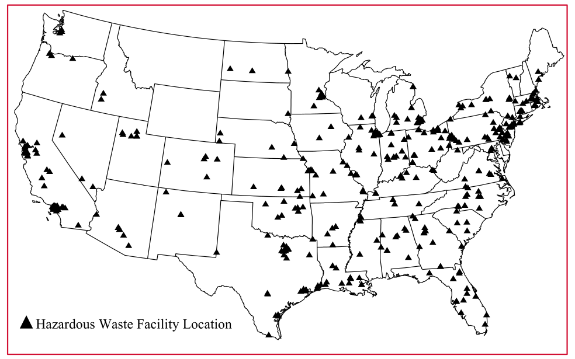
```

::: notes

*Citation: Bullard, R. D., Mohai, P., Saha, R., & Wright, B. (2007). Toxic Wastes and Race at Twenty: Why Race Still Matters After All of These Years. United Church of Christ Justice & Witness Ministries. (**ONLY ch 3 and 4**)*

<br>

<br>

Enough hypotheticals, let's talk about what the empirical data shows.

- Are hazardous waste facilities in the US more likely to be near people of color and the poor?

<br>

### What is the main takeaway of chapters 3 and 4 that answers this question?

- Main Conclusion: Preponderance of the research since 1987 shows "environmental hazards of a wide variety are distributed inequitably by race and socioeconomic status" (38).
:::


## Bullard, Mohai, Saha & Wright (2007) {background-image="libs/Images/background-forest_v3.png"}

```{r, fig.align='center'}
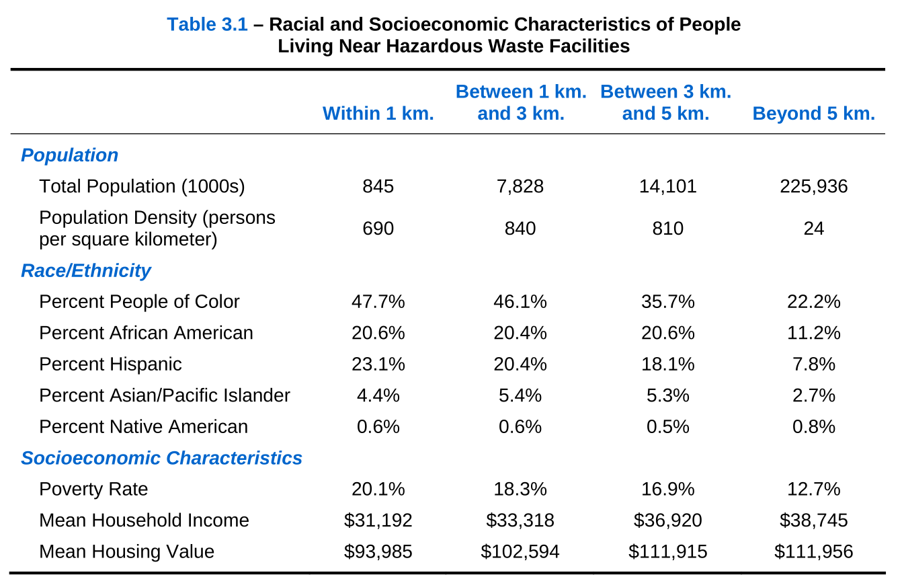
```

::: notes

Here we see a tabular summary of the average data in 1990.

- Each column represents the average value for people living within set distances from a hazardous waste facility.
:::


## Bullard, Mohai, Saha & Wright (2007) {background-image="libs/Images/background-forest_v3.png"}

```{r, fig.align='center'}
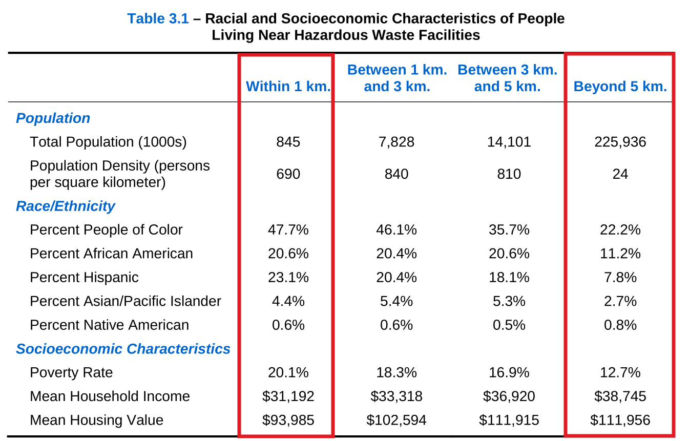
```

::: notes

Focus first on just the difference between those super close and those far away.

### What do we see in the data?

<br>

These results are consistent even when including up to 3km away as "close".

### Why do the authors adopt 3km as their definition of closeness?
- Focusing on 3km (1.8mi) radius which "corresponds to the distance within which empirical studies have noted adverse health, property value and quality of life impacts associated with hazardous waste sites, including hazardous waste facilities (see Methods Appendix)."

<br>

**SLIDE**: Let's jump forward in time
:::


## Bullard, Mohai, Saha & Wright (2007) {background-image="libs/Images/background-forest_v3.png"}

```{r, fig.align='center'}
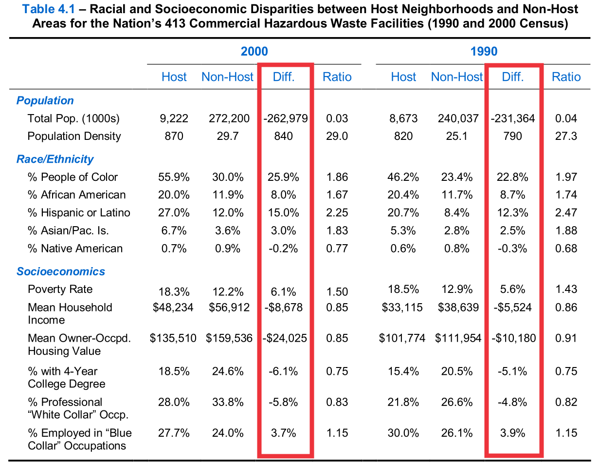
```

::: notes

**What do we learn from their updated data in 2000? Are things getting better?**

- "Overall, Table 4.1 shows that the magnitude of racial and socioeconomic disparities did not change appreciably between 1990 and 2000. It is notable, however, that during the 1990s the percentages of people of color increased in the United States such that people of color now comprise a majority of the population living near the nation’s commercial hazardous waste facilities" (54).

<br>

The report goes on to break down these differences across EPA regions and states.

- The story is fairly consistent across all of them.

<br>

**SLIDE**: More recent research continues to make these points

<br>

**Notes**

Bullard et al 2007 ch 4

- Updates analysis in chapter 3 using more up-to-date data (2007 EPA and 2000 census)
- Five questions on p49
1. What is the current extent of racial and socioeconomic disparities in the location of the nation’s commercial hazardous waste facilities?
2. Did disparities increase during the 1990s?
3. Are disparities greater for host neighborhoods with clustered facilities?
4. How are racial and socioeconomic disparities distributed in different regions of the country?
5. How important is race in predicting facility location in comparison to socioeconomic status and other non­racial factors?
- Focusing on 3km (1.8mi) radius which "corresponds to the distance within which empirical studies have noted adverse health, property value and quality of life impacts associated with hazardous waste sites, including hazardous waste facilities (see Methods Appendix)."
- More than nine million people (9,222,000) are estimated to live within 3 kilometers (1.8 miles) of the nation’s 413 commercial hazardous waste facilities (52).
- Table 4.1 is the updated Table 3.1
- "Overall, Table 4.1 shows that the magnitude of racial and socioeconomic disparities did not change appreciably between 1990 and 2000. It is notable, however, that during the 1990s the percentages of people of color increased in the United States such that people of color now comprise a majority of the population living near the nation’s commercial hazardous waste facilities" (54).
- 2000: Host neighborhood 55.9% people of color vs non-host 30% (26% difference or saying people of color are 1.86x more likely to live within 3km of TSDF)
- 2000: Host neighborhood 18% poverty rate vs non-host 12% (6.1% difference or saying people in poverty 1.5x more likely to live within 3km of TSDF)
- Some evidence that this is worse in certain EPA regions than others. 
- Region 5 (Great Lake states) is real bad! 52.6% PoC vs 18.8% PoC in non-host areas. 33.8% higher!
- Region 9 real bad too (CA, AZ, NV). 80.5% PoC vs 49.4% PoC in non-host areas. 31.1% higher!
- Figure 4.3 shows states with biggest discrepancies by race
- "This analysis shows that statistically significant racial and socioeconomic disparities in the location of commercial hazardous waste facilities are very prevalent among the states and thus throughout the country" (60).
- "This analysis of the states also shows that racial disparities are more prevalent and extensive than socioeconomic disparities, suggesting that race has more to do with the current distribution of the nation’s hazardous waste facilities than poverty" (60).
:::


## Kerr et al (2024) {background-image="libs/Images/background-forest_v3.png"}

**Increasing Racial and Ethnic Disparities in Ambient Air Pollution-Attributable Morbidity and Mortality in the United States**

```{r, fig.align='center'}
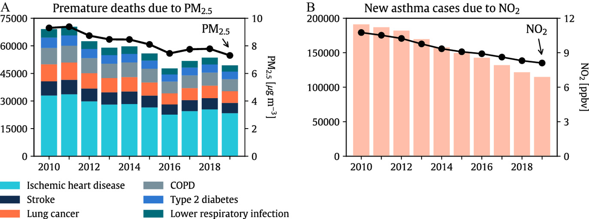
```

::: notes

Research published in 2024 in Environmental Health Perspectives shows that the US continues to make serious progress in improving air quality and that those improvements have translated into better health outcomes!

- On the left, premature deaths due to PM2.5
    - You can see the many ways breathing PM can kill you!
    
- On the right, pediatric asthma cases attributable to nitrogen dioxide

<br>


**SLIDE**: HOWEVER, not everyone gets the same benefits!
:::


## Kerr et al (2024) {background-image="libs/Images/background-forest_v3.png"}

**Increasing Racial and Ethnic Disparities in Ambient Air Pollution-Attributable Morbidity and Mortality in the United States**

```{r, fig.align='center'}
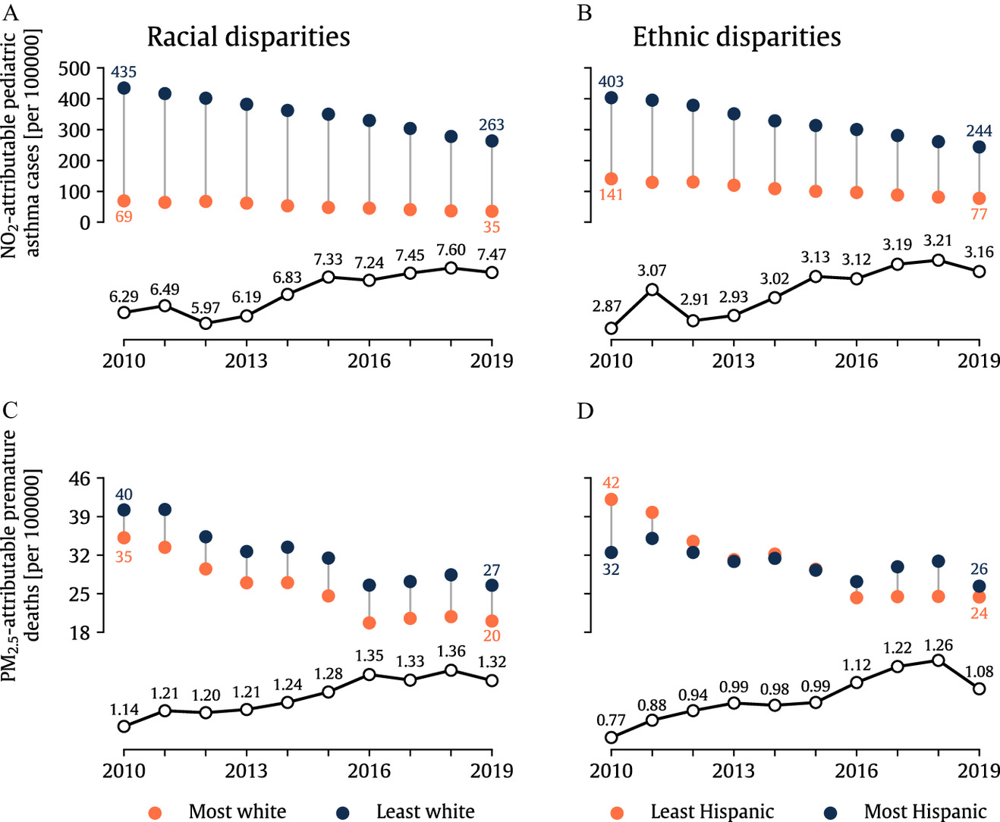
```

::: notes

- The top row here focuses on new asthma cases attributable to NO2 comparing the most to the least white census tracts in the country

- The bottom row focuses on deaths attributable to particulate matter in the air

- The orange dots are the most white areas and the blue dots are the least white

- The line plots at bottom are the ratios across sub-groups
    - A value of 1 means the risks are equal across the groups

<br>

The good news is that our air quality is improving and that is being born out in better health outcomes!

- The bad news is that the racial gap remains quite large!

<br>

**SLIDE**: And our current policy tools are struggling to address this gap
:::


## Donoghoe and Perry (2024) {background-image="libs/Images/background-forest_v3.png"}

::: {.r-fit-text}
**US Civil Rights Tools Are Failing the Most Polluted Black Communities**
:::

<br>

:::: {.columns}
::: {.column width="50%"}
```{r, fig.align='center'}
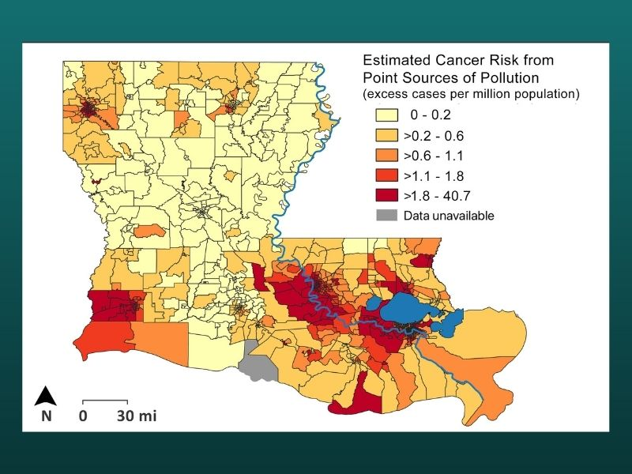
```
:::

::: {.column width="50%"}
```{r, fig.align='center'}
knitr::include_graphics("libs/Images/13_2-Cancer_Alley_March.jpg")
```
:::
::::

::: notes

I can't go a couple of days without new examples of a need for environmental justice popping up in the news

<br>

A long persistent problem is the aptly named "cancer alley" that runs along the Mississippi river in Louisiana.

- Along this 85-mile stretch along the Mississippi River in Louisiana Black residents have long faced higher rates of death and morbidity due to polluted and toxic environments.


<br> 

The EPA has recently closed down an investigation into this problem that, according to reporting, was about to conclude that Louisana had failed in its duty to protect these residents and the state would be liable for the harms.

- Why? Louisiana Attorney General Jeff Landry (R), also a gubernatorial candidate, has fought the effort with a federal lawsuit claiming the EPA overstepped its authority

- The Biden administration ended the investigation, possibly to protect other ongoing investigations, and is now pursuing alternative avenues for helping the residents...

<br>

There's a lot of complexity to this case but the long and short of it is that currently there are more votes in shutting down environmental justice actions than in protecting vulnerable black populations in Louisiana.

:::


## Complicating Factors in Environmental Policy-making {background-image="libs/Images/background-forest_v3.png" .center}

<br>

Given the problematic history, the unequal present harms and the political challenges, should environmental justice be a central piece of your problem-framing? Why or why not?

::: notes

I want to end today with this big question.

- Given all that we've discussed today, what role should environmental justice play in your problem-solving?

- Is it a key element or a dangerous distraction that will only make problem-solving harder?

:::


## For Next Class {background-image="libs/Images/background-forest_v3.png" .center}

<br>

**Fusion Day Prep**

- Prepare an "elevator pitch" for your project

::: notes
Next class we'll talk Fusion Day activities, talk posters and practice our elevator pitches

- Give some thought to your pitch!

- Everyone should have a two minute version of their project!
:::
