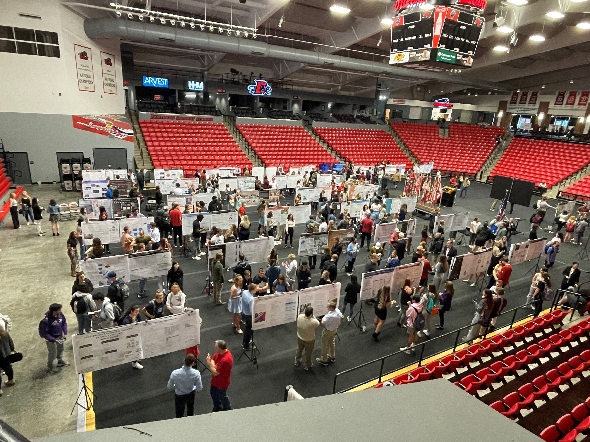

---
output:
  xaringan::moon_reader:
    css: ["default", "extra.css"]
    lib_dir: libs
    seal: false
    nature:
      highlightStyle: github
      highlightLines: true
      countIncrementalSlides: false
      ratio: '16:9'
---

```{r, echo = FALSE, warning = FALSE, message = FALSE}
##xaringan::inf_mr()
## For offline work: https://bookdown.org/yihui/rmarkdown/some-tips.html#working-offline
## Images not appearing? Put images folder inside the libs folder as that is the main data directory

library(tidyverse)
library(readxl)
library(stargazer)
##library(kableExtra)
##library(modelr)

knitr::opts_chunk$set(echo = FALSE,
                      eval = TRUE,
                      error = FALSE,
                      message = FALSE,
                      warning = FALSE,
                      comment = NA)
```

background-image: url('libs/Images/background-forest_v3.png')
background-size: 100%
background-position: center
class: middle

.size70[**Today's Agenda**]

.center[.size65[
Prepare for Fusion Day
]]

<br>

.center[.size40[
  Justin Leinaweaver (Spring 2024)
]]

???

## Prep for Class
1. After volunteers selected you need to make slides for panel

2. [Compass Center Resources](https://www.drury.edu/academic-affairs/fusion-day/compass-center-fusion-day-resources/)


---

background-image: url('libs/Images/background-forest_v3.png')
background-size: 100%
background-position: center
class: middle

.center[.content-box-green[.size45[**Assignment 3: Fusion Day Poster**]]]

```{r, echo = FALSE, fig.align = 'center', out.width = '58%'}

```

.center[.content-box-green[.size45[**Getting Feedback from your Community**]]]

???

Fusion Day is Wednesday and your poster session is 3pm-4:30pm.

### How's everybody feeling?

<br>

**SLIDE**: I'm still working my way through the grading but I want to share some of the great work your classmates have done!


---

background-image: url('libs/Images/14_1-Poster_Anh_Vi.png')
background-size: 84%
background-position: center

???

I love Anh's layout here.

- Super clean but full of valuable detail.

- Includes cited evidence!

- Clear policy options


---

background-image: url('libs/Images/14_1-Poster_Taylor.png')
background-size: 84%
background-position: center


???

Taylor's done a great job balancing detail with compelling visualizations

- This stakeholder map is really cool

- I also like the policies presented as example and concrete hypothetical


---

background-image: url('libs/Images/14_1-Poster_Abbi.png')
background-size: 84%
background-position: center


???

Come on, Abbi's in the field photo is awesome!

- Shows the community you have skin in the game. This is a super clever design addition!

<br>

You'll get your poster grades back after Fusion Day and I will give everyone a chance to revise and resubmit.

<br>

**SLIDE**: Let's now talk expectations for tomorrow.


---

background-image: url('libs/Images/11_1-Compass_Center14.png')
background-size: 90%
background-position: center


---

background-image: url('libs/Images/11_1-Compass_Center15.png')
background-size: 90%
background-position: center

???

Not sure how many of you participated in this last year, but it can be a lot of fun.

- People want to understand and be excited by your work.

- This means you'll be presenting to a really good audience!

<br>

### Any questions on Wednesday's poster session?


---

background-image: url('libs/Images/14_1-elevator-pitch.png')
background-size: 100%
background-position: center

???

My plan for today is that everyone develop a 2-3 minute elevator pitch for their project.

### Is everybody familiar with this concept?

- Imagine you have a 2 minute elevator ride with a person you want something from

- Can you effectively pitch your idea to someone in a compelling way in such a short time?

<br>

### Has anybody ever prepped this kind of exercise before?

<br>

**SLIDE**: Before we do this, we need to discuss one other thing.


---

background-image: url('libs/Images/background-forest_v3.png')
background-size: 100%
background-position: center

class: middle

# Fusion Day Panel

.size40[
- Four certificates present (OBT 300), 10am-11:30am

- Each certificate:
    - 4 certificate students
    - Twenty minutes

- Audience of FUSE 102 students 
]

???

Because we are the certificate capstone, we are on the hook for a presentation in the morning to FUSE 102 students who are trying to pick certificates.

- Basically, four certificates are assigned to a room and each get 20 minutes to introduce the certificate

- The audience for the certificate panels is primarily first year students with the goal of helping them make decisions about which certificates they want to pursue. 

<br>

**SLIDE**: Plan of attack

<br>

Room 300:
- 10:00-10:20   Graphic Storytelling
- 10:20-10:40   Life in Close Up: Film, History, and Society
- 10:40-10:50   Break
- 10:50-11:10   Designing Solutions for Environmental Problems
- 11:10-11:30   The Activists Tool Kit: Transforming Society through Civic Engagement


---

background-image: url('libs/Images/background-forest_v3.png')
background-size: 100%
background-position: center

class: middle

# Fusion Day Panel: Our Plan (Breech 200)

.size40[
- Intro: 2 mins

- 4 students: 2-3 minute elevator pitch
    - What's the problem?
    - What are you proposing?
    - Any connections to the certificate classes?

- Five minutes for Q&A with the audience
]

???

Our plan is simple.

- I give a 2 minute opening, e.g. what is the certificate

- Then four of you give your elevator pitch for the project and talk about your experience of the certificate

- We end with a few minutes Q&A

<br>

This means I need four volunteers who are willing to come to the panel and briefly present their projects.

### So, volunteers?


---

background-image: url('libs/Images/14_1-elevator-pitch.png')
background-size: 100%
background-position: center

???

Ok, everybody needs an elevator pitch.

- Take some time to develop yours.

- Open up your poster and think about how you can quickly and effectively guide someone through your research project.

<br>

Let's now pair off, practice running your elevator pitch.

- Give each other feedback!

<br>

New pairs, do it again!

<br>

New pairs, last chance, do it again!

<br>

Alright, I'll see you all tomorrow!
