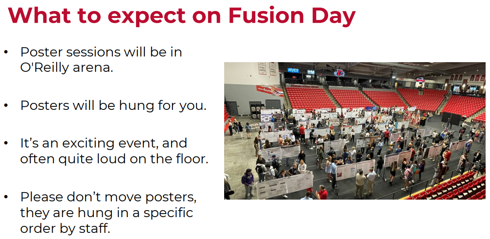
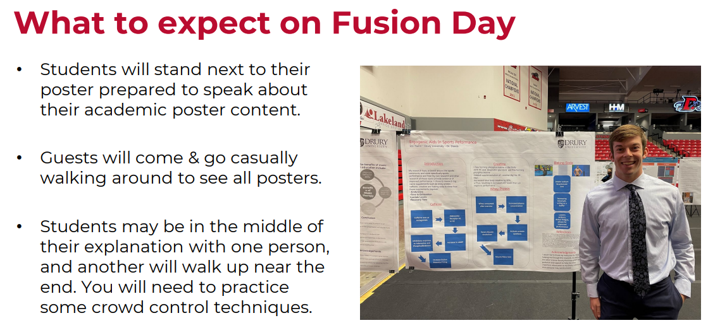

## Today's Agenda {background-image="libs/Images/background-forest_v3.png" .center}

```{r}
library(tidyverse)
library(readxl)
```

<br>

::: {.r-fit-text}

**Prepare for Fusion Day**

:::

<br>

::: r-stack
Justin Leinaweaver (Spring 2024)
:::

::: notes
Prep for Class

1. After volunteers selected you need to make slides for panel

2. [Compass Center Resources](https://www.drury.edu/academic-affairs/fusion-day/compass-center-fusion-day-resources/)

3. Add examples from class of excellent posters!
:::


## Assignment 3: Fusion Day Poster {background-image="libs/Images/background-forest_v3.png"}

**Getting Feedback from your Community**

```{r, echo = FALSE, fig.align = 'center'}
knitr::include_graphics("libs/Images/11_1-FD22 wide shot.jpg")
```

::: notes

Fusion Day is tomorrow and your poster session is 3pm-5pm.

- **How's everybody feeling?**

<br>

**SLIDE**: I'm still working my way through the grading but I want to share some of the great work your classmates have done!
:::


## {background-image="libs/Images/14_1-Class_Poster_Example-Annie.png"  background-size='92%'}

::: notes

Annie did a really nice job balancing layout, carity and detail

- Such a hard needle to thread!

<br>

I really appreciate the local data touches here

- The data on commute times in SGF is very cool

- The map of bike paths in the community too

<br>

And, of course, the photo of Annie getting out into the world is great!

- On a psychological level these kinds of touches are incredibly effective when appealing to local stakeholders

- It also gives the people coming up to look at your poster an easy in, e.g. what did you do? what did you learn?

<br>

On the other hand, misspelled my name... Booooooo

:::


## {background-image="libs/Images/14_1-Class_Poster_Example-Megan.png" background-size='92%'}

::: notes

Megan has also produced such a clean and inviting poster here

- The addition of the QR code for more information was super clever

<br>

Megan's in the field photo is also awesome!

- Shows the community you have skin in the game. This is a super clever design addition!

- I really the style here as well. Draws the viewer in.
:::


## {background-image="libs/Images/14_1-Class_Poster_Example-Emily.png" background-size='92%'}

::: notes

Emily's poster is jam packed with excellent information, but done in a very compelling way

- Each section is written in an incredibly inviting manner

- So much great detail here but never overwhelming!

<br>

You'll get your poster grades back after Fusion Day

<br>

**SLIDE**: Let's now talk expectations for tomorrow.
:::


## {background-image="libs/Images/background-forest_v3.png" .center}

```{r, fig.align='center'}

```


## {background-image="libs/Images/background-forest_v3.png" .center}

```{r, fig.align='center'}

```

::: notes

Not sure how many of you participated in this last year, but it can be a lot of fun.

- People want to understand and be excited by your work.

- This means you'll be presenting to a really good audience!

<br>

**Any questions on Wednesday's poster session?**
:::


## {background-image="libs/Images/14_1-elevator-pitch.png"}

::: notes

My plan for today is that everyone develop a 2-3 minute elevator pitch for their project.

<br>

**Is everybody familiar with this concept?**

- Imagine you have a 2 minute elevator ride with a person you want something from

- Can you effectively pitch your idea to someone in a compelling way in such a short time?

<br>

**Has anybody ever prepped this kind of exercise before?**

<br>

Ok, everybody needs an elevator pitch.

- Take some time to develop yours.

- Open up your poster and think about how you can quickly and effectively guide someone through your research project.

<br>

Let's now pair off, practice running your elevator pitch.

- Give each other feedback!

<br>

New pairs, do it again!

<br>

New pairs, last chance, do it again!

:::


## For Next Class {background-image="libs/Images/background-forest_v3.png" .center}

<br>

::: {.r-fit-text}
**Greenwashing and Eco-Capitalism**

- Dauvergne (2016) *Environmentalism of the Rich*
:::

::: notes

Thursday we end on a really big problem

- Can any version of capitalism actually protect the environment?

<br>

Alright, I'll see you all tomorrow for the poster session!
:::