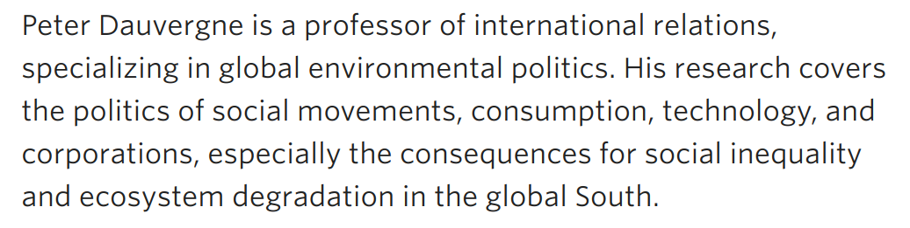
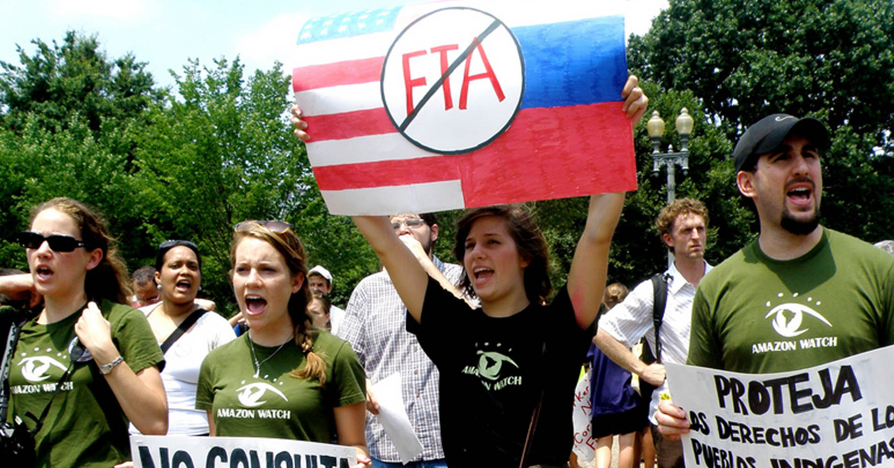
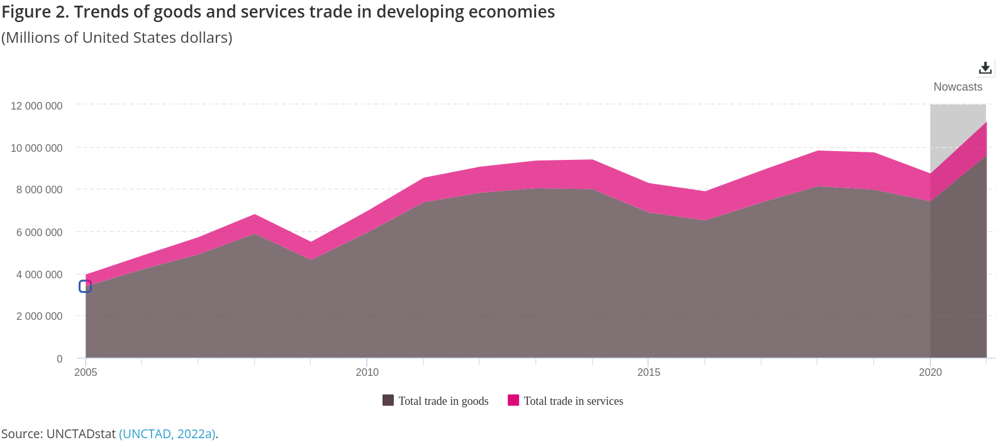
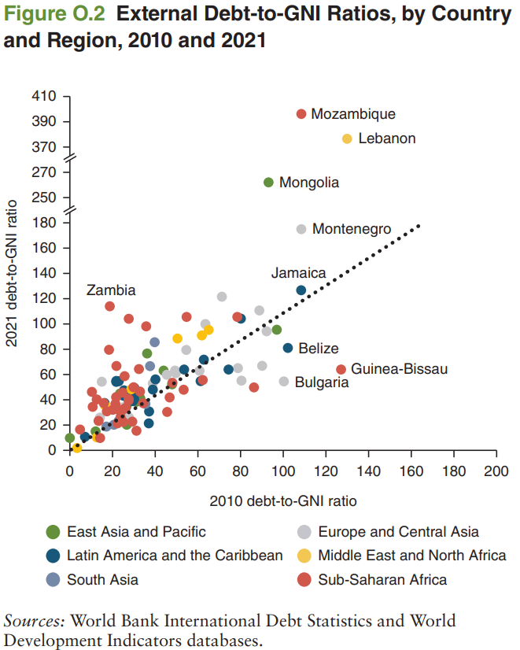
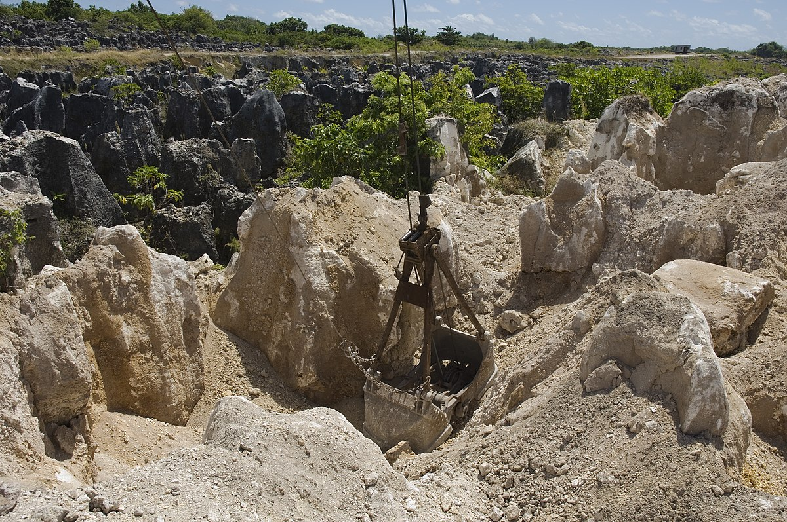
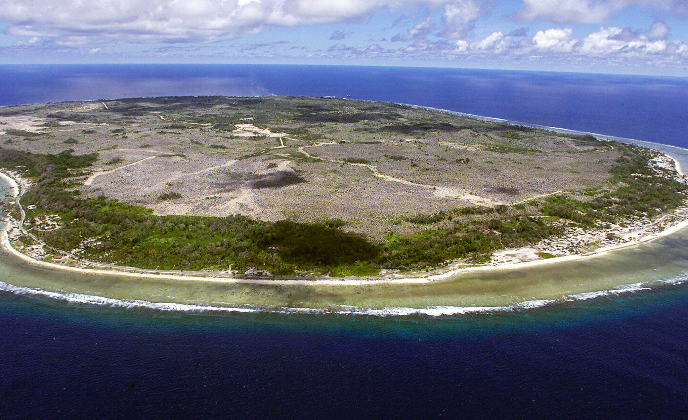
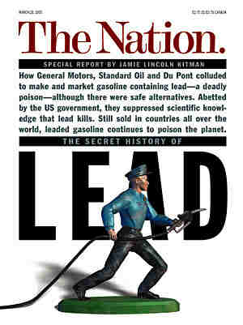
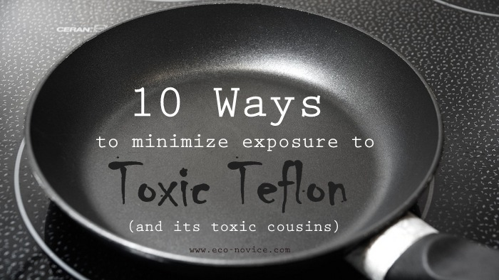
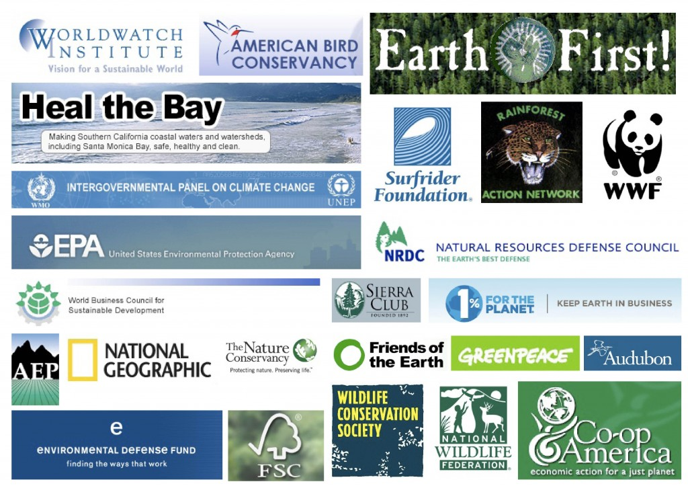

# Today's Agenda {background-image="libs/Images/background-forest_v3.png" }

```{r}
library(tidyverse)
library(readxl)
```

<br>

::: {.r-fit-text}
**III. Designing an Environmental Policy**

- Complications 5: Greenwashing & Eco-Capitalism
:::

<br>

::: r-stack
Justin Leinaweaver (Spring 2024)
:::

::: notes
Prep for Class

1. Added a link to Schaub (2024) op-ed titled: Don’t waste your time recycling plastic
    - Link: https://www.washingtonpost.com/opinions/2024/04/22/stop-recycling-plastic-earth-day/

<br>

Nice work at Fusion Day!

<br>

**How did it go for you?**

- Useful feedback?

- Lots of compliments for your excellent work?
:::


## Assignment 5: Proposing a Policy {background-image="libs/Images/background-forest_v3.png" .center}

<br>

Propose a policy to address your selected environmental problem that balances the interests of the relevant stakeholders against the constraints of established institutions and uncertainty.

::: notes

I want to keep drawing your eyes back to the prompt for our final paper.

<br>

### Questions on the prompt?
:::


## Complicating Factors to Consider When Designing Your Policy {background-image="libs/Images/background-forest_v3.png" .center}

<br>

- Risk aversion (acceptance)

- Temporal discounting and uncertainty

- Collective action problems and free-riding

- Inequality

- Greenwashing

::: notes

Our last section of the semester is meant to help you think about the complications common to environmental problem-solving.

<br>

Remember, our work exploring complications is meant to:

1. help you keep this project moving forward in concrete ways, AND

2. deepen your thinking about environmental policy design.

<br>

### Questions on any of the complications we have previously explored?
:::


## Peter Dauvergne {background-image="libs/Images/background-forest_v3.png" .center}

:::: {.columns}
::: {.column width="30%"}
```{r}

```
:::

::: {.column width="70%"}

<br>

```{r}

```

:::
::::

::: notes

Dr. Dauvergne has published EXTENSIVELY in this research area

- A very engaging writer

- I always enjoy reading his stuff (even if it is crushingly depressing)

<br>

Today I'd like us to dig into some of the big ideas raised by his book, Environmentalism of the Rich.

<br>

I assigned you the final chapters (ch10-12) both because they wrap up the broader narrative and because that is where the material most directly impacting your policy design work lives.

- However, for people interested in solving environmental problems I believe that the whole thing is worth a read.

<br>

The book has been designed to help us think critically about environmentalism.

- Where did it come from, what has it accomplished and where is it going?

<br>

**SLIDE**: Let's start with the key thesis of the book

:::


## Greenwashing and Eco-Capitalism {background-image="libs/Images/background-forest_v3.png" .center}

<br>

...over the past two decades the pendulum of environmentalism has **swung too far toward cooperation and reconciliation with the institutions of capitalism**, and to make more of a global difference the mainstream of the environmental movement **needs to pursue more transformative, ecological and justice-oriented goals** (9).

::: notes

Chapter 1 gives us Dauvergne's key conclusion

- *Read quote*

<br>

**What do we learn just from this quote about how Dauvergne frames the key concepts in his book?**

- **In other words, what do you learn about this analyst from this conclusion (e.g. defining the problem, the environmental movement and its goals)?**

<br>

Fundamentally, Dauvergne is interested in evaluating if the environmental movement has been successful or not

- The "movement" seems to be a very broad brush aggregation of all groups doing this kind of work

<br>

By "success" he focuses on sustainability

- However, his definition of sustainability appears to include much more than economic efficiency

- It is used to describe the ability of an entire society to exist indefinitely

<br>

I want to briefly walk you through FIVE of the key premises in the chapters we didn't have time to read in order to build up to the chapters you read for today.

- This way you'll have a better sense of the whole argument when we get to the work of evaluating it.
:::


## 1. Globalisation is imperialism by another name {background-image="libs/Images/13-1-globalism_colonialism_v2.png" .center}

::: notes

A sizable claim that Dauvergne makes early, and often, in the book is that for the developing world, globalization is imperialism continued under another name (see ch2 especially).

<br>

Let's clarify the concepts here.

<br>

**When you've heard the word 'globalization' in the past, what was it referring to?**

- (Growing connections between states and people around the world often in terms of trade, exchange, travel and/or communication)

- Intensely contested concept

<br>

**When you've heard the word 'imperialism' in the past, what was it referring to?**

- Think colonialism but without requiring direct physical control

- a policy of extending a country's power and influence through diplomacy or military force (Oxford Languages).

- Imperialism is the state policy, practice, or advocacy of extending power and dominion, especially by direct territorial acquisition or by gaining political and economic control of other territories and peoples (Britannica).

<br>

Put these together for me

- **What is the argument here? What does it mean to equate these two mechanisms?**

- (**SLIDE**)
:::


## {background-image="libs/Images/background-forest_v3.png" .center}

::: {.r-fit-text}
**1. Globalisation is imperialism by another name**
:::

```{r, fig.align='center'}

```

::: notes

European imperialism was violent and exploitative harming communities and environments around the world

<br>

Per Dauvergne, globalization is equally as destructive because it is fundamentally a process of forcing everyone to play by the "rules" of trade created by, and for the benefit of, the rich

<br>

You want to engage in world trade? 

- Adopt our rules!

- Allow capital to flow in and out of your country more easily

- Create judicial processes to protect foreign investors

<br>

You want to protect your citizens?

- Sure, just make sure you prioritize investors needs first or else

- Economic coercion (follow our rules or suffer)

<br>

**SLIDE**: Let's consider some evidence!
:::


## {background-image="libs/Images/background-forest_v3.png" .center}

::: {.r-fit-text}
**1. Globalisation is imperialism by another name**
:::

```{r, fig.align='center'}

```

::: notes

The United Nations Conference on Trade and Development (UNCTAD) is an intergovernmental organization within the United Nations Secretariat that promotes the interests of developing countries in world trade. [LINK](https://sdgpulse.unctad.org/trade-developing-economies/)

- Here we see the massive growth in trade by developing economies over time.

- Clearly, many poor countries are engaging in international trade and the amounts are growing across time.

<br>

**SLIDE**: And what has been the experience of these countries over time?
:::


## {background-image="libs/Images/background-forest_v3.png" .center}

::: {.r-fit-text}
**1. Globalisation is imperialism by another name**
:::

```{r, fig.align='center'}

```

::: notes

This figure is taken from the World Bank's recent report on [International Debt Statistics 2022](https://openknowledge.worldbank.org/handle/10986/36289)

- Plot visualizes the change in country debt levels (compared to the size of their economies) for developing economies

- 2010 data is on the x-axis, 2021 data is on the y-axis

- Dots above the 45 degree line are countries whose debt has grown since 2010.

<br>

What I hope is clear here is that most dots are above the line.

- e.g. debt is growing!

- Per this report, Low-Income Country debt has risen to a RECORD $860 Billion in 2020

<br>

So, developing countries are engaging in more and more international trade AND increasing their debt burdens at the same time!

- Globalization appears to be making them poorer...
:::


## {background-image="libs/Images/14_2-Nauru_Beach.webp"}

::: {.r-fit-text}
<p style="color: white;">**The Exploitation of Nauru**</p>
:::

::: notes

Dauvergne steps us through the tragic story of Nauru as a case study for exploitation through globalization (chapter 3).

<br>

Nauru is a small island country in the Pacific Ocean

- settled by Micronesians around 3,000 years ago

- Only 21 km squared (third smallest country in the world)

<br>

No contact with the "developed" world until 1798 when a British whaling ship, *Hunter*, stumbled across it

- Things rapidly go downhill from there

- In 1886 Germany and the Brits are divding up land for colonies around the world and Nauru is granted to the Germans

- 1888 the Germans invade and conquer the island

:::


## {background-image="libs/Images/background-forest_v3.png" .center}

::: {.r-fit-text}
**1. Globalisation is imperialism by another name**
:::

<br>

**The Exploitation of Nauru**

:::: {.columns}
::: {.column width="50%"}
```{r, fig.align='center'}

```
:::

::: {.column width="50%"}
```{r, fig.align='center'}

```
:::
::::

::: notes

But things don't get REALLY bad until 1900 when phosphate ore is discovered

- At the time, and still today, a very valuable mineral

<br>

By the time of Nauru independence in 1968, 1/3 of the entire island was a strip mine

- After independence, the new leaders of Nauru decide to INCREASE mining to make money for the country (and themselves) 

- By the early 2000s supplies plummet and economic catastrophe is wrought.

- At this point, over 80% of the ENTIRE ISLAND has been strip-mined 

<br>

Desperate to replace income, Nauru has become: 

- A haven for dirty banks and money laundering,

- A country willing to sell citizenships to the highest bidder, and recently

- Nauru has agreed to let Australia set up a detention camps for would-be immigrants on its territory in exchange for money.
    - e.g. an open-air prison

<br>

Clearly, the story of globalization in the developing world is a complicated one and there is much evidence of deep tragedies and exploitation in its wake.
:::


## 1. Globalisation is imperialism by another name {background-image="libs/Images/13-1-globalism_colonialism_v2.png" .center}

::: notes

In sum, Dauvergne argues that there is a ton of current evidence in the developing world for this first premise: 

- Massive and rising debts,

- Rising inequality,

- Rampant environmental destruction, and 

- A concentration of financial power.

<br>

**So, based on your experience of the world are you convinced by this argument?**

- **Do we believe that globalization has been as destructive as imperialism in the developing world? Why or why not?**

:::


## {background-image="libs/Images/background-forest_v3.png" .center}

::: {.r-fit-text}
**Environmentalism**

**+**

**Capitalism**

**=** 

**Bad Ecological Outcomes**
:::

::: notes

Dauvergne's second premise

- *Read slide*

<br>

Dauvergne argues that you cannot "frame" or "embed" environmentalism in the capitalist system and expect ecologically positive outcomes (ch4).

<br>

In short:

- Capitalism is defined by the want of more (money, stuff)

- "To survive, capitalism needs to expand production and markets" (49)

<br>

This central motivation tends to corrupt even those with good intentions!

- A company that dedicates itself to being cleaner, more efficient or less wasteful may generate more profits

- HOWEVER, those profits will then be reinvested into expansion in order to sell more things!

<br>

**SLIDE**: Patagonia example

:::


## {background-image="libs/Images/13-1-patagonia_dont_buy_jacket-BW.jpg" .center background-size='95%'}

::: notes
**Anybody ever seen this ad before?**

<br>

Patagonia ran this as a full page advertisement in the NYT in 2011

- This is the $700 "Don't Buy This Jacket" jacket

<br>

*Read the ad copy*

<br>

**How many jackets do you think they sold?**

- Sales EXPLODED!

<br>

Patagonia believes this worked because:

1. it was a testimony to the high quality and durability of their clothes, and

2. they depend on the loyalty of a kind of consumer who feels this message strongly

<br>

**Be honest, would this work on you? Why or why not?**

:::


## {background-image="libs/Images/background-forest_v3.png" .center}

::: {.r-fit-text}
**Environmentalism**

**+**

**Capitalism**

**=** 

**Bad Ecological Outcomes**
:::

::: notes

Dauvergne's argument is fairly simple

- Capitalism structures our choices and incentivizes consumption above all else

<br>

**What companies or brands do you think of as being "good" stewards of the environment?**

<br>

**What about companies or brands that have good reputations for other social causes? e.g. helping the poor, etc**

<br>

Per Dauvergne, examples of capitalism messing up company incentives are everywhere

- Oil and gas companies advertise extensively on their efforts to be greener and more efficient while also dramatically increasing oil and gas production

- Pampers diapers not selling well because some young parents worried about waste, shrink the packaging and the size of the diapers and advertise the newer, slimmer more efficient diapers (sales increase)

<br>

**So, do we buy this argument?**

- **Are we convinced that corporate "good" behavior is always designed to increase consumption? Why or why not?**

<br>

**Other chapter notes**

- Too often, corporate social responsibility (CSR) is about protecting wealth and priviledge rather than promoting ecological ends.
    - Those who question this env of the rich are scorned and derided.
- Case: Kalle Lasn, Adbusters and the Occupy Movement 
- Case: Patagonia's $700 "don't buy this jacket" jacket
- The spread of sustainability as a corporate mantra
- Case: Pampers in China; crummy product equalled crummy sales; improved product plus MASSIVE marketing campaign "golden sleep"
- Oil and gas companies provide the literal fuel for this growth and they have succeeded massively as economies have grown.
- The catch? So much of this wealth is being generated only at the very top. Inequality is exploding!
- Argument: wealth inequality is deeply problematic for sustainability.

:::


## 3. We are rapidly consuming the world while feeling better and better about our choices {background-image="libs/Images/13-1-recycling_myths_v3.png" .center}

::: notes

Dauvergne's THIRD premise is that we are rapidly consuming the world while feeling better and better about making environmental choices.

<br>

The first part of this is uncontroversial: we are rapidly consuming the world's resources

- Rapidly increasing extinction rates, 

- Animal populations crashing, 

- Coral reefs dying, 

- Rainforests in crisis,

- etc.
    
<br>

The second part of this is that despite the environmental harms, we feel pretty good about our own choices!

- Most people, given the choice, prefer products marketed as "green," "recyclable," "sustainable" or efficient

- BUT, we still consume essentially the same amounts of stuff!


<br>

**Is this a fair characterization of your behaviors as a consumer?**

- **Have your "green" choices led to less consumption or just "slightly better" consumption?**

- **e.g. do you try to make "better" purchases or "fewer" purchases?**

<br>

**To what degree do you consider environmental harms when making purchases?**

- **Do you consider the harms exclusively in our country or are you concerned about global harms too? Why or why not?**

<br>

**Do you consider your choices in terms of harms to future generations? Why or why not?**

<br>

Dauvergne is concerned about our role in this bad dynamic

- "Most consumers are unaware of, and feel little responsibility for, the environmental risks and damage of consumption in other countries and for future generations" (56).

<br>

**How does this argument fit with the op-ed I assigned you on Canvas?**

- **e.g. Schaub (2024) "Don’t waste your time recycling plastic"**

<br>

##### Other chapter notes
Argument: "I'll demonstrate in this chapter, however, rising ecological footprints and unsustainable consumption are causing severe ecological strains..." (54)

- Case: Walmart, global sales and global supplies
- A "commercialization of values" is also occuring through advertising and branding.
- We are already above earth's capacity to sustain us and our carbon footprint is growing along with globalization.
- ecological footprint analysis
    - worldwide avg 2.7 global hectares
    - Avgs: Africa 1.5, UK 4.7, Canada 6.4, US 7.2
    - In 2010, estimated Earth can support 12 billion hectares (productive biocapacity), our use was 18 billion hectares.
- The consequences?
:::


## 4. Legal risk-taking by corporations is rampant and incredibly dangerous {background-image="libs/Images/14_2-cleaners_aisle_v2.png" .center}

::: notes

Dauvergne's FOURTH premise is that businesses continue to do legal, but risky things experimenting on consumers and the environment.

<br>

Over time our government has gotten sharper and more demanding that companies not harm people

-  And yet, companies continue to "routinely introduce new chemicals and technologies with little understanding of the consequences for ecosystems and future generations" (67).

<br>

Industry often argues that only when harms are direct, immediate and measurable should caution be taken. 

- And even then, if the profits are big enough (dwarfing the cost of lawsuits and fines), do it anyway!

<br>

BOTTOM LINE there is little regulation or understanding of the risks of 1000s of chemicals on sale around the world today.

<br>

Business and industry have gone to incredible lengths to protect profitability:

- Lobbying politicians and world leaders, 

- Funding right wing think tanks, 

- Allying with commerce and natural resource departments,

- Suing environmental agencies, 

- Initimidating grassroots activists, and

- Fomenting community backlash.
:::


## 4. Legal risk-taking by corporations is rampant and incredibly dangerous {background-image="libs/Images/background-forest_v3.png" .center}

<br>

:::: {.columns}
::: {.column width="50%"}
```{r, fig.align='center'}

```
:::

::: {.column width="50%"}
```{r, fig.align='center'}

```
:::
::::

::: notes

Case Study Examples from the book

<br>

Thomas Midgley Jr. adds ethyl to gasoline to prevent engine knock, but the tetraethyl lead does serious harm to the environment.

- Business and government work together to undermine/slow developing scientific concerns that this is a problem.
    
- Industry backed research continually "confirms" the safety of leaded gas.
    
- Took until the mid-1960s for the panic to set in as people had lead levels 100 times normal.
    
<br>
    
Do you love your non-stick pan?

- Making Teflon adds serious harms to the environment and your health if you cook over high heat!
    
- Well documented flu-like symptoms from breathing in fumes from an overheated Teflon-coated pan
    
- BUT it was profitable so industry fought to hide and suppress the research.
:::


## 5. "Environmentalism of the Rich" {background-image="libs/Images/background-forest_v3.png" .center}

```{r, fig.align='center'}

```

::: notes

Dauvergne's FIFTH premise is that the modern environmental movement has come to be dominated by an "environmentalism of the rich"

<br>

The first piece of good news: The modern environmental movement has accomplished SO MUCH

- "National environmental organizations have ... grown considerably since the 1970s" (79).
    
- "Just about every country now has an environmental agency, and over a thousand International environmental treaties are in place" (79).
    
- "Just about every culture has come to embrace the language of sustainability (80). Swamps have become Wetlands, jungles have become biodiversity hotspots, whales are now seeing as sentient and majestic beings, not target practice like they were in the early part of the 20th century.
    
- The environmental movement can even take credit for transforming ways of learning and educating citizens.
    
- Meanwhile, billions of people are recycling and composting.

<br>

The second piece of good news: the modern environmental movement is diverse and dynamic

- Deep philosophical and policy differences have long characterized environmentalism.
    
- Broad dimension running from radicals (remake the world economy!) to reformers (use institutions to guide globalzation to do good).
:::


## "Environmentalism of the Rich" {background-image="libs/Images/background-forest_v3.png" .center}

<br>

"More important, however, has been the innate power of consumer capitalism to distort and assimilate counternarratives and countermovements, especially critiques of wealth and economic growth" (p76).

::: notes

The big "but"...

- *Read quote*

<br>

BUT, the modern environmental movement has failed to meaningfully challenge consumer capitalism

- The reformers have accomplished much for the wealthy amongst us, but these small changes has weakened the capacity of the movement to challenge capitalism.
    
- These groups are the creation of the West and are far too responsive to the demands of Western interests
:::


## {background-image="libs/Images/background-forest_v3.png" .center}

1. Globalisation = imperialism
2. Environmentalism + Capitalism = Bad Outcomes
3. "Green" consumption is still consumption
4. Corporate risk-taking is rampant and dangerous
5. "Environmentalism of the Rich"
6. ...

Therefore, the mainstream of the environmental movement needs to pursue more transformative, ecological and justice-oriented goals.

::: notes
Ok, here's the argument so far.

<br>

Let's now jump to what you read for today in order to complete the argument diagram.

- On your own, try to summarize the main argument in Chapter 10 in one sentence.

<br>

Discuss with person next to you.

- *Report back and discuss*

- (**SLIDE**)

<br>

#### Chapter 10 notes
Chapter 10 Mindbombing the Wealthy

"The power of Greenpeace to influence global supply chains and certification processes would appear to be increasing as multinational brands and local suppliers try to avoid becoming a target. ... But it's easy to exaggerate the value of the resulting corporate reforms... ...mindbombing middle-class consumers over social media is doing little to alter the world politics of ever-rising revenues, growth, and consumption" (114).

Eco-Warriors of the Arctic Sunrise
- Protests of Gazprom in the Arctic sea lead to arrests and a worldwide movement to free the protestors. Calls this a successful mindbomb.

Greenpeace International
- "Campaigns to discourage consumers from purchasing a product until the manufacturer modifies a particular practice have tended to achieve the most traction. Firms have generally offered the least resistance when it's relatively easy and inexpensive to appease campaigners, and when doing so does not look likely to hurt long-term revenues, profits, or market control, as was the case with the 2011 Greenpeace campaign to push Mattel to change its Barbie doll packaging" (118).

Palm Oil Campaign
- Nestle eventually buckles to the pressure. "Today, the company portrays NGOs as allies, not adversaries. Activists are, in the words of Nestles' Chris Hogg, the company's 'eyes and ears on the ground. And if they find something we take it seriously and look into it' " (120).
- "Will such efforts slow deforestation? Divisions within rainforest activism run deep over the value of business pledges, CSR and certification, eco-products and eco-tourism, and using forests as carbon sinks" (123).

The Power of Eco-Consumerism
- "Consumers are the foot soldiers of today's middle class environmentalism" (123).
- Is it effective? Much good is being done HOWEVER plastic waste is rising and "Eco-consumerism is also doing a little to reduce global energy consumption" (124).
:::


## {background-image="libs/Images/background-forest_v3.png" .center}

1. Globalisation = imperialism
2. Environmentalism + Capitalism = Bad Outcomes
3. "Green" consumption is still consumption
4. Corporate risk-taking is rampant and dangerous
5. "Environmentalism of the Rich"
6. Eco-consumerism isn't working

Therefore, the mainstream of the environmental movement needs to pursue more transformative, ecological and justice-oriented goals.

::: notes

I don't mean to claim this is actually Dauvergne's sixth premise but man alive this line on p114 hit me like a ton of bricks.

- "The power of Greenpeace to influence global supply chains and certification processes would appear to be increasing as multinational brands and local suppliers try to avoid becoming a target. ... But it's easy to exaggerate the value of the resulting corporate reforms... ...mindbombing middle-class consumers over social media is doing little to alter the world politics of ever-rising revenues, growth, and consumption" (114).

<br>

**How convinced by this argument are you? Why or why not?**

<br>

Segue way to chapter 11!

- On your own, try to summarize the main argument in Chapter 11 in one sentence.

- Discuss with person next to you.

- *Report back and discuss*

- (**SLIDE**)

<br>

**Chapter 11 notes: Million Dollar Pandas**

- "Corporate money and partnerships are financing environmental projects, programs, and technologies. And they are paying for NGO staff, supplies, buildings, and campaign costs" (127).
- "Such partnerships with business are also offering NGOs the chance to monitor, and even manage, certification and eco-labeling programs. And they're opening up opportunities for environmental activists to advise--or perhaps work alongside--business executives and state regulators" (127).
- "We should not discount the benefits of corporate funding and partnerships for the capacity of environmental NGOs to support programs and projects. ... Yet at the same time such Partnerships, now at the Forefront of environmentalism of the rich, our seating authority to global business by defusing criticism of the growth, sales, and profit models of multinational investors, manufacturers, and retailers. These partnerships... are also doing little to lighten ecological footprints and nothing at all to reduce the extreme inequalities, unrelenting violence, and unsustainable growth underlying the world economy" (128).

WWF

- The World Wildlife Fund as a case study
- 1986 name change to World Wide Fund for Nature
- 2001 to WWF
- WWF has accomplished much through corporate partnerships and labeling, however, Dauvergne argues WWF isn't actually "helping to reduce pollution and wasteful consumption or lower humanity's ecological footprint" (133). See partnership with Coke as an example.
-- Is this a fair critique??

- Other examples: Conservation International, Environmental Defense Fund
- Seems to argue that the businesses gain far more cover for bad behavior than the NGOs gain in funding and incremental improvements to industrial processes.
:::


## {background-image="libs/Images/background-forest_v3.png" .center .smaller}

1. Globalisation = imperialism
2. Environmentalism + Capitalism = Bad Outcomes
3. "Green" consumption is still consumption
4. Corporate risk-taking is rampant and dangerous
5. "Environmentalism of the Rich"
6. Eco-consumerism isn't working
7. Corporate money buys more cover for bad behavior than it provides in better processes

Therefore, the mainstream of the environmental movement needs to pursue more transformative, ecological and justice-oriented goals.

::: notes
**How convinced by this argument are you? Why or why not?**

<br>

Chapter 12 does a nice job wrapping all of this up, but this diagram represents the bulk of the argument.

**How convincing do you find this?**

- **What are the strongest premises?**

- **What are the weakest?**

<br>

**What are the primary implications of this for us as policy designers?**

- *Force this discussion*

<br>

**What are the big recommendations Dauvergne makes in chapter 12 for how we should move forward from this?**

- (**SLIDE**)
:::


## {background-image="libs/Images/background-forest_v3.png" .center .smaller}

**Dauvergne's Policy Arguments**

- People must consume less
- Create new laws to protect ecosystems and human rights
- Measures to end extreme inequality and stop corporate pillaging 
- Far higher levels of precaution when introducing new technologies and chemicals.
- Carbon neutral energy base with fair distribution
- People must accept responsibility for the consequences of the sources of their wealth, owning up to historical wrongs and to contemporary inequities so new rules and institutions can be put in place 
- Controls must be placed on the institutions of overconsumption and wasteful consumption
- "a politics of global sustainability must respect nature, demand intergenerational equity, advance environmental justice, and promote fair economics without irreparably harming present or future life."

::: notes

p(150-151) Dauvergne makes some big recommendations for the future.

### Are any of these possible? Why or why not?

<br>

#### Notes

- "...getting people to consume less and differently is crucial for global sustainability" (150).

- "Moving high consuming lifestyles toward a fair earth share will therefore require far-reaching political and economic reforms... Stricter International and domestic laws to protect ecosystems and human rights are necessary. So are measures to end extreme and equality and stop corporate pillaging. So are far higher levels of precaution when introducing new technologies and chemicals. And so is a new energy base for our economies: carbon neutral, with fair distribution. Most challenging of all, we will need more people, especially those with power and money, to accept more responsibility for the consequences of the sources of their wealth, owning up to historical wrongs and to contemporary inequities so new rules and institutions can be put in place" (150).

- "Controls must be placed on the institutions of overconsumption and wasteful consumption, including the automobile industry, the chemical industry, the construction industry, the fossil fuel industry, the mining industry, the fishing industry, the timber industry, the advertising industry, the fast food industry, the discount retail industry, and the agricultural industry" (151).

- "a politics of global sustainability must respect nature, demand intergenerational equity, advance environmental justice, and promote fair economics without irreparably harming present or future life. It must restrain corporations as well as unbalanced growth and consumption. And it must recognize that socioeconomic and ecological systems interlock, putting in place measures to balance systems that are interacting with increasing speed and volatility" (151).

#### Chapters notes

Dauvergne ch 10-12 (40 pages)

Capitalism is only part of the reason environmentalism of the rich is failing us (12) and fooling us (15). "... reinforcing a belief among well-off consumers in the value of small lifestyle changes and eco product purchases... such efforts are now a defining feature of environmentalism in wealthy countries. Consumers are being urged to buy green detergents and order sustainably produced seafood in restaurants. And they're being advised to unplug appliances, shut off dripping taps, and air-dry clothes. Although laudable as individual acts, such efforts do not get at the patterns of extraction, production, and consumption that are causing global unsustainability... at best these manifestations of environmentalism of the rich reduce some of the local symptoms of unsustainability, but do not get at the causes that are spreading like a common cold as the world economy globalizes."


Chapter 12
Conclusion: The Allie and Illusion of Riches

- "... Looking globally over the past 50 years, environmentalism in all of its diversity has clearly been an important counterforce to the reckless pursuit of economic growth, corporate profits, and personal consumption" (139).
- "especially since the early 1970s environmentalism has made a real difference in how governments regulate, how corporations operate, and how people live. In this sense environmentalism is succeeding. Yet, even as environmentalism continues to spread, the global environmental crisis continues to escalate. In this sense environmentalism is failing" (140).
- "Still, environmentalists must accept some responsibility for the escalating crisis. Especially since the 1990s, as I've argued in this book, environmentalism has increasingly come to reflect the interests and comforts of those with the most money and the most power. ... After all, in wealthier countries environmentalism emerged from a desire to preserve nature for trail hiking, bird-watching, game hunting, and sustainable yields, then later gain strength following calls to clean up pollution in high-income neighborhoods. Yet in recent years, the priorities of big business, powerful economies, and well-off consumers have taken center stage, while calls for frugality, quality of life, community well-being, social equality, corporate controls, limits on growth, and sustainable consumption have been pushed into the wings" (141).
- Environmentalism of the rich has "considerable power to produce small-scale, local successes." However, it lacks the "capacity to aggregate into global scale solutions or transform the political, economic, and social structures causing over-consumption, extreme and equality, and ecological decay. The growing dominance of environmentalism of the rich moreover is having insidious consequences, weakening the power of environmentalism as a whole to function as a counter narrative and counterforce to consumer capitalism, while opening up opportunities for ruling elites to co-opt aspects of the movement to enhance the legitimacy of business as usual" (141).

The Appeal of Environmentalism of the Rich
- "It exudes optimism in pragmatism and realism, up ceiling to the understandable desire to move beyond pessimism and cynicism... Solutions arise from business Innovation, wealth creation, new technology, eco-markets, free trade, more foreign investment, and faster development, not from new rules to contain excesses and change lifestyles. All that is necessary are small steps and small changes, allowing people to feel like they're advancing sustainability without sacrificing anything of note" (142).

The Limits of Environmentalism of the Rich
- "Those who put their faith in environmentalism of the rich do not account adequately for the sources and consequences of such extreme wealth. Nor did they sufficiently integrate into their analysis the legacies of imperialism, colonialism, and the globalization of consumer capitalism. Moving toward global sustainability will require the rich to confront the violent, unjust, and risky sources of their wealth" (144).
- "Efficiencies are quickly lost as companies reinvest savings to ramp up production and stimulate even greater levels of unsustainable consumption" (145).
- "As we saw, however, states have long treated both environmentalism of the poor and the direct action of radical add activists as security threats, suppressing uprisings and jailing leaders. And challenging the wealth and values of ruling Elites has become even harder since the al-Qaeda attacks of 2001, with countries such as the US now classifying direct action environmentalism as eco-terrorism" (145).
- "In short, environmentalism of the rich is doing little to scale back the global ecological damage of States, corporations, or markets, primarily addressing symptoms of unsustainability, not root causes" (147).

As If Consumption Matters
- "My premise here is in no way surprising, although it is surprising to me how often people across every culture ignore it: careers, choices, and everyday consumption matter greatly for the sustainability of the Earth " (149).
- "...getting people to consume less and differently is crucial for global sustainability" (150).
- "Moving high consuming lifestyles toward a fair earth share will therefore require far-reaching political and economic reforms... Stricter International and domestic laws to protect ecosystems and human rights are necessary. So are measures to end extreme and equality and stop corporate pillaging. So are far higher levels of precaution when introducing new technologies and chemicals. And so is a new energy base for our economies: carbon neutral, with fair distribution. Most challenging of all, we will need more people, especially those with power and money, to accept more responsibility for the consequences of the sources of their wealth, owning up to historical wrongs and to contemporary inequities so new rules and institutions can be put in place" (150).
- "Controls must be placed on the institutions of overconsumption and wasteful consumption, including the automobile industry, the chemical industry, the construction industry, the fossil fuel industry, the mining industry, the fishing industry, the timber industry, the advertising industry, the fast food industry, the discount retail industry, and the agricultural industry" (151).
- "a politics of global sustainability must respect nature, demand intergenerational equity, advance environmental justice, and promote fair economics without irreparably harming present or future life. It must restrain corporations as well as unbalanced growth and consumption. And it must recognize that socioeconomic and ecological systems interlock, putting in place measures to balance systems that are interacting with increasing speed and volatility" (151).
:::


## Complicating Factors to Consider When Designing Your Policy {background-image="libs/Images/background-forest_v3.png" .center}

<br>

How does greenwashing and eco-capitalism complicate your efforts to address your specific environmental problem?

::: notes

Everybody take a few minutes to reflect on how our material from today impacts your specific environmental problem.

<br>

Alright, let's share!
:::